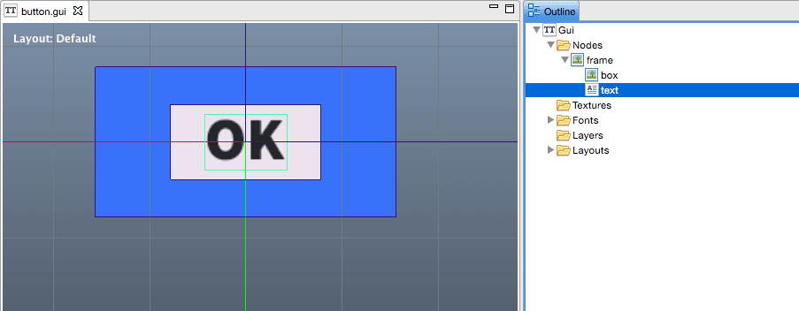

# GUI templates

GUI templates provide a simple but powerful mechanism to create reusable visual GUI components based on shared templates or "prefabs". This manual explains the feature and how to use it.

GUI templates are GUI scenes that are inserted into another GUI scene as a compound node, much like sub-collections can be placed inside other collections. But while a placed sub-collection can override the position of the sub-collection's root and any defined script-properties, a GUI template node can override any property values. Also, like sub-collections, GUI template nodes does not exist as a runtime concept, only as an editing tool.

## Creating and using a template

Since a GUI template is a plain GUI scene, there's nothing special about how they are created. Suppose we want to create and use a button template. We can then make a default button in a GUI scene and save it in a file:



Now we can add any number of instances of the button to another GUI scene. Create or open a new scene and select <kbd>Gui ▸ Add Template Node</kbd>, alternatively right-click *Nodes* in the *Outline* and select <kbd>Add Template</kbd> from the drop-down.


Select the GUI scene file to use as template, in this case *button.gui*. You can add any number of nodes, each an instance based on the same template. If we change the template, each instance updates immediately in the editor, reflecting the changes. Notice that all nodes present in the template node are accessible in the *Outline* view. Nodes under a template node are automatically named with a prefix "[template node id]/".


The template itself is represented in the node tree with an item: "button" and "button1" above. Even though they look like they are nodes, they *are not*. Adding a template to a scene adds all the template nodes. There is no "template root node" or similar. If you need a root node to manipulate all nodes in a template, you have to add the root node to the template scene.

## Overloading properties

Each instance node can overload any of the properties set in the template. Simply mark the node you wish to edit and change the property you want to alter. Nodes that have any overloaded properties are marked green in the *Outline* view. An overloaded property is marked blue. Click the blue property name to reset the property's value to the default.


## Layers

Layers behave as expected. Any property settings done to a particular layout in the template file is reflected in the layout of the instance nodes, given that the layer exists. Conversely, overloads to the template node instances affects the layer that is currently selected.


## Scripting

Writing Lua scripts to manipulate or query nodes added through the template node mechanism works exactly as usual. Just remember to address the nodes by their _full_ name, including the template node base prefix:

```lua
if gui.pick_node(gui.get_node("button_ok/frame"), x, y) then
    -- Do something...
end
```

Note though that there is no template node present during runtime. All nodes under a template node are added to the game but the template node itself exists only in the editor. Also, if you add a script to the template GUI scene, the script will be ignored, only one script is tied to each GUI scene and is set on the scene root node in the *Outline* view as usual.
