# GUI

Defold provides you with a custom GUI editor and powerful scripting possibilities that are tailor made for the construction and implementation of user interfaces. 

A graphical user interface in Defold is a game object component that you build and attach to a game object and place in a collection. This component has the following properties:

* It has simple, but powerful, layout features that allow resolution and aspect ratio independent rendering of your user interface.
* It can have logic behavior attached to it through a gui script.
* It is rendered in a separate pass from the rest of the game, on top of other content.
* It is rendered against a screen-space coordinate system that is independent of camera view so even if you have a moving camera, your GUI elements will stay put on the screen.

The GUI is not part of the collection’s coordinate system but is rendered independently of the game view. Because of this it is not placed in a particular location in the collection editor, nor does it have a visual representation in the collection editor. However, GUI components have to reside in a game object that has a location in a collection. Changing that location has no effect on the GUI.

::: important
The rendering behavior can be changed in the render script but it is usually desirable to use this arrangement since the user interface is a separate visual "layer" on top of the game view and you usually want HUD items and menus on certain spots on screen.
:::

## Nodes

A GUI component is built from a set of nodes. A node is a visual object that is either:

* A Box node, a rectangle filled with a color or texture
* A Text node. See the [Text node documentation](/manuals/gui-text) for details
* A Pie node. See the [Pie node documentation](/manuals/gui-pie) for details
* A Template node. See the [Template node documentation](/manuals/gui-templates) for details
* A Spine node. See the [Spine node documentation](/manuals/gui-spine) for details

Nodes are simple and don’t contain any logic. They can be translated (moved) and ordered in parent-child hierarchies either in the editor or at runtime through scripting. 
You have direct access to all nodes in your GUI component from the script code.
Nodes can be animated with script (see [Property animation](#_property_animation) below) and animation can be run on nodes (flipbook animations on Box nodes and bone animations on Spine nodes).

Add nodes by right-clicking on the *Nodes* folder and selecting either <kbd>Add Box</kbd>, <kbd>Add Text</kbd>, <kbd>Add Pie</kbd>, <kbd>Add Template</kbd> or <kbd>Add Spine Node</kbd>.

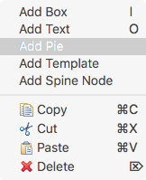

You can also use the GUI top menu, or the keyboard shortcuts <kbd>I</kbd> and <kbd>O</kbd> for box and text nodes.
Placed nodes are moved and rotated in the same way game objects are translated in the collection editor.

## Node properties

Each node has an extensive set of properties that control its appearance:

* Position, Rotation, Scale, Size (can be animated)
* Color, Outline, Shadow (can be animated)
* Blend mode
* Adjust mode, Pivot, Xanchor, Yanchor
* Font, Text, Line-break (for text nodes)
* Index, Layer, Parent
* Clipping (for box and pie nodes) (See the [Clipping documentation](/manuals/gui-clipping) for details)

These properties can be modified in the editor's properties tab (except index and parenting), or through script (see [GUI API reference](/ref/gui)).

Each of these properties can also be animated in script (see [Property animation](#_property_animation) below).

## Textures and flip book animations

You can use images and animations from texture atlases or tile sources as part of your GUI interface component. To do so, an image resource (atlas or tile source) must first be added, then all images and animations included in the resource can be applied to GUI nodes. You add textures either by right clicking the *Textures* folder, through the <kbd>GUI</kbd> top menu, or with keyboard shortcuts.

Textures that has been added to the GUI can be applied to box and pie nodes.


The selected texture animation (or single frame image) will automatically play when the GUI component is drawn on screen.

Note that the color of the box node will tint the animation. The tint color is multiplied onto the image data, meaning that if you set the color to white (the default) no tint is applied.

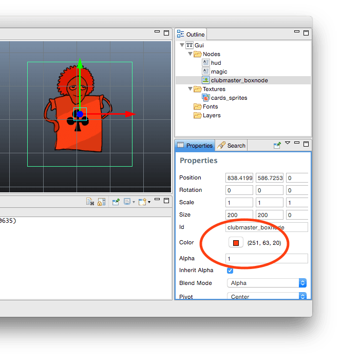

::: sidenote
Box nodes are always rendered, even if they do not have a texture assigned to them, have their alpha set to `0`, or are sized `0, 0, 0`. Box nodes should always have a texture assigned to them so the renderer can batch them properly and reduce the number of draw-calls.
:::

## Slice-9 texturing

Many GUIs and HUDs feature elements that are context sensitive in regards to their size. Panels and dialogs often need to be resized to fit the containing content and that will cause problems as soon as you apply texturing to the scaled node. Let's say that you want to use a large set of buttons where the width is determined by the amount of text you write on the button. Making a box node, applying a texture and then scale it will result in deformation:


Defold contains a feature called _slice-9_ texturing that is intended to be used in situations like this. It works by allowing you to preserve the size of parts of the node texture when the node is scaled. A button texture is divided into bits and applied to the node so that the end bits don't scale as you change the horizontal size of the button node:

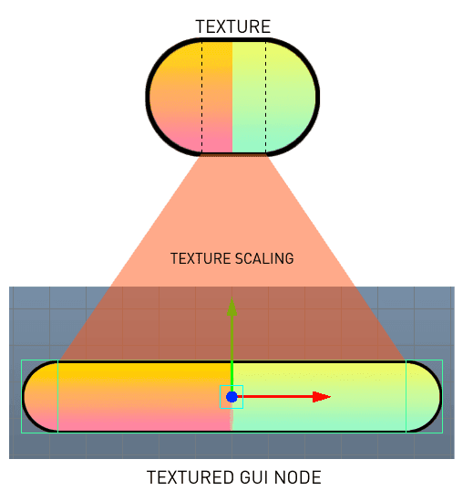

You can thus make buttons of any width using this simple technique. The *Slice9* box node property is used to control how the texture is sliced:


The slicing is controlled by 4 numbers that specify the margin width, in pixels, which will be preserved as the node is resized. Corner segments are never scaled, only moved; edge segments are scaled along one axis, and the center segment is scaled both horizontally and vertically as needed. The margins are set clockwise, starting on the left hand side:


Due to the way mipmapping works in the renderer, scaling of texture segments can sometimes look incorrect. This happens when you _scale down_ segments below the original texture size. The renderer then selects a lower resolution mipmap for the segment, resulting in visual artifacts.


It is easy to avoid this problem, but it implies some constraints to the source texture: simply make sure that the texture's segments that will be scaled are small enough never to be scaled down, only up.

::: sidenote
It might also be tempting to use a 1 pixel wide bottom or top edge segment to save texture memory. However, doing so might result in other unwanted artifacts, because of texture filtering. If you make the edge wider so that edge segments start and stop with similar neighbor pixels you will typically get nicer results.
:::

## Index: rendering order

All nodes are rendered in the order they are listed under the "Nodes" folder. The node on top of the list is drawn first and will appear behind any other node. The last node in the list is drawn last, meaning it will appear in front of all other nodes. Drag nodes in the list to change their index order. You can also change and group the ordering of nodes with layers (see below).

If you set the Z-value on a node the draw order will not change. The Z-values on nodes are ignored.

## Parent-child hierarchies

A node is made the child of another node by dragging it onto the node that you wish to be the child's parent. A node with a parent inherits the transform (change in position, rotation and scale) applied to the parent and relative to the parent pivot (see below). Children are drawn after their parents, so they will appear in front of the parent node. Use layers to change the draw order of parent and child nodes and to optimize the rendering of nodes (see "Batch Rendering" below)

## Layers

Layers give fine grained control over how nodes are drawn. If you assign a layer to a node it will be drawn as part of that layer. The layer drawing order takes precedence over the regular node order.

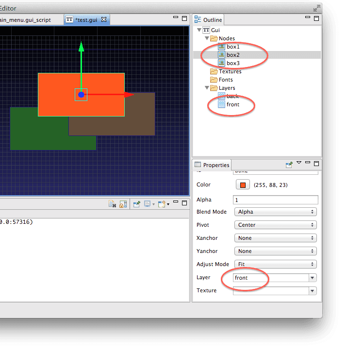

In this example the orange box node "box2" is part of layer "front" which is drawn last according to the layer order list. This means that all nodes that are part of "front" will be drawn on top of nodes that are part of layer "back" and nodes without layers set.

Both "box1" and "box3" are set to layer "back". The drawing order within a layer is determined by the node’s index, it’s place in the node list. "box1" comes before "box3" and is thus drawn first, behind "box3".

::: important
A child node with unset layer will implicitly inherit the layer setting of its parent node.
:::
Not setting a layer on a node implicitly adds it to the "null" layer, which is drawn before any other layer.

## Batch rendering

In order to render your GUI as efficiently as possible, there are steps that you can take that will permit the engine to organise drawing of your GUI nodes in batches, reducing the overall number of drawcalls that the engine must create. If groups of nodes meet the following conditions, then they may be handled within a single batch:

- If they are all box nodes, they use the same atlas for textures.
- The nodes must be rendered with the same blend mode.
- If they are text nodes, they use same font.
- They must be rendered in sequence. That means that they must appear next to each other in the node list, or be part of the same layer (see the example below for details)
- In addition, clipping nodes always break the batch and each stencil scope also breaks the batch.

The ability to arrange nodes in hierarchies is powerful and makes it easy to group complex hierarchies of nodes into manageable units. But hierarchies can effectively break batch rendering. Let’s look at a simple example:


Here we have built two buttons each out of three nodes. We have a box node with a shadow texture, a box node with a shaded button texture and a text node with the button text. We have put these nodes in logical manageable hierarchies. The button graphics is drawn with "alpha" blend mode and the shadow with "multiply" blend mode.

When the rendering pipeline walks through the list of nodes, it is forced to set up a separate batch for each separate node. This is because walking through the list the nodes with graphics share the same atlas, but because the shadow nodes use different blend modes than the buttons, the batch is broken at each node. So, all in all these two buttons will require six separate batches.

We can do better, though. By carefully assigning layers to our nodes, we can render our buttons much more efficiently. For this example we create three layers:

- Shadow
- Button
- Text

We assign the nodes to the corresponding layer and make sure the layers are placed in correct render order in the Layers-list:

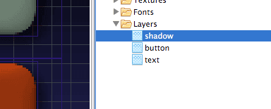

Since the layer drawing order takes precedence over the regular node order the nodes are now drawn in the following order:

1. "play_block_shadow"
2. "quit_block_shadow"
3. "play_block"
4. "quit_block"
5. "play"
6. "quit"

The nodes that share atlas, blend mode or font now sit adjacent to each other and the rendering pipeline can batch these nodes into three batches instead of six. A 50% performance win.

Now, imagine that we scale our little example up and expand the GUI to 10 buttons. If we make sure to properly assign the right layer to each new nodes, the engine will still render them in three batches, but this time instead of 30.

## Script

To control the logic of your GUI and animate nodes you use Lua scripts. GUI scripts work the same as regular game object scripts, but are saved as a different file type and have access to a different set of functions: all in the `gui` module.

You create a GUI Script File in your project and attach it to the GUI component by selecting the root GUI component in the outline view and then choosing a script file in the properties view.


The script file is by default equipped with functions just as game object scripts:

```lua
function init(self)
   -- Add initialization code here
   -- Remove this function if not needed
end

function final(self)
   -- Add finalization code here
   -- Remove this function if not needed
end

function update(self, dt)
   -- Add update code here
   -- Remove this function if not needed
end

function on_message(self, message_id, message, sender)
   -- Add message-handling code here
   -- Remove this function if not needed
end

function on_input(self, action_id, action)
   -- Add input-handling code here
   -- Remove this function if not needed
end

function on_reload(self)
   -- Add input-handling code here
   -- Remove this function if not needed
end

```

GUI components can thus receive input and messages just as game objects. You send messages to a GUI component by addressing the component in the fragment part of the URL:

```lua
local msgdata = { score = 4711, stars = 3, health = 6 }
msg.post("hud#gui", "set_stats", msgdata)
```

## Handling different resolutions and aspect ratios

GUI components are rendered separately and on top of other game content and there are some mechanisms in place to make life easier for game developers that target device that have screens of different resolutions and aspect ratios.

Your Defold game project specifies a target resolution in the *game project* settings, however one or more of your target devices might have a different screen resolution and aspect ratio. In this case this means that your game will be up- or downscaled to fit the target screen.

Defold deals with the scaling of any GUI components differently to other game content. It also provides you with a set of simple, but powerful tools to lay out your user interface independently of resolution and/or aspect ratio.

Let’s illustrate with a little experiment and create a game app with a GUI. The display size is set to a square with dimensions 1024x1024. The game contains a GUI component with a level menu on top of some imagery. This is how it looks when run on a computer:


Now, if we run the same app on the iPad (with a very different screen size and aspect ratio of 4:3) we get the following result:


We see that on the iPad the game is stretched out to fill the screen. The octopus in the background is deformed, but the GUI elements are not. The text nodes are rendered with the correct aspect ratio and keeps their location in the center of the screen.

You can easily simulate changes to the screen resolution and aspect ratio by changing the window size of your running Defold game. Running the game on a device with a different resolution and aspect ratio is equivalent to changing the window. When the window changes size it triggers redrawing and re-positioning of GUI components, according to a set of adjustment and anchoring rules that give you good control over your user interface layout.

## Adjust mode

When the window is resized and the resolution and aspect ratio is changed, all nodes are reshaped and adjusted according to how their Adjust Mode property is set. This property can be either of the following three settings:

`Fit`
: This is the default. The node is uniformly scaled proportionally against what would be the resized node's bounding box width or height, whichever is smallest.

`Zoom`
: The node is uniformly scaled proportionally against what would be the resized node's bounding box width or height, whichever is largest.

`Stretch`
: The node is reshaped proportionally.

It’s perhaps easiest to understand the adjust modes by looking at the following example that contains a GUI component with a couple of nodes:

- A background box node that has a grid texture for reference. This node has *Adjust Mode* set to `Stretch`.
- Three 256x256 pixel box nodes with a square Defold logo texture. One each with *Adjust Mode* `Fit`, `Zoom` and `Stretch`.

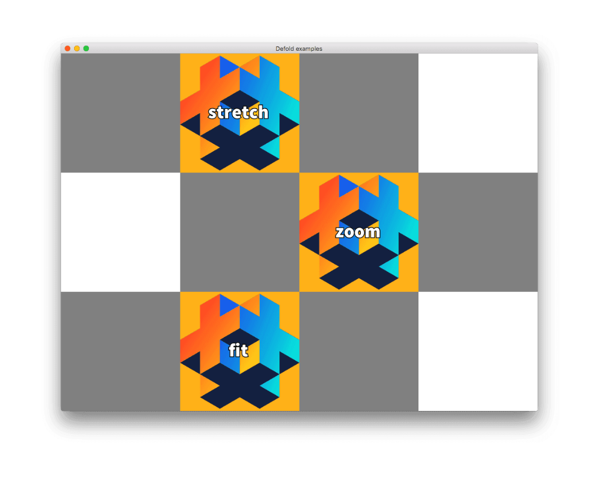

Now let’s see what happens to the box nodes when the window is resized:

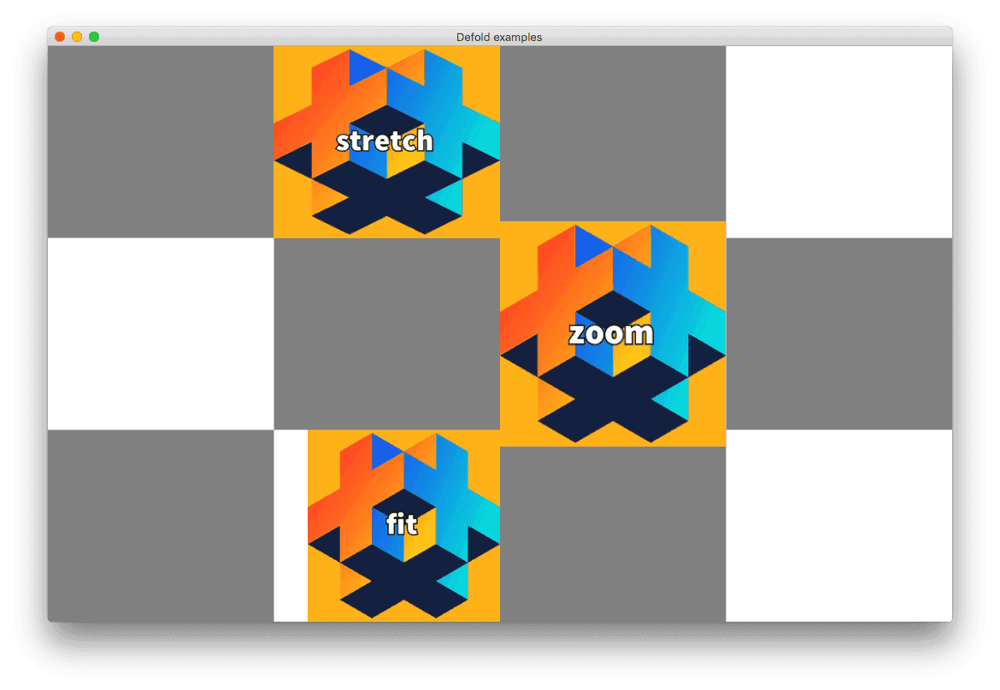

The `Stretch` node is just deformed to the new shape whereas the `Fit` and `Zoom` nodes keep their aspect ratio. The `Fit` node is fit inside the would-be reshaped bounding box (the grid square that it's in) and the `Zoom` node covers the would-be reshaped bounding box.

Text nodes behave in exactly the same way. The adjust mode applies to the invisible text bounding box that controls the shape of the text.

## Anchors

Anchors control the behavior of a node’s position _inside the would-be reshaped bounding box_ when the window is resized. New nodes are created _anchorless_, meaning that they are positioned relative to the center of the screen.

## Node repositioning without anchors

The default behavior of a created node is the following

   * The GUI component’s coordinate system is uniformly scaled and centered inside the resized window.
   * The node keeps its position in this scaled coordinate system.

This means that all non-anchored nodes will keep their relative distance, in relation to the screen center. To illustrate, if the window gets wider, the added width (relatively) gets distributed equally on the sides of the GUI:

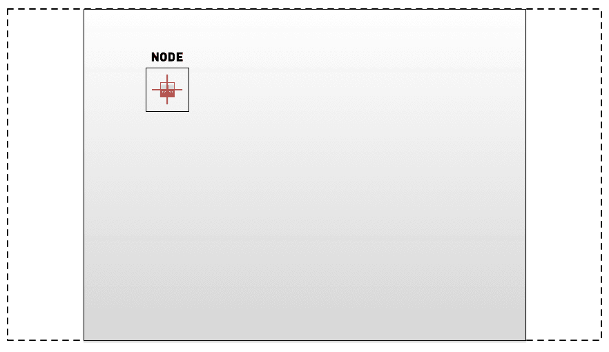

Similarly, if the window is shrunk and gets relatively narrower, the added height (relatively) is distributed equally above and below the GUI:

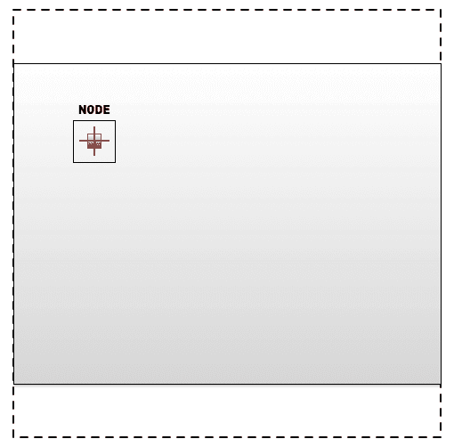

## Node repositioning with anchors

By setting the Xanchor and/or the Yanchor properties you can lock the position of nodes relative to the edges of the _would-be reshaped bounding box_.

   * Xanchor set to `Left` will lock the horizontal position of the node against the left edge of the box.
   * Xanchor set to `Right` will lock the horizontal position of the node against the right edge of the box.
   * Yanchor set to `Top` will lock the vertical position of the node against the top edge of the box.
   * Yanchor set to `Bottom` will lock the vertical position of the node against the bottom edge of the box.

In practice this means that if you set the Xanchor property to `Right` and the Yanchor property to `Top`, the node will keep its position relative to the top right corner of its reshaped box. The distance to the right edge and the top edge will be kept constant. However, the default *Pivot* is `Center` which keeps the center point. Often you want to anchor against an edge and then you should adjust the *Pivot* accordingly.

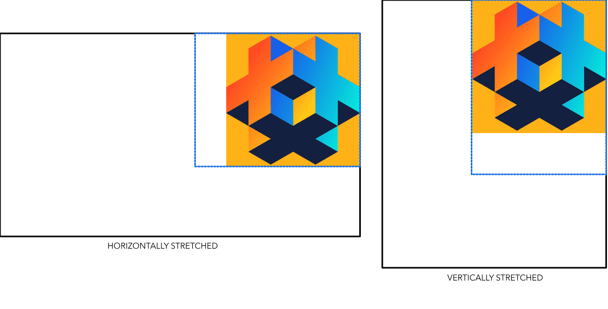

This example shows a node that has `Top` and `Right` anchoring. It is `Fit` adjusted and has *Pivot* set to `North East`. When the window stretch, the node is fit inside the "would-be" reshaped box (the blue dotted rectangle) and also anchored.

## Pivot

Each node has a position, scale and rotation inside the GUI coordinate system. A node is placed on that position so that its pivot is at the set coordinate and any rotation is done around that same pivot. For text nodes the text will be aligned according to the pivot setting.

The default positioning and rotation of nodes happen against the center of the node—it has the *Pivot* property set to `Center`. You can change the pivot of a node to any of one of the following settings:

* `Center`
* `North`, `South`, `East`, `West`
* `North` West, `North East`, `South West`, `South East`

The following image illustrates the position of each pivot setting:

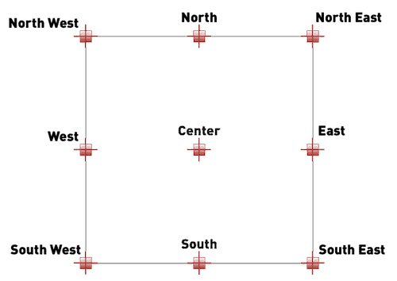

If you change the pivot of a node, the node will be moved so that the new pivot will be at the given position. Text nodes are aligned so that `Center` sets the text center-aligned, `West` sets the text left-aligned and `East` sets the text right-aligned.

## GUI scripts

Since GUI nodes have no logic in themselves but are controlled by a GUI script attached to the GUI component, you have to get direct script control of the nodes. This is done by obtaining a node reference using the node’s id. The reference is usually stored in a variable and then used to manipulate the node:

```lua
-- Obtain a reference to the "magic" text node
local magicnode = gui.get_node("magic")
-- Change the color of the node to orange
local orange = vmath.vector4(1.0, 0.3, 0.0, 1.0)
gui.set_color(magicnode, orange)
```

As soon as you have obtained the reference to a node by the `gui.get_node()` function you can call any of the many manipulation functions in the GUI module to reposition, resize, change appearance of, reorder in draw-order, or move in the parent-child hierarchy. All node properties are accessible through scripting.

## Node id:s

Each node must have a unique id. If you create a box node, it will have a default id "box" and a text node has the id "text". You should change the id of each created node right away to a more descriptive, unique name. If the Defold GUI editor detects an id name collision, an error is signalled.

## Dynamically created nodes

To create a new node with script in runtime you have two options. You either create the node from scratch:

```lua
-- Create a new, white box node at position 300, 300 with size 150x200
local new_position = vmath.vector3(300, 300, 0)
local new_size = vmath.vector3(150, 200, 0)
local new_boxnode = gui.new_box_node(new_position, new_size)
-- Add a text node at the same position
local new_textnode = gui.new_text_node(new_position, "Hello!")
```

With the newly created nodes' references stored in variables you are now free to manipulate the nodes:

```lua
-- Rotate the text node 10 degrees (around the z-axis)
gui.set_rotation(new_textnode, vmath.vector3(0, 0, 10))
```

If we put this code in the GUI script’s init() function and run the game we get the following:

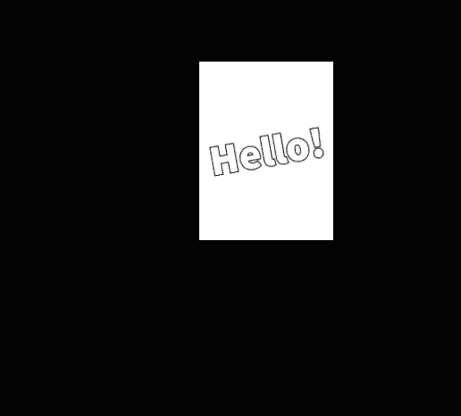

The alternative way to create new nodes is to clone an existing node:

```lua
-- Clone the magic text node
local magicnode = gui.get_node("magic")
local magic2 = gui.clone(magicnode)
-- The new node is right on top of the original. Let's move it.
gui.set_position(magic2, vmath.vector3(300, 300, 0))
```

## Dynamic node IDs

Dynamically created nodes do not have an id assigned to them. This is by design. The reference that is returned from `gui.new_box_node()`, `gui.new_text_node()`, `gui.new_pie_node()` and `gui.clone()` is the only thing necessary to be able to access the node and you should keep track of that reference.

```lua
-- Add a text node
local new_textnode = gui.new_text_node(vmath.vector3(100, 100, 0), "Hello!")
-- "new_textnode" contains the reference to the node.
-- The node has no id, and that is fine. There's no reason why we want
-- to do gui.get_node() when we already have the reference.
```

## Property animation

Several of the node properties can be fully asynchronously animated. To animate a property, you use the `gui.animate()` function and supply the following parameters:

`gui.animate(node, property, to, easing, duration [,delay] [,complete_function] [,playback])`

::: sidenote
See [`go.animate()`](/ref/go#go.animate) for details on the parameters.
:::

The `property` parameter is usually given as a constant (`gui.PROP_POSITION` etc), but can also be supplied as described in the Properties guide (see [Properties](/manuals/properties)). This is handy if you want to animate just a specific component of a compound property value.

For instance, the `color` property describes a, RGBA value, encoded in a vector4 value with one component for each color component red, green and blue, and the last one for alpha. The vector components are named respectively `x`, `y`, `z` and `w` and the alpha is thus in the `w` component.

To fade up and down the alpha value of a node we can do that with the following piece of code:

```lua
function fadeup(self, node)
   gui.animate(node, "color.w", 1.0, gui.EASING_LINEAR, 0.3, 0, fadedown, gui.PLAYBACK_ONCE_FORWARD)
end

function fadedown(self, node)
   gui.animate(node, "color.w", 0.0, gui.EASING_LINEAR, 0.3, 0, fadeup, gui.PLAYBACK_ONCE_FORWARD)
end
```

Now we can call either `fadeup()` or `fadedown()` and supply the node we want the alpha animated on. Note that we set the `complete_function` parameter to supply the function to call when the animation is done, effectively chaining an endless loop of fade up and fade downs.

## Render script

The default render script is a Lua script that handles all rendering of your game content (see [Rendering documentation](/manuals/rendering) for details). It is set up to render GUI nodes on top of the rest of a game in a separate pass:

```lua
...
render.set_view(vmath.matrix4())
render.set_projection(vmath.matrix4_orthographic(0,
render.get_window_width(), 0,
render.get_window_height(), -1, 1))
render.draw(self.gui_pred)
render.draw(self.text_pred)
...
```

The view is a normal identity matrix and the projection is orthographic. You can create custom render scripts for your project by copying the *default.render_script* and *default.render* render file from the *builtins/render* folder, changing them as you wish and then specifying your custom renderer under the *bootstrap* section of the project settings (see [Project settings](/manuals/project-settings)).

To illustrate, you can render all GUI components with a 3D "camera" view and perspective projection:

```lua
-- Set up a view to get a 3D positioned camera.
local w = render.get_window_width() * 0.5
local h = render.get_window_height() * 0.5
local view = vmath.matrix4_look_at(vmath.vector3(w-25, h-10, 70),
vmath.vector3(w, h, -250),
vmath.vector3(0, 1.0, 0))
render.set_view(view)
-- Perspective projection
render.set_projection(vmath.matrix4_perspective(2.5, 4/3, 0.1, 1000))

render.draw(self.gui_pred)
render.draw(self.text_pred)
```

This now affects all GUI components that are rendered. Here’s a version of our previous level menu with the modified render-script:

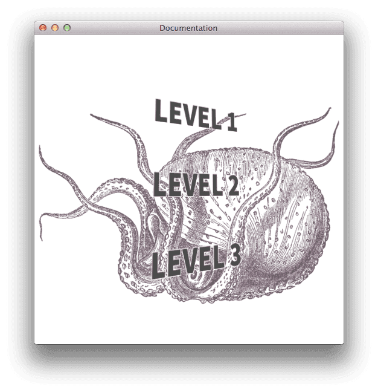

