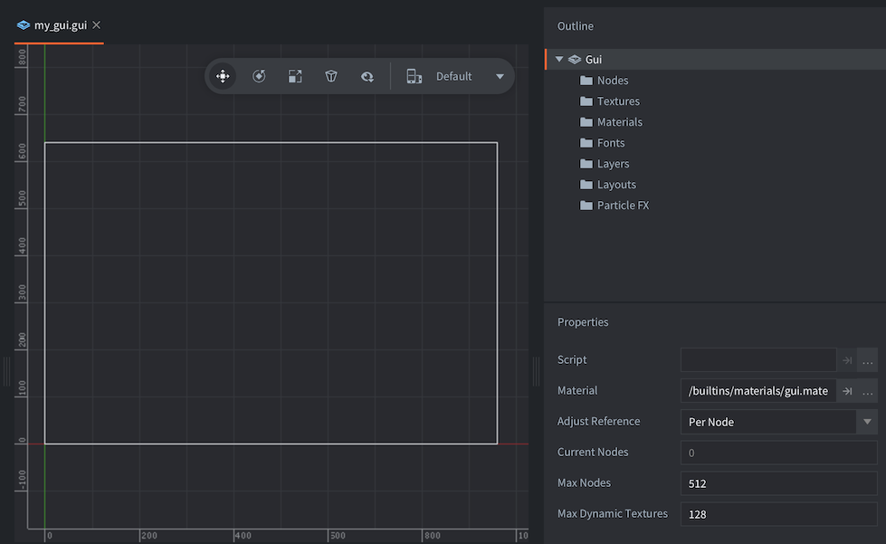

# GUI

Defold provides you with a custom GUI editor and powerful scripting possibilities that are tailor made for the construction and implementation of user interfaces. 

A graphical user interface in Defold is a component that you build and attach to a game object and place in a collection. This component has the following properties:

* It has simple, but powerful, layout features that allow resolution and aspect ratio independent rendering of your user interface.
* It can have logic behavior attached to it through a *GUI script*.
* It is (by default) rendered on top of other content, independent of camera view so even if you have a moving camera, your GUI elements will stay put on the screen. The rendering behavior can be changed.

GUI components are rendered independently of the game view. Because of this it is not placed in a particular location in the collection editor, nor does it have a visual representation in the collection editor. However, GUI components have to reside in a game object that has a location in a collection. Changing that location has no effect on the GUI.

## Creating a GUI component

GUI components are created from file blueprints so to to create a new GUI component, <kbd>right click</kbd> a location in the *Assets* browser and select <kbd>New ▸ Gui</kbd>. Type a name for the new GUI file and press <kbd>Ok</kbd>.

{srcset="images/gui/new_gui_file@2x.png 2x"}

Defold now automatically opens the file in the GUI editor.

{srcset="images/gui/new_gui@2x.png 2x"}

The *Outline* lists all the GUI:s content: it's list of nodes and any dependencies (see below).

The central editing area shows the GUI. The toolbar in the top right corner of the editing area contains *Move*, *Rotate* and *Scale* tools, as well as a [layout](/manuals/gui-layout) selector.

{srcset="images/gui/toolbar@2x.png 2x"}

A white rectangle shows the bounds of the currently selected layout, of the default display width and height as set in the project settings.

## GUI properties

Selecting the root "Gui" node in the *Outline* shows the *Properties* for the GUI component:

Script
: The GUI script bound to this GUI component.

Material
: The material used when rendering this GUI.

Adjust Reference
: Controls how each node's *Adjust Mode* should be calculated:

  - `Per Node` adjusts eack node against the adjusted size of the parent node, or the resized screen.
  - `Disable` turns off node adjust mode. This forces all nodes to keep their set size.

Max Nodes
: The maximum number of nodes for this GUI.

## Dependencies

The resource tree in a Defold game is static so any dependences that you at you need to specify dependencies. The GUI outline 

## Nodes

A GUI component is built from a set of nodes. A node is a visual object that is either:

* A Box node, See the [Box node documentation](/manuals/gui-box) for details
* A Text node. See the [Text node documentation](/manuals/gui-text) for details
* A Pie node. See the [Pie node documentation](/manuals/gui-pie) for details
* A Template node. See the [Template node documentation](/manuals/gui-templates) for details
* A Spine node. See the [Spine node documentation](/manuals/gui-spine) for details
* A ParticleFX node. See the [ParticleFX node documentation](/manuals/gui-particlefx) for details

Nodes are simple and don’t contain any logic. They can be translated (moved) and ordered in parent-child hierarchies either in the editor or at runtime through scripting. 
You have direct access to all nodes in your GUI component from the script code.
Nodes can be animated with script (see [Property animation](#_property_animation) below) and animation can be run on nodes (flipbook animations on Box nodes and bone animations on Spine nodes).

Add nodes by right-clicking on the *Nodes* folder and selecting either <kbd>Add Box</kbd>, <kbd>Add Text</kbd>, <kbd>Add Pie</kbd>, <kbd>Add Template</kbd> or <kbd>Add Spine Node</kbd>.


You can also use the GUI top menu, or the keyboard shortcuts <kbd>I</kbd> and <kbd>O</kbd> for box and text nodes.
Placed nodes are moved and rotated in the same way game objects are translated in the collection editor.

## Node properties

Each node has an extensive set of properties that control its appearance:

* Position, Rotation, Scale, Size (can be animated)
* Color, Outline, Shadow (can be animated)
* Blend mode
* Adjust mode, Pivot, Xanchor, Yanchor
* Font, Text, Line-break (for text nodes)
* Index, Layer, Parent
* Clipping (for box and pie nodes) (See the [Clipping documentation](/manuals/gui-clipping) for details)

These properties can be modified in the editor's properties tab (except index and parenting), or through script (see [GUI API reference](/ref/gui)).

Each of these properties can also be animated in script (see [Property animation](#_property_animation) below).


## Index: rendering order

All nodes are rendered in the order they are listed under the "Nodes" folder. The node on top of the list is drawn first and will appear behind every other node. The last node in the list is drawn last, meaning it will appear in front of all other nodes. Drag nodes in the list to change their index order. You can also change and group the ordering of nodes with layers (see below).

If you set the Z-value on a node the draw order will not change. The Z-values on nodes are ignored.

## Parent-child hierarchies

A node is made the child of another node by dragging it onto the node that you wish to be the child's parent. A node with a parent inherits the transform (change in position, rotation and scale) applied to the parent and relative to the parent pivot (see below). Children are drawn after their parents, so they will appear in front of the parent node. Use layers to change the draw order of parent and child nodes and to optimize the rendering of nodes (see "Batch Rendering" below)

## Layers

Layers give fine grained control over how nodes are drawn. If you assign a layer to a node it will be drawn as part of that layer. The layer drawing order takes precedence over the regular node order.


In this example the orange box node "box2" is part of layer "front" which is drawn last according to the layer order list. This means that all nodes that are part of "front" will be drawn on top of nodes that are part of layer "back" and nodes without layers set.

Both "box1" and "box3" are set to layer "back". The drawing order within a layer is determined by the node’s index, it’s place in the node list. "box1" comes before "box3" and is thus drawn first, behind "box3".

::: important
A child node with unset layer will implicitly inherit the layer setting of its parent node.
:::
Not setting a layer on a node implicitly adds it to the "null" layer, which is drawn before any other layer.

## Batch rendering

In order to render your GUI as efficiently as possible, there are steps that you can take that will permit the engine to organise drawing of your GUI nodes in batches, reducing the overall number of drawcalls that the engine must create. If groups of nodes meet the following conditions, then they may be handled within a single batch:

- If they are all box nodes, they use the same atlas for textures.
- The nodes must be rendered with the same blend mode.
- If they are text nodes, they use same font.
- They must be rendered in sequence. That means that they must appear next to each other in the node list, or be part of the same layer (see the example below for details)
- In addition, clipping nodes always break the batch and each stencil scope also breaks the batch.

The ability to arrange nodes in hierarchies is powerful and makes it easy to group complex hierarchies of nodes into manageable units. But hierarchies can effectively break batch rendering. Let’s look at a simple example:


Here we have built two buttons each out of three nodes. We have a box node with a shadow texture, a box node with a shaded button texture and a text node with the button text. We have put these nodes in logical manageable hierarchies. The button graphics is drawn with "alpha" blend mode and the shadow with "multiply" blend mode.

When the rendering pipeline walks through the list of nodes, it is forced to set up a separate batch for each separate node. This is because walking through the list the nodes with graphics share the same atlas, but because the shadow nodes use different blend modes than the buttons, the batch is broken at each node. So, all in all these two buttons will require six separate batches.

We can do better, though. By carefully assigning layers to our nodes, we can render our buttons much more efficiently. For this example we create three layers:

- Shadow
- Button
- Text

We assign the nodes to the corresponding layer and make sure the layers are placed in correct render order in the Layers-list:


Since the layer drawing order takes precedence over the regular node order the nodes are now drawn in the following order:

1. "play_block_shadow"
2. "quit_block_shadow"
3. "play_block"
4. "quit_block"
5. "play"
6. "quit"

The nodes that share atlas, blend mode or font now sit adjacent to each other and the rendering pipeline can batch these nodes into three batches instead of six. A 50% performance win.

Now, imagine that we scale our little example up and expand the GUI to 10 buttons. If we make sure to properly assign the right layer to each new nodes, the engine will still render them in three batches, but this time instead of 30.


## Handling different resolutions and aspect ratios

GUI components are rendered separately and on top of other game content and there are some mechanisms in place to make life easier for game developers that target device that have screens of different resolutions and aspect ratios.

Your Defold game project specifies a target resolution in the *game project* settings; however, one or more of your target devices might have a different screen resolution and aspect ratio. In this case this means that your game will be up- or downscaled to fit the target screen.

Defold deals with the scaling of any GUI components differently to other game content. It also provides you with a set of simple but powerful tools to lay out your user interface independently of resolution and/or aspect ratio.

Let’s illustrate with a little experiment and create a game app with a GUI. The display size is set to a square with dimensions 1024x1024. The game contains a GUI component with a level menu on top of some imagery. This is how it looks when run on a computer:


Now, if we run the same app on the iPad (with a very different screen size and aspect ratio of 4:3) we get the following result:


We see that on the iPad the game is stretched out to fill the screen. The octopus in the background is deformed, but the GUI elements are not. The text nodes are rendered with the correct aspect ratio and keep their location in the center of the screen.

You can easily simulate changes to the screen resolution and aspect ratio by changing the window size of your running Defold game. Running the game on a device with a different resolution and aspect ratio is equivalent to changing the window. When the window changes size it triggers redrawing and re-positioning of GUI components, according to a set of adjustment and anchoring rules that give you good control over your user interface layout.

## Adjust mode

When the window is resized and the resolution and aspect ratio is changed, all nodes are reshaped and adjusted according to how their Adjust Mode property is set. This property can be either of the following three settings:

`Fit`
: This is the default. The node is uniformly scaled proportionally against what would be the resized node's bounding box width or height, whichever is smallest.

`Zoom`
: The node is uniformly scaled proportionally against what would be the resized node's bounding box width or height, whichever is largest.

`Stretch`
: The node is reshaped proportionally.

It’s perhaps easiest to understand the adjust modes by looking at the following example that contains a GUI component with a couple of nodes:

- A background box node that has a grid texture for reference. This node has *Adjust Mode* set to `Stretch`.
- Three 256x256 pixel box nodes with a square Defold logo texture. One each with *Adjust Mode* `Fit`, `Zoom` and `Stretch`.


Now let’s see what happens to the box nodes when the window is resized:


The `Stretch` node is just deformed to the new shape whereas the `Fit` and `Zoom` nodes keep their aspect ratio. The `Fit` node is fit inside the would-be reshaped bounding box (the grid square that it's in) and the `Zoom` node covers the would-be reshaped bounding box.

Text nodes behave in exactly the same way. The adjust mode applies to the invisible bounding box that controls the shape of the text.

## Anchors

Anchors control the behavior of a node’s position _inside the would-be reshaped bounding box_ when the window is resized. New nodes are created _anchorless_, meaning that they are positioned relative to the center of the screen.

## Node repositioning without anchors

The default behavior of a created node is the following

   * The GUI component’s coordinate system is uniformly scaled and centered inside the resized window.
   * The node keeps its position in this scaled coordinate system.

This means that all non-anchored nodes will keep their relative distance, in relation to the screen center. To illustrate, if the window gets wider, the added width (relatively) gets distributed equally on the sides of the GUI:


Similarly, if the window is shrunk and gets relatively narrower, the added height (relatively) is distributed equally above and below the GUI:


## Node repositioning with anchors

By setting the Xanchor and/or the Yanchor properties you can lock the position of nodes relative to the edges of the _would-be reshaped bounding box_.

   * Xanchor set to `Left` will lock the horizontal position of the node against the left edge of the box.
   * Xanchor set to `Right` will lock the horizontal position of the node against the right edge of the box.
   * Yanchor set to `Top` will lock the vertical position of the node against the top edge of the box.
   * Yanchor set to `Bottom` will lock the vertical position of the node against the bottom edge of the box.

In practice this means that if you set the Xanchor property to `Right` and the Yanchor property to `Top`, the node will keep its position relative to the top right corner of its reshaped box. The distance to the right edge and the top edge will be kept constant. However, the default *Pivot* is `Center` which keeps the center point. Often you want to anchor against an edge and then you should adjust the *Pivot* accordingly.


This example shows a node that has `Top` and `Right` anchoring. It is `Fit` adjusted and has *Pivot* set to `North East`. When the window stretches, the node is fit inside the "would-be" reshaped box (the blue dotted rectangle) and also anchored.

## Pivot

Each node has a position, rotation and scale inside the GUI coordinate system. A node is placed so that its pivot is at the set coordinate and any rotation is done around that same pivot. For text nodes the text will be aligned according to the pivot setting.

The default positioning and rotation of nodes happens against the center of the node---it has the *Pivot* property set to `Center`. You can change the pivot of a node to any of one of the following settings:

* `Center`
* `North`, `South`, `East`, `West`
* `North West`, `North East`, `South West`, `South East`

The following image illustrates the position of each pivot setting:


If you change the pivot of a node, the node will be moved so that the new pivot will be at the given position. Text nodes are aligned so that `Center` sets the text center-aligned, `West` sets the text left-aligned and `East` sets the text right-aligned.

## Property animation

Several of the node properties can be fully asynchronously animated. To animate a property, you use the `gui.animate()` function and supply the following parameters:

`gui.animate(node, property, to, easing, duration [,delay] [,complete_function] [,playback])`

::: sidenote
See [`gui.animate()`](/ref/gui#gui.animate) for details on the parameters.
:::

The `property` parameter is usually given as a constant (`gui.PROP_POSITION` etc), but can also be supplied as described in the Properties guide (see [Properties](/manuals/properties)). This is handy if you want to animate just a specific component of a compound property value.

For instance, the `color` property describes an RGBA value, encoded in a vector4 value with one component for each color component---red, green, blue and the last one for alpha. The vector components are named respectively `x`, `y`, `z` and `w` and the alpha is thus in the `w` component.

To fade up and down the alpha value of a node we can use the following piece of code:

```lua
function fadeup(self, node)
   gui.animate(node, "color.w", 1.0, gui.EASING_LINEAR, 0.3, 0, fadedown, gui.PLAYBACK_ONCE_FORWARD)
end

function fadedown(self, node)
   gui.animate(node, "color.w", 0.0, gui.EASING_LINEAR, 0.3, 0, fadeup, gui.PLAYBACK_ONCE_FORWARD)
end
```

Now we can call either `fadeup()` or `fadedown()` and supply the node we want the alpha animated on. Note that we set the `complete_function` parameter to supply the function to call when the animation is done, effectively chaining an endless loop of fade ups and fade downs.

## Render script

The default render script is a Lua script that handles all rendering of your game content (see [Render documentation](/manuals/render) for details). It is set up to render GUI nodes on top of the rest of a game in a separate pass:

```lua
...
render.set_view(vmath.matrix4())
local w = render.get_window_width()
local h = render.get_window_height()
local proj = vmath.matrix4_orthographic(0, w, 0, h, -1, 1)
render.set_projection(proj)
render.draw(self.gui_pred)
render.draw(self.text_pred)
...
```

The view is a normal identity matrix and the projection is orthographic. You can create custom render scripts for your project by copying the *default.render_script* and *default.render* render file from the *builtins/render* folder, changing them as you wish and then specifying your custom renderer under the *bootstrap* section of the project settings (see [Project settings](/manuals/project-settings)).

To illustrate, you can render all GUI components with a 3D "camera" view and perspective projection:

```lua
-- Set up a view to get a 3D positioned camera.
local w = render.get_window_width() * 0.5
local h = render.get_window_height() * 0.5
local eye = vmath.vector3(w-25, h-10, 70)
local look_at = vmath.vector3(w, h, -250)
local up = vmath.vector3(0, 1.0, 0)
local view = vmath.matrix4_look_at(eye, look_at, up)
render.set_view(view)
-- Perspective projection
local proj = vmath.matrix4_perspective(2.5, 4/3, 0.1, 1000)
render.set_projection(proj)

render.draw(self.gui_pred)
render.draw(self.text_pred)
```

This now affects all GUI components that are rendered. Here’s a version of our previous level menu with the modified render-script:


