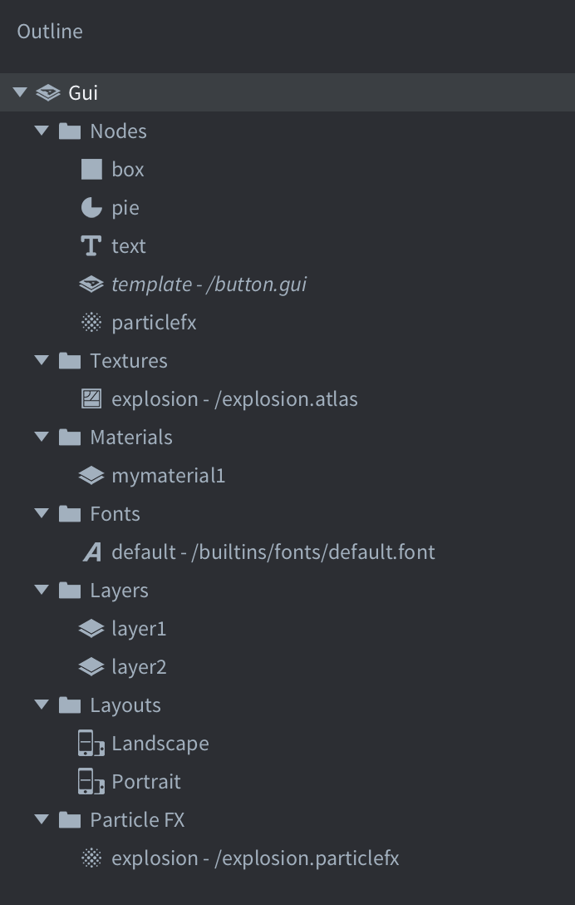

# GUI

Defold provides you with a custom GUI editor and powerful scripting possibilities that are tailor made for the construction and implementation of user interfaces.

A graphical user interface in Defold is a component that you build and attach to a game object and place in a collection. This component has the following properties:

* It has simple, but powerful, layout features that allow resolution and aspect ratio independent rendering of your user interface.
* It can have logic behavior attached to it through a *GUI script*.
* It is (by default) rendered on top of other content, independent of camera view so even if you have a moving camera, your GUI elements will stay put on the screen. The rendering behavior can be changed.

GUI components are rendered independently of the game view. Because of this it is not placed in a particular location in the collection editor, nor does it have a visual representation in the collection editor. However, GUI components have to reside in a game object that has a location in a collection. Changing that location has no effect on the GUI.

## Creating a GUI component

GUI components are created from a GUI scene blueprint file. To to create a new GUI component, <kbd>right click</kbd> a location in the *Assets* browser and select <kbd>New ▸ Gui</kbd>. Type a name for the new GUI file and press <kbd>Ok</kbd>.

{srcset="images/gui/new_gui_file@2x.png 2x"}

Defold now automatically opens the file in the GUI scene editor.

{srcset="images/gui/new_gui@2x.png 2x"}

The *Outline* lists all the GUI:s content: it's list of nodes and any dependencies (see below).

The central editing area shows the GUI. The toolbar in the top right corner of the editing area contains *Move*, *Rotate* and *Scale* tools, as well as a [layout](/manuals/gui-layouts) selector.

{srcset="images/gui/toolbar@2x.png 2x"}

A white rectangle shows the bounds of the currently selected layout, of the default display width and height as set in the project settings.

Selecting the root "Gui" node in the *Outline* shows the *Properties* for the GUI component:

Script
: The GUI script bound to this GUI component.

Material
: The material used when rendering this GUI.

Adjust Reference
: Controls how each node's *Adjust Mode* should be calculated:

  - `Per Node` adjusts each node against the adjusted size of the parent node, or the resized screen.
  - `Disable` turns off node adjust mode. This forces all nodes to keep their set size.

Max Nodes
: The maximum number of nodes for this GUI.

## Dependencies

The resource tree in a Defold game is static so any dependences that you need for your GUI nodes need to be added to the component. The *Outline* groups all dependencies by type under "folders":

{srcset="images/gui/dependencies@2x.png 2x"}

To add a new dependency, <kbd>right click</kbd> the "Gui" root in the *Outline*, then select <kbd>Add ▸ [type]</kbd> from the popup context menu.

You can also <kbd>right click</kbd> on the folder icon for the type you want to add and select <kbd>Add ▸ [type]</kbd>.

## Node types

A GUI component is built from a set of nodes. Nodes are simple elements. They can be translated (moved, scaled and rotated) and ordered in parent-child hierarchies either in the editor or at runtime through scripting. The following node types exist:

Box node
: {.left}
  Rectangular node with either a single color, texture or flip-book animation. See the [Box node documentation](/manuals/gui-box) for details.

<div style="clear: both;"></div>

Text node
: {.left}
  Displays text. See the [Text node documentation](/manuals/gui-text) for details.

<div style="clear: both;"></div>

Pie node
: {.left}
  A circular or ellipsoid node that can be partially filled or inverted. A See the [Pie node documentation](/manuals/gui-pie) for details.

<div style="clear: both;"></div>

Template node
: {.left}
  Templates are used to create instances based on other GUI scene files. See the [Template node documentation](/manuals/gui-template) for details.

<div style="clear: both;"></div>

Spine node
: {.left}
  Displays and animates a spine model. See the [Spine node documentation](/manuals/gui-spine) for details.

<div style="clear: both;"></div>

ParticleFX node
: {.left}
  Plays a particle effect. See the [ParticleFX node documentation](/manuals/gui-particlefx) for details.

<div style="clear: both;"></div>

Add nodes by right-clicking on the *Nodes* folder and selecting <kbd>Add ▸</kbd> and then <kbd>Box</kbd>, <kbd>Text</kbd>, <kbd>Pie</kbd>, <kbd>Template</kbd>, <kbd>Spine</kbd> or <kbd>ParticleFx</kbd>.

{srcset="images/gui/add_node@2x.png 2x"}

You can also press <kbd>A</kbd> and select the type you want to add to the GUI.

## Node properties

Each node has an extensive set of properties that control its appearance:

Id
: The identity of the node. This name has to be unique within the GUI scene.

Position, Rotation and Scale
: Governs the location, orientation and stretching of the node. You can use the *Move*, *Rotate* and *Scale* tools to change these values. The values can be animated from script.

Size (box, text and pie nodes)
: The size of the node is automatic by default but by setting the *Size Mode* to `Manual` you can alter the value. The size defines the bounds of the node and is used when doing input picking. This value can be animated from script.

Size Mode (box and pie nodes)
: If set to `Automatic` the editor will set a size for the node. If set to `Manual` you can set the size yourself.

Text (text nodes)
: The text to display on the node.

Line Break (text nodes)
: Set for text to wrap according to the width of the node.

Font (text nodes)
: The font to use when rendering the text.

Texture (box and pie nodes)
: The texture to draw on the node. This is a reference to an image or animation in an atlas or tile source.

Slice 9 (box nodes)
: Set to preserve the pixel size of the node's texture around the edges when the node is resized. See the [Box node documentation](/manuals/gui-box) for details.

Inner Radius (pie nodes)
: The inner radius of the node, expressed along the X axis. See the [Pie node documentation](/manuals/gui-pie) for details.

Outer Bounds (pie nodes)
: Controls the behavior of the outer bounds. See the [Pie node documentation](/manuals/gui-pie) for details.

Perimeter Vertices (pie nodes)
: The number of segments that will be used to build the shape. See the [Pie node documentation](/manuals/gui-pie) for details.

Pie Fill Angle (pie nodes)
: How much of the pie should be filled. See the [Pie node documentation](/manuals/gui-pie) for details.

Template (template nodes)
: The GUI scene file to use as template for the node. See the [Template node documentation](/manuals/gui-template) for details.

Spine Scene (spine nodes)
: The Spine Scene to use for this node. See the [Spine node documentation](/manuals/gui-spine) for details.

Default Animation (spine nodes)
: The animation to automatically play on this node. See the [Spine node documentation](/manuals/gui-spine) for details.

Skin (spine nodes)
: The skin to use for the node. See the [Spine node documentation](/manuals/gui-spine) for details.

ParticleFX (particlefx nodes)
: The particle effect to use on this node. See the [ParticleFX node documentation](/manuals/gui-particlefx) for details.

Color
: The color of the node. It the node is textured, the color tints the texture. The color can be animated from script.

Alpha
: The translucency of the node. The alpha value can be animated from script.

Inherit Alpha
: Setting this checkbox makes a node inherit the alpha value of the parent node. The node's alpha value is then multiplied with the parent's alpha value.

Leading (text nodes)
: A scaling number for the line spacing. A value of `0` gives no line spacing. `1` (the default) is normal line spacing.

Tracking (text nodes)
: A scaling number for the letter spacing. Defaults to 0.

Layer
: Assigning a layer to the node overrides the normal draw order and instead follows the layer order. See below for details.

Blend mode
: Controls how the graphics of the node is blended with background graphics:
  - `Alpha` alpha blends the pixel values of the node with the background. This corresponds to "Normal" blend mode in graphics software.
  - `Add` adds the pixel values of the node with the background. This corresponds to "Linear dodge" in some graphics software.
  - `Multiply` multiplies the pixel values of the node with the background.

Pivot
: Sets the pivot point for the node. This can be seen as the "center point" of the node. Any rotation, scaling or size change will happen around this point.

  Possible values are `Center`, `North`, `South`, `East`, `West`, `North West`, `North East`, `South West` or `South East`.

  {srcset="images/gui/pivot@2x.png 2x"}

  If you change the pivot of a node, the node will be moved so that the new pivot will be at the node's position. Text nodes are aligned so that `Center` sets the text center-aligned, `West` sets the text left-aligned and `East` sets the text right-aligned.

X Anchor, Y Anchor
: Anchoring controls how the node's vertical and horizontal position is altered when the scene boundaries, or the parent node's boundaries are stretched to fit the physical screen size.

  {srcset="images/gui/anchoring_unadjusted@2x.png 2x"}

  The following anchoring modes are available:

  - `None` (for both *X Anchor* and *Y Anchor*) keeps the node's position from the center of the parent node or scene, relative it's *adjusted* size.
  - `Left` or `Right` (*X Anchor*) scales the horizontal position of the node so it keeps the position from the left and right edges of the parent node or scene at the same percentage.
  - `Top` or `Bottom` (*Y Anchor*) scales the vertical position of the node so it keeps the position from the top and bottom edges of the parent node or scene at the same percentage.

  {srcset="images/gui/anchoring@2x.png 2x"}

Adjust Mode
: Sets the adjust mode for the node. The adjust mode setting controls what happens to a node when the scene boundaries, or the parent node's boundaries, are adjusted to fit the physical screen size.

  A node created in a scene where the logical resolution is a typical landscape resolution:

  {srcset="images/gui/unadjusted@2x.png 2x"}

  Fitting the scene to a portrait screen cause the scene to be stretched. Each node's bounding box is similarly stretched. However, by setting the adjust mode, the aspect ratio of the node's content can be kept intact. The following modes are available:

  - `Fit` scales the node content so that it is equal to the stretched bounding box width or height, whichever is smallest. In other words, the content will fit inside the stretched node bounding box.
  - `Zoom` scales the node content so that it is equal to the stretched bounding box width or height, whichever is largest. In other words, the content will fully cover the stretched node bounding box.
  - `Stretch` stretches the node content so it fills the stretched node bounding box.

  {srcset="images/gui/adjusted@2x.png 2x"}

  If the GUI scene property *Adjust Reference* is set to `Disabled`, this setting will be ignored.

Clipping Mode (box, pie and spine nodes)
: Sets the clipping mode on the node:

  - `None` renders the node as usual.
  - `Stencil` makes the node boundaries define a stencil mask that is used to clip the node's child nodes.

  See the [GUI clipping manual](/manuals/gui-clipping) for details.

Clipping Visible (box, pie and spine nodes)
: Set to render the node's content in the stencil area. See the [GUI clipping manual](/manuals/gui-clipping) for details.

Clipping Inverted (box, pie and spine nodes)
: Invert the stencil mask. See the [GUI clipping manual](/manuals/gui-clipping) for details.


## Pivot, Anchors and Adjust Mode

The combination of Pivot, Anchors and Adjust Mode properties allows for a very flexible design of GUIs but it can be somewhat hard to understand how it all works without looking at a concrete example. Let's take this GUI mockup created for a 640x1136 screen as an example:


The UI is created with X and Y Anchors set to None and the Adjust Mode for each node is left at the default value of Fit. The Pivot point for the top panel is North, the pivot for the bottom panel is South and the pivot point for the bars in the top panel are set to West. The rest of the nodes have pivot points set to Center. If we resize the window to make it wider this is what happens:


Now, what if we want the top and bottom bars to always be as wide as the screen? We can change the Adjust Mode for the grey background panels at the top and bottom to Stretch:


This is better. The grey background panels will now always stretch to the width of the window, but the bars in the top panel as well as the two boxes at the bottom aren't positioned properly. If we want to keep the bars at the top positioned to the left we need to change the X Anchor from None to Left:


That is exactly as we want it for the top panel. The bars in the top panel already had their Pivot points set to West which means that they will position themselves nicely with the left/west edge of the bars (Pivot) anchored to the left edge of the parent panel (X Anchor).

Now, if we set the X Anchor to Left for the box on the left and the X Anchor to Right for the box on the right we get the following result:


This is not quite the expected result. The two boxes should stay as close to the left and right edges as the two bars did in the top panel. The reason for this is that the Pivot point is wrong:


Both boxes have a Pivot point set to Center. What this means is that when the screen becomes wider the center point (the pivot point) of the boxes will stay at the same relative distance from the edges. In the case of the left box it was 17% from the left edge with the original 640x1136 window:


When the screen is resized the center point of the left box remains at the same distance of 17% from the left edge:


If we change the Pivot point from Center to West for the box on the left and to East for the box on the right and reposition the boxes we get the result we're after even when the screen is resized:


## Draw order

All nodes are rendered in the order they are listed under the "Nodes" folder. The node at the top of the list is drawn first and will thus appear behind every other node. The last node in the list is drawn last, meaning it will appear in front of all other nodes. Altering the Z-value on a node does not control its draw order; however, if you set the Z-value outside of your render script's render range the node will no longer be rendered to screen. You can override the index ordering of nodes with layers (see below).

{srcset="images/gui/draw_order@2x.png 2x"}

Select a node and press <kbd>Alt + Up/Down</kbd> to move a node up or down and change its index order.

The draw order can be changed in script:

```lua
local bean_node = gui.get_node("bean")
local shield_node = gui.get_node("shield")

if gui.get_index(shield_node) < gui.get_index(bean_node) then
  gui.move_above(shield_node, bean_node)
end
```

## Parent-child hierarchies

A node is made the child of another node by dragging it onto the node that you wish to be the child's parent. A node with a parent inherits the transform (position, rotation and scale) applied to the parent and relative to the parent pivot.

{srcset="images/gui/parent_child@2x.png 2x"}

Parents are drawn before their children. Use layers to change the draw order of parent and child nodes and to optimize the rendering of nodes (see below).


## Layers and draw calls

Layers give fine grained control over how nodes are drawn and can be used to reduce the number of draw calls the engine must create to draw a GUI scene. When the engine is about to draw the nodes of a GUI scene, it groups the nodes into draw call batches based on the following conditions:

- The nodes must use the same type.
- The nodes must use the same atlas or tile source.
- The nodes must be rendered with the same blend mode.
- They must use same font.

If a node differs from the previous one on any of these points, it will break the batch and create another draw call. Clipping nodes always break the batch and each stencil scope also breaks the batch.

The ability to arrange nodes in hierarchies makes it easy to group nodes into manageable units. But hierarchies can effectively break batch rendering if you mix different node types:

{srcset="images/gui/break_batch@2x.png 2x"}

When the rendering pipeline walks through the list of nodes, it is forced to set up a separate batch for each separate node because the types are different. All in all these three buttons will require six draw calls.

By assigning layers to the nodes, they can be ordered differently, allowing the render pipeline to group the nodes together in fewer draw calls. Start by adding the layers you need to the scene. <kbd>Right click</kbd> the "Layers" folder icon in the *Outline* and select <kbd>Add ▸ Layer</kbd>. Mark the new layer and assign it a *Name* property in the *Properties* view.

{srcset="images/gui/layers@2x.png 2x"}

Then set the *Layer* property on each node to the corresponding layer. The layer drawing order takes precedence over the regular indexed node order, so setting the button graphics box-nodes to "graphics" and the button text nodes to "text" will result in the following draw order:

* First all nodes in the "graphics" layer, from the top:

  1. "button-1"
  2. "button-2"
  3. "button-3"

* Then all nodes in the "text" layer, from the top:

  4. "button-text-1"
  5. "button-text-2"
  6. "button-text-3"

The nodes can now be batched into two draw calls, instead of six. A major performance win!

Note that a child node with unset layer will implicitly inherit the layer setting of its parent node. Not setting a layer on a node implicitly adds it to the "null" layer, which is drawn before any other layer.
