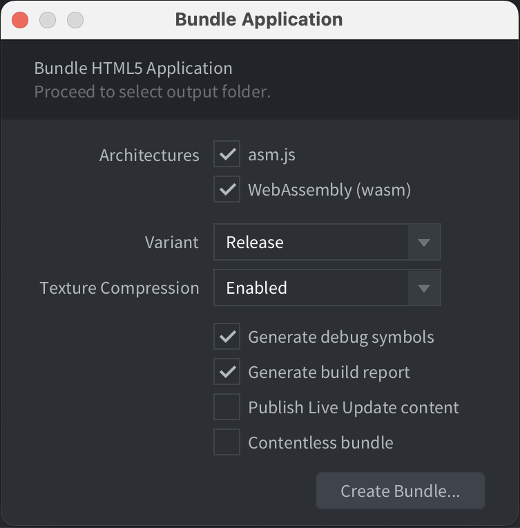
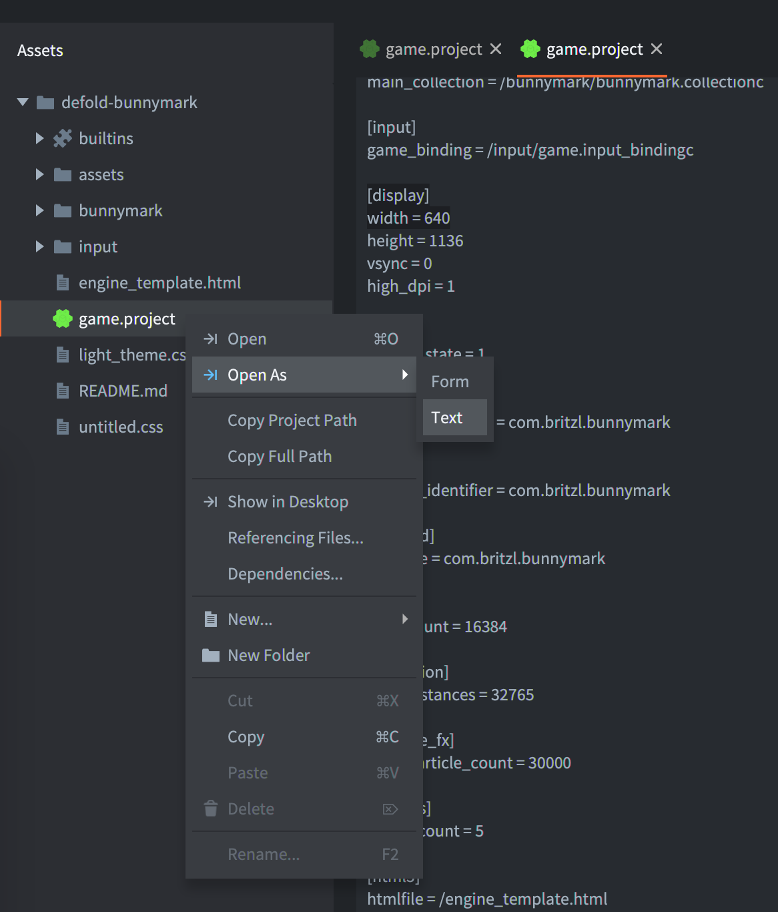

# HTML5 development

Defold supports building games for the HTML5 platform through the regular bundling menu, as well as for other platforms. In addition, the resulting game is embedded on a regular HTML page that can be styled through a simple template system.

The *game.project* file contains the HTML5 specific settings:


## Heap size

Defold support for HTML5 is powered by Emscripten (See http://en.wikipedia.org/wiki/Emscripten). In short, it creates a sandbox of memory for the heap in which the application operates. By default, the engine allocates a generous amount of memory (256MB). This should be more than sufficient for the typical game. As part of your optimization process, you may choose to use a smaller value. To do this, follow these steps:

1. Set *heap_size* to a preferred value. It should be expressed in megabytes.
2. Create your HTML5 bundle (see below)

## Testing HTML5 build

For testing HTML5 build you need a HTTP server. We will create the simplest one for you if you choose <kbd>Project ▸ Build HTML5</kbd>.


If you want to test your bundle, just upload it to your remote HTTP server or create local, for example, using python in the bundle folder.
Python 2:
> python -m SimpleHTTPServer

Python 3:
> python -m http.server

or
> python3 -m http.server

::: important
You can't test HTML5 bundle just opening `index.html` file in a browser. This requires HTTP server.
:::

## Creating HTML5 bundle

Creating HTML5 content with Defold is simple and follows the same pattern as all other supported platforms: select <kbd>Project ▸ Bundle...​ ▸ HTML5 Application...</kbd> from the menu:



You will be prompted to select a folder in which to create your application. After the export process completes, you will find all of the files needed to run the application.

## Known issues and limitations

Live update
: Defold applications must run their own miniature web server in order to receive live updates from the editor. This is not possible within a pure browser application.


CORS
: Cross-origin resource sharing (See http://en.wikipedia.org/wiki/Cross-origin_resource_sharing) is not enabled in the QA environment, limiting the ability of browsers to interact with web APIs. There are two possible workarounds: when using Chrome, start it with the ‘--disable-web-security’ flag; you can create a proxy server.


Internet Explorer 11 (audio)
: Defold handles audio playback using HTML5 _WebAudio_ (see http://www.w3.org/TR/webaudio), which is not currently supported by Internet Explorer 11. Applications will fall back to a null audio implementation when using this browser.


Internet Explorer 11 (WebGL)
: Microsoft has not completed work implementing the _WebGL_ API (see https://www.khronos.org/registry/webgl/specs/latest/). Therefore, it does not perform as well as other browsers.


Internet Explorer 11 (Full screen)
: Full screen mode is unreliable in the browser.


## Customizing HTML5 applications

When generating an HTML5 version of your application, Defold provides a default web page that will house your application. It references style and script resources that dictate how your application is presented.

Unless overridden, Defold will produce a default page, consisting of:

- An HTML5 canvas for your application
- A button to access fullscreen mode, if required
- A link to Defold.com site, if required
- Splash screen content and logic

Each time the application is exported, this content is created afresh. If you wish to customize any of these elements you must make modifications to your project settings. To do so, open the *game.project* in the Defold editor and scroll to the *html5* section:


These settings allow you to add a custom HTML file, stylesheet and splash image.

::: sidenote
To get started, you can begin by exporting the application once with the default settings. You then copy the exported HTML and CSS back into your project. Once copied, make the changes to the settings, as described above, and start editing the files.
:::

You have considerable freedom to make changes or additions to this content, but some restrictions apply:

- The canvas should not be styled with any border or padding. If you do, mouse input coordinates will be wrong.


## Tokens

We use [Mustache template language](https://mustache.github.io/mustache.5.html) for creation `index.html` file. When your are building the HTML and CSS files are passed through a compiler that is capable of replacing certain tokens with values that depend upon your project settings. These tokens are always encased in either double or triple curly braces (`{{TOKEN}}` or `{{{TOKEN}}}`), depending on whether character sequences should be escaped or not. This feature can be useful if you either make frequent changes to your project settings or intend for material to be reused in other projects.

::: sidenote
More information about Mustache template language is available in [manual](https://mustache.github.io/mustache.5.html).
:::

Any `game.project` can be a token. For example, if you want to use `Width` value from `Display` section:


Open `game.project` as a text and check `[section_name]` and name of the field you want to use. Then you can use it as a token: `{{section_name.field}}` or `{{{section_name.field}}}`.



For example, in HTML template in JavaScript:

```javascript
function doSomething() {
    var x = {{display.width}};
    // ...
}
```

Also, we have the following custom tokens:

DEFOLD_SPLASH_IMAGE
: Writes the filename of the splash image file or `false` if `html5.splash_image` in `game.project` is empty


```css
{{#DEFOLD_SPLASH_IMAGE}}
		background-image: url("{{DEFOLD_SPLASH_IMAGE}}");
{{/DEFOLD_SPLASH_IMAGE}}
```

exe-name
: The project name without unacceptable symbols


DEFOLD_CUSTOM_CSS_INLINE
: This is the place when we inline of the CSS file specified in your `game.project` settings.


```html
<style>
{{{DEFOLD_CUSTOM_CSS_INLINE}}}
</style>
```

::: important
It is important that this inline block appear before the main application script is loaded. Since it includes HTML tags, this macro should appear in triple braces `{{{TOKEN}}}` to prevent character sequences being escaped.
:::

DEFOLD_SCALE_MODE_IS_DOWNSCALE_FIT
: This token is `true` if `html5.scale_mode` is `Downscale Fit`.

DEFOLD_SCALE_MODE_IS_FIT
: This token is `true` if `html5.scale_mode` is `Fit`.

DEFOLD_SCALE_MODE_IS_NO_SCALE
: This token is `true` if `html5.scale_mode` is `No Scale`.

DEFOLD_SCALE_MODE_IS_STRETCH
: This token is `true` if `html5.scale_mode` is `Stretch`.

DEFOLD_HEAP_SIZE
: Heap size specified in `game.project` `html5.heap_size` converted to bytes.

DEFOLD_ENGINE_ARGUMENTS
: Engine arguments specified in `game.project` `html5.engine_arguments` separated by `,` symbol.


## Extra parameters

If you create your custom template, you can specify extra parameters for the engine loader:
```
`Module.runApp("canvas", extra_params) - Starts the
    application given a canvas element id

'extra_params' is an optional object that can have the
    following fields:

'archive_location_filter':
    Filter function that will run for each archive path.

'unsupported_webgl_callback':
    Function that is called if WebGL is not supported.

'engine_arguments':
    List of arguments (strings) that will be passed to the engine.

'persistent_storage':
    Boolean toggling the usage of persistent storage.

'custom_heap_size':
    Number of bytes specifying the memory heap size.

'disable_context_menu':
    Disables the right-click context menu on the canvas element if true.

'retry_time':
    Pause before retry file loading after error.

'retry_count':
    How many attempts we do when trying to download a file.

'can_not_download_file_callback':
    Function that is called if you can't download file after 'retry_count' attempts.
*/
```
