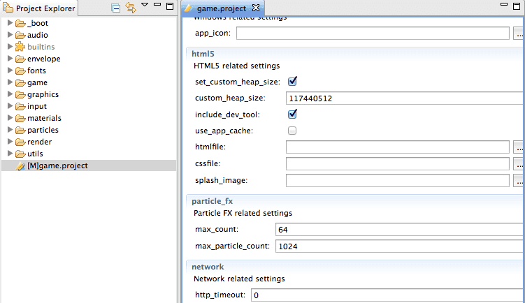
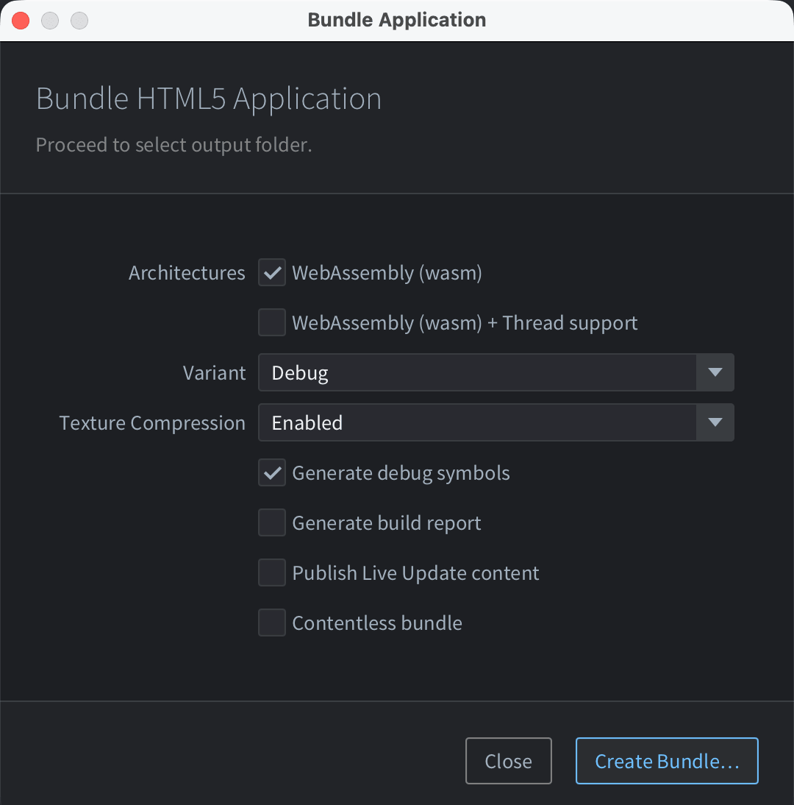
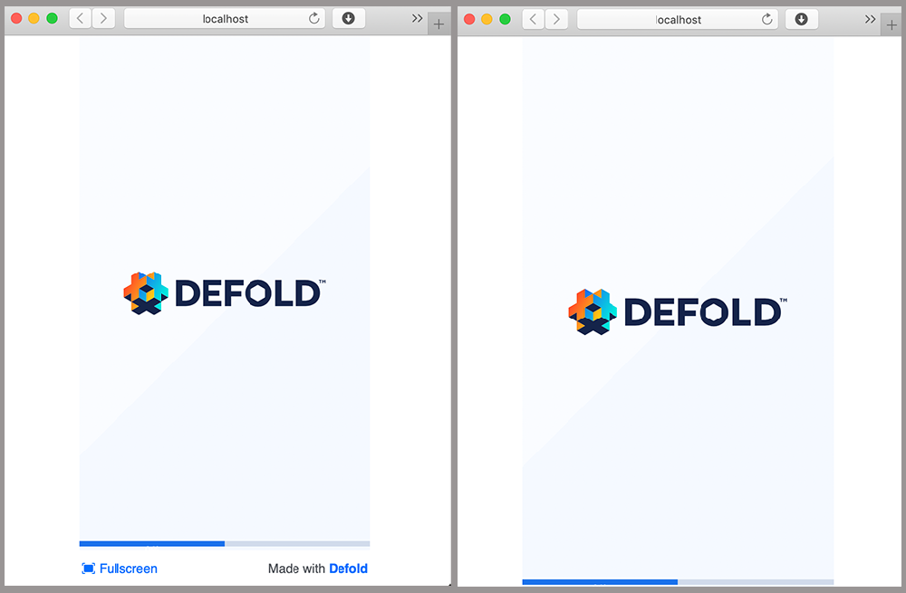

# HTML5 development

Defold supports building games for the HTML5 platform through the regular bundling menu, as well as for other platforms. In addition, the resulting game is embedded on a regular HTML page that can be styled through a simple template system.

The *game.project* file contains the HTML5 specific settings:



## Heap size

Defold support for HTML5 is powered by Emscripten (See http://en.wikipedia.org/wiki/Emscripten). In short, it creates a sandbox of memory for the heap in which the application operates. By default, the engine allocates a generous amount of memory (256MB). This should be more than sufficient for the typical game. As part of your optimization process, you may choose to use a smaller value. To do this, follow these steps:

1. Set *heap_size* to a preferred value. It should be expressed in megabytes.
2. Create your HTML5 bundle (see below)

## Testing HTML5 build

For testing, HTML5 build needs an HTTP server. Defold creates one for you if you choose <kbd>Project ▸ Build HTML5</kbd>.


If you want to test your bundle, just upload it to your remote HTTP server or create a local server, for example, using python in the bundle folder.
Python 2:

```sh
python -m SimpleHTTPServer
```

Python 3:

```sh
python -m http.server
```

or

```sh
python3 -m http.server
```

::: important
You can't test the HTML5 bundle by opening `index.html` file in a browser. This requires HTTP server.
:::

::: important
If you see a `"wasm streaming compile failed: TypeError: Failed to execute ‘compile’ on ‘WebAssembly’: Incorrect response MIME type. Expected ‘application/wasm’."` error in the console you must make sure that your server uses the `application/wasm` MIME type for `.wasm` files.
:::

## Creating HTML5 bundle

Creating HTML5 content with Defold is simple and follows the same pattern as all other supported platforms: select <kbd>Project ▸ Bundle... ▸ HTML5 Application...</kbd> from the menu:



HTML5 bundles support two WebAssembly architectures:

* `wasm-web` - the regular, non-threaded WebAssembly engine.
* `wasm_pthread-web` - a WebAssembly engine that can use threads.

You can include either architecture or both. When both are included, the loader selects `wasm_pthread-web` when the browser and hosting environment support it and falls back to `wasm-web` otherwise. See the [Bob manual](/manuals/bob/#usage) for the canonical target names.

::: important
The threaded engine requires `SharedArrayBuffer` in a secure, [cross-origin-isolated](https://developer.mozilla.org/en-US/docs/Web/API/Window/crossOriginIsolated) page. Serve the bundle over HTTPS (or localhost) and configure the server with compatible cross-origin isolation headers, commonly:

```txt
Cross-Origin-Opener-Policy: same-origin
Cross-Origin-Embedder-Policy: require-corp
```

Cross-origin resources loaded by the page must also use compatible CORS or Cross-Origin-Resource-Policy headers. A bundle containing only `wasm_pthread-web` cannot run when these requirements are not met; include `wasm-web` as a fallback if the game may be hosted on a site that does not support cross-origin isolation.
:::

Defold HTML5 bundles require a modern browser with WebAssembly support. Internet Explorer 11 is not supported.

When you click on the <kbd>Create bundle</kbd> button you will be prompted to select a folder in which to create your application. After the export process completes, you will find all of the files needed to run the application.

## Known issues and limitations

* Hot Reload - Hot Reload doesn't work in HTML5 builds. Defold applications must run their own miniature web server in order to receive updates from the editor, which isn't possible in a HTML5 build.
* Chrome
  * Slow debug builds - In debug builds on HTML5 we verify all WebGL graphics calls to detect errors. This is unfortunately very slow when testing on Chrome. It is possible to disable this by setting the *Engine Arguments* field of *game.project* to `--verify-graphics-calls=false`.
* Gamepad support - [Refer to the Gamepad documentation](/manuals/input-gamepads/#gamepads-in-html5) for special considerations and steps you may need to take on HTML5.

## Customizing HTML5 bundle

When generating an HTML5 version of your game, Defold provides a default web page. It references style and script resources that dictate how your game is presented.

Each time the application is exported, this content is created afresh. If you wish to customize any of these elements you must make modifications to your project settings. To do so, open the *game.project* in the Defold editor and scroll to the *html5* section:


More information about every option is available in [project settings manual](/manuals/project-settings/#html5).

::: important
You can't modify files of the default html/css template in `builtins` folder. For applying your modifications copy/paste needed file from `builtins` and set this file in *game.project*.
:::

::: important
The canvas shouldn't be styled with any border or padding. If you do, mouse input coordinates will be wrong.
:::

In *game.project* it is possible to turn-off the `Fullscreen` button and the `Made with Defold` link.
Defold provides a dark and light theme for the `index.html`. The light theme is set by default but it is possible to change by changing `Custom CSS` file. There is also four predefined scale modes to chose from in the `Scale Mode` field.

::: important
The calculations for all scale modes include current screen DPI in case if you turn on `High Dpi` option in *game.project* (`Display` section)
:::

### Downscale Fit and Fit

For the `Fit` mode canvas size will be changed to show full game canvas on the screen with original proportions. The only difference in `Downscale Fit` is changing size only if the inner size of the webpage is smaller than the original canvas of the game, but doesn't scale-up when a webpage is bigger than the original game canvas.



### Stretch

For the `Stretch` mode canvas size will be changed to fully fill the inner size of the webpage.


### No Scale
With `No Scale` mode the canvas size is exactly the same as you predefined in *game.project* file, `[display]` section.


## Tokens

We use [Mustache template language](https://mustache.github.io/mustache.5.html) for creation of the `index.html` file. When your are building or bundling, the HTML and CSS files are passed through a compiler that is capable of replacing certain tokens with values that depend upon your project settings. These tokens are always encased in either double or triple curly braces (`{{TOKEN}}` or `{{{TOKEN}}}`), depending on whether character sequences should be escaped or not. This feature can be useful if you either make frequent changes to your project settings or intend for material to be reused in other projects.

::: sidenote
More information about Mustache template language is available in [manual](https://mustache.github.io/mustache.5.html).
:::

Any *game.project* can be a token. For example, if you want to use `Width` value from `Display` section:


Open *game.project* as a text and check `[section_name]` and name of the field you want to use. Then you can use it as a token: `{{section_name.field}}` or `{{{section_name.field}}}`.


For example, in HTML template in JavaScript:

```javascript
function doSomething() {
    var x = {{display.width}};
    // ...
}
```

Also, we have the following custom tokens:

DEFOLD_SPLASH_IMAGE
: Writes the filename of the splash image file or `false` if `html5.splash_image` in *game.project* is empty


```css
{{#DEFOLD_SPLASH_IMAGE}}
		background-image: url("{{DEFOLD_SPLASH_IMAGE}}");
{{/DEFOLD_SPLASH_IMAGE}}
```

exe-name
: The project name without unacceptable symbols


DEFOLD_CUSTOM_CSS_INLINE
: This is the place when we inline of the CSS file specified in your *game.project* settings.


```html
<style>
{{{DEFOLD_CUSTOM_CSS_INLINE}}}
</style>
```

::: important
It is important that this inline block appear before the main application script is loaded. Since it includes HTML tags, this macro should appear in triple braces `{{{TOKEN}}}` to prevent character sequences being escaped.
:::

DEFOLD_SCALE_MODE_IS_DOWNSCALE_FIT
: This token is `true` if `html5.scale_mode` is `Downscale Fit`.

DEFOLD_SCALE_MODE_IS_FIT
: This token is `true` if `html5.scale_mode` is `Fit`.

DEFOLD_SCALE_MODE_IS_NO_SCALE
: This token is `true` if `html5.scale_mode` is `No Scale`.

DEFOLD_SCALE_MODE_IS_STRETCH
: This token is `true` if `html5.scale_mode` is `Stretch`.

DEFOLD_HEAP_SIZE
: Heap size specified in *game.project* `html5.heap_size` converted to bytes.

DEFOLD_ENGINE_ARGUMENTS
: Engine arguments specified in *game.project* `html5.engine_arguments` separated by `,` symbol.

build-timestamp
: Current build timestamp in seconds.


## Extra parameters

If you create a custom template, you can change parameters for the engine loader by assigning values in the global `CUSTOM_PARAMETERS` object. The built-in template provides an intentionally empty `<script id="engine-setup">` block for these customizations.
::: important
Keep the `engine-setup` block after the script that loads `dmloader.js` and before the `engine-start` block that calls `EngineLoader.load()`.
:::
For example:

```html
    <script id="engine-setup" type="text/javascript">
        CUSTOM_PARAMETERS.disable_context_menu = false;
        CUSTOM_PARAMETERS.unsupported_webgl_callback = function() {
            console.log("Oh-oh. WebGL not supported...");
        };
    </script>
```

`CUSTOM_PARAMETERS` may contain fields including:

```
'archive_location_filter':
    Filter function that will run for each archive path.

'unsupported_webgl_callback':
    Function that is called if WebGL is not supported.

'engine_arguments':
    List of arguments (strings) that will be passed to the engine.

'custom_heap_size':
    Number of bytes specifying the memory heap size.

'disable_context_menu':
    Disables the right-click context menu on the canvas element if true.

'retry_time':
    Pause in seconds before retry file loading after error.

'retry_count':
    How many attempts we do when trying to download a file.

'can_not_download_file_callback':
    Function that is called if you can't download file after 'retry_count' attempts.

'resize_window_callback':
    Function that is called when resize/orientationchanges/focus events happened

'start_success':
    Function that is called just before main is called upon successful load.

'update_progress':
    Function that is called as progress is updated. Parameter progress is updated 0-100.
```

## File operations in HTML5

HTML5 builds support file operations such as `sys.save()`, `sys.load()` and `io.open()` but the way these operations are handled internally is different from other platforms. When Javascript is run in a browser there is no real concept of a file system and local file access is blocked for security reasons. Instead Emscripten (and thus Defold) uses [IndexedDB](https://developer.mozilla.org/en-US/docs/Web/API/IndexedDB_API/Using_IndexedDB), an in-browser database used to persistently store data, to create a virtual filesystem in the browser. The important difference from file system access on other platforms is that there can be a slight delay between writing to a file and the change actually being stored in the database. The browser developer console usually allows you to inspect the contents of the IndexedDB.


## Passing arguments to an HTML5 game

It is sometimes necessary to provide additional arguments to a game before it or as it is started. This could for instance be a user id, session token or which level to load when the game starts. This can be achieved in a number of different ways, some of which are described here.

### Engine arguments

It is possible to specify additional engine arguments when the engine is configured and loaded. These extra engine arguments can be retrieved at runtime using `sys.get_config_string()`. Assign the arguments directly to `CUSTOM_PARAMETERS.engine_arguments` in the `engine-setup` block of `index.html`:


```html
    <script id="engine-setup" type="text/javascript">
        CUSTOM_PARAMETERS.engine_arguments = [
            "--config=example.foo1=bar1",
            "--config=example.foo2=bar2"
        ];
    </script>
```

Assigning a new array replaces any engine arguments configured in *game.project*. To preserve those arguments and add another, use `CUSTOM_PARAMETERS.engine_arguments.push("--config=example.foo3=bar3")` instead.

You can also add `--config=example.foo1=bar1, --config=example.foo2=bar2` to the *Engine Arguments* field in the HTML5 section of *game.project*. The comma-separated values are added to `CUSTOM_PARAMETERS.engine_arguments` in the generated `dmloader.js`.

At runtime you get the values like this:

```lua
local foo1 = sys.get_config_string("example.foo1")
local foo2 = sys.get_config_string("example.foo2")
print(foo1) -- bar1
print(foo2) -- bar2
```


### Advanced HTML5 embedding: Host-set Module properties
These options are intended for advanced HTML5 embedding scenarios, such as WebView wrappers or custom host pages. Most games should not need them.

Embedding hosts can fine-tune the loader's behaviour by pre-setting properties on the global `Module` object *before* the `<script src="dmloader.js">` tag runs. This is the standard Emscripten pattern; `dmloader.js` captures each host-set value before its own `var Module = {...}` redefinition discards the global. Default behaviour is byte-identical when nothing is pre-set.

```html
<script>
var Module = {
    isWASMPthreadSupported: false,
    isWebGL2Supported: false,
    webGLContextAttributes: { preserveDrawingBuffer: true },
    webGLExtensionFilter: function (name) {
        return typeof name === "string" && name.toLowerCase().includes("compressed_texture");
    },
    showButtonStrip: false,
    autoReloadOnWebGLContextRestore: true
};
</script>
<script src="dmloader.js"></script>
```

| Property | Type | Effect |
| --- | --- | --- |
| `isWASMPthreadSupported` | `=== false` | Force the single-threaded WASM variant. Useful when the page passes the `crossOriginIsolated` + `SharedArrayBuffer` probe but still can't construct same-origin Workers (e.g. a WebView wrapper serving the bundle from a custom URL scheme — Chromium rejects `new Worker('myscheme://...')` with `SecurityError: cannot be accessed from origin 'null'`). |
| `isWebGL2Supported` | `=== false` | Downgrade `getContext('webgl2')` to `'webgl'`. Useful when the embedded GLES driver advertises WebGL2 but trips inside the engine's VAO / instancing init. |
| `webGLContextAttributes` | `Object` | Merged (`Object.assign`) into the attrs argument of the WebGL context creation. Notably useful for forcing `preserveDrawingBuffer:true` when the host compositor is flaky and `eglSwapBuffers` may fail between renders. |
| `webGLExtensionFilter` | `(name) => boolean` | Strip names from `getSupportedExtensions` / `getExtension`. Returning `true` for a name removes it. Useful when the driver falsely advertises compressed-texture / float-texture / depth-texture extensions then rejects the actual upload. |
| `showButtonStrip` | `=== false` | Hide the engine_template footer (`.buttons-background`). This can be used in addition to the existing html5.show_fullscreen_button and html5.show_made_with_defold project settings - `html5.show_fullscreen_button = 0` + `html5.show_made_with_defold = 0` suppresses the inner anchors but leaves a 42 px white bar behind; this opt-out finishes the job for hosts that want a true-fullscreen canvas. |
| `autoReloadOnWebGLContextRestore` | `=== true` | Attach `webglcontextlost` / `webglcontextrestored` listeners to the canvas. `preventDefault()` on lost asks the browser to restore; on restored, `location.reload()` so the engine boots cleanly. On restore, the page is reloaded so the engine can initialise a fresh WebGL context. Any game state that should survive the reload must be persisted by the game.|

::: important
Some of these options patch browser prototypes and may affect other WebGL canvases on the same page. Use them only on controlled host pages dedicated to the Defold game.
:::

::: important
Use a `var` declaration or `window.Module = {...}`. Top-level `let Module = ...` creates a script-scoped binding that the loader's global `var Module` can't see — the host-set values will be invisible to the captures.
:::

::: important
The checks are strict — only the literal sentinel triggers the opt-out (`=== false` for the booleans, `=== true` for `autoReloadOnWebGLContextRestore`, a `function` typeof for the filter, a truthy object for the attrs). Must be a plain object. Other truthy/falsy values like `0`, `null`, `""`, or `undefined` are unsupported, ignored, and should not be used.
:::


### Query arguments in the URL

You can pass arguments as part of the query parameters in the page URL and read these at runtime:

```
https://www.mygame.com/index.html?foo1=bar1&foo2=bar2
```

```lua
local url = html5.run("window.location")
print(url)
```

A full helper function to get all query parameters as a Lua table:

```lua
local function get_query_parameters()
    local url = html5.run("window.location")
    -- get the query part of the url (the bit after ?)
    local query = url:match(".*?(.*)")
    if not query then
        return {}
    end

    local params = {}
    -- iterate over all key value pairs
    for kvp in query:gmatch("([^&]+)") do
        local key, value = kvp:match("(.+)=(.+)")
        params[key] = value
    end
    return params
end

function init(self)
    local params = get_query_parameters()
    print(params.foo1) -- bar1
end
```

## Optimizations
HTML5 games usually have strict requirements on initial download size, startup time and memory usage to ensure that games load fast and run well on low end devices and slow internet connections. To optimize an HTML5 game it is recommended to focus on the following areas:

* [Memory usage](/manuals/optimization-memory)
* [Engine size](/manuals/optimization-size)
* [Game size](/manuals/optimization-size)

## FAQ
:[HTML5 FAQ](../shared/html5-faq.md)
