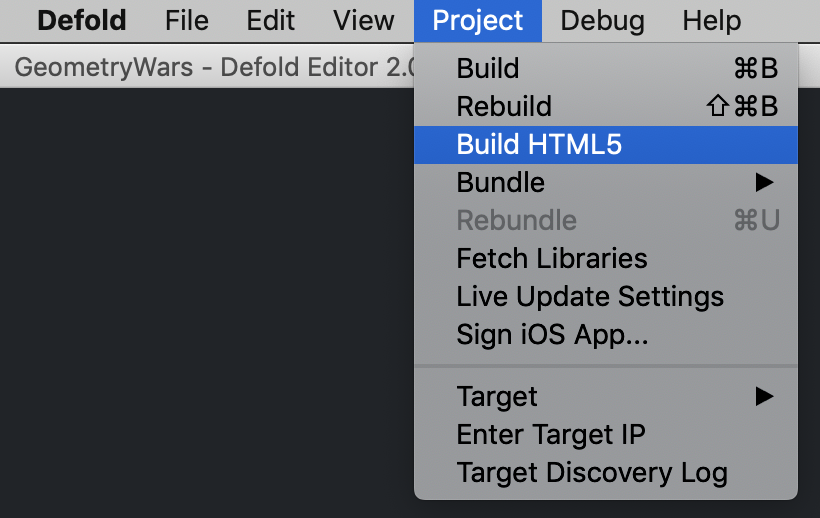

# HTML5 development

Defold supports building games for the HTML5 platform through the regular bundling menu, as well as some platform specific tools. In addition, the resulting game is embedded on a regular HTML page that can be styled through a simple template system.

The *game.project* file contains the HTML5 specific settings:


## Customizing heap size

Defold support for HTML5 is powered by Emscripten (See http://en.wikipedia.org/wiki/Emscripten). In short, it creates a sandbox of memory for the heap in which the application operates. By default, the engine allocates a generous amount of memory (256MB). This should be more than sufficient for the typical game. As part of your optimization process, you may choose to use a smaller value. To do this, follow these steps:

1. Set *custom_heap_size* to a preferred value. It should be expressed in bytes.
2. Enable the override by checking *set_custom_heap_size*
3. Create your HTML5 bundle (see below)

## Monitoring memory usage

During development, you may track the use of application memory by creating bundles that include a special memory tracking component. This feature is enabled by checking *include_dev_tool*. For further details, see below.

## Application cache

You may opt to save application data within the _HTML5 application cache_ (See https://developer.mozilla.org/en-US/docs/Web/HTML/Using_the_application_cache), as it may improve loading times and reduce network traffic. Most commonly, this features is not used during development as the browser will prefer cached data over any new content you create. If you use the feature during testing, note that building a new bundle will alter the cache manifest, leading to new data being fetched. All browsers provide the means to clear this cache.

## Creating HTML5 content

Creating HTML5 content with Defold is simple and follows the same pattern as all other supported platforms: select <kbd>Project ▸ Bundle...​ ▸ HTML5 Application...</kbd> from the menu:



You will be prompted to select a folder in which to create your application. After the export process completes, you will find all of the files needed to run the application.


## Testing HTML5 Content

Install your content into a directory accessible to a web server. The testing environment available to you will depend upon your project: from this environment simply open the .html page of your application.


You may also launch HTML content directly from the editor, which opens the application in a local browser. Depending on the functionality of your game, you may prefer to test your application from a web server instead.

## Known issues and limitations

Live update
: Defold applications must run their own miniature web server in order to receive live updates from the editor. This is not possible within a pure browser application.


CORS
: Cross-origin resource sharing (See http://en.wikipedia.org/wiki/Cross-origin_resource_sharing) is not enabled in the QA environment, limiting the ability of browsers to interact with web APIs. There are two possible workarounds: when using Chrome, start it with the ‘--disable-web-security’ flag; you can create a proxy server.


Safari (IndexedDB)
: Persistent user data is stored locally using _IndexedDB API_ (see https://developer.mozilla.org/en-US/docs/Web/API/IndexedDB_API). This HTML5 feature is not supported in the current version of Safari, so data will not be stored between sessions when using this browser. It will be included in the next update.


Internet Explorer 11 (audio)
: Defold handles audio playback using HTML5 _WebAudio_ (see http://www.w3.org/TR/webaudio), which is not currently supported by Internet Explorer 11. Applications will fall back to a null audio implementation when using this browser.


Internet Explorer 11 (WebGL)
: Microsoft has not completed work implementing the _WebGL_ API (see https://www.khronos.org/registry/webgl/specs/latest/). Therefore, it does not perform as well as other browsers.


Internet Explorer 11 (Full screen)
: Full screen mode is unreliable in the browser.


## Customizing HTML5 applications

When generating an HTML5 version of your application, Defold provides a default web page that will house your application. It references style and script resources that dictate how your application is presented.

In general, the time required to fetch all resources required to launch an application is not negligible. For this reason, Defold HTML5 applications implement a splash screen feature that is loaded separately from the main application and that will show while the main application loads.

Unless overridden, Defold will produce a default page, consisting of:

- An HTML5 canvas for your application
- A button to access fullscreen mode
- Splash screen content and logic
- Development tools, if required

Each time the application is exported, this content is created afresh. If you wish to customize any of these elements you must make modifications to your project settings. To do so, open the *game.project* in the Defold editor and scroll to the *html5* section:


These settings allow you to add a custom HTML file, stylesheet and splash image.

::: sidenote
To get started, you can begin by exporting the application once with the default settings. You then copy the exported HTML and CSS back into your project. Once copied, make the changes to the settings, as described above, and start editing the files.
:::

You have considerable freedom to make changes or additions to this content, but some restrictions apply:

- The canvas should not be styled with any border or padding. If you do, mouse input coordinates will be wrong.
- If Facebook support is required then the script tag that loads the Javascript SDK should appear before the main application script.

## Splash screens

By default, a splash screen is implemented. If you wish to customize or remove the splash screen then there are a few features that require attention:

- HTML markup
- CSS styling
- Javascript logic

Although the implementation of any associated Javascript is a matter of preference, Defold applications will send information back to you if you implement a "SplashControl" object that contains the following methods:

onSetMessage(text)
: This callback receives text that is intended for display to the user.


onSetProgress(current, max)
: As the application is loaded, this callback receives the current progress. "current" contains the amount of data that has been loaded and "max" contains the total amount of data to load.


onDismissSplash()
: This callback is invoked by the application when the application is loaded and it is about to begin execution and render to the canvas (i.e. the splash screen should be dismissed).


The default implementation also contains logic to deal with window resizing events. If you wish to change or replace the implementation, the main module provides two helper functions:

Module.matchToCanvas(id)
: Accepts the id of a DOM element and adjusts its styled "width" and "height" properties to match the proportions of the canvas. The "marginTop" property is set to a value that centers the canvas vertically in the browser window.


Module.setMarginTop(id, sourcePixels)
: Set the "marginTop" property of element "id" to a value "sourcePixels" that is expressed at a scale relative to the project settings application height. Internally, "sourcePixels" is multiplied by _scale_ before it's assigned to the top margin. The _scale_ is the actual browser window pixel height divided by the application pixel height as specified in the project settings.


::: important
These methods are not available until the module script is loaded. See the default generated HTML file for example usage.
:::

::: sidenote
When focusing on splash screen development, you can comment out any code related to loading and running the engine to speed up the process.
:::

## Tokens

When your HTML5 application is created, the HTML and CSS files are passed through a compiler that is capable of replacing certain tokens with values that depend upon your project settings. These tokens are always encased in either double or triple curly braces (`{{TOKEN}}` or `{{{TOKEN}}}`), depending on whether character sequences should be escaped or not. This feature can be useful if you either make frequent changes to your project settings or intend for material to be reused in other projects.

Whether HTML or CSS content, the following tokens are all supported:

DEFOLD_DISPLAY_WIDTH
: (HTML or CSS) Writes the value specified in your project settings for display width.


```javascript
function doSomething() {
    var x = {{DEFOLD_DISPLAY_WIDTH}};
    // ...
}
```

DEFOLD_DISPLAY_HEIGHT
: (HTML or CSS) Writes the value specified in your project settings for display height.


```javascript
function doSomething() {
    var y = {{DEFOLD_DISPLAY_HEIGHT}};
}
```

DEFOLD_SPLASH_IMAGE
: (HTML or CSS) Writes the filename of the splash image file.


```html
<image class="splashImage" src="{{DEFOLD_SPLASH_IMAGE}}"></image>
```

The following tokens are only supported when processing HTML files:

DEFOLD_APP_TITLE
: (HTML) Generates a string based on your project’s title.


```html
<head>
    <title>{{DEFOLD_APP_TITLE}}</title>
</head>
```

DEFOLD_JS
: (HTML) Corresponds to the name of the main application javascript file.


DEFOLD_MODULE_JS
: (HTML) Corresponds to the name of the bootstrap javascript file. It is this file that loads the application assets and coordinates the activity of the splash screen.


```html
<script type='text/javascript' src="{{DEFOLD_MODULE_JS}}"></script>
```

DEFOLD_CSS
: (HTML) This is the filename of the CSS file that is output during export, either using the default or the template specified in your project settings.


```html
<head>
    <link rel="stylesheet" type="text/css" href="{{DEFOLD_CSS}}"></style>
</head>
```

DEFOLD_DEV_HEAD
: (HTML) Creates a custom HTML fragment, used in the `<head>` section of your HTML document, content depending upon your project settings. Note the use of triple braces, as it is important that this character sequence should not be escaped.


```html
<head>
    {{{DEFOLD_DEV_HEAD}}}
</head>
```

DEFOLD_DEV_INLINE
: (HTML) Creates a custom HTML fragment, used in the `<body>` section of your HTML document, content depending upon your project settings.


```html
{{{DEFOLD_DEV_INLINE}}}
<script type="text/javascript" src="//connect.facebook.net/en_US/sdk.js"></script>
<!-- etc. -->
```

::: important
It is important that this inline block appear before the main application script is loaded. Since it includes HTML tags, this macro should appear in triple braces to prevent character sequences being escaped.
:::

DEFOLD_JS_INIT
: (HTML) This tag, once processed, adds code to load the Defold application. Should development options also be enabled, it also performs initialization of any associated modules.


```html
{{{DEFOLD_DEV_INLINE}}}
<script type="text/javascript" src="//connect.facebook.net/en_US/sdk.js"></script>
{{DEFOLD_JS_INIT}}
```

::: important
If you wish to use the Facebook SDK then the tag to load this should appear before the `{{{DEFOLD_JS_INIT}}}` tag. This macro should also be enclosed in triple braces, as it too contains HTML tags and should not be escaped.
:::

## HTML5 Memory Tracker

In development, HTML5 bundles can be created that include a simple memory tracking tool. To include it in your application, open your "game.project" file and scroll to the *html5* section.


By enabling the *include_dev_tool* option, the bundling process will automatically include and enabled this tool. *Remember to cancel this option before creating release candidates!*

## Tool features

Launch your application in a browser as normal, and the tool will appear on screen.


You may enable or disable the various sections of memory reporting by pressing the toggle switches. The sections contain the following information:

Heap
: The overall size of the heap memory. This may be configured by setting a custom heap size. Tuning this value will be useful when creating a release that makes optimum use of resources.

Dynamic
: Measures the current and peak levels of dynamic memory allocation, alongside overall counts of allocation and free operations being performed by the application.

Static
: Summarizes memory allocated for statically included data, built directly into the application.

Stack
: Monitors the overall amount of memory allocated to the code for stack use. You should expect the used value to consistently report zero during normal operation, other values may indicate a bug in the engine.


It is most likely that the first two sections will be most relevant during development. In particular, best performing applications will not make frequent requests to dynamically allocate memory.

## Known limitations

The memory tracking tool works by patching the functions `malloc()` and `free()`, and doing so at the earliest possible moment. This patch is not performed before methods are declared to global constructors, meaning that dynamic allocations made during this early phase of the application will not be tracked in the usage or peak data. Values relating to the dynamic memory area and locations will, however, be accurate.

