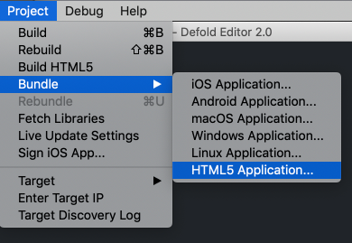
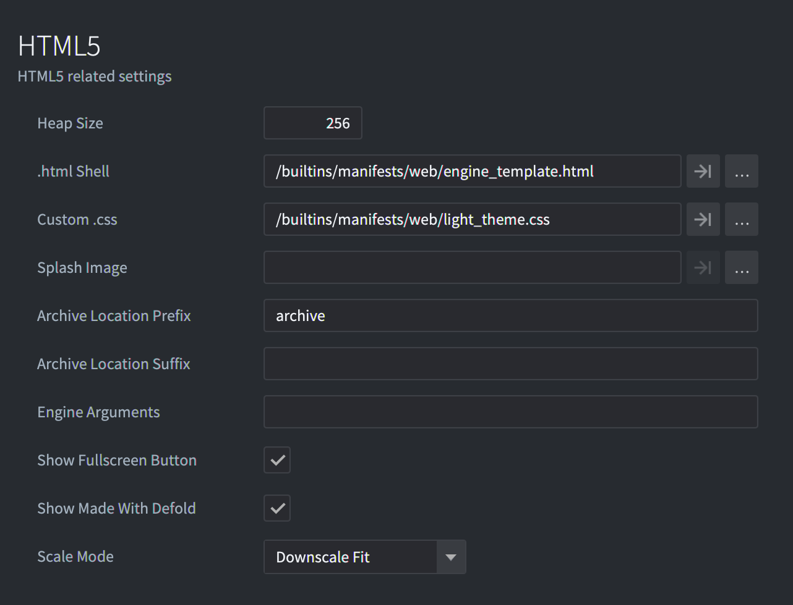
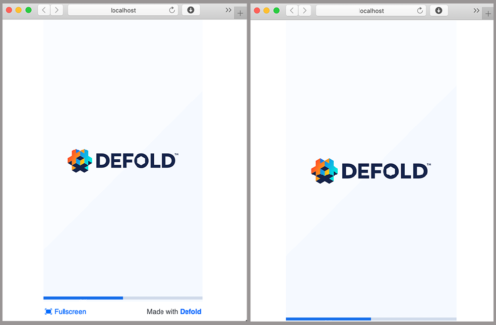
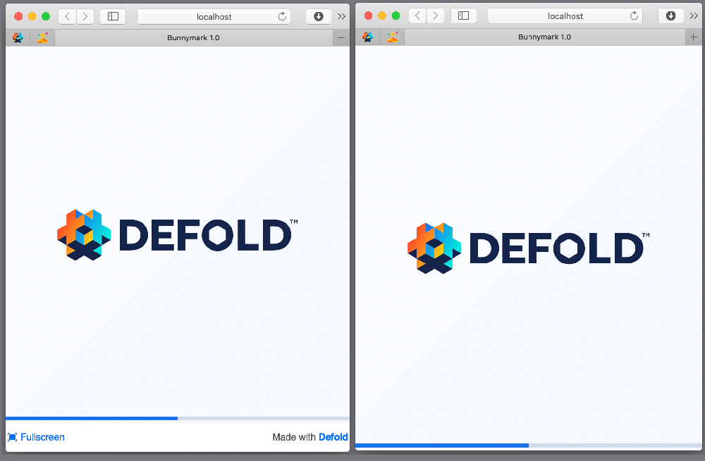
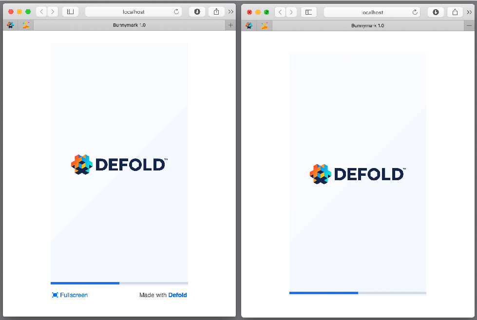
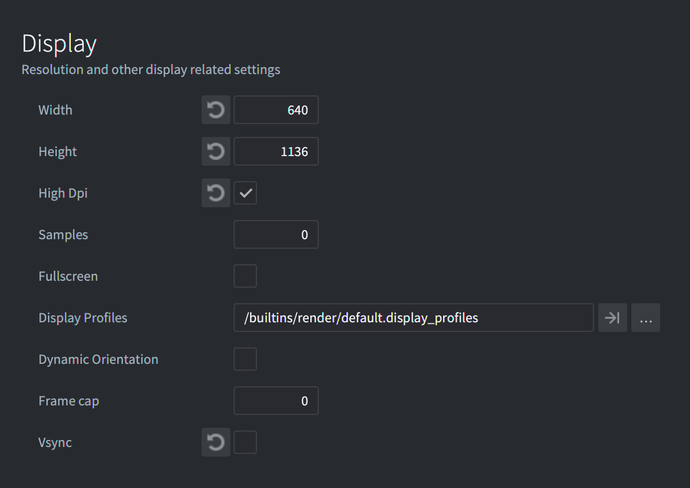

# HTML5 development

Defold supports building games for the HTML5 platform through the regular bundling menu, as well as for other platforms. In addition, the resulting game is embedded on a regular HTML page that can be styled through a simple template system.

The *game.project* file contains the HTML5 specific settings:


## Heap size

Defold support for HTML5 is powered by Emscripten (See http://en.wikipedia.org/wiki/Emscripten). In short, it creates a sandbox of memory for the heap in which the application operates. By default, the engine allocates a generous amount of memory (256MB). This should be more than sufficient for the typical game. As part of your optimization process, you may choose to use a smaller value. To do this, follow these steps:

1. Set *heap_size* to a preferred value. It should be expressed in megabytes.
2. Create your HTML5 bundle (see below)

## Testing HTML5 build

For testing, HTML5 build needs an HTTP server. Defold creates one for you if you choose <kbd>Project ▸ Build HTML5</kbd>.


If you want to test your bundle, just upload it to your remote HTTP server or create a local server, for example, using python in the bundle folder.
Python 2:
> python -m SimpleHTTPServer

Python 3:
> python -m http.server

or
> python3 -m http.server

::: important
You can't test the HTML5 bundle by opening `index.html` file in a browser. This requires HTTP server.
:::

## Creating HTML5 bundle

Creating HTML5 content with Defold is simple and follows the same pattern as all other supported platforms: select <kbd>Project ▸ Bundle...​ ▸ HTML5 Application...</kbd> from the menu:



You will be prompted to select a folder in which to create your application. After the export process completes, you will find all of the files needed to run the application.

## Known issues and limitations

* Hot Reload - Hot Reload doesn't work in HTML5 builds. Defold applications must run their own miniature web server in order to receive updates from the editor, which isn't possible in a HTML5 build.
* Internet Explorer 11
  * Audio - Defold handles audio playback using HTML5 _WebAudio_ (see http://www.w3.org/TR/webaudio), which is not currently supported by Internet Explorer 11. Applications will fall back to a null audio implementation when using this browser.
  * WebGL - Microsoft has not completed work implementing the _WebGL_ API (see https://www.khronos.org/registry/webgl/specs/latest/). Therefore, it does not perform as well as other browsers.
  * Full screen - Full screen mode is unreliable in the browser.
* Chrome
  * Slow debug builds - In debug builds on HTML5 we verify all WebGL graphics calls to detect errors. This is unfortunately very slow when testing on Chrome. It is possible to disable this by setting the *Engine Arguments* field of *game.project* to `--verify-graphics-calls=false`.

## Customizing HTML5 bundle

When generating an HTML5 version of your game, Defold provides a default web page. It references style and script resources that dictate how your game is presented.

Each time the application is exported, this content is created afresh. If you wish to customize any of these elements you must make modifications to your project settings. To do so, open the *game.project* in the Defold editor and scroll to the *html5* section:



More information about every option is available in [project settings manual](/manuals/project-settings/#html5).

::: important
You can't modify files of the default html/css template in `builtins` folder. For applying your modifications copy/paste needed file from `builtins` and set this file in `game.project`.
:::

::: important
The canvas shouldn't be styled with any border or padding. If you do, mouse input coordinates will be wrong.
:::

In `game.project` it is possible to turn-off the `Fullscreen` button and the `Made with Defold` link.
Defold provides a dark and light theme for the index.html. The light theme is set by default but it is possible to change by changing `Custom CSS` file. There is also four predefined scale modes to chose from in the `Scale Mode` field.

::: important
The calculations for all scale modes include current screen DPI in case if you turn on `High Dpi` option in `game.project` (`Display` section)
:::

### Downscale Fit and Fit

For the `Fit` mode canvas size will be changed to show full game canvas on the screen with original proportions. The only difference in `Downscale Fit` is changing size only if the inner size of the webpage is smaller than the original canvas of the game, but doesn't scale-up when a webpage is bigger than the original game canvas.



### Stretch

For the `Stretch` mode canvas size will be changed to fully fill the inner size of the webpage.



### No Scale
With `No Scale` mode the canvas size is exactly the same as you predefined in `game.project` file, `[display]` section.



## Tokens

We use [Mustache template language](https://mustache.github.io/mustache.5.html) for creation of the `index.html` file. When your are building or bundling, the HTML and CSS files are passed through a compiler that is capable of replacing certain tokens with values that depend upon your project settings. These tokens are always encased in either double or triple curly braces (`{{TOKEN}}` or `{{{TOKEN}}}`), depending on whether character sequences should be escaped or not. This feature can be useful if you either make frequent changes to your project settings or intend for material to be reused in other projects.

::: sidenote
More information about Mustache template language is available in [manual](https://mustache.github.io/mustache.5.html).
:::

Any `game.project` can be a token. For example, if you want to use `Width` value from `Display` section:



Open `game.project` as a text and check `[section_name]` and name of the field you want to use. Then you can use it as a token: `{{section_name.field}}` or `{{{section_name.field}}}`.


For example, in HTML template in JavaScript:

```javascript
function doSomething() {
    var x = {{display.width}};
    // ...
}
```

Also, we have the following custom tokens:

DEFOLD_SPLASH_IMAGE
: Writes the filename of the splash image file or `false` if `html5.splash_image` in `game.project` is empty


```css
{{#DEFOLD_SPLASH_IMAGE}}
		background-image: url("{{DEFOLD_SPLASH_IMAGE}}");
{{/DEFOLD_SPLASH_IMAGE}}
```

exe-name
: The project name without unacceptable symbols


DEFOLD_CUSTOM_CSS_INLINE
: This is the place when we inline of the CSS file specified in your `game.project` settings.


```html
<style>
{{{DEFOLD_CUSTOM_CSS_INLINE}}}
</style>
```

::: important
It is important that this inline block appear before the main application script is loaded. Since it includes HTML tags, this macro should appear in triple braces `{{{TOKEN}}}` to prevent character sequences being escaped.
:::

DEFOLD_SCALE_MODE_IS_DOWNSCALE_FIT
: This token is `true` if `html5.scale_mode` is `Downscale Fit`.

DEFOLD_SCALE_MODE_IS_FIT
: This token is `true` if `html5.scale_mode` is `Fit`.

DEFOLD_SCALE_MODE_IS_NO_SCALE
: This token is `true` if `html5.scale_mode` is `No Scale`.

DEFOLD_SCALE_MODE_IS_STRETCH
: This token is `true` if `html5.scale_mode` is `Stretch`.

DEFOLD_HEAP_SIZE
: Heap size specified in `game.project` `html5.heap_size` converted to bytes.

DEFOLD_ENGINE_ARGUMENTS
: Engine arguments specified in `game.project` `html5.engine_arguments` separated by `,` symbol.


## Extra parameters

If you create your custom template, you can specify extra parameters for the engine loader:
```
`Module.runApp("canvas", extra_params) - Starts the
    application given a canvas element id

'extra_params' is an optional object that can have the
    following fields:

'archive_location_filter':
    Filter function that will run for each archive path.

'unsupported_webgl_callback':
    Function that is called if WebGL is not supported.

'engine_arguments':
    List of arguments (strings) that will be passed to the engine.

'persistent_storage':
    Boolean toggling the usage of persistent storage.

'custom_heap_size':
    Number of bytes specifying the memory heap size.

'disable_context_menu':
    Disables the right-click context menu on the canvas element if true.

'retry_time':
    Pause before retry file loading after error.

'retry_count':
    How many attempts we do when trying to download a file.

'can_not_download_file_callback':
    Function that is called if you can't download file after 'retry_count' attempts.
*/
```

## File operations in HTML5

HTML5 builds support file operations such as `sys.save()`, `sys.load()` and `io.open()` but the way these operations are handled internally is different from other platforms. When Javascript is run in a browser there is no real concept of a file system and local file access is blocked for security reasons. Instead Emscripten (and thus Defold) uses [IndexedDB](https://developer.mozilla.org/en-US/docs/Web/API/IndexedDB_API/Using_IndexedDB), an in-browser database used to persistently store data, to create a virtual filesystem in the browser. The important difference from file system access on other platforms is that there can be a slight delay between writing to a file and the change actually being stored in the database. The browser developer console usually allows you to inspect the contents of the IndexedDB.
