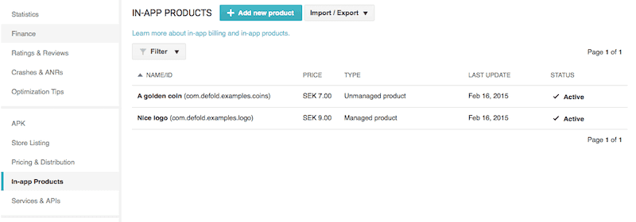
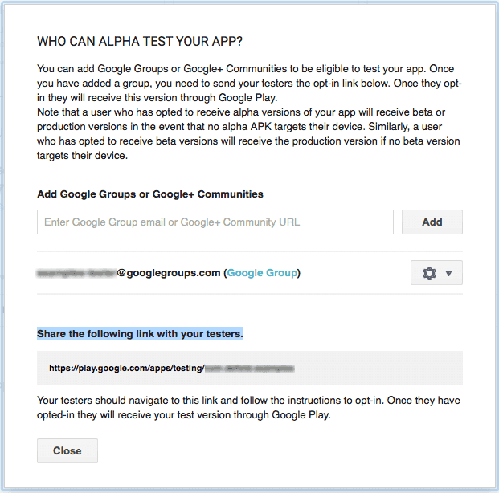
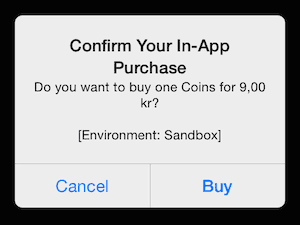
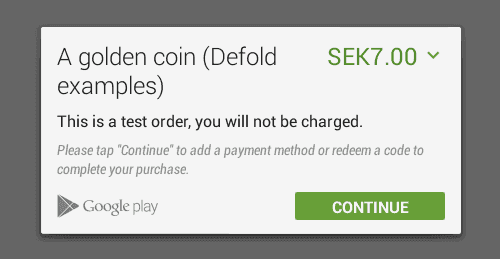
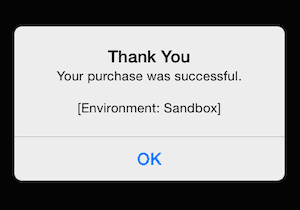

# In-app purchases

Defold provides a unified, simple to use interface to Apple's iOS Appstore "in-app purchases" and Google Play's or Amazon's "in-app billing" on Android devices. Facebook Canvas "game payments" are supported for Facebook Canvas. These services gives you the opportunity to sell products as:

* Standard in-app products (one time billing) of consumables or non-consumables and
* Subscriptions (recurring, automated billing)

::: important
The current Defold interface allows full interaction with Apple's Storekit functionality. For Google Play and Facebook Canvas, the interface is identical, meaning that you can run the same code on either platform. However, some process flow might differ from platform to platform. Also note that there is currently no support for OS X purchases through the Mac Appstore.
:::

Detailed documentation from Apple, Google, Amazon and Facebook can be found here:

* [In-App Purchase Programming Guide](https://developer.apple.com/library/ios/documentation/NetworkingInternet/Conceptual/StoreKitGuide/Introduction.html).
* [Google Play In-app Billing documentation](http://developer.android.com/google/play/billing/index.html).
* [Amazon In-app Purchase documentation](https://developer.amazon.com/public/apis/earn/in-app-purchasing).
* [Facebook game payments documentation](https://developers.facebook.com/docs/payments).

## Installing the extension

To start using the In-app purchases extension you need to add it as a dependency to your `game.project` file. The latest stable version is available with the dependency URL:
```
https://github.com/defold/extension-iap/archive/master.zip
```

We recommend using a link to a zip file of a [specific release](https://github.com/defold/extension-iap/releases).

Documentation of the API is available on the [extension GitHub page](https://defold.github.io/extension-iap/).


## Testing Google Play Billing with static responses

On Android it is recommended that you start implementing IAP in your app by using static responses from Google Play. This enables you to verify that everything in your app works correctly before you publish the app. Four reserved product IDs exist for testing static In-app Billing responses:

`android.test.purchased`
: Google Play responds as though you successfully purchased an item. The response includes a JSON string, which contains fake purchase information (for example, a fake order ID).

`android.test.canceled`
: Google Play responds as though the purchase was canceled. This can occur when an error is encountered in the order process, such as an invalid credit card, or when you cancel a user's order before it is charged.

`android.test.refunded`
: Google Play responds as though the purchase was refunded.

`android.test.item_unavailable`
: Google Play responds as though the item being purchased was not listed in your application's product list.

## Setting up your app for purchases/billing

The procedure on iOS and Android is similar:

1. Make sure you are a registered Apple or Google Play developer.
2. Set up your project so it works on your target device. See the [iOS development](/manuals/ios) and [Android development](/manuals/android) guides.
3. Set up the app for testing:

    - For Android, this is done on the [Google Play Developer Console](https://play.google.com/apps/publish/).
    - For iOS, this is done on [iTunes Connect](https://itunesconnect.apple.com/). Make sure that your App ID (created in the "Member Center" on https://developer.apple.com) has "In-App Purchase" enabled.

    

4. For Google Play, you need to _upload and publish_ an alpha *.apk* file. For iTunes Connect, you should _not upload_ the development binary to iTunes Connect until the application is ready for App Review approval. If you upload a binary to iTunes Connect and it is not fully functional, Apple will likely reject it.

5. Create products for your app.

    

    

6. Add test users.
    - The iTunes Connect page *Users and Roles* allow you to add users that can do test purchases in the _sandbox environment_. You should sign your app with a Developer certificate and use the sandbox account in Appstore on the test device.
    - From the Google Play Developer Console, choose *Settings > Account Details* where you can add user emails to the License Testing section. Separate the emails by commas. This allows your testers to use test purchases that don’t actually cost real money.
    - On Google Play, you also need to set up a Google Group for your testers. Google uses Groups to manage testers that can download your app from the Alpha and Beta stores. Click on the *Alpha Testing* tab and then *Manage list of testers* to add your Google Group as Alpha testers. The app must have passed through alpha publishing before you can see the opt-in link.



The procedure on Facebook:

1. Make sure you are a registered Facebook developer. Go to [Facebook for developers](https://developers.facebook.com/), "My Apps" and "Register as a developer", follow the steps.
2. Facebook has extensive payment functionality and requires support of both synchronous and asynchronous payments. More info here [Payment overview](https://developers.facebook.com/docs/payments/overview)
3. Set up app hosting and callback server:
    * You will need to set up a secure canvas URL hosting your project. How this works is explained here [Games on Facebook](https://developers.facebook.com/docs/games/gamesonfacebook/hosting).
    * The next step is to set up your callback server. Follow the steps here [Setting up your callback server](https://developers.facebook.com/docs/payments/realtimeupdates#yourcallbackserver).
4. Set up you canvas app. Follow the steps on [Facebook Developer Dashboard](https://developers.facebook.com/quickstarts/?platform=canvas).
5. Add test users. This is done in the "Canvas Payments" section of the app dashboard.
6. Create products for your app [Defining products](https://developers.facebook.com/docs/payments/implementation-guide/defining-products/).

## Asynchronous transactions

The IAP API is asynchronous, meaning that after each request that your program sends to the server, the program will not halt and wait for a response. Instead, the program continues as ordinary and when the response arrives, a _callback_ function is invoked where you can react to the response data.

To fetch all product information available:

```lua
local COINS_ID = "com.defold.examples.coins"
local LOGO_ID = "com.defold.examples.logo"

local function product_list(self, products, error)
    if error == nil then
        for i,p in pairs(products) do
            print(p.ident)
            print(p.title)
            print(p.description)
            print(p.currency_code)
            print(p.price_string)
        end
    else
        print(error.error)
    end
end

function init(self)
    -- Initiate a fetch of products (max 20 at a time for Google Play)
    iap.list({ COINS_ID, LOGO_ID }, product_list)
end
```

To perform actual transactions, first register a function that will listen to transaction results, then call the store function at the appropriate time:

```lua
local function iap_listener(self, transaction, error)
    if error == nil then
        if transaction.state == iap.TRANS_STATE_PURCHASING then
            print("Purchasing...")
        elseif transaction.state == iap.TRANS_STATE_PURCHASED then
            print("Purchased!")
        elseif transaction.state == iap.TRANS_STATE_UNVERIFIED then
            print("Unverified!")
        elseif transaction.state == iap.TRANS_STATE_FAILED then
            print("Failed!")
        elseif transaction.state == iap.TRANS_STATE_RESTORED then
            print("Restored")
        end
    else
        print(error.error)
    end
end

function on_message(self, message_id, message, sender)
    ...
    -- Register the function that will listen to IAP transactions.
    iap.set_listener(iap_listener)
    -- Initiate a purchase of a coin...
    iap.buy(COINS_ID)
    ...
end
```

The device operating system will automatically show a pop-up window allowing the user to go through with the purchase. The interface clearly indicates when you are running in the test/sandbox environment.







## Synchronous payments

Most payment providers only supports synchronous payments. This means that the client (your application) will receive a notification when the payment is complete, TRANS_STATE_PURCHASED. This is the final state of the payment, meaning no more callbacks will be done on this transaction.

## Asynchronous payments

Some payment providers require supporting asynchronous payments. This means that the client (your application) will only receive a notification when the payment is initiated. In order to verify completion of payment, further communication needs to be done between the developer server (or client) and the payment provider in order to verify.
In the case of an initiated asynchronous payment the IAP listener will receive the state TRANS_STATE_UNVERIFIED to indicate this (as opposed to TRANS_STATE_PURCHASED). This is the final state of the payment, meaning no more callbacks will be done on this transaction.

## Purchase fulfillment

In order to complete a purchase from a payment provider, the application needs to signal a purchase fulfillment to the provider telling the provider the purchase has gone through (for example by developer server-side verification).
IAP supports auto-completion, where fulfillment is automatically signaled to the provider when a purchase is complete (this is the default behavior). You can also disable auto-completion in the game project settings. You are then required to call `iap.finish()` when the transaction is complete, which will signal purchase fulfillment to the provider.

### Consumable vs non-consumable products
The Google Play store does only support consumable products. If you need non-consumable products it is recommended to use manual fulfillment of purchases and never finish purchases for products that should be non-consumable. As long as a purchase isn't finished it will be returned as an active purchase when `iap.set_listener()` is called.

The Apple App Store supports non-consumable products which means that you need to finish all purchases when you provide products to your users. You can do it automatically by keeping the default behavior in the game project settings or manually (if you want to do that after server validation, for example) using `iap.finish()`.

## Transaction receipt

The receipt is a signed chunk of data that can be sent to the App Store to verify that the payment was successfully processed. This is most useful when designing a store that uses a separate server to verify that payment was processed.

## Troubleshooting

Android `iap.list()` returns "failed to fetch product"
: You need to upload and publish an *.apk* on the alpha or beta channels on the Google Play Developer Console. Also make sure that the _time and date_ on your device is correct.

Android (Google Play) `iap.list()` never returns more than 20 products
: Google has an [limit of 20 products per request](https://github.com/android/play-billing-samples/blob/7a94c6905a9c125518354c216b5c3094fde47ce1/TrivialDrive/app/src/main/aidl/com/android/vending/billing/IInAppBillingService.aidl#L62). The solution is to make multiple calls to `iap.list()` and combine the results if the number of products exceeds 20.

iOS `iap.list()` returns nothing
: Make sure that you’ve requested an iOS Paid Applications account, and all proper documentation has been filed. Without proper authorization, your iOS app purchasing (even test purchases) will not work.

  Check that the AppId you have on the "Member Center" has in-app purchases activated and that you are signing your app (or the dev-app) with a provisioning profile that is up to date with the AppId (check the "Enabled Services:" field in the provisioning profile details in the "Certificates, Identifiers & Profiles" area of "Member Center")

  Wait. It can take a few hours for the In-App product IDs to propagate to the Sandbox environment.

iOS `iap.list()` fails logging error "Unexpected callback set"
: `iap.list()` does not support nested calls. Calling `iap.list()` from an `iap.list()` callback function will be ignored, with the engine logging this error.

On iOS, the "price_string" field contains '~' characters
: The '~' characters are placeholders where no matching character could be found in the font file. The "price_string" field returned in the product list when using `iap.list()` is formatted with a _non breaking space_ (`\u00a0`) between the value and the currency denominator. If you render this string in the GUI, you need to add the character to the font's *extra_characters* field. On Mac OS X you can type non breaking spaces by pressing <kbd>Option + SPACE</kbd>. See http://en.wikipedia.org/wiki/Non-breaking_space for more information.
