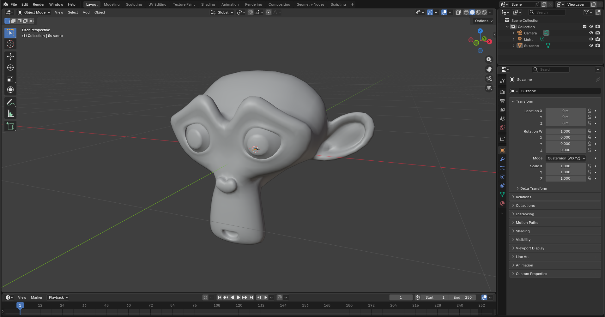
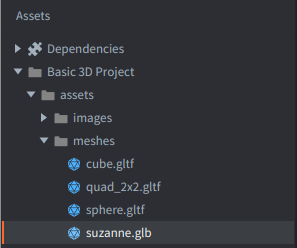
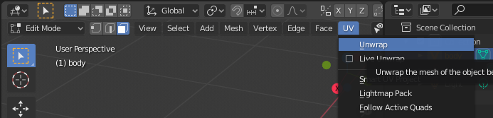
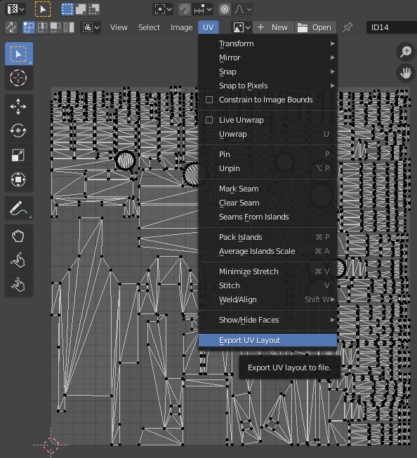
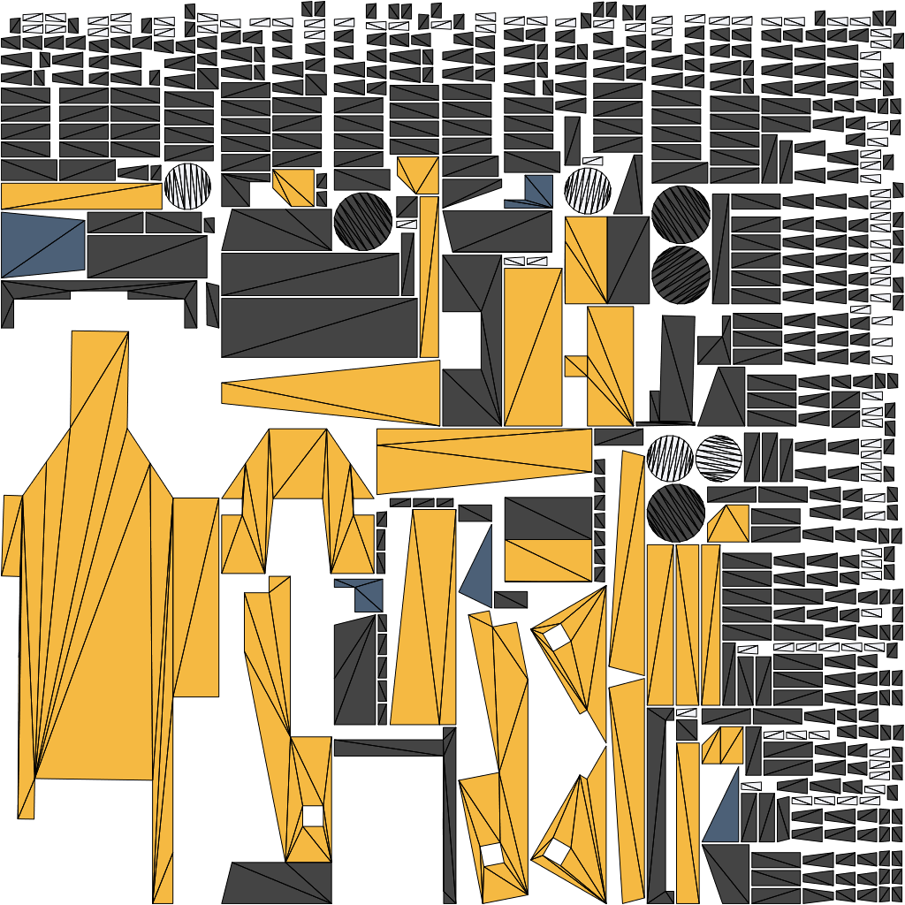
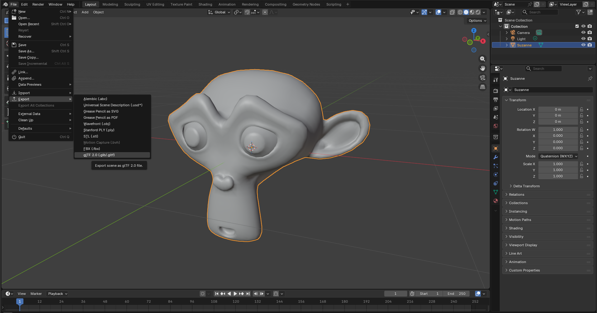
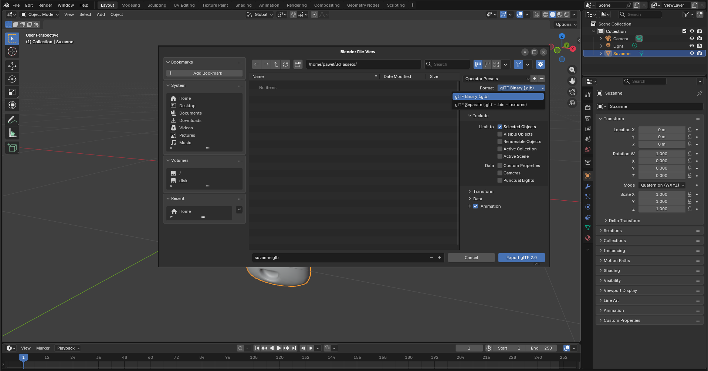

# Importing 3D models
Defold supports models, skeletons and animations in the glTF 2.0 (GL Transmission Format) format. Use *.gltf* or *.glb* files for 3D models. The glTF is a modern format designed for transferring and loading 3D data in game engines and real-time applications.

You can use tools such as Maya, 3ds Max, SketchUp and Blender to create or convert 3D models to glTF.

Blender is a powerful and popular 3D modeling, animation and rendering program. It runs on Windows, macOS and Linux and is freely available from [https://www.blender.org](https://www.blender.org).

## Importing to Defold
To import a model, drag and drop the *.gltf* or *.glb* file into the Defold editor *Assets pane*.

glTF can be stored in two common ways:

* *.glb* is a single binary file. It contains the model data and may also contain packed texture images. This is convenient when you want to move or store a model as one file.
* *.gltf* is a text-based JSON file. It usually references a separate *.bin* file for mesh data and separate texture images such as *.png* or *.jpg*. When using this variant, add all referenced files to the project and keep their relative paths intact.

If the model should use a texture in Defold, import the texture image as a separate asset. Even when the source glTF/GLB file contains embedded images, textures must be assigned to the Model component through the component material texture properties.

::: sidenote
Starting with Defold 1.13.0, Defold preserves the positions and transforms from the imported glTF file and does not automatically re-center the model during import. The editor preview and runtime use the imported transforms consistently: skinned or bone-parented meshes preserve their local, skeleton-relative transforms, while rigid meshes retain their flattened world placement.

If a model created with an older version of Defold changes position or orientation after being reimported, correct the transform in Blender or another authoring tool and export the *.gltf* or *.glb* file again.
:::

## Using a model
Once you have imported the model, use it in a [Model component](/manuals/model):

1. Create a Model file from the *Assets* pane with <kbd>New... ▸ Model</kbd>, or add a Model component directly to a game object with <kbd>Add Component ▸ Model</kbd>.
2. Set the *Mesh* property to the imported *.gltf* or *.glb* file containing the mesh.
3. For an animated model, set the *Skeleton* property to the *.gltf* or *.glb* file containing the skeleton. This is often the same file used for *Mesh* when mesh, skeleton and animations are exported together.
4. Create an *Animation Set* file for the animations and assign it to the *Animations* property. Set *Default Animation* if you want an animation to start automatically.
5. Set the *Material* property to a material suitable for the model. The built-in *model.material*, *model_instances.material*, *model_skinned.material* and *model_skinned_instances.material* files are useful starting points.
6. Set the material texture properties, such as *Texture*, to the imported texture image files. If the material uses multiple textures, assign each texture in the corresponding material texture field.

## Exporting to glTF
The exported *.gltf* or *.glb* file contains all the vertices, edges and faces that make up the model, as well as _UV coordinates_ (what part of the texture image maps to a certain part of the mesh) if you have defined them, the bones in the skeleton and animation data.

* A detailed description on polygon meshes can be found on http://en.wikipedia.org/wiki/Polygon_mesh.

* UV coordinates and UV mapping is described at http://en.wikipedia.org/wiki/UV_mapping.

Defold imposes some limitations on exported animation data:

* Defold currently only supports baked animations. Animations need to have matrices for each animated bone each keyframe, and not position, rotation and scale as separate keys.

* Animations are also linearly interpolated. If you do more advanced curve interpolation the animations needs to be prebaked from the exporter.

### Requirements
When you export a model, keep in mind that glTF support can differ between tools and engines. Use glTF 2.0, make sure the model has correct UV coordinates if it uses textures, and import texture images separately when they should be assigned to a Model component.

While our ambition is to fully support the glTF format, we're not fully there yet.
If a feature is missing, please make a feature request for it in [our repo](https://github.com/defold/defold/issues)

### Exporting a texture
If you do not already have a texture for your model you can use Blender to generate a texture. You should do this before you remove extra materials from the model. Start by selecting the mesh and all of its vertices:

When all vertices are selected you unwrap the mesh to get the UV layout:

You can then proceed to export the UV layout to an image that can be used as a texture:

### Exporting using Blender
Export your model from Blender using <kbd>File ▸ Export ▸ glTF 2.0 (.glb/.gltf)</kbd>.

Select the object or objects before exporting and enable *Selected Objects* if you only want to export the selection.

Choose one of the *Format* options:

* *glTF Binary (.glb)* creates one file. Use this when you want the model to be easy to move or store as a single asset.
* *glTF Separate (.gltf + .bin + textures)* creates separate files for the model description, binary data and textures. Use this when you want to edit texture images or assign them in Defold separately.

If the model contains animations, enable animation export and make sure the animations are baked. If the model uses textures, make sure the mesh has a UV unwrap and that texture images are exported in a format Defold can import, such as PNG or JPEG.

