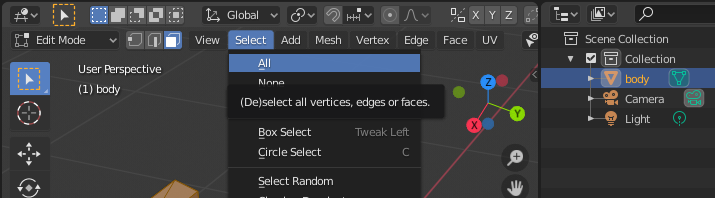
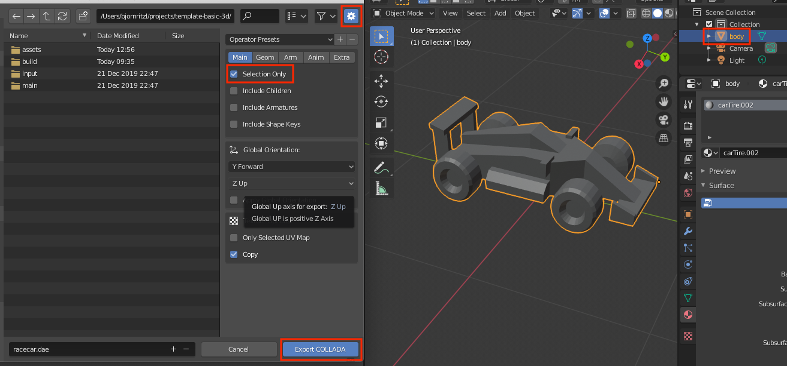

# Importing 3D models
Defold currently only support models, skeletons and animations in the Collada *.dae* format. You can use tools such as Maya, 3D Max, Sketchup and Blender to create and/or convert 3D models into Collada format. Blender is a powerful and popular 3D modeling, animation and rendering program. It runs on Windows, Mac OS X and Linux and is freely available for download at http://www.blender.org

{srcset="images/model/blender@2x.png 2x"}

## Exporting to Collada
When you export a model to Collada format you get a file with the *.dae* file extension. This file contain all the vertices, edges and faces that make up the model, as well as _UV coordinates_ (what part of the texture image maps to a certain part of the mesh) if you have defined them, the bones in the skeleton and animation data.

* A detailed description on polygon meshes can be found on http://en.wikipedia.org/wiki/Polygon_mesh.

* UV coordinates and UV mapping is described at http://en.wikipedia.org/wiki/UV_mapping.

Defold imposes some limitations on exported animation data:

* Defold currently only supports baked animations. Animations need to have matrices for each animated bone each keyframe, and not position, rotation and scale as separate keys.

* Animations are also linearly interpolated. If you do more advanced curve interpolation the animations needs to be prebaked from the exporter.

* Animation clips in Collada are not supported. To use multiple animations per model, export them into separate *.dae* files and gather the files into an *.animationset* file in Defold.

### Requirements
When you export a model to Collada format you need to make sure that it fulfills the following requirements:

* The model must consist of a single mesh
* The model must use a single material

#### Joining multiple meshes
You can use Blender to join multiple meshes. Select all of the meshes and press `CTRL`/`CMD` + `J` to join them.

#### Removing materials
You can use Blender to remove extra materials from the model. Select the material to remove and press the `-` button.

#### Exporting a texture
If you do not already have a texture for your model you can use Blender to generate a texture. You should do this before you remove extra materials from the model. Start by selecting the mesh and all of its vertices:

When all vertices are selected you unwrap the mesh to get the UV layout:

You can then proceed to export the UV layout to an image that can be used as a texture:

## Exporting using Blender
You export your model into Collada format using the Export menu option. Select the model before you select the Export to Collada menu option and check "Selection Only" to only export the model.

## Importing to Defold
To import the model, simply drag and drop the *.dae* file and the corresponding texture image into the *Assets Pane* somewhere.

{srcset="images/model/assets@2x.png 2x"}

## Using a model
Once you have the model imported into Defold you can use it in a [Model component](/manuals/model).
