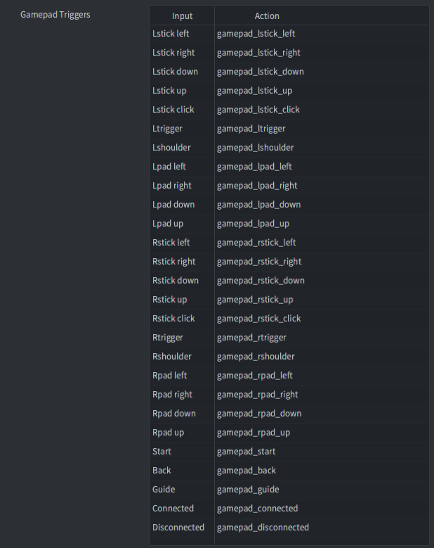

::: sidenote
It is recommended that you familiarise yourself with the general way in which input works in Defold, how to receive input and in which order input is received in your script files. Learn more about the input system in the [Input Overview manual](/manuals/input).
:::

# Gamepads
Gamepad triggers allow you to bind standard gamepad input to game functions. Gamepad input offers bindings for:

- Left and right sticks (direction and clicks)
- Left and right digital pads. Right pad usually translates to the "A", "B", "X" and "Y" buttons on the Xbox controller and "square", "circle", "triangle" and "cross" buttons on the Playstation controller.
- Left and right triggers
- Left and right shoulder buttons
- Start, Back and Guide buttons



::: important
The examples below use the actions shown in the image above. As with all input you are free to name your input actions any way you want to.
:::

## Digital buttons
Digital buttons generate pressed, released and repeated events. Example showing how to detect input for a digital button (either pressed or released):

```lua
function on_input(self, action_id, action)
    if action_id == hash("gamepad_lpad_left") then
        if action.pressed then
            -- start moving left
        elseif action.released then
            -- stop moving left
        end
    end
end
```

## Analog sticks
Analog sticks generate continuous input events when the stick is moved outside the dead zone defined in the gamepad settings file (see below). Example showing how to detect input for an analog stick:

```lua
function on_input(self, action_id, action)
    if action_id == hash("gamepad_lstick_down") then
        -- left stick was moved down
        print(action.value) -- a value between 0.0 an -1.0
    end
end
```

Analog sticks also generate pressed and released events when moved in the cardinal directions above a certain threshold value. This makes it easy to also use an analog stick as digital directional input:

```lua
function on_input(self, action_id, action)
    if action_id == hash("gamepad_lstick_down") and action.pressed then
        -- left stick was moved to its extreme down position
    end
end
```

## Multiple gamepads
Defold supports multiple gamepads through the host operating system, actions set the `gamepad` field of the action table to the gamepad number the input originated from:

```lua
function on_input(self, action_id, action)
    if action_id == hash("gamepad_start") then
        if action.gamepad == 0 then
          -- gamepad 0 wants to join the game
        end
    end
end
```

## Connect and Disconnect
Gamepad input bindings also provide two separate bindings named `Connected` and `Disconnected` to detect when a gamepad is connected (even those connected from the start) or disconnected.

```lua
function on_input(self, action_id, action)
    if action_id == hash("gamepad_connected") then
        if action.gamepad == 0 then
          -- gamepad 0 was connected
        end
    elseif action_id == hash("gamepad_dicconnected") then
        if action.gamepad == 0 then
          -- gamepad 0 was dicconnected
        end
    end
end
```

## Raw gamepads
(From Defold 1.2.183)

Gamepad input bindings also provide a separate binding named `Raw` to give the unfiltered (without applied deadzone) button, axis and hat input of any connected gamepad.

```lua
function on_input(self, action_id, action)
    if action_id == hash("raw") then
        pprint(action.gamepad_buttons)
        pprint(action.gamepad_axis)
        pprint(action.gamepad_hats)
    end
end
```

## Gamepads settings file
Gamepad input setup uses a separate mapping file for each hardware gamepad type. Gamepad mappings for specific hardware gamepads are set in a *gamepads* file. Defold ships with a built-in gamepads file with settings for common gamepads:

{srcset="images/input/gamepads@2x.png 2x"}

If you need to create a new gamepad settings file, we have a simple tool to help:

[Click to download gdc.zip](https://forum.defold.com/t/big-thread-of-gamepad-testing/56032).

It includes binaries for Windows, Linux and macOS. Run it from the command line:

```sh
./gdc
```

The tool will ask you to press different buttons on your connected controller. It will then output a new gamepads file with correct mappings for your controller. Save the new file, or merge it with your existing gamepads file, then update the setting in "game.project":

{srcset="images/input/gamepad_setting@2x.png 2x"}

### Unidentified gamepads
(From Defold 1.2.186)

When a gamepad is connected and no mapping exists for the gamepad the gamepad will only generate "connected", "disconnected" and "raw" actions. In this case you need to manually map the raw gamepad data to actions in your game.

## Gamepads in HTML5
Gamepads are supported in HTML5 builds and generate the same input events as on other platforms. Support for gamepads is based on the [Gamepad API](https://www.w3.org/TR/gamepad/) which is supported in most browsers ([refer to this support chart](https://caniuse.com/?search=gamepad)). If the browser doesn't support the Gamepad API Defold will silently ignore any Gamepad triggers in your project. You can check if the browser supports the Gamepad API by checking if the `getGamepads` function exists on the `navigator` object:

```lua
local function supports_gamepads()
    return not html5 or (html5.run('typeof navigator.getGamepads === "function"') == "true")
end

if supports_gamepads() then
    print("Platform supports gamepads")
end
```

If your game is running from inside an `iframe` you must also make sure that the `iframe` has the `gamepad` permission added:

```html
<iframe allow="gamepad"></iframe>
```

### Standard gamepad
(From Defold 1.3.8)

If a connected gamepad is not found in the [gamepads settings file](/manuals/input-gamepads/#gamepads-settings-file) Defold will check if the gamepad is identified as a *Standard Gamepad*. A standard gamepad is defined as having 16 buttons and 2 analog sticks with a button layout similar to a PlayStation or Xbox controller (see the [W3C definition and button layout](https://w3c.github.io/gamepad/#dfn-standard-gamepad) for more information). If the connected gamepad is a standard gamepad Defold will look for a gamepad mapping for "Standard Gamepad" in the gamepads settings file (a Standard Gamepad mapping is included in the `default.gamepads` file in `/builtins`).

## Gamepads on Windows
On Windows, only XBox 360 controllers are currently supported. To hook up your 360 controller to your Windows machine, [make sure it is setup correctly](http://www.wikihow.com/Use-Your-Xbox-360-Controller-for-Windows).

## Gamepads on Android
(From Defold 1.2.183)

Gamepads are supported in Android builds and generate the same input events as on other platforms. Support for gamepads is based on the [Android input system for key and motion events](https://developer.android.com/training/game-controllers/controller-input). The Android input events will be translated to Defold gamepad events using the same *gamepad* file as described above.

When adding additional gamepad bindings on Android you can use the following lookup tables to translate from the Android input events to *gamepad* file values:

| Key event to button index   | Index | Version |
|-----------------------------|-------|---------|
| AKEYCODE_BUTTON_A           | 0     | 1.2.183 |
| AKEYCODE_BUTTON_B           | 1     | 1.2.183 |
| AKEYCODE_BUTTON_C           | 2     | 1.2.183 |
| AKEYCODE_BUTTON_X           | 3     | 1.2.183 |
| AKEYCODE_BUTTON_L1          | 4     | 1.2.183 |
| AKEYCODE_BUTTON_R1          | 5     | 1.2.183 |
| AKEYCODE_BUTTON_Y           | 6     | 1.2.183 |
| AKEYCODE_BUTTON_Z           | 7     | 1.2.183 |
| AKEYCODE_BUTTON_L2          | 8     | 1.2.183 |
| AKEYCODE_BUTTON_R2          | 9     | 1.2.183 |
| AKEYCODE_DPAD_CENTER        | 10    | 1.2.183 |
| AKEYCODE_DPAD_DOWN          | 11    | 1.2.183 |
| AKEYCODE_DPAD_LEFT          | 12    | 1.2.183 |
| AKEYCODE_DPAD_RIGHT         | 13    | 1.2.183 |
| AKEYCODE_DPAD_UP            | 14    | 1.2.183 |
| AKEYCODE_BUTTON_START       | 15    | 1.2.183 |
| AKEYCODE_BUTTON_SELECT      | 16    | 1.2.183 |
| AKEYCODE_BUTTON_THUMBL      | 17    | 1.2.183 |
| AKEYCODE_BUTTON_THUMBR      | 18    | 1.2.183 |
| AKEYCODE_BUTTON_MODE        | 19    | 1.2.183 |
| AKEYCODE_BUTTON_1           | 20    | 1.2.186 |
| AKEYCODE_BUTTON_2           | 21    | 1.2.186 |
| AKEYCODE_BUTTON_3           | 22    | 1.2.186 |
| AKEYCODE_BUTTON_4           | 23    | 1.2.186 |
| AKEYCODE_BUTTON_5           | 24    | 1.2.186 |
| AKEYCODE_BUTTON_6           | 25    | 1.2.186 |
| AKEYCODE_BUTTON_7           | 26    | 1.2.186 |
| AKEYCODE_BUTTON_8           | 27    | 1.2.186 |
| AKEYCODE_BUTTON_9           | 28    | 1.2.186 |
| AKEYCODE_BUTTON_10          | 29    | 1.2.186 |
| AKEYCODE_BUTTON_11          | 30    | 1.2.186 |
| AKEYCODE_BUTTON_12          | 31    | 1.2.186 |
| AKEYCODE_BUTTON_13          | 32    | 1.2.186 |
| AKEYCODE_BUTTON_14          | 33    | 1.2.186 |
| AKEYCODE_BUTTON_15          | 34    | 1.2.186 |
| AKEYCODE_BUTTON_16          | 35    | 1.2.186 |

([Android KeyEvent definitions](https://developer.android.com/ndk/reference/group/input#group___input_1gafccd240f973cf154952fb917c9209719))

| Motion event to axis index  | Index |
|-----------------------------|-------|
| AMOTION_EVENT_AXIS_X        | 0     |
| AMOTION_EVENT_AXIS_Y        | 1     |
| AMOTION_EVENT_AXIS_Z        | 2     |
| AMOTION_EVENT_AXIS_RZ       | 3     |
| AMOTION_EVENT_AXIS_LTRIGGER | 4     |
| AMOTION_EVENT_AXIS_RTRIGGER | 5     |
| AMOTION_EVENT_AXIS_HAT_X    | 6     |
| AMOTION_EVENT_AXIS_HAT_Y    | 7     |

([Android MotionEvent definitions](https://developer.android.com/ndk/reference/group/input#group___input_1ga157d5577a5b2f5986037d0d09c7dc77d))

Use this lookup table in combination with a gamepad test app from the Google Play Store to figure out which key event each button on your gamepad is mapped to.
