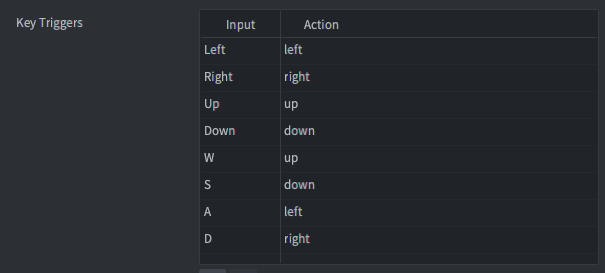
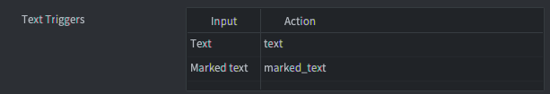

::: sidenote
It is recommended that you familiarise yourself with the general way in which input works in Defold, how to receive input and in which order input is received in your script files. Learn more about the input system in the [Input Overview manual](/manuals/input).
:::

# Key Triggers
Key triggers allow you to bind single key keyboard input to game actions. Each key is mapped separately into a corresponding action. Key triggers are used to tie specific buttons to specific functions, like character movement with the arrow or WASD keys. If you need to read arbitrary keyboard input, use text triggers (see below).



```lua
function on_input(self, action_id, action)
    if action_id == hash("left") then
        if action.pressed then
            -- start moving left
        elseif action.released then
            -- stop moving left
        end
    end
end
```

# Text Triggers
Text triggers are used to read arbitrary text input. There are two types of text triggers; text and marked text.



## Text
The `text` captures normal text input. It sets the `text` field of the action table to a string containing the typed character. The action is only fired at the press of the button, no `release` or `repeated` action is sent.

```lua
function on_input(self, action_id, action)
    if action_id == hash("text") then
        -- Concatenate the typed character to the "user" node...
        local node = gui.get_node("user")
        local name = gui.get_text(node)
        name = name .. action.text
        gui.set_text(node, name)
    end
end
```

## Marked text
The `marked-text` is used primarily for asian keyboards where multiple keypresses can map to single inputs. For example, with the iOS "Japanese-Kana" keyboard, the user can type combinations and the top of the keyboard will display avaliable symbols or sequences of symbols that can be entered.

{srcset="images/input/marked_text@2x.png 2x"}

- Each keypress generates a separate action and sets the action field `text` to the currently entered sequence of symbols (the "marked text").
- When the user selects a symbol or symbol combination, a separate `text` type trigger action is sent (provided that one is set up in the input binding list). The separate action sets the action field `text` to the final sequence of symbols.
