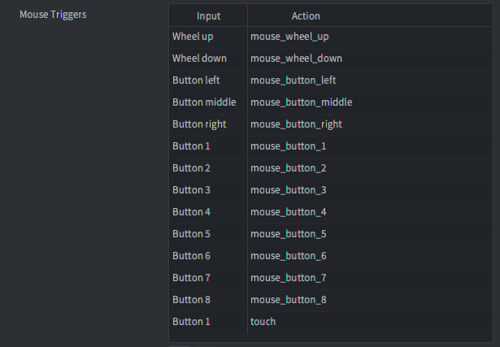
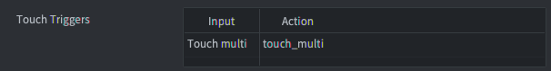

::: sidenote
It is recommended that you familiarize yourself with the general way in which input works in Defold, how to receive input and in which order input is received in your script files. Learn more about the input system in the [Input Overview manual](/manuals/input).
:::

# Mouse Triggers
Mouse triggers allow you to bind input from mouse buttons and scroll wheels to game actions.



::: sidenote
Mouse button inputs `MOUSE_BUTTON_LEFT`, `MOUSE_BUTTON_RIGHT` and `MOUSE_BUTTON_MIDDLE` are equivalent to `MOUSE_BUTTON_1`, `MOUSE_BUTTON_2` and `MOUSE_BUTTON_3`.
:::

::: important
The examples below use the actions shown in the image above. As with all input you are free to name your input actions any way you want to.
:::

## Mouse buttons
Mouse buttons generate pressed, released and repeated events. Example showing how to detect input for the left mouse button (either pressed or released):

```lua
function on_input(self, action_id, action)
    if action_id == hash("mouse_button_left") then
        if action.pressed then
            -- left mouse button pressed
        elseif action.released then
            -- left mouse button released
        end
    end
end
```

::: important
`MOUSE_BUTTON_LEFT` (or `MOUSE_BUTTON_1`) input actions are sent for single touch inputs as well.
:::

## Mouse wheel
Mouse wheel inputs detect scroll actions. The field `action.value` is `1` if the wheel is scrolled and `0` otherwise. (Scroll actions are dealt with as they were button presses. Defold does not currently support fine grained scroll input on touch pads.)

```lua
function on_input(self, action_id, action)
    if action_id == hash("mouse_wheel_up") then
        if action.value == 1 then
            -- mouse wheel is scrolled up
        end
    end
end
```

## Mouse movement
Mouse movement is handled separately. Mouse movement events are not received unless at least one mouse trigger is set up in your input bindings.

Mouse movement are not bound in the input bindings but `action_id` is set to `nil` and the `action` table is populated with the location and delta movement of the mouse position.

```lua
function on_input(self, action_id, action)
    if action.x and action.y then
        -- let game object follow mouse/touch movement
        local pos = vmath.vector3(action.x, action.y, 0)
        go.set_position(pos)
    end
end
```

# Touch Triggers
Single-touch and Multi-touch type triggers are available on iOS and Android devices in native applications and in HTML5 bundles.



## Single-touch
Single-touch type triggers are not set up from the Touch Triggers section of the input bindings. Instead **single-touch triggers are automatically set up when you have mouse button input set up for `MOUSE_BUTTON_LEFT` or `MOUSE_BUTTON_1`**.

## Multi-touch
Multi-touch type triggers populate a table in the action table called `touch`. The elements in the table are integer-indexed with numbers `1`--`N`where `N` is the number of touch points. Each element of the table contains fields with input data:

```lua
function on_input(self, action_id, action)
    if action_id == hash("touch_multi") then
        -- Spawn at each touch point
        for i, touchdata in ipairs(action.touch) do
            local pos = vmath.vector3(touchdata.x, touchdata.y, 0)
            factory.create("#factory", pos)
        end
    end
end
```

::: important
Multi-touch must not be assigned the same action as the mouse button input for `MOUSE_BUTTON_LEFT` or `MOUSE_BUTTON_1`. Assigning the same action will effectively override single-touch and prevent you from receiving any single-touch events.
:::

::: sidenote
The [Defold-Input asset](https://defold.com/assets/defoldinput/) can be used to easily set up virtual on-screen controls such as buttons and analog sticks with support for multi touch.
:::


## Detecting click or tap on objects
Detecting when the user has clicked or tapped on a visual component is a very common operation that is needed in many games. It could be user interaction with a button or other UI element or the interaction with a game object such as a player controlled unit in a strategy game, some treasure on a level in a dungeon crawler or a quest giver in an RPG. The approach to use varies depending on the type of visual component.

### Detecting interaction with GUI nodes
For UI elements there is the `gui.pick_node(node, x, y)` function that will return true or false depending on if the specified coordinate is within the bounds of a gui node or not. Refer to the [API docs](/ref/gui/#gui.pick_node:node-x-y), the [pointer over example](/examples/gui/pointer_over/) or the [button example](/examples/gui/button/) to learn more.

### Detecting interaction with game objects
For game objects it is more complicated to detect interaction since things such as camera translation and render script projection will impact the required calculations. There are two general approaches to detecting interaction with game objects:

  1. Track the position and size of game objects the user can interact with and check if the mouse or touch coordinate is within the bounds of any of the objects.
  2. Attach collision objects to game objects the user can interact with and one collision object that follows the mouse or finger and check for collisions between them.

::: sidenote
A ready to use solution for using collision objects to detect user input with drag and click support can be found in the [Defold-Input asset](https://defold.com/assets/defoldinput/).
:::

In both cases there is a need to convert from the screen space coordinates of the mouse or touch event and the world space coordinates of the game objects. This can be done in a couple of different ways:

  * Manually keep track of which view and projection that is used by the render script and use this to convert to and from world space. See the [camera manual for an example of this](/manuals/camera/#converting-mouse-to-world-coordinates).
  * Use a [third-party camera solution](/manuals/camera/#third-party-camera-solutions) and make use of the provided screen-to-world conversion functions.
