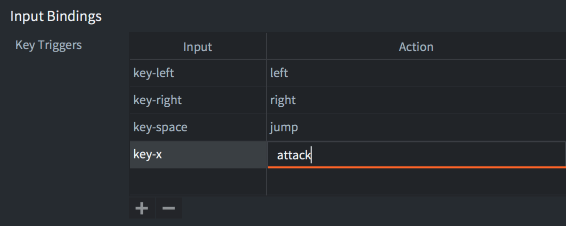
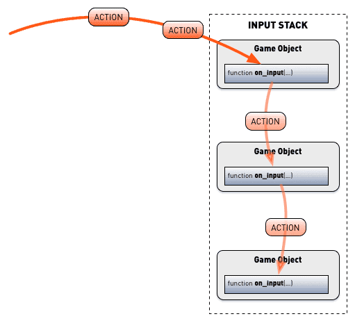

# Input

All user input is captured by the engine and dispatched as actions to script- and GUI script components in game objects that have acquired input focus and that implement the `on_input()` function. This manual explains how you set up bindings to capture input and how you create code that responds to it.

The input system uses a set of simple and powerful concepts, allowing you to manage input as you see fit for your game.

{srcset="images/input/overview@2x.png 2x"}

Devices
: Input devices that are either part of, or plugged into, your computer or mobile device provide raw system level input to the Defold runtime. The following device types are supported:

  1. Keyboard (single key as well as text input)
  2. Mouse (position, button clicks and mouse wheel actions)
  3. Single and multi-touch (on iOS and Android devices)
  4. Gamepads (as supported through the operating system and mapped in the [gamepads](#gamepads-settings-file) file)

Input bindings
: Before input is sent to a script the raw input from the device is translated into meaningful *actions* via the input bindings table.

Actions
: Actions are identified by the (hashed) names that you list in the input bindings file. Each action also contain relevant data about the input: if a button is pressed or released, the coordinates of the mouse and touch etc.

Input listeners
: Any script component or GUI script can receive input actions by *acquiring input focus*. Several listeners can be active at the same time.

Input stack
: The list of input listeners with the first acquirer of focus at the bottom of the stack and the last acquirer at the top.

Consuming input
: A script may choose to consume the input it received, preventing listeners further down the stack to receive it.

## Setting up input bindings

The input bindings is a project wide table that allows you to specify how device input should translate into named *actions* before they are dispatched to your script components and GUI scripts. You can create a new input binding file, <kbd>right click</kbd> a location in the *Assets* view and select <kbd>New... ▸ Input Binding</kbd>. To make the enginen use the new file, change the *Game Binding* entry in "game.project".

{srcset="images/input/setting@2x.png 2x"}

A default input binding file is automatically created with all new project templates so there is usually no need to create a new binding file. The default file is called "game.input_binding" and can be found in the "input" folder in the project root. <kbd>Double click</kbd> the file to open it in the editor:

{srcset="images/input/input_binding@2x.png 2x"}

To create a new binding, click the <kbd>+</kbd> button at the bottom of the relevant trigger type section. Each entry has two fields:

*Input*
: The raw input to listen for, selected from a scroll list of available inputs.

*Action*
: The action name given to input actions when they are created and dispatched to your scripts. The same action name can be assigned to multiple inputs. For instance, you can bind the <kbd>Space</kbd> key and the gamepad "A" button to the action `jump`. Note that there is a known bug where touch inputs unfortunately cannot have the same action names as other inputs.

## Trigger types

There are five device specific types of triggers that you can create

Key Triggers
: Single key keyboard input. Each key is mapped separately into a corresponding action. Key triggers are used to tie specific buttons to specific functions, like character movement with the arrow or WASD keys. If you need to read arbitrary keyboard input, use text triggers (see below).

Mouse Triggers
: Input from mouse buttons and scroll wheels. Mouse movement is handled separately. Mouse movement events are not received unless at least one mouse trigger is set up in your input bindings.

  - Mouse button inputs `MOUSE_BUTTON_LEFT`, `MOUSE_BUTTON_RIGHT` and `MOUSE_BUTTON_MIDDLE` are equivalent to `MOUSE_BUTTON_1`, `MOUSE_BUTTON_2` and `MOUSE_BUTTON_3`.

  - **`MOUSE_BUTTON_LEFT` (or `MOUSE_BUTTON_1`) input actions are sent for single touch inputs as well**.

  - Mouse wheel inputs detect scroll actions. The field `action.value` is `1` if the wheel is scrolled and `0` otherwise. (Scroll actions are dealt with as they were button presses. Defold does not currently support fine grained scroll input on touch pads.)

  - Mouse movement are not bound in the input bindings but `action_id` is set to `nil` and the `action` table is populated with the location and delta movement of the mouse position.

Gamepad Triggers
: Gamepad triggers allow you to bind standard gamepad input to game functions. Defold supports multiple gamepads through the host operating system, actions set the `gamepad` field of the action table to the gamepad number the input originated from:

  ```lua
  if action_id == hash("gamepad_start") then
    if action.gamepad == 0 then
      -- gamepad 0 wants to join the game
    end
  end
  ```

  Gamepad input and offers bindings for:

  - Left and right sticks (direction and clicks)
  - Left and right digital pads. Right pad usually translates to the "A", "B", "X" and "Y" buttons on the Xbox controller and "square", "circle", "triangle" and "cross" buttons on the Playstation controller.
  - Left and right triggers
  - Left and right shoulder buttons
  - Start, Back and Guide buttons

  On Windows, only XBox 360 controllers are currently supported. To hook up your 360 controller to your Windows machine, make sure it is setup correctly. See http://www.wikihow.com/Use-Your-Xbox-360-Controller-for-Windows

  Gamepad input setup uses a separate mapping file for each hardware gamepad type. See below for more information.

Touch Triggers
: Single-touch type triggers are available on iOS and Android devices. Single-touch type triggers are not set up from the Touch Triggers section of the input bindings. Instead **single-touch triggers are automatically set up when you have mouse button input set up for `MOUSE_BUTTON_LEFT` or `MOUSE_BUTTON_1`**.

: Multi-touch type triggers are available on iOS and Android devices in native applications and HTML5 bundles. They populate a table in the action table called `touch`. The elements in the table are integer-indexed with numbers `1`--`N`where `N` is the number of touch points. Each element of the table contains fields with input data:

  ```lua
  -- Spawn at each touch point
  for i, touchdata in ipairs(action.touch) do
    local pos = vmath.vector3(touchdata.x, touchdata.y, 0)
    factory.create("#factory", pos)
  end
  ```

::: important
Multi-touch must not be assigned the same action as the mouse button input for `MOUSE_BUTTON_LEFT` or `MOUSE_BUTTON_1`. Assigning the same action will effectively override single-touch and prevent you from receiving any single-touch events.
:::

Text Triggers
: Text triggers are used to read arbitrary text input. There are two types of text triggers:

  - `text` captures normal text input. It sets the `text` field of the action table to a string containing the typed character. The action is only fired at the press of the button, no `release` or `repeated` action is sent.

    ```lua
    if action_id == hash("text") then
      -- Concatenate the typed character to the "user" node...
      local node = gui.get_node("user")
      local name = gui.get_text(node)
      name = name .. action.text
      gui.set_text(node, name)
    end
    ```

  - `marked-text` is used primarily for asian keyboards where multiple keypresses can map to single inputs. For example, with the iOS "Japanese-Kana" keyboard, the user can type combinations and the top of the keyboard will display avaliable symbols or sequences of symbols that can be entered.

  {srcset="images/input/marked_text@2x.png 2x"}

  - Each keypress generates a separate action and sets the action field `text` to the currently entered sequence of symbols (the "marked text").
  - When the user selects a symbol or symbol combination, a separate `text` type trigger action is sent (provided that one is set up in the input binding list). The separate action sets the action field `text` to the final sequence of symbols.

## Input focus

To listen to input actions in a script component or GUI script, the message `acquire_input_focus` should be sent to the game object holding the component:

```lua
-- tell the current game object (".") to acquire input focus
msg.post(".", "acquire_input_focus")
```

This message instructs the engine to add input capable components (script components, GUI components and collection proxies) in the game objects to the *input stack*. The game object components are put on top of the input stack; the component that is added last will be top of the stack. Note that if the game object contains more than one input capable component, all components will be added to the stack:

{srcset="images/input/input_stack@2x.png 2x"}

Each game world that is dynamically loaded through a collection proxy has its own input stack. For action dispatch to reach the loaded world's input stack, the proxy component must be on the main world's input stack.

If a game object that has already aquired input focus does so again, its component(s) will be moved to the top of the stack.

To stop listening to input actions, send a `release_input_focus` message to the game object. This message will remove any of the game object's components from the input stack:

```lua
-- tell the current game object (".") to release input focus.
msg.post(".", "release_input_focus")
```

## Input dispatch and on_input()

Input actions are dispatched according to the input stack, from the top to the bottom.

{srcset="images/input/actions@2x.png 2x"}

Any component that is on the stack containing an `on_input()` function will have that function called, once for each input action during the frame, with the following arguments:

`self`
: The current script instance.

`action_id`
: The hashed name of the action, as set up in the input bindings.

`action`
: A table containing the useful data about the action, like the value of the input, its location (absolute and delta positions), whether button input was `pressed` etc. See [on_input()](/ref/go#on_input) for details on the available action fields.

```lua
function on_input(self, action_id, action)
  if action_id == hash("left") and action.pressed then
    -- move left
    local pos = go.get_position()
    pos.x = pos.x - 100
    go.set_position(pos)
  elseif action_id == hash("right") and action.pressed then
    -- move right
    local pos = go.get_position()
    pos.x = pos.x + 100
    go.set_position(pos)
  end
end
```

Collection proxy components must be on the main world's stack for input to be dispatched to the components on the loaded world's input stack. All components on a loaded world's stack are handled before dispatch continues down the main stack:

{srcset="images/input/proxy@2x.png 2x"}

It is a common error to forget to send `acquire_input_focus` to the game object holding the collection proxy component. Skipping this step prevents input from reaching any of the components on the loaded world's input stack.

## Consuming input

A component's `on_input()` can actively control whether actions should be passed on further down the stack or not:

- If `on_input()` returns `false`, or a return is omitted (this implies a `nil` return which is a false value in Lua) input actions will be passed on to the next component on the input stack.
- If `on_input()` returns `true` input is consumed. No component further down the input stack will receive the input. Note that this applies to *all* input stacks. A component on a proxy-loaded world's stack can consume input preventing components on the main stack to receive input:

{srcset="images/input/consuming@2x.png 2x"}

There are many good use cases where input consumption provides a simple and powerful way to shift input between different parts of a game. For example, if you need a pop-up menu that temporarily is the only part of the game that listens to input:

{srcset="images/input/game@2x.png 2x"}

The pause menu is initially hidden (disabled) and when the player touches the "PAUSE" HUD item, it is enabled:

```lua
function on_input(self, action_id, action)
    if action_id == hash("mouse_press") and action.pressed then
        -- Did the player press PAUSE?
        local pausenode = gui.get_node("pause")
        if gui.pick_node(pausenode, action.x, action.y) then
            -- Tell the pause menu to take over.
            msg.post("pause_menu", "show")
        end
    end
end
```

{srcset="images/input/game_paused@2x.png 2x"}

The pause menu GUI acquires input focus and consumes input, preventing any input other than what's relevant for the pop-up menu:

```lua
function on_message(self, message_id, message, sender)
  if message_id == hash("show") then
    -- Show the pause menu.
    local node = gui.get_node("pause_menu")
    gui.set_enabled(node, true)

    -- Acquire input.
    msg.post(".", "acquire_input_focus")
  end
end

function on_input(self, action_id, action)
  if action_id == hash("mouse_press") and action.pressed then

    -- do things...

    local resumenode = gui.get_node("resume")
    if gui.pick_node(resumenode, action.x, action.y) then
        -- Hide the pause menu
        local node = gui.get_node("pause_menu")
        gui.set_enabled(node, false)

        -- Release input.
        msg.post(".", "release_input_focus")
    end
  end

  -- Consume all input. Anything below us on the input stack
  -- will never see input until we release input focus.
  return true
end
```


## Detecting click or tap on objects

Detecting when the user has clicked or tapped on a visual component is a very common operation that is needed in many games. It could be user interaction with a button or other UI element or the interaction with a game object such as a player controlled unit in a strategy game, some treasure on a level in a dungeon crawler or a quest giver in an RPG. The approach to use varies depending on the type of visual component.

### Detecting interaction with GUI nodes

For UI elements there is the `gui.pick_node(node, x, y)` function that will return true or false depending on if the specified coordinate is within the bounds of a gui node or not. Refer to the [API docs](/ref/gui/#gui.pick_node:node-x-y), the [pointer over example](/examples/gui/pointer_over/) or the [button example](/examples/gui/button/) to learn more.

### Detecting interaction with game objects
For game objects it is more complicated to detect interaction since things such as camera translation and render script projection will impact the required calculations. There are two general approaches to detecting interaction with game objects:

  1. Track the position and size of game objects the user can interact with and check if the mouse or touch coordinate is within the bounds of any of the objects.
  2. Attach collision objects to game objects the user can interact with and one collision object that follows the mouse or finger and check for collisions between them.

::: sidenote
A ready to use solution for using collision objects to detect user input can be found in the [Defold-Input library asset](https://github.com/britzl/defold-input).
:::

In both cases there is a need to convert from the screen space coordinates of the mouse or touch event and the world space coordinates of the game objects. This can be done in a couple of different ways:

  * Manually keep track of which view and projection that is used by the render script and use this to convert to and from world space. See the [camera manual for an example of this](/manuals/camera/#converting-mouse-to-world-coordinates).
  * Use a [third-party camera solution](/manuals/camera/#third-party-camera-solutions) and make use of the provided screen-to-world conversion functions.


## Gamepads settings file

Gamepad mappings for specific hardware gamepads are set in a *gamepads* file. Defold ships with a built-in gamepads file with settings for common gamepads:

{srcset="images/input/gamepads@2x.png 2x"}

If you need to create a new gamepad settings file, we have a simple tool to help:

[Click to download gdc.zip](https://forum.defold.com/t/big-thread-of-gamepad-testing/56032).

It includes binaries for Windows, Linux and macOS. Run it from the command line:

```sh
./gdc
```

The tool will ask you to press different buttons on your connected controller. It will then output a new gamepads file with correct mappings for your controller. Save the new file, or merge it with your existing gamepads file, then update the setting in "game.project":

{srcset="images/input/gamepad_setting@2x.png 2x"}
