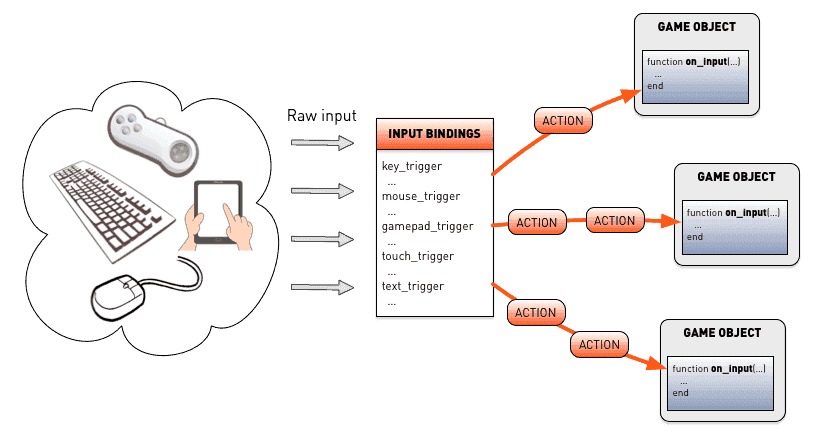
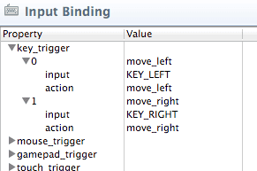
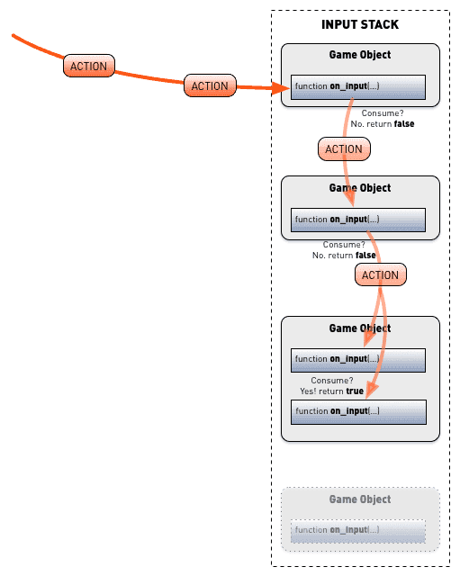
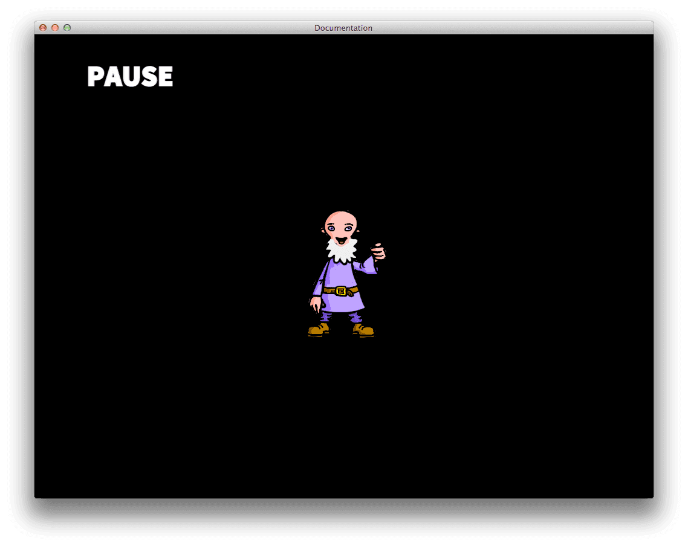
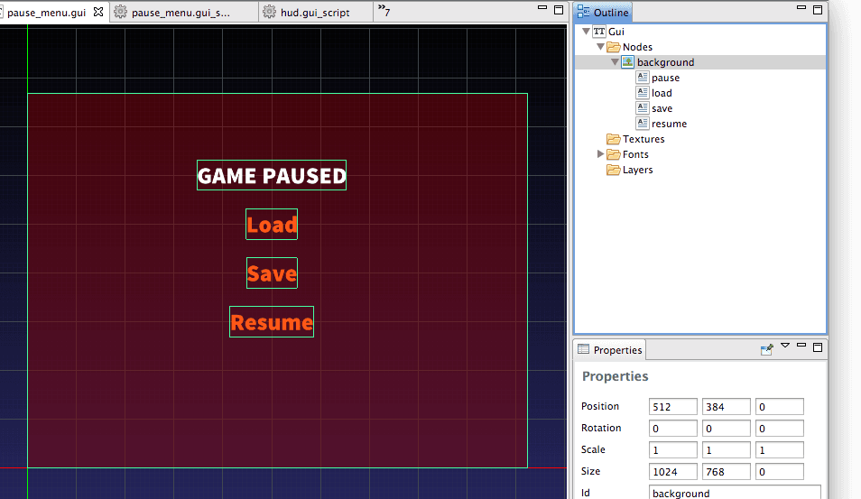

# Device input

Defold is capable of listening to input from a variety of devices and you can set up custom mapping from device input to input *actions* that your script logic can react to. Input handling in Defold is simple and powerful, allowing you to manage input as you see fit for your game. 

Defold supports the following input device types:

1. Keyboard (key and text input)
2. Mouse (including mouse wheel actions)
3. Multitouch (on iOS and Android devices)
4. Gamepads (as supported through the operating system)

::: important
On Windows, only XBox 360 controllers are currently supported. To hook up your 360 controller to your Windows machine, make sure it is setup correctly. See http://www.wikihow.com/Use-Your-Xbox-360-Controller-for-Windows
:::

All user input is captured by the engine and dispatched as actions to script- and GUI script components in game objects that have acquired input focus and that implement the `on_input()` function.

Before the input reaches your scripts it is translated through input bindings into meaningful actions:



Depending on which components have acquired input focus and whether they consume this input or pass it on, the input may or may not reach a specific component's `on_input()`. We will look at how this works in detail below.

## Input bindings

The input bindings is a project wide table that allows you to specify how raw input should translated into meaningful *actions* before they are dispatched to your Lua scripts. The input bindings is by default named *game.input_binding* and is found in the *input* folder at the root of your project. You can, however, easily change its name and location and update the project settings so the engine will find the bindings (see [Project settings](/manuals/project-settings)).


There are five types of triggers that you can create. They are device specific:

1. `key_trigger` and `text_trigger` are for keyboard button input.
2. `mouse_trigger` is for mouse input.
3. `gamepad_trigger` is for system gamepads (e.g. Xbox or Playstation controllers).
4. `touch_trigger` is for all types of touch input.
5. `text_trigger` is for text input.

Right click on a trigger type and select <kbd>Add [TYPE]\_trigger...</kbd> to add a new trigger. Each trigger has two fields:

*input*
: The raw input to listen for, selected from a scroll list of available inputs.

*action*
: The action name given to input actions when they are created and dispatched to your scripts. It is fine to have the same action names assigned to multiple actions. For instance, it is convenient to be able to bind the <kbd>Space</kbd> key to the action `jump` and the gamepad "A" button to the same action name.

::: sidenote
There is a known bug where touch inputs unfortunately cannot have the same action names as other inputs.
:::

For instance, to set up key bindings for movement left and right for a game, you might want to do something like this:



Here, the inputs `KEY_LEFT` (the left arrow key on the keyboard) and `KEY_RIGHT` (the right arrow key) are bound to the action names `move_left` and `move_right` respectively. The benefit of separating the hardware input from the logical actions is that if you decide later on that you want to change which hardware inputs trigger what actions, you only have to modify it in one place.

## Acquiring and releasing input focus

To listen to input actions, create a game object with a script (or GUI script) component. In the script, send the game object itself a message `acquire_input_focus`:

```lua
function init(self)
    msg.post(".", "acquire_input_focus")
end
```

This message instructs Defold to direct input actions to the current game object. Technically, what happens is that the object is added to an *input stack* (see below for further details).
To stop listening to input actions, simply send a `release_input_focus` message to the game object:

```lua
...
msg.post(".", "release_input_focus")
...
```

## on_input()

To react to input actions, you need a component in your game object (that has acquired input focus) with a script and an `on_input()` function. The engine will then dispatch input actions to the function.

```lua
function on_input(self, action_id, action)
```

The function takes 2 parameters (besides "self"):

`action_id`
: The name of the message, as set up in the input bindings. The name is hashed.

`action`
: A Lua table containing the message data.

To (very crudely) handle the `move_left` and `move_right` bindings we set up above, we can write the following code:

```lua
function on_input(self, action_id, action)
    if action_id == hash("move_left") and action.pressed then
        local pos = go.get_position()
        pos.x = pos.x - 100
        go.set_position(pos)
    elseif action_id == hash("move_right") and action.pressed then
        local pos = go.get_position()
        pos.x = pos.x + 100
        go.set_position(pos)
    end
end
```

::: important
When working with collection proxies it is imperative to understand how input is dispatched through collections. If you can't get input to work with your collection proxies, make sure to read "Input and Collection Proxies" below.
:::

## Action fields

The `action` parameter sent to `on_input()` for each input message is a Lua table containing useful data like the value of the input, the position of the input and whether button input was `pressed`, `repeated` or `released`.

`action.pressed`
: `true` the first frame the input was detected, otherwise `false`.

`action.repeated`
: `true` if the input was repeated, otherwise `false`. Note that this value is _not_ set each frame by default, but depends on the `repeat_delay` and `repeat_interval` [project settings](/manuals/project-settings#_input).

`action.released`
: `true` the frame the input was released, otherwise `false`.


::: sidenote
See [on_input()](/ref/go#on_input) for details on the available action fields.
:::

## Screen positions

Mouse and touch inputs set fields in the `action` table for location (`x` and `y`) as well as movement (`dx` and `dy`). These inputs also set specific fields that are calculated against the real screen space. These fields are called:

`screen_x` and `screen_y`
: The real screen position

`screen_dx` and `screen_dy`
: The real screen delta change since last update

These fields are useful on devices where the screen pixel position differs from the game position--for instance if you run a lower resolution game on a retina screen that scales the game. For instance, on the iPad you can have a screen that is 1024x768 but each "logical" pixels consists of 4 real ones and maps to a physical resolution of 2048x1536.

## Key triggers

Key triggers are simple one-key inputs that act as button inputs. They are useful for games that need to tie specific buttons to specific functions, like the `move_left` and `move_right` button setup above. If you need to read arbitrary key input, use text triggers (see below).

## Mouse triggers

Mouse input comes in two forms. First there are mouse button and wheel inputs, which are set up in your input bindings just like key triggers; then there is mouse movement input, which is handled differently (see below).

Mouse button inputs
: Use these to detect mouse button presses.

  Note that the inputs `MOUSE_BUTTON_LEFT`, `MOUSE_BUTTON_RIGHT` and `MOUSE_BUTTON_MIDDLE` are equivalent to `MOUSE_BUTTON_1`, `MOUSE_BUTTON_2` and `MOUSE_BUTTON_3`.

::: sidenote
Currently, `MOUSE_BUTTON_LEFT` (or `MOUSE_BUTTON_1`) input actions are sent for single touch inputs as well.
:::

Mouse wheel inputs
: Use these to detect scroll actions. The field `action.value` is `1` if the wheel is scrolled and `0` otherwise. (Scroll actions are dealt with as they were button presses. Defold does not currently support fine grained scroll input on touch pads.)

Mouse movement
: Mouse movement cannot be bound in the input bindings, and does not set the `action_id` to a name. Instead, the `action_id` is set to `nil` and the `action` table is populated with the location and delta movement of the mouse position. Note that mouse movement events are not received unless at least one mouse trigger is set up in your input bindings.

## Gamepad triggers

Gamepad triggers allow you to bind standard gamepad input to game functions. Defold supports multiple gamepads through the host operating system and offers bindings for:

1. Left and right sticks (direction and clicks)
2. Left and right digital pads
3. Left and right triggers
4. Left and right shoulder buttons
5. Start, Back and Guide buttons

::: sidenote
Right pad usually translates to the "A", "B", "X" and "Y" buttons on the Xbox controller and "square", "circle", "triangle" and "cross" buttons on the Playstation controller.
:::

Gamepad input sets the `gamepad` field of the action table to the gamepad number the
input originated from.

```lua
function on_input(self, action_id, action)
    if action_id == hash("gamepad_start") then
        ...
        if action.gamepad == 0 then
            -- gamepad 0 wants to join the game
            ...
        end
    end
end
```

## Touch triggers

Touch and multi-touch triggers populate a subtable in the action table called `action.touch`. The elements in the table are numbered `1`--`N` (where `N` is the number of touch points) and each element contains fields with input data.

::: sidenote
See [`on_input()`](/ref/go#on_input) for details on the available touch action fields.
:::

Since the elements are in a numbered table, array-like, you can traverse it easily:

```lua
function on_input(self, action_id, action)
        if action_id == hash("touch") and #action.touch > 1 and #action.touch < 4 then
                -- If there's 2-3 touch point we'll spawn
                -- magic spark particles at each point.
                for i, tpoint in ipairs(action.touch) do
                        local pos = vmath.vector3(tpoint.x, tpoint.y, 0)
                        factory.create("#factory", pos)
                end
        end
end
```

Here, a component "factory" is used to spawn a simple particle effect with `factory.create()`. The result is a nice trail of spawned particles for each finger as you touch the device screen using 2 or 3 fingers.


## Text triggers

Text triggers allow you to read arbitrary text input. There are two types of text triggers:

`TEXT`
: This input trigger captures normal text input.

  A text trigger sets the `text` field of the action table to a string containing the typed character. The action is only fired at the press of the button, no `release` or `repeated` action is sent.

  ```lua
  function on_input(self, action_id, action)
      if action_id == hash("text") then
          -- Concatenate the input character to the "text" node...
          local node = gui.get_node("text")
          local text = gui.get_text(node)
          text = text .. action.text
          gui.set_text(node, text)
      end
  end
  ```

`MARKED_TEXT`
: This is used primarily for asian keyboards where multiple keypresses can map to single inputs.

  For example, the iOS "Japanese-Kana" keyboard is a 10 key keyboard. The user can type combinations and the top of the keyboard will display avaliable symbols or sequences of symbols that can be entered.

  

  Each keypress generates a separate action and sets the action field with the series of entered keypresses in the `text` field:

  ```lua
  {
    repeated = false,
    released = false,
    text = た,
    value = 0,
    pressed = false,
  }
  ```

  When the user selects a symbol or symbol combination, an ordinary text trigger action is sent.

## The input stack

Any game object that acquires input focus is put first in the list of objects that listen to input. This list is called the *input stack*. Input actions are dispatched to the top object's components first and actions then trickle further down the stack to other components that listen to input:


All actions are dispatched within the same frame so unless you deliberately control the dispatch of actions down the stack (see "Consuming input" below) it will appear as if all listening components' `on_input()` functions will receive actions simultaneously.

## Stack order

If you have a set of game objects that all acquire input, they get added to the top of the input stack one by one:

```lua
-- in "listener1.script"
function init(self)
    msg.post(".", "acquire_input_focus")
end

-- in "listener2.script"
function init(self)
    msg.post(".", "acquire_input_focus")
end
```

Initialization and update order between objects is, however, unknown. So there is no guarantee that the listeners will appear on the stack in any specific order.

In situations where you need the listeners on the stack in a particular order you can force a specific input order between objects by chaining a series of messages:

```lua
-- in "listener1.script"
function init(self)
    -- We're added to the input stack first, "listener2" second.
    msg.post(".", "acquire_input_focus")
    msg.post("listener2", "acquire_input")
end

-- in "listener2.script"
function on_message(self, message_id, message, sender)
    if message_id == hash("acquire_input") then
        -- Acquire input when we get this message.
        msg.post(".", "acquire_input_focus")
    end
end
```

Running this code will result in an input stack ordered like this:


If the same game object is added more than once to the input stack, the previous entry in the stack will be removed and entries above will be shifted down. The duplicate game object will be placed at the top of the stack. If this happens the engine will issue a warning in the console.

## Consuming input

A component's `on_input()` code can actively control whether actions should be passed on down the stack or not:

1. If the component's `on_input()` code returns `false`, or if there is no return statement in the code (an omitted return statement implies a `nil` return which is a false value in Lua) input actions will be passed on to the next game object on the input stack.
2. If any of a game object components' scripts return `true` in its `on_input()` then the input is consumed and not passed on to other objects further down the input stack.

::: sidenote
A game object can contain several script components. All input actions are broadcast to the game object's components.

A game object that lacks an `on_input()` function will pass on input actions down the stack just as if it had returned `false` in an `on_input()`  function.
:::



There are several good use cases where input consumption provides a simple and powerful way to shift input between different parts of a game. For example, if you need a pop-up menu that temporarily is the only part of the game that listens to input.

Let's say that you are building a game where you control a wizard through touch input. In the corner, you put a HUD menu item that allows the player to pause the game.



The pause menu is initially hidden (disabled) and when the player touches the "PAUSE" HUD item, it is enabled:

```lua
function init(self)
    msg.post(".", "acquire_input_focus")
end

function on_input(self, action_id, action)
    if action_id == hash("mouse_press") and action.pressed then
        local x = action.x
        local y = action.y
        -- Get the "pause" node and see if player has pressed it.
        local pausenode = gui.get_node("pause")
        if gui.pick_node(pausenode, x, y) then
            -- Tell the pause menu to take over.
            msg.post("pause_menu", "show")
        end
    end
end
```


The pause menu consists of a coloured background containing a set of child menu items. By disabling and enabling the "background" node, the whole pause menu GUI can be shown and hidden:



The pause menu GUI runs the following code:

```lua
function init(self)
    -- Fetch background node and disable it.
    -- Everything is childed under it.
    local node = gui.get_node("background")
    gui.set_enabled(node, false)
end

function on_message(self, message_id, message, sender)
    if message_id == hash("show") then
        -- First, show the pause menu.
        local node = gui.get_node("background")
        gui.set_enabled(node, true)

        -- Now, acquire input. We're gonna be on top of
        -- the input stack. Yay!
        msg.post(".", "acquire_input_focus")
    end
end

function on_input(self, action_id, action)
    if action_id == hash("mouse_press") and action.pressed then
        local x = action.x
        local y = action.y
        -- Get the nodes and see if we have pressed any.
        local loadnode = gui.get_node("load")
        local savenode = gui.get_node("save")
        local resumenode = gui.get_node("resume")
        if gui.pick_node(loadnode, x, y) then
            print("THE GAME WILL LOAD...")
        elseif gui.pick_node(savenode, x, y) then
            print("THE GAME WILL SAVE...")
        elseif gui.pick_node(resumenode, x, y) then
            -- Resume the game...
            -- First, hide the pause menu.
            local node = gui.get_node("background")
            gui.set_enabled(node, false)

            -- Finally, release input.
            msg.post(".", "release_input_focus")
        end
    end

    -- As long as we're listening to input, we're gonna consume it.
    -- This disables game controls while the pause menu is showing.
    return true
end
```

The `on_input()` function of the pause menu GUI script returns `true` as long as the menu shows. This means that it will consume all input actions. The game is thus effectively paused from a user input perspective.

## Input and Collection Proxies

The input stack is actually not global---there exists a separate local input stack for each collection. If you use collection proxies to structure your game it is imperative to understand how input is dispatched through collections.

When input actions are passed on down the current collection's input stack and reach a game object that contains a collection proxy component that is enabled, those actions will continue down the input stack of the dynamically loaded collection before they continue down the main collection's stack. The following diagram clarifies the process:


It is clear now that in order for any `on_input()` component code in a dynamically loaded collection to receive input actions, the game object containing the collection proxy *must* be on the input stack.

Even if the collection proxy's game object contain no `on_input()` code at all, it must still send a `acquire_input_focus` message to itself to be added on top of the input stack. Any game object inside the loaded collection must send "acquire_input_focus" to get added to the collection's input stack.

Note that if at any step down the input stack an `on_input()` function returns true, then it will consume the input. It does not matter where that happens, actions will not be passed on further. If necessary, a loaded collection can therefore consume input and prevent objects further down the main collection input stack from receiving any actions.


