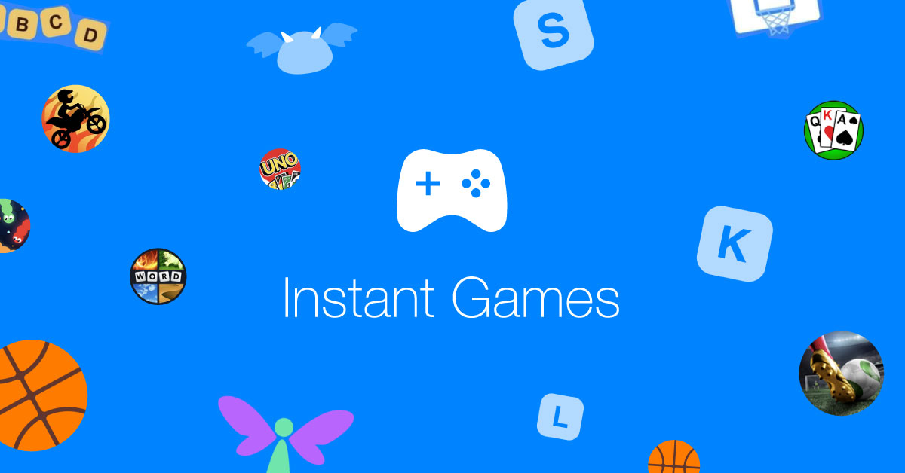
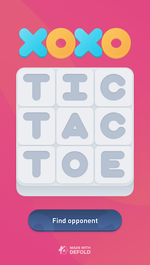

# Facebook Instant Games

Instant Games is a new way for people to play games across Facebook platforms. Powered by HTML5 technology, it allows people to find and play games directly in the News Feed or Messenger conversations, on both desktops and mobile devices.



## Publishing Instant Games

Before you can publish your Defold game to Facebook, you need to set up your game properly:

1. Configure a game for Instant Games in the [Facebook App Dashboard](https://developers.facebook.com/apps). See the [Instant Games Getting Started guide](https://developers.facebook.com/docs/games/instant-games/getting-started/game-setup) for details.

2. Add a dependency to the Instant Games extension in your "game.project" file. Add "https://github.com/defold/extension-fbinstant/archive/master.zip" to the *Dependencies* property.

   

3. Make sure to include the Instant Games SDK in your "index.html" that is generated when you bundle your game.

   ```html
   <script src="https://connect.facebook.net/en_US/fbinstant.6.3.js"></script>
   ```

   See [the HTML5 manual](/manuals/html5/#customizing-html5-bundle) for details on how to customize your bundled app.

4. When you are ready to test your game, bundle it to HTML5 and upload it to Facebook.

## API Usage

The Instant Games extension is accessible through the `fbinstant.*` namespace where it wraps the Javascript SDK in a Lua API. The extension provides an almost 1 to 1 mapping between the Javascript SDK and the Lua API.

For example, consider this Javascript code:

```javascript
FBInstant.initializeAsync().then(function() {
    FBInstant.startGameAsync().then(function() {
      var playerID = FBInstant.player.getID();
      var playerName = FBInstant.player.getName();
    });
});
```

The corresponding Lua code looks like this:

```lua
fbinstant.initialize(function(self, success)
    fbinstant.start_game(function(self, success)
        local player_id = fbinstant.get_player().id
        local player_name = fbinstant.get_player().name
    end)
end)
```

Refer to the extension [API documentation](https://github.com/defold/extension-fbinstant/blob/master/README.md) for details on how to use the Instant Games SDK in Defold.

## Example game

A Defold version of the "Tic Tac Toe" example game for Instant Games is available with full source code and all assets in the [official GitHub repository](https://github.com/defold/extension-fbinstant). You can use it as a learning asset or reference while developing.



## Reducing bundle size

The Facebook Instant Games [best practices](https://developers.facebook.com/docs/games/instant-games/best-practices) recommends an initial loading time less than 5 seconds. Defold adds little overhead to your games and provide a number of tools allowing you to reduce the size of your game:

Removing unused engine features
: A standard Defold engine for HTML5 is a little less than 1.2MB in size when compressed using gzip, but the engine size can be significantly reduce by removing parts of the engine that aren't used by your game. Which parts of the engine to remove is specified in an "app.manifest", referenced from the [Native Extension section](/manuals/project-settings/#native-extension) of your "game.project" file.

  This functionality is still in an alpha state and needs further documentation. Tools for generating app.manifests file can be found here: https://forum.defold.com/t/stripping-appmanifest-maker/16059

Apply texture compression
: Texture compression is an efficient method of reducing both the amount of runtime memory needed by your textures and the size the textures takes in your application bundle. Read more about how to work with texture compression in [Texture Profiles manual](/manuals/texture-profiles/).

Exclude content from boot and download it during run-time
: Many games split the game content into levels or episodes. For those types of games it often make sense to postpone loading of game content until the player has downloaded and started playing the game.

This process of excluding parts of the game content, storing it on a server and then downloading and caching it while the game is running is perfect for reducing the application size of an Instant Game. The entire process is handled by Defold's [Live Update](/manuals/live-update/) system.

## Known issues

Refer to the [Known Issues section of the HTML5 manual](/manuals/html5/#known-issues-and-limitations) for known issues with HTML5 and Instant Games.
