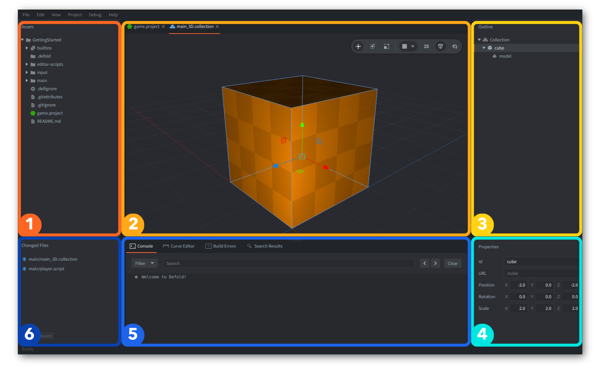
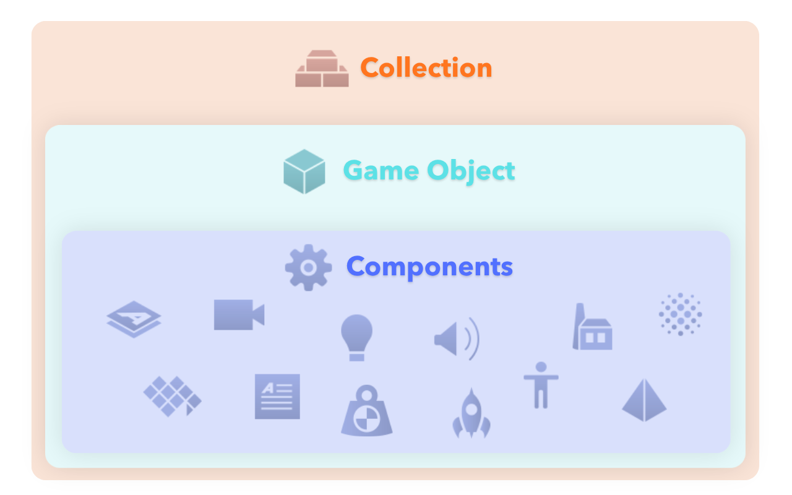
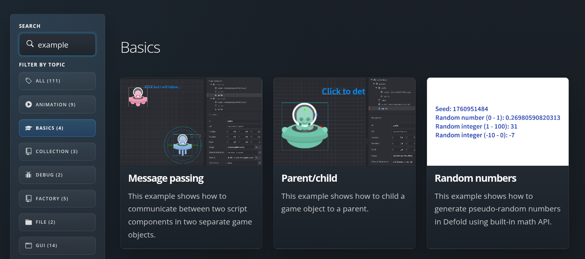
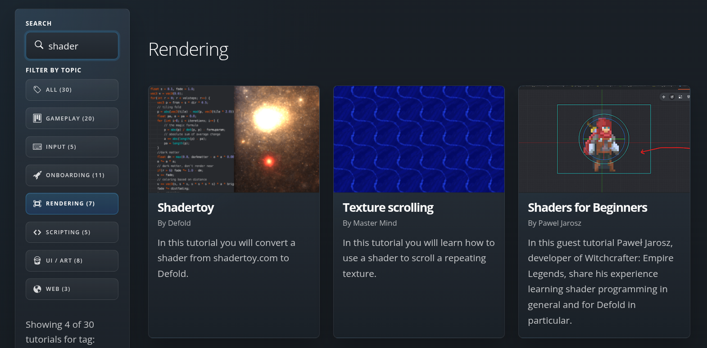
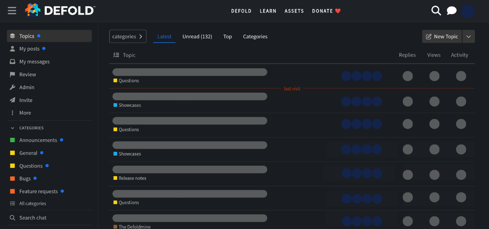

## Welcome to Defold

Defold is a free, lightweight, and high-performance turnkey solution for the development of 2D and 3D games - a game engine, editor, and building ecosystem in one box, providing everything you need to design, build, and ship. The full list of supported features can be seen in our [Product Overview](/product).

We have spent a lot of time and effort making sure that certain key elements of the game development process are as smooth and effortless as possible, and we believe it makes Defold stand out from the crowd. Learn [why we think you should use Defold](/why).

## Where to start?

Our [**Learning Hub**](/learn) is a starting point for all learning resources for Defold. You'll find there:

- [**Manuals**](/manuals) (like this one) - to deeply understand a given topic and broaden your knowledge
- [**Tutorials**](/tutorials) - to create something by following guided step-by-step instructions
- [**Examples**](/examples) - short snippets of code and simple, small, contained functionalities and samples
- [**Courses**](/courses) - longer-form, comprehensive, structured lessons on Zenva, Udemy, and created by the community
- [**Videos**](/videos) - if you prefer watching, there are a lot of video tutorials and overviews to choose from
- [**API**](/ref/stable/overview_defoldlua) - understand all the provided functions and constants with our up-to-date full documentation
- [**FAQ**](/faq/faq) - with answers to the most frequently asked questions - search to see if maybe your issue was already solved

We encourage you to experiment, follow tutorials, read our manuals and API documentation, and join our [community channels](/community) - to ask questions, learn from other users, and follow the development of Defold.

Here are some good-to-know pointers when starting your game development journey or learning Defold:

### Defold Editor

[The Editor Overview](/manuals/editor/) gives a good introduction to it and will help you get around, use the visual tools, and write code. If you are familiar with other game engines' editors, 3D modelling programs, and programming IDEs, there shouldn't be many surprises, but there are always things that will be different from your favorite piece of software.

### The building blocks of Defold

[Defold Building Blocks](/manuals/building-blocks/) is a great introductory manual about the fundamental core concepts of game development in Defold. Defold uses game objects with multiple different kinds of components for building games, and game objects are then grouped into collections. These might seem familiar if you have used other engines before. There are some architectural design decisions that make the building blocks of Defold special, and it takes a moment to become comfortable working with them. Therefore, our building blocks manual is a good start, especially if you feel you need to understand how it works.

### Examples

[Examples](/examples/) collection is a good introduction to how to put pieces together into something that works. You will find there minimal examples of how to do a wide variety of common things in Defold, code snippets to use, samples of some common functionalities, and showcases of certain features.

### Tutorials

[Tutorials](/tutorials) are great for starting your game development journey. We believe that you learn best by doing. That is why we have a selection of tutorials at various skill and complexity levels available directly from [the editor](/manuals/editor/) and in our learning hub. Fire it up and follow step-by-step instructions to learn how to build things and how Defold works.

### The Lua language

[Lua](/manuals/lua/) is the language used in Defold for all its logic control. The engine internally is a fast C++ piece of machinery, but it is controlled at a high level by Lua scripts. If you have programmed in Python, GDScript, GML, Javascript, or any other high-level language, you will find Lua pretty easy to grasp and can probably follow along with a tutorial just fine. Otherwise, read through our Lua manual and take it from there.

### The Defold Forum

[The Defold Forum](//forum.defold.com/) is often the best way to learn - you can learn from others, search the forum to find whether your issue was answered in the past, or ask directly. Our community is very friendly, helpful, and knows a lot about building games in general and Defold in particular. If you ever get stuck, don't hesitate, but head over to the forum for help!

### Learning Hub

Remember that no matter what path you take to learning Defold, you can always come back to our [**Learning Hub**](/learn) to find any other learning resources and read manuals for in-depth explanations of the various features and concepts Defold provides. And don't hesitate to point out things that you do not understand or think are wrong. These pages are for you, and we want to make them as good as possible, so we take users' feedback into account and try to improve the resources to make the learning curve as smooth as possible!

We hope that you will enjoy creating your next awesome game in Defold!