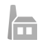

# Welcome to Defold

Welcome to Defold. This introduction covers the core concepts of Defold and is intended to give an overview of the editor and the most important features. All descriptions are quite brief but there are links to more thorough documentation.

## Philosophy

Defold is designed with a clear philosophy of simplicity. It is a turn-key production platform, but Defold does not try to provide all-encompassing solutions for everything. Instead, we believe the job of Defold is to empower you, the game creator, with simple, strong tools that allow you to realize your unique vision.

Sometimes that means that you have to do a bit more work yourself, but it also means that the path to the goal is clear. Ready made solutions seldom fit perfectly and when they don't it can be hard, or even impossible, to get them to work exactly the way you need them to.

If you are an experienced developer, Defold's core concepts may be pretty straightforward to understand, but please take the time to read this overview carefully---some of our concepts are, even though simple, different from what you might initially expect.

## Scripts

A script is a component that contains a program that defines game object behaviors. With scripts you can specify the rules of your game, how objects should respond to various interactions (with the player as well as other objects). All scripts are written in the Lua programming language. To be able to work with Defold, you or someone on your team needs to learn how to program in Lua. Read the [Lua in Defold documentation](/manuals/lua) for more information.

To allow communication between objects, Defold extends Lua with [Message passing](/manuals/message-passing). Defold also provides a library of useful functions.

For instance, the Lua-code required to play an explosion sound from a game object looks like this:

```lua
msg.post("#explosion", "play_sound")
```

Here, "explosion" is the name of the object's sound component where the script resides. `play_sound` is a message that sound components respond to. This is a simple example of message passing, which is how components interact. When scripting, no data is shared between scripts or objects. Components (including scripts) only exchange information by passing messages using the function `msg.post()`.

## Messages

Components communicate with each other and other systems through message passing. Components also respond to a set of predefined messages that alter them or trigger specific actions. You send messages to hide graphics, play sounds or nudge physics objects. The engine also uses messages to notify components of events, for instance when physics shapes collide.

The message passing mechanism needs a recipient for each sent message. Therefore, everything in the game has an address, or URL. Every game object and component has a unique URL which allows any two components in your app or game to send messages to each other.

See the [Message passing documentation](/manuals/message-passing) for an in depth explanation of how message passing works.

## Factories

In some situations you cannot manually place all needed game objects in a collection, you have to create the game objects dynamically, on the fly. For instance, a player might fire bullets and each shot should be dynamically spawned and sent off whenever the player presses the trigger. To create game objects dynamically (from a pre-allocated pool of objects), you use a factory component.


Defold provides two types of factories and you can read about them in the respective manual.

* [Factories](/manuals/factory)
* [Collection factories](/manuals/collection-factory)

## Collaboration

Most games are created as a collaborative effort between two or more people. We believe that the ability to work together is key for a fast development cycle. Collaboration is therefore a cornerstone of the Defold platform.


When you create a new project, a central repository is automatically created on our servers. During development, the files you create and modify are your personal view of this repository. When you have done some work and are ready to share your changes, just synchronize your personal view with the central repository. The editor uploads your changes, downloads any new changes (from other team members) and helps resolve conflicts if you and someone else have edited the same piece of project data. All changes are recorded and logged so there is a clear history of what has happened in your project. You don't have to worry about backups and you will never need to email files back and forth with your team. Read more about project collaboration in the [Workflow documentation](/manuals/workflow/).

Defold's collaboration tools are built on the popular and extremely powerful distributed version control system "Git". (If you're interested in Git, you can read more on http://git-scm.com).

## Libraries

In addition to collaborating through project branches, Defold allows you to share data between projects through a powerful library mechanism. You can use it to set up shared libraries that are accessible from all your projects, either for yourself or across the whole team. Read more about the library mechanism in the [Libraries documentation](/manuals/libraries).

## Building blocks

This is a list of all the available building blocks for creating apps and games. They are listed together with the icon used for the type of building block in the Defold editor.

Game object
: {.left} See above for a description of game objects.

Collection
: {.left} See above for a description of collections.

Script
: {.left} See above for a description of scripts.

Sound
: {.left} The sound component is responsible for playing a specific sound. Currently, Defold supports sound files in the WAV and Ogg Vorbis formats.

Collision object
: {.left} Collision objects are components that extend game objects with physical properties (like spatial shape, weight, friction and restitution). These properties govern how the collision object should collide with other collision objects. The most common types of collision objects are kinematic objects, dynamic objects and triggers. A kinematic object gives detailed collision information that you have to manually respond to, a dynamic object is automatically simulated by the physics engine to obey Newtonian laws of physics. Triggers are simple shapes that detect if other shapes have entered or exited the trigger.

Factory
: {.left} See above for a description of factories.

Sprite
: {.left} A sprite is a component that extends game objects with graphics. It displays an image either from a Tile source or from an Atlas. Sprites have built-in support for flip-book and bone animation. Sprites are usually used for characters and items. See the [2D graphics documentation](/manuals/2dgraphics) for more information.

Atlas
: {.left} An atlas is a set of separate images that are compiled into a larger sheet for performance and memory reasons. They can contain still images or flip-book animated series of images. Atlases are used by Sprite and ParticleFX components to share graphics resources. See the [2D graphics documentation](/manuals/2dgraphics) for more information.

  

Tile source
: {.left} A tile source describes a texture that is composed of multiple smaller images, each with the same size. You can define flip-book animations from a sequence of images in a tile source. Tile sources can also automatically calculate collision shapes from image data. This is very useful for creating tiled levels that object can collide and interact with. Tile sources are used by Tile map (and Sprite and ParticleFX although Atlases are usually preferred) components to share graphics resources. See the [2D graphics documentation](/manuals/2dgraphics) for more information.

  

  

  

Tile map
: {.left} Tile map components display images from a tile source in one or more overlaid grids. They are most commonly used to build game environments: ground, walls, buildings and obstacles. A tile map can display several layers aligned on top of each other with a specified blend mode. This is useful to, for example, put foliage on top of grass background tiles. It is also possible to dynamically change the displayed image in a tile. That allows you to, for instance, destroy a bridge and make it impassable by simply replacing the tiles with ones depicting the broken down bridge and containing the corresponding physics shape.

  

  

ParticleFX
: {.left} Particles are very useful for creating nice visual effects, particularly in games. you can use them to create fog, smoke, fire, rain or falling leaves. Defold contains a powerful particle effects editor that allows you to build and tweak effects while you run them real time in your game. The [ParticleFX documentation](/manuals/particlefx) gives you the details on how that works.

  

GUI
: {.left} A GUI component contains elements used to construct user interfaces: text and colored and/or textured blocks. Elements can be organized into hierarchical structures, scripted and animated. GUI components are typically used to create heads-up displays, menu systems and on-screen notifications. GUI components are controlled with GUI scripts that define the behavior of the GUI and control the user interaction with it. Read more in the [GUI documentation](/manuals/gui).

  

GUI script
: {.left} GUI scripts are used to define the behaviour of GUI components. They control GUI animations and how the user interacts with the GUI.

Font
: {.left} A Font is built from a TrueType or OpenType font file. The Font specifies which size to render the font in and what type of decoration (outline and shadow) the rendered font should have. Fonts are used by GUI and Label components.

  

Input binding
: {.left} Input binding files define how the game should interpret hardware input (mouse, keyboard, touchscreen and gamepad). The file binds hardware input to high level input _actions_ like "jump" and "move_forward". In script components that listen to input you are able to script the actions the game or app should take given certain input. See the [Input documentation](/manuals/input) for details.

  

Camera
: {.left} Camera components help to decide what part of the game world should be visible and how it should be projected. A common use case is to attach a camera to the player game object, or to have a separate game object with a camera that follows the player around with some smoothing algorithm.

Material
: {.left} Materials define how different objects should be rendered by specifying shaders and their properties.

Render
: {.left} Render files contain settings used when rendering the game to the screen. Render files define which Render script to use for rendering and which materials to use.

Render script
: {.left} A Render script is a Lua script that controls how the game or app should be rendered to the screen. There is a default Render script that covers most common cases, but you can write your own if you need custom lighting models and other effects.

Collection proxy
: {.left} A Collection proxy is used to load and enable collections on the fly while an app or game is running. The most common use case for Collection proxies is to load levels as they are to be played. See the [Collection proxy documentation](/manuals/collection-proxy) for details.

