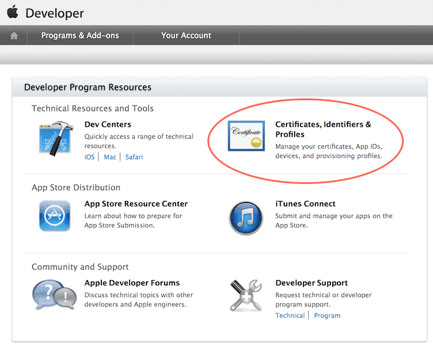
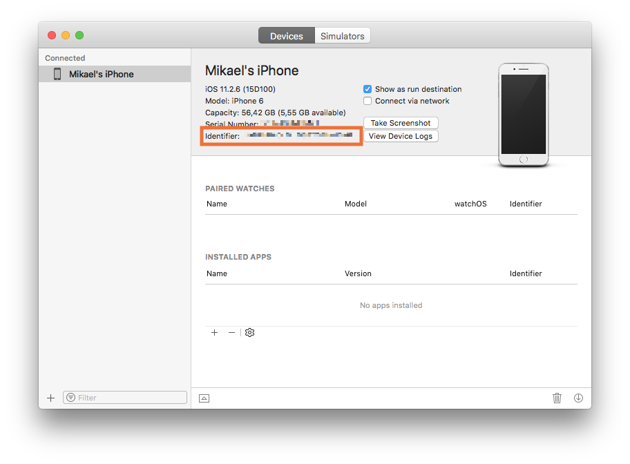
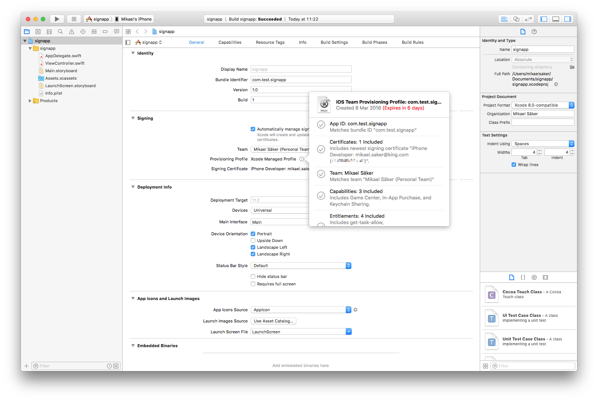
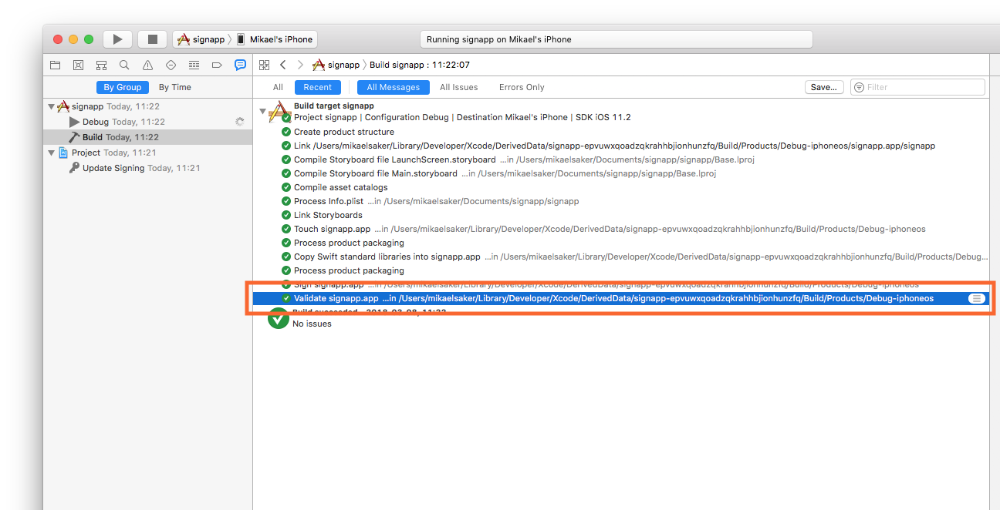
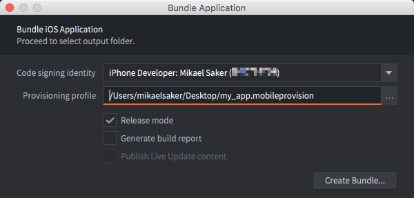
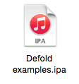

# iOS development

iOS requires that _any_ app that you build and want to run on your phone or tablet _must_ be signed with an Apple-issued certificate and provisioning profile. This manual explains the steps involved in bundling your game for iOS. During development, running your game through the [development app](/manuals/dev-app) is often preferred since it allows you to hot reload content and code wirelessly directly to your device.

## Apple's code signing process

The security associated with iOS apps consists of several components. You can get access to the required tools by singing up to the [Apple's iOS Developer Program](https://developer.apple.com/programs/). When you have enrolled, go to the [Apple's Developer Member Center](https://developer.apple.com/membercenter/index.action).



The section *Certificates, Identifiers & Profiles* contains all the tools that you need. From here you can create, delete and edit:

Certificates
: Apple-issued cryptographic certificates that identify you as a developer. You can create development or production certificates. Developer certificates allow you to test certain features such as the in-app purchase mechanism in a sandbox test environment. Production certificates are used to sign the final app for upload to the App Store. You need a certificate to sign apps before you can put them on your device for testing.

Identifiers
: Identifiers for various uses. It is possible to register wildcard identifiers (i.e. `some.prefix.*`) which can be used with several apps. App IDs can contain Application Service information, like if the app enables Passbook integration, the Game Center, etc. Such App IDs cannot be wildcard identifiers. For Application Services to function, your application's *bundle identifier* must match the App ID identifier.

Devices
: Each development device needs to be registered with their UDID (Unique Device IDentifier, see below).

Provisioning Profiles
: Provisioning profiles associate certificates with App IDs and a list of devices. They tell which app by what developer is allowed to be on what devices.

When signing your games and apps in Defold, you need a valid certificate and a valid provisioning profile.

::: sidenote
Some of the things you can do on the Member Center homepage you can also perform from inside the XCode development environment---if you have that installed.
:::

Device identifier (UDID)
: The UDID for an iOS device can be found by connecting the device to a computer via wifi or cable. Open Xcode and select <kbd>Window ▸ Devices and Simulators</kbd>. The serial number and identifier are displayed when you select your device.

  

  If you don't have Xcode installed you can find the identifier in iTunes. Click on the devices symbol and select your device.

  

  1. On the *Summary* page, locate the *Serial Number*.
  2. Click the *Serial Number* once so the field changes into *UDID*. If you click repeatedly, several pieces of information about the device will show up. Just continue to click until *UDID* shows.
  3. Right-click the long UDID string and select <kbd>Copy</kbd> to copy the identifier to the clipboard so you can easily paste it into the UDID field when registering the device on Apple's Developer Member Center.

## Developing using a free Apple developer account

Since Xcode 7, anyone can install Xcode and do on-device development for free. You don't have to sign up for the iOS Developer Program. Instead, Xcode will automatically issue a certificate for you as a developer (valid for 1 year) and a provisioning profile for your app (valid for one week) on your specific device.

1. Connect your device.
2. Install Xcode.
3. Add a new account to Xcode and sign in with your Apple ID.
4. Create a new project. The simplest "Single View App" works fine.
5. Select your "Team" (auto created for you) and give the app a bundle identifier.
6. Make sure that Xcode has created a *Provisioning Profile* and *Signing Certificate* for the app.

   

7. Build and launch the app on your device. The first time, Xcode will ask you to enable Developer mode and will prepare the device with debugger support. This may take a while.
8. When you have verified that the app works, find it on your disk. You can see the build location in the Build report in the "Report Navigator".

   

9. Locate the app, right-click it and select <kbd>Show Package Contents</kbd>.

   

10. Copy the file "embedded.mobileprovision" to some place on your drive where you will find it.

   

This provision file can be used together with your code signing identity to sign apps in Defold for one week, for _one device_. There is no way to add additional device UDIDs to this generated provisioning profile.

When the provision expires, you need to build the app again in Xcode and get a new temporary provision file as described above.

## Creating an iOS application bundle

When you have the code signing identity and privisioning profile, you are ready to create a stand alone application bundle for your game from the editor. Simply select <kbd>Project ▸ Bundle... ▸ iOS Application...</kbd> from the menu.



Select your code signing identity and browse for your mobile provisioning file. Select which architectures (32 bit, 64 bit and the iOS simulator) to bundle for as well as the variant (Debug or Release). You can optionally untick the `Sign application` checkbox to skip the signing process and then manually sign at a later stage.

::: important
You **must** untick the `Sign application` checkbox when testing your game on the iOS simulator. You will be able to install the application but it will not boot.
:::

Press *Create Bundle* and you will then be prompted to specify where on your computer the bundle will be created.

You specify what icon to use for the app, the launch screen image(s) and so forth on the *game.project* project settings file.

::: important
When your game launches on iOS, the launch images are used to set the correct screen resolution. If you do not supply the correct image size, you will get a lower resolution with resulting black bars.
:::

{.left}

## Installing an iOS application bundle

The editor writes an *.ipa* file which is an iOS application bundle. To install the file on your device, you can use Xcode (via the "Devices and Simulators" window). Other options are to use a command line tool such as [ios-deploy](https://github.com/phonegap/ios-deploy) or iTunes.

You can use the `xcrun simctl` command line tool to work with the iOS simulators available via Xcode:

```
# show a list of available devices
xcrun simctl list

# boot an iPhone X simulator
xcrun simctl boot "iPhone X"

# install your.app to a booted simulator
xcrun simctl install booted your.app

# launch the simulator
open /Applications/Xcode.app/Contents/Developer/Applications/Simulator.app
```
