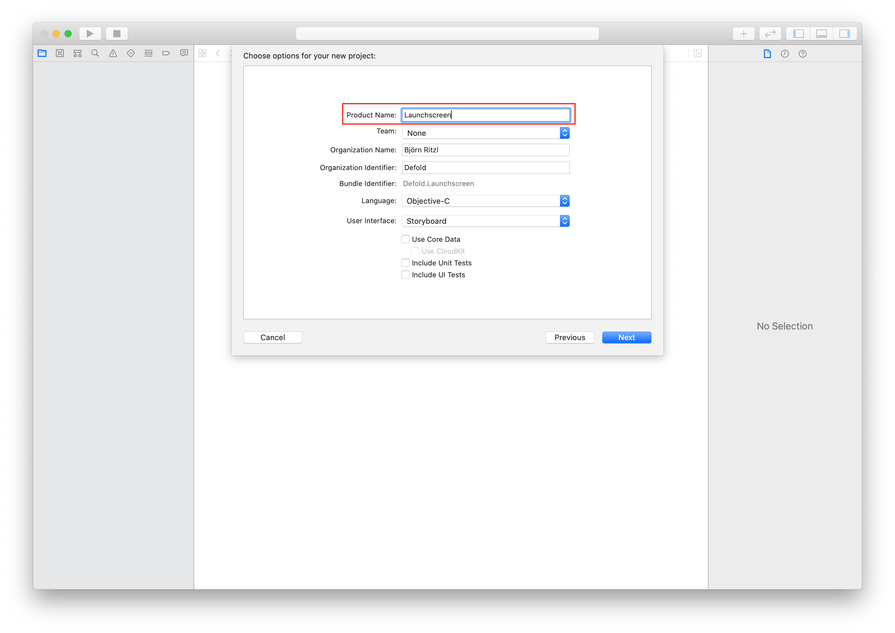
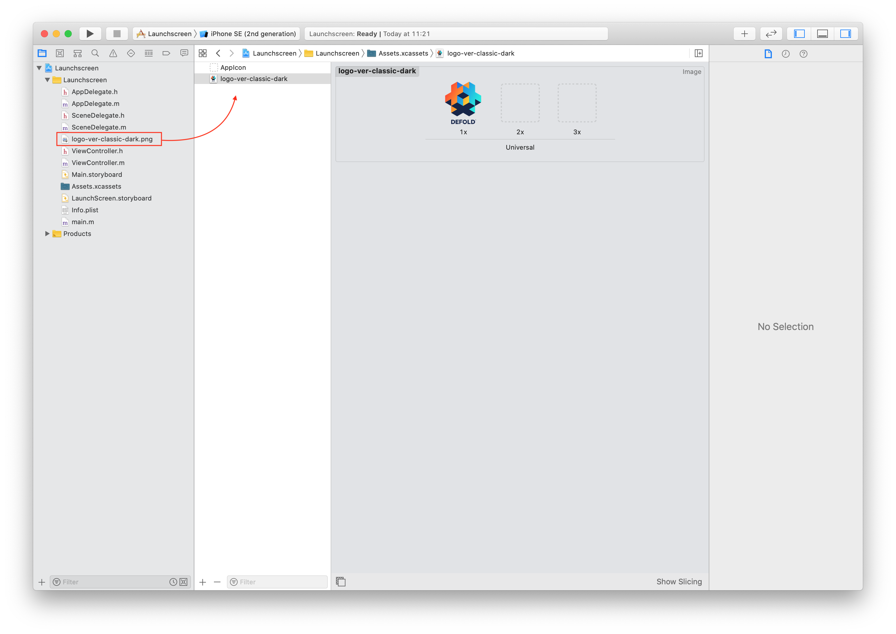
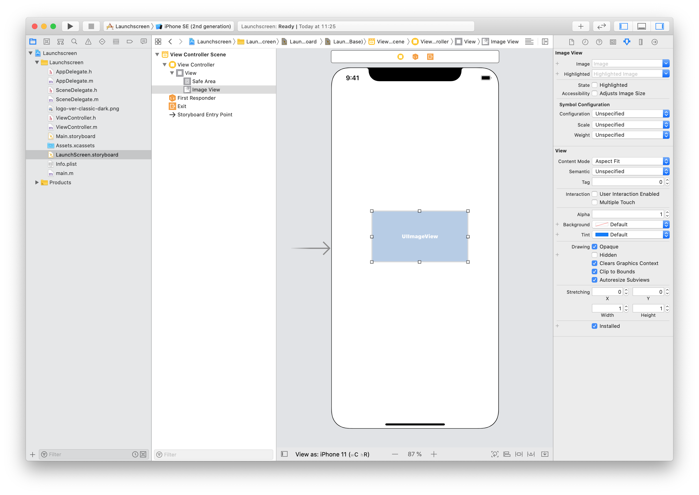
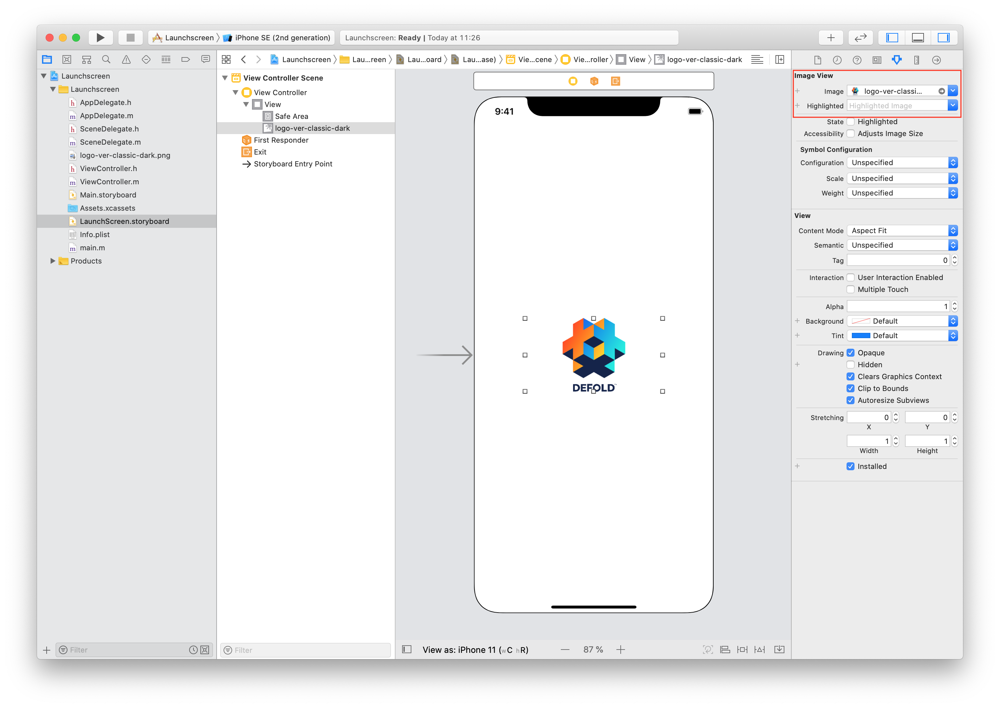

# iOS development

::: sidenote
Bundling a game for iOS is available only on Mac version of the Defold Editor.
:::

iOS requires that _any_ app that you build and want to run on your phone or tablet _must_ be signed with an Apple-issued certificate and provisioning profile. This manual explains the steps involved in bundling your game for iOS. During development, running your game through the [development app](/manuals/dev-app) is often preferred since it allows you to hot reload content and code wirelessly directly to your device.

## Apple's code signing process

The security associated with iOS apps consists of several components. You can get access to the required tools by singing up to the [Apple's iOS Developer Program](https://developer.apple.com/programs/). When you have enrolled, go to the [Apple's Developer Member Center](https://developer.apple.com/membercenter/index.action).


The section *Certificates, Identifiers & Profiles* contains all the tools that you need. From here you can create, delete and edit:

Certificates
: Apple-issued cryptographic certificates that identify you as a developer. You can create development or production certificates. Developer certificates allow you to test certain features such as the in-app purchase mechanism in a sandbox test environment. Production certificates are used to sign the final app for upload to the App Store. You need a certificate to sign apps before you can put them on your device for testing.

Identifiers
: Identifiers for various uses. It is possible to register wildcard identifiers (i.e. `some.prefix.*`) which can be used with several apps. App IDs can contain Application Service information, like if the app enables Passbook integration, the Game Center, etc. Such App IDs cannot be wildcard identifiers. For Application Services to function, your application's *bundle identifier* must match the App ID identifier.

Devices
: Each development device needs to be registered with their UDID (Unique Device IDentifier, see below).

Provisioning Profiles
: Provisioning profiles associate certificates with App IDs and a list of devices. They tell which app by what developer is allowed to be on what devices.

When signing your games and apps in Defold, you need a valid certificate and a valid provisioning profile.

::: sidenote
Some of the things you can do on the Member Center homepage you can also perform from inside the Xcode development environment---if you have that installed.
:::

Device identifier (UDID)
: The UDID for an iOS device can be found by connecting the device to a computer via wifi or cable. Open Xcode and select <kbd>Window ▸ Devices and Simulators</kbd>. The serial number and identifier are displayed when you select your device.

  

  If you don't have Xcode installed you can find the identifier in iTunes. Click on the devices symbol and select your device.

  

  1. On the *Summary* page, locate the *Serial Number*.
  2. Click the *Serial Number* once so the field changes into *UDID*. If you click repeatedly, several pieces of information about the device will show up. Just continue to click until *UDID* shows.
  3. Right-click the long UDID string and select <kbd>Copy</kbd> to copy the identifier to the clipboard so you can easily paste it into the UDID field when registering the device on Apple's Developer Member Center.

## Developing using a free Apple developer account

Since Xcode 7, anyone can install Xcode and do on-device development for free. You don't have to sign up for the iOS Developer Program. Instead, Xcode will automatically issue a certificate for you as a developer (valid for 1 year) and a provisioning profile for your app (valid for one week) on your specific device.

1. Connect your device.
2. Install Xcode.
3. Add a new account to Xcode and sign in with your Apple ID.
4. Create a new project. The simplest "Single View App" works fine.
5. Select your "Team" (auto created for you) and give the app a bundle identifier.

::: important
Make a note of the bundle identifier as you must use the same bundle identifier in your Defold project.
:::

6. Make sure that Xcode has created a *Provisioning Profile* and *Signing Certificate* for the app.

   

7. Build and launch the app on your device. The first time, Xcode will ask you to enable Developer mode and will prepare the device with debugger support. This may take a while.
8. When you have verified that the app works, find it on your disk. You can see the build location in the Build report in the "Report Navigator".

   

9. Locate the app, right-click it and select <kbd>Show Package Contents</kbd>.

   

10. Copy the file "embedded.mobileprovision" to some place on your drive where you will find it.

   

This provision file can be used together with your code signing identity to sign apps in Defold for one week.

When the provision expires, you need to build the app again in Xcode and get a new temporary provision file as described above.

## Creating an iOS application bundle

When you have the code signing identity and provisioning profile, you are ready to create a stand alone application bundle for your game from the editor. Simply select <kbd>Project ▸ Bundle... ▸ iOS Application...</kbd> from the menu.


Select your code signing identity and browse for your mobile provisioning file. Select which architectures (32 bit, 64 bit and the iOS simulator) to bundle for as well as the variant (Debug or Release). You can optionally untick the `Sign application` checkbox to skip the signing process and then manually sign at a later stage.

::: important
You **must** untick the `Sign application` checkbox when testing your game on the iOS simulator. You will be able to install the application but it will not boot.
:::

Press *Create Bundle* and you will then be prompted to specify where on your computer the bundle will be created.

{.left}

You specify what icon to use for the app, the launch screen storyboard and so forth in the *game.project* project settings file in the [iOS section](/manuals/project-settings/#ios).

## Installing and launching bundle on a connected iPhone

You can install and launch the built bundle using editor's "Install on connected device" and "Launch installed app" check-boxes in the Bundle dialog:


You need [ios-deploy](https://github.com/ios-control/ios-deploy) command lint tool installed for this feature to work. The simplest way to install it is using Homebrew:
```
$ brew install ios-deploy
```

If the editor can't detect the install location of the ios-deploy tool, you will need to specify it in [Preferences](/manuals/editor-preferences/#tools). 

### Creating a storyboard

You create a storyboard file using Xcode. Start Xcode and create a new project. Select iOS and Single View App:


Click Next and proceed to configure your project. Enter a Product Name:



Click Create to finish the process. Your project is now created and we can proceed to create the storyboard:


Drag and drop an image to import it to the project. Next select `Assets.xcassets` and drop the image to `Assets.xcassets`:



Open `LaunchScreen.storyboard` and click on the plus button (<kbd>+</kbd>). Type "imageview" in the dialog to find the ImageView component.


Drag the Image View component onto the storyboard:



Select the image you previously added to `Assets.xcassets` from the Image dropdown:



Position the image and make any other adjustments you need, perhaps adding a Label or some other UI element. When you are done set the active scheme to "Build -> Any iOS Device (arm64, armv7)"(or "Generic iOS Device") and select Product -> Build. Wait for the build process to finish.

::: sidenote
If you have only `arm64` option in "Any iOS Device (arm64)" change `iOS Deployment target` to 10.3 in "Project -> Basic -> Deployment" settings. It will make your storyboard compatible with `armv7` devices (for example iPhone5c)  
:::

If you use images in the storyboard they will not be included in your `LaunchScreen.storyboardc` automatically. Use `Bundle Resources` field in *game.project* to include resources.
For example, create folder `LaunchScreen` in Defold project and folder `ios` inside (`ios` folder needed to include these files only for ios bundles), then put your files in `LaunchScreen/ios/`. Add this path in `Bundle Resources`.


The last step is to copy the compiled `LaunchScreen.storyboardc` file to your Defold project. Open Finder at the following location and copy the `LaunchScreen.storyboardc` file to your Defold project:

    /Library/Developer/Xcode/DerivedData/YOUR-PRODUCT-NAME-cbqnwzfisotwygbybxohrhambkjy/Build/Intermediates.noindex/YOUR-PRODUCT-NAME.build/Debug-iphonesimulator/YOUR-PRODUCT-NAME.build/Base.lproj/LaunchScreen.storyboardc

::: sidenote
Forum user Sergey Lerg has put together [a video tutorial showing the process](https://www.youtube.com/watch?v=6jU8wGp3OwA&feature=emb_logo).
:::

Once you have the storyboard file you can reference it from *game.project*.


### Creating an icon asset catalog

::: sidenote
This is required from Defold 1.2.175.
:::

Using an asset catalog is Apple's preferred way to manage your application's icons. In fact it is the only way to provide the icon used in the App Store listing. You create an asset catalog in the same way as a storyboard, using Xcode. Start Xcode and create a new project. Select iOS and Single View App:


Click Next and proceed to configure your project. Enter a Product Name:


Click Create to finish the process. Your project is now created and we can proceed to create the asset catalog:


Drag and drop images to the empty boxes representing the different supported icon sizes:


::: sidenote
Do not add any icons for Notifications, Settings or Spotlight.
:::

When you are done, set the active scheme to "Build -> Any iOS Device (arm64)"(or "Generic iOS Device") and select <kbd>Product</kbd> -> <kbd>Build</kbd>. Wait for the build process to finish.

::: sidenote
Make sure that you build for "Any iOS Device (arm64)" or "Generic iOS Device" otherwise you will get `ERROR ITMS-90704` error when uploading your build.
:::


The last step is to copy the compiled `Assets.car` file to your Defold project. Open Finder at the following location and copy the `Assets.car` file to your Defold project:

    /Library/Developer/Xcode/DerivedData/YOUR-PRODUCT-NAME-cbqnwzfisotwygbybxohrhambkjy/Build/Products/Debug-iphoneos/Icons.app/Assets.car

Once you have the asset catalog file you can reference it and the icons from *game.project*:


::: sidenote
The App Store icon does not have to be referenced from *game.project*. It is automatically extracted from the `Assets.car` file when uploading to iTunes Connect.
:::


## Installing an iOS application bundle

The editor writes an *.ipa* file which is an iOS application bundle. To install the file on your device, you can use one of the following tools:

* Xcode via the "Devices and Simulators" window
* [ios-deploy](https://github.com/ios-control/ios-deploy) command line tool
* [Apple Configurator 2](https://apps.apple.com/us/app/apple-configurator-2/) from the macOS App Store
* iTunes

You can also use the `xcrun simctl` command line tool to work with the iOS simulators available via Xcode:

```
# show a list of available devices
xcrun simctl list

# boot an iPhone X simulator
xcrun simctl boot "iPhone X"

# install your.app to a booted simulator
xcrun simctl install booted your.app

# launch the simulator
open /Applications/Xcode.app/Contents/Developer/Applications/Simulator.app
```


## Export Compliance information

When you submit your game to the App Store you will be asked to provide Export Compliance information with regard to the use of encryption in your game. [Apple explains why this is required](https://developer.apple.com/documentation/security/complying_with_encryption_export_regulations):

"When you submit your app to TestFlight or the App Store, you upload your app to a server in the United States. If you distribute your app outside the U.S. or Canada, your app is subject to U.S. export laws, regardless of where your legal entity is based. If your app uses, accesses, contains, implements, or incorporates encryption, this is considered an export of encryption software, which means your app is subject to U.S. export compliance requirements, as well as the import compliance requirements of the countries where you distribute your app."

Additional documentation:

* Export compliance overview - https://help.apple.com/app-store-connect/#/dev88f5c7bf9
* Determining your export compliance requirements - https://help.apple.com/app-store-connect/#/dev63c95e436

The Defold game engine use encryption for the following purposes:

* Making calls over secure channels (i.e. HTTPS and SSL)
* Copyright protection of Lua code


## FAQ
:[iOS FAQ](../shared/ios-faq.md)
