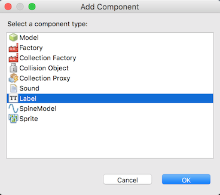
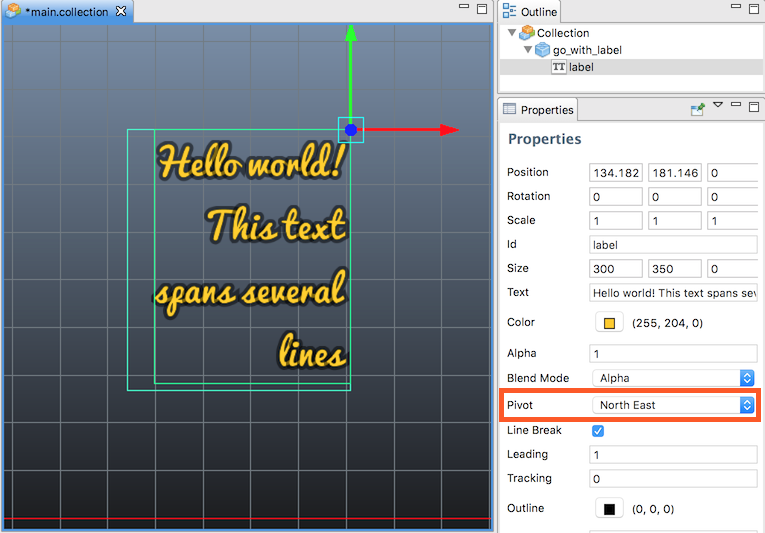

# Label

A *Label* component renders a piece of text on screen, in game space. By default it is sorted and drawn with all sprite and tile graphics. The component has a set of properties that governs how the text is rendered. Defold's GUI supports text but it can be tricky to place GUI elements in the game world. Labels make this easier.

## Creating a label

To create a Label component, <kbd>right click</kbd> the game object and selecting <kbd>Add Component ▸ Label</kbd>.

{srcset="images/label/add_label@2x.png 2x"}

(If you want to instantiate several labels from the same template you can alternatively make a new label component file: <kbd>right click</kbd> a folder in the *Assets* browser and select <kbd>New... ▸ Label</kbd>, then add the file as component to any game objects)

{srcset="images/label/label@2x.png 2x"}

Set the *Font* property to the font you want to use and make sure to set the *Material* property to a material that matches the font type:

{srcset="images/label/font_material@2x.png 2x"}

## Label properties

Apart from the properties *Id*, *Position*, *Rotation* and *Scale* the following component specific properties exist:

*Text*
: The text content of the label.

*Size*
: The size of the text bounding box. If *Line Break* is set the width specifies at what point the text should break.

*Color*
: The color of the text.

*Outline*
: The color of the outline.

*Shadow*
: The color of the shadow.

::: sidenote
Note that the default material has shadow rendering disabled for performance reasons.
:::

*Leading*
: A scaling number for the line spacing. A value of 0 gives no line spacing. Defaults to 1.

*Tracking*
: A scaling number for the letter spacing. Defaults to 0.

*Pivot*
: The pivot of the text. Use this to change text alignment (see below).

*Blend Mode*
: The blend mode to use when rendering the label.

*Line Break*
: Text alignment follows the pivot setting and setting the this property allows the text to flow over several lines. The width of the component determines where the text will wrap. Note that there has to be a space in the text for it to break.

*Font*
: The font resource to use for this label.

*Material*
: The material to use for rendering this label. Make sure to select a material that is created for the font type that you use (bitmap, distance field or BMFont).

### Blend modes
:[blend-modes](../shared/blend-modes.md)

### Pivot and alignment

By setting the *Pivot* property you can change the alignment mode for the text.

*Center*
: If the pivot is set to `Center`, `North` or `South`, the text is center-aligned.

*Left*
: If the pivot is set to any of the `West` modes, the text is left-aligned.

*Right*
: If the pivot is set to any of the `East` modes, the text is right-aligned.

{srcset="images/label/align@2x.png 2x"}

## Runtime manipulation

You can manipulate labels in runtime by getting and setting the label text as well as the various other properties.

`color`
: The label color (`vector4`)

`outline`
: The label outline color (`vector4`)

`shadow`
: The label shadow color (`vector4`)

`scale`
: The label scale, either a `number` for uniform scaling or a `vector3` for individual scaling along each axis.

`size`
: The label size (`vector3`)

```lua
function init(self)
    -- Set the text of the "my_label" component in the same game object
    -- as this script.
    label.set_text("#my_label", "New text")
end
```

```lua
function init(self)
    -- Set the color of the "my_label" component in the same game object
    -- as this script. Color is a RGBA value stored in a vector4.
    local grey = vmath.vector4(0.5, 0.5, 0.5, 1.0)
    go.set("#my_label", "color", grey)

    -- ...and remove the outline, by setting its alpha to 0...
    go.set("#my_label", "outline.w", 0)

    -- ...and scale it x2 along x axis.
    local scale_x = go.get("#my_label", "scale.x")
    go.set("#my_label", "scale.x", scale_x * 2)
end
```
