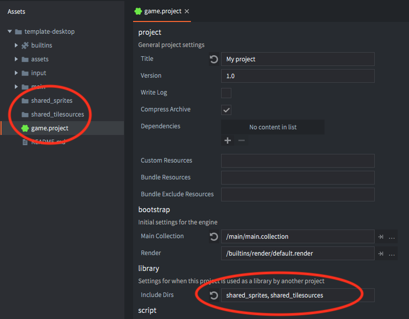
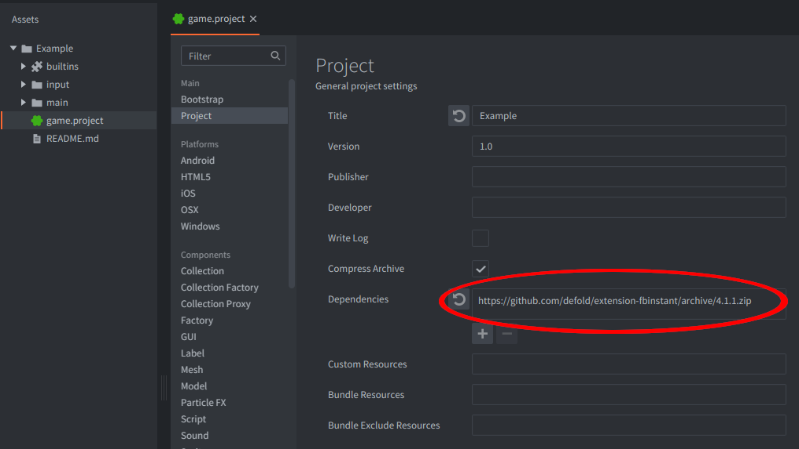
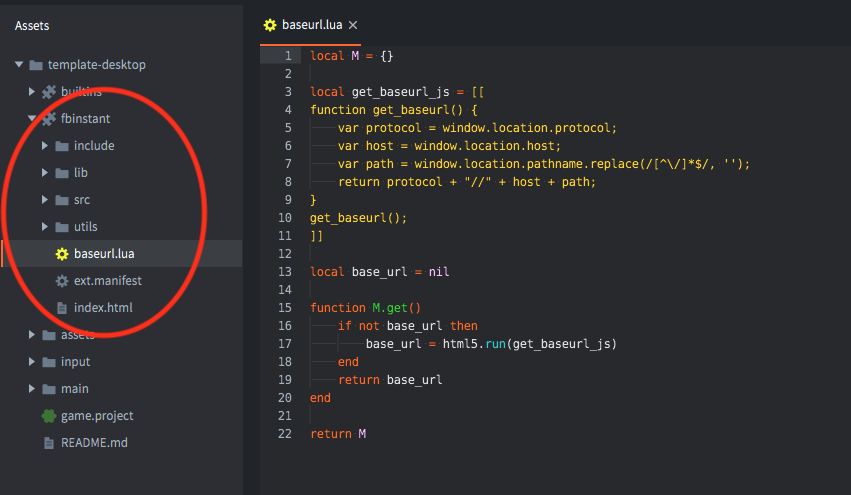

# Libraries

The Libraries feature allows you to share assets between projects. It is a simple but very powerful mechanism that you can use in your workflow in a number of ways.

Libraries are useful for the following purposes:

* To copy assets from a finished project to a new one. If you are making a sequel to an earlier game, this is an easy way to get going.
* To build a library of templates that you can copy into you projects and then customize or specialize.
* To build one or more libraries of ready-made objects or scripts that you can reference directly. This is very handy for storing common script modules or to build a shared library of graphics, sound and animation assets.

## Setting up library sharing

Suppose you want to build a library containing shared sprites and tile sources. You start by [setting up a new project](/manuals/project-setup/). Decide what folders you want to share from the project and add the names of those folders to the *include_dirs* property in the Project settings. If you want to list more than one folder, separate the names with spaces:

Before we can add this library to another project we need to a way to locate the library.

## Library URL

Libraries are referred to via a standard URL. For a project hosted on GitHub it would be the URL to a project release:

::: important
It is recommend to always depend on a specific release of a library project instead of on the master branch. This way it is up to you as a developer to decide when to incorporate changes from a library project as opposed to always getting the latest (and potentially breaking) changes from the master branch of a library project.
:::

::: important
Note that you need read access to the Library URL. For GitHub projects, that means that the project has to be either public or that you have generated an access token.
:::

## Setting up library dependencies

Open the project that you would like to access the library from. In the project settings, add the Library URL to the *dependencies* property. You can specify multiple dependent projects if you want. Just add them one by one using the `+` button and remove using the `-` button:

Now, select <kbd>Project ▸ Fetch Libraries</kbd> to update library dependencies. This happens automatically whenever you open a project so you will only need to do this if the dependencies change without re-opening the project. This happens if you add or remove dependency libraries or if one of the dependency library projects is changed and synchronized by someone.

Now the folders that you shared appear in the *Assets pane* and you can use everything you shared. Any synchronized changes done to the library project will be available in your project.

## Broken references

Library sharing only includes files that are located under the shared folder(s). If you create something that references assets that are located outside of the shared hierarchy, the reference paths will be broken.

## Name collisions

Since you can list several project URLs in the *dependencies* project setting you might encounter a name collision. This happens if two or more of the dependent projects share a folder with the same name in the *include_dirs* project setting.

Defold resolves name collisions by simply ignoring all but the last reference to folders of the same name in the order the project URLs are specified in the *dependencies* list. For instance. If you list 3 library project URLs in the dependencies and all of them share a folder named *items*, only one *items* folder will show up---the one belonging to the project that is last in the URL list.
