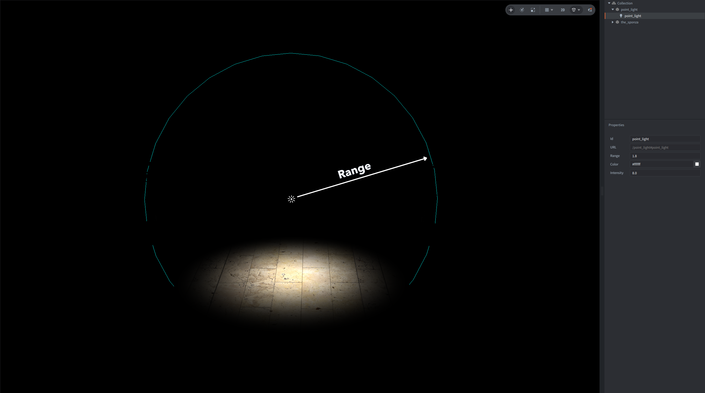
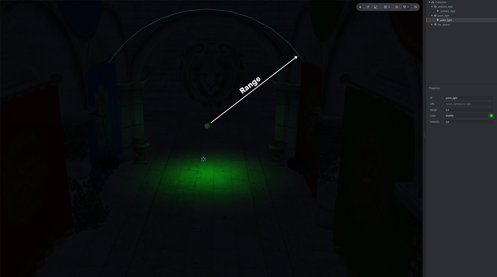
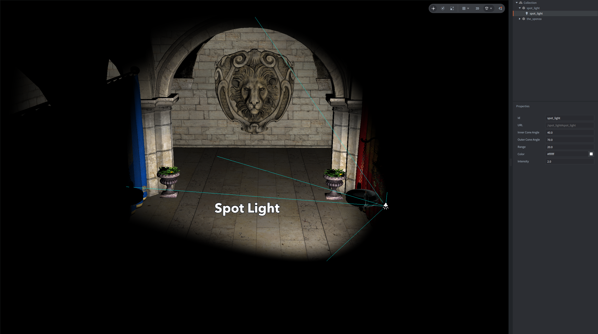
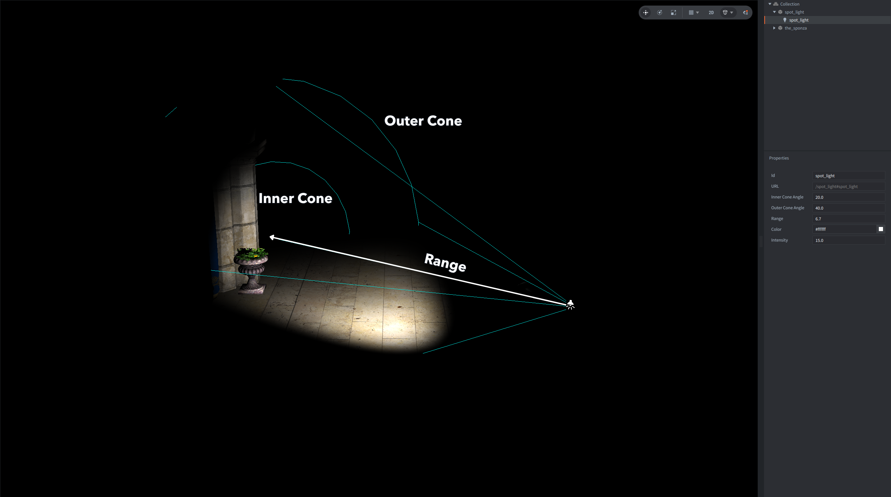
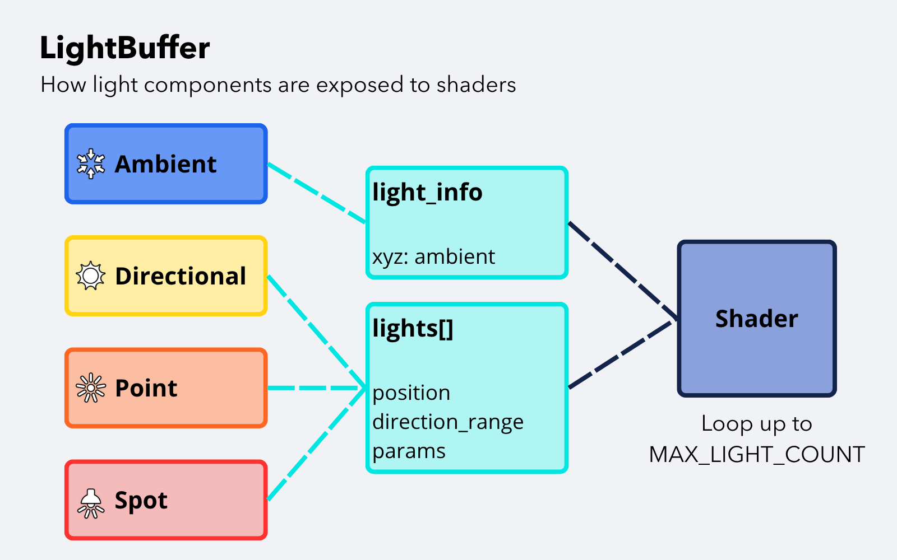

# Light component

The Light component represents a light source in a collection. Defold currently supports four light resource types:

- Ambient light (`.ambient_light`)
- Directional light (`.directional_light`)
- Point light (`.point_light`)
- Spot light (`.spot_light`)

Light resources are added to game objects like other component resources. You can either create light components directly under a game object, or create a light resource in the *Assets* browser and then add it as a component to a game object in the *Outline* view.

Defold does not apply lighting automatically to every material. Lights are collected by the engine and made available to shaders through the built-in light buffer. Your material shader decides how to use the light data.

The examples below use the same scene to show how the different light types affect the final result:


## Light properties

All light colors are RGB values. The alpha channel is not used by light resources.

### Ambient light

Ambient lights add constant light to the scene. They are not affected by the game object position, rotation or scale. They can be used e.g. for a general, background illumination or to make objects look unlit.

Ambient light component is represented in the editor with an icon with arrows rotated to the center. Color of the icon is same as its `color` property. 


Properties:

`color`
: The RGB color of the ambient light.

`intensity`
: Multiplies the ambient light color.


Ambient lights are accumulated into a single ambient color `light_info.xyz` in the shader light buffer. They do not occupy entries in the `lights[]` array. Multiple ambient light components in the scene will produce only one output color that is a blend of all of them.

### Directional light

Directional lights represent light coming from one direction, such as sunlight. They do not use the game object position or scale, but the light direction is derived from the game object's world rotation applied to the local forward direction `(0, 0, -1)`.

Directional light component is represented in the editor with a coloured sun icon with a 3D arrow that indicates its direction.


Properties:

`color`
: The RGB color of the directional light.

`intensity`
: Multiplies the directional light color.


Directional lights are often combined with ambient light to keep surfaces facing away from the directional light from becoming completely dark.


### Point light

Point lights emit light outward from the game object's world position. The point light position comes from the game object's world position.

Point light component is represented in the Editor with a dot with rays emitted around it and its color represents its `color` property and a circle representing the `range`.


Properties:

`color`
: The RGB color of the point light.

`intensity`
: Multiplies the point light color.

`range`
: The light radius in world units.

The effective range is multiplied by the smallest absolute axis of the game object's world scale.



Changing the light color tints the point light contribution while the range controls how far from the source the light reaches.



### Spot light

Spot lights emit light in a cone from the game object's world position. The direction is derived from the game object's world rotation applied to `(0, 0, -1)`.

Spot light component is represented in the editor with a coloured lamp icon and guide lines that show the outer and inner cones.



Properties:

`color`
: The RGB color of the spot light.

`intensity`
: Multiplies the spot light color.

`range`
: The light radius in world units.

`inner_cone_angle`
: The inner cone angle in degrees in the editor. Pixels inside this cone receive the full spot contribution.

`outer_cone_angle`
: The outer cone angle in degrees in the editor. The light fades between the inner and outer cone.

The effective range is multiplied by the smallest absolute axis of the game object's world scale. Cone angles are edited in degrees and converted to radians in the compiled light resource.



## Validation

The build pipeline validates and normalizes light resource data:

- `color` must contain exactly three numbers.
- `intensity` is clamped to `0` or higher.
- `range` is clamped to `0` or higher for point and spot lights.
- Spot cone angles are clamped to `0..180` degrees.
- `inner_cone_angle` is clamped so it never exceeds `outer_cone_angle`.

## Project limit

The maximum number of light components is controlled by the `light.max_count` project setting. The default value is `64`.

Ambient lights do not consume entries in the shader `lights[]` array, but they are still Light components and count toward `light.max_count`. Directional, point and spot lights consume entries in `lights[]` while they are active.

If the number of light components exceeds `light.max_count`, the engine will report a full component buffer error.

## Light buffer in shaders

A shader can access active lights by declaring a uniform block named `LightBuffer` with the built-in layout. The engine detects this block and binds the light data automatically for materials and compute programs that use it.



```glsl
#version 140

#define MAX_LIGHT_COUNT 32

struct Light
{
    vec4 position;        // xyz: world position, w: unused
    vec4 color;           // rgb: color, a: unused
    vec4 direction_range; // xyz: normalized world direction, w: range
    vec4 params;          // x: type, y: intensity, z: inner cone, w: outer cone
};

uniform LightBuffer
{
    // xyz: accumulated ambient color, w: active non-ambient light count
    vec4 light_info;
    Light lights[MAX_LIGHT_COUNT];
};
```

The light type is stored in `lights[i].params.x`:

| Type | Value |
|------|-------|
| Directional | `0` |
| Point | `1` |
| Spot | `2` |

The shader may declare a smaller `lights[]` array than `light.max_count`, but not a larger one. Always bind light loops by the declared array size:

```glsl
vec3 apply_lights(vec3 normal)
{
    vec3 result = light_info.xyz;
    int active_light_count = int(light_info.w);

    for (int i = 0; i < MAX_LIGHT_COUNT; ++i)
    {
        if (i >= active_light_count)
        {
            break;
        }

        int type = int(lights[i].params.x);
        vec3 light_color = lights[i].color.rgb * lights[i].params.y;

        if (type == 0) // Directional
        {
            vec3 light_dir = normalize(-lights[i].direction_range.xyz);
            result += light_color * max(dot(normal, light_dir), 0.0);
        }
        else if (type == 1) // Point
        {
            result += light_color;
        }
        else if (type == 2) // Spot
        {
            result += light_color;
        }
    }

    return result;
}
```

The example above shows the buffer access pattern. A real point or spot light shader should also calculate the vector from the shaded point to `lights[i].position.xyz`, apply distance attenuation using `lights[i].direction_range.w`, and for spot lights use `lights[i].params.z` and `lights[i].params.w` as cone angles in radians.

## Built-in lighting helper

Defold includes a shader helper at `/builtins/materials/lighting.glsl`. Define `MAX_LIGHT_COUNT`, provide the varyings expected by the helper, then include it from your fragment shader:

```glsl
#version 140

#define MAX_LIGHT_COUNT 32

in vec3 var_normal;
in vec4 var_position;
in mat4 var_view;

out vec4 color_out;

#include "/builtins/materials/lighting.glsl"

void main()
{
    vec3 normal = normalize(var_normal);
    vec3 ambient = ambient_light();
    vec3 diffuse = diffuse_lambert(normal, var_position.xyz);
    color_out = vec4(ambient + diffuse, 1.0);
}
```

The helper defines the constants `LIGHT_DIRECTIONAL`, `LIGHT_POINT` and `LIGHT_SPOT`, exposes `ambient_light()`, and provides Lambert diffuse functions for the lights in the buffer.

## See also

- [Shader manual](/manuals/shader)
- [Material manual](/manuals/material)
- [Render manual](/manuals/render)
