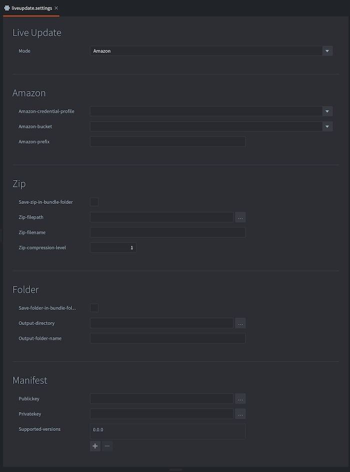

# Live update

When bundling a game, Defold packs all the game resources into the resulting platform specific package. In most cases this is preferred since the running engine has instant access to all resources and can load them swiftly from storage. However, there are instances where you might want to postpone the loading of resources to a later stage. For instance:

- Your game features a series of episodes and you wish to include only the first one for players to try out before they decide if they want to continue with the rest of the game.
- Your game is targeted for HTML5. On the browser, loading an application from storage means that the entire application package has to be downloaded before startup. On such a platform you may wish to send a minimal start package and get the app up and running quickly before you download the rest of the game resources.
- Your game contains very large resources (images, videos etc) that you wish to postpone the downloading of until they are about to show in the game. This is to keep the install size down.

The Live update functionality expands the concept of the collection proxy with a mechanism allowing the runtime to fetch and store resources to the application bundle that were intentionally left out of the bundle at build time.

It allows you to have your content split up into multiple archives:

* _Base Archive_
* Level Common Files
* Level Pack 1
* Level Pack 2
* ...

## Preparing content for Live update

Suppose we are making a game containing large, high resolution image resources. The game keeps these images in collections with a game object and a sprite with the image:

To have the engine load such a collection dynamically, we can simply add a collection proxy component and point it to *monalisa.collection*. Now the game can choose when to load the content in the collection from storage into memory by sending a `load` message to the collection proxy. However, we want to go further and control the loading of the resources contained in the collection ourselves.

This is done by simply checking the *Exclude* checkbox in the collection proxy properties, telling the bundler to leave any content in *monalisa.collection* out when creating an application bundle.

::: important
Any resources referenced by the base game package, will not be excluded.
:::

## Live update settings

When the bundler creates an application bundle it needs to store any excluded resources somewhere. The project settings for Live update govern the location for those resources. The settings are found under <kbd>Project ▸ Live update Settings...</kbd>. This will create a settings file if none exists. In *game.project*, select which live-update settings file to use when bundling. This allows for using different live-update settings for different environments, for example for live, QA, dev etc.

There are currently two ways that Defold can store the resources. Choose the method in the *Mode* dropdown in the settings window:

`Zip`
: This option tells Defold to create a Zip archive file with any excluded resources. The archive is saved at the location specified in the *Export path* setting.

`Amazon`
: This option tells Defold to automatically upload excluded resources to an Amazon Web Service (AWS) S3 bucket. Fill in your AWS *Credential profile* name, select the appropriate *Bucket* and provide a *Prefix* name.  You can read more on how to setup an AWS account in this [aws guide](/manuals/live-update-aws.md)

## Bundling with Live update

::: important
Building and running from the editor (<kbd>Project ▸ Build</kbd>) does not support Live Update. In order to test Live Update you need to bundle the project.
:::

To bundle with Live update is easy. Select <kbd>Project ▸ Bundle ▸ ...</kbd> and then the platform you want to create an application bundle for. This opens the bundling dialog:

When bundling, any excluded resource will be left out of the application bundle. By checking the *Publish Live update content* checkbox, you tell Defold to either upload the excluded resources to Amazon or to create a Zip archive, depending on how you have set up your Live update settings (see above). The manifest file for the bundle will also be included in the excluded resources.

Click *Package* and select a location for the application bundle. Now you can start the application and check that everything works as expected.

## The .zip archives

A live update .zip file contains files that were excluded from the base game package.

While our current pipeline only supports creating a single .zip file, it is in fact possible to split that zip file into smaller .zip files. This allows for smaller downloads for a game: level packs, seasonal content etc. Each .zip file also contains a manifest file that describes the meta data for each resource contained within the .zip file.

## Content verification

One of the major features of the live update system, is that you can now use many content archives, potentially from many different Defold versions.

The `liveupdate.add_mount()` default behavior, is to add an engine version check when attaching a mount.
This means that both the game base archive and live update archive(s) need to be created at the same time  with the same engine version, using the bundle option. This will invalidate any previously downloaded archives by the client, forcing them to redownload the content.

This behavior can be turned off with an options flag.
When turned off, the content verification responsibility lies entirely with the developer, to guarantee that each live update archive will work with the running engine.

We recommend storing some metadata for each mount, so that _directly upon startup_, the developer can decide if the mount/archive should be removed.
One way to do so is to add an extra file to the zip archive after the game has been bundled. For instance by inserting a `metadata.json` with any relevant information that the game requires. Then, at startup, the game can retrieve with `sys.load_resource("/metadata.json")`. _Note that you will need a unique name for each mount's custom data, or the mounts will give you the file with the topmost priority_

Failure to do so, you may end up in a situation where the content is not compatible with the engine at all, forcing it to quit.

## Mounts

The live update system can use multiple content archives at the same time.
Each archive is "mounted" to the engine's resource system, with a name and priority.

If two archives have the same file `sprite.texturec`, the engine will load the file from the mount with the highest priority.

The engine doesn't keep a reference to any resource in a mount. Once a resource is loaded into memory, the archive may be unmounted. The resource will remain in memory until it is unloaded.

The mounts are automatically readded upon engine restart.

::: sidenote
Mounting an archive doesn't copy or move the archive. The engine only stores the path to the archive. Thus, the developer can remove the archive at any time, and the mount will also be removed at next startup.
:::

## Scripting with Live Update

To actually use the live update content, you need to download and mount the data to your game.
Read more about about how to [script with live update here](/manuals/live-update-scripting.md).

## Development caveats

Debugging
: When running a bundled version of your game, you don't have direct access to a console. This causes problems for debugging. However, you can run the application from the command line or by double clicking the executable in the bundle directly:

  

  Now the game starts with a shell window that will output any `print()` statements:

  

Forcing re-download of resources
: The developer can download the content to any file/folder they wish, but often they're located under the application path. The location of the application support folder depends on the operating system. It can be found with `print(sys.get_save_file("", ""))`.

  The file liveupdate.mounts is located under the "local storage", and it's path is output to the console at start "INFO:LIVEUPDATE: Live update folder located at: ..."

  
