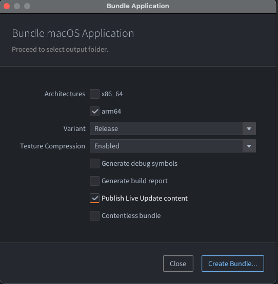

# Live update

When bundling a game, Defold packs all the game resources into the resulting platform specific package. In most cases this is preferred since the running engine has instant access to all resources and can load them swiftly from storage. However, there are instances where you might want to postpone the loading of resources to a later stage. For instance:

- Your game features a series of episodes and you wish to include only the first one for players to try out before they decide if they want to continue with the rest of the game.
- Your game is targeted for HTML5. On the browser, loading an application from storage means that the entire application package has to be downloaded before startup. On such a platform you may wish to send a minimal start package and get the app up and running quickly before you download the rest of the game resources.
- Your game contains very large resources (images, videos etc) that you wish to postpone the downloading of until they are about to show in the game. This is to keep the install size down.

The Live update functionality expands the concept of the collection proxy with a mechanism allowing the runtime to fetch and store resources to the application bundle that were intentionally left out of the bundle at build time.

## Preparing content for Live update

Suppose we are making a game containing large, high resolution image resources. The game keeps these images in collections with a game object and a sprite with the image:


To have the engine load such a collection dynamically, we can simply add a collection proxy component and point it to *monalisa.collection*. Now the game can choose when to load the content in the collection from storage into memory by sending a `load` message to the collection proxy. However, we want to go further and control the loading of the resources contained in the collection ourselves.

This is done by simply checking the *Exclude* checkbox in the collection proxy properties, telling the bundler to leave any content in *monalisa.collection* out when creating an application bundle.


## Live update settings

When the bundler creates an application bundle, it needs to store any excluded resources somewhere. The project settings for Live update govern the location for those resources. The settings are found under <kbd>Project ▸ Live update Settings...</kbd>.


There are two ways Defold can store the settings. Choose the method in the *Mode* dropdown in the settings window:

`Amazon`
: This option tells Defold to automatically upload excluded resources to an Amazon Web Service (AWS) S3 bucket. Fill in your AWS *Credential profile* name, select the appropriate *Bucket* and provide a *Prefix* name. [See below for details how to set up an AWS account](#_setting_up_amazon_web_service).

`Zip`
: This option tells Defold to create a Zip archive file with any excluded resources. The archive is saved at the location specified in the *Export path* setting.


## Scripting with excluded collection proxies

A collection proxy that has been excluded from bundling works as a normal collection proxy, with one important difference. Sending it a `load` message while it still has resources not available in the bundle storage will cause it to fail.

So before we send it a `load`, we need to check if there are any missing resources. If there are, we have to download them and then store them. The following example code assumes that the resources are stored on Amazon S3, in a bucket called "my-game-bucket" with the prefix `my-resources`.

```lua
function init(self)
    self.resources_pending = 0 -- <1>
    msg.post("#", "attempt_load_resources")
end

-- This function is called whenever we have tried to store a downloaded resource
-- necessary for our collection proxy to load.
local function resource_store_response(self, hexdigest, status)
    if status == true then
        -- Successfully loaded resource
        print("Resource data stored: " .. hexdigest)

        -- One less resource to go...
        self.resources_pending = self.resources_pending - 1

        -- That was all of them, time to load the proxied collection.
        if self.resources_pending == 0 then
            msg.post("#proxy", "load") -- <8>
        end
    else
        -- ERROR! Failed to store the data!
        print("Failed to store resource data: " .. hexdigest)
    end
end

function on_message(self, message_id, message, sender)
    if message_id == hash("attempt_load_resources") then
        local missing_resources = collectionproxy.missing_resources("#proxy") -- <2>

        -- initiate a download request for each of the missing resources that has not yet been tried.
        for _,resource_hash in ipairs(missing_resources) do
            msg.post("#", "attempt_download", { resource_hash = resource_hash})
        end

        self.resources_pending = #missing_resources -- <3>

        -- if we're running from editor all resources are there from the start.
        if self.resources_pending == 0 then
            msg.post("#proxy", "load")
        end
    elseif message_id == hash("attempt_download") then
        local manifest = resource.get_current_manifest() -- <4>
        local base_url = "https://my-game-bucket.s3.amazonaws.com/my-resources/" -- <5>
        http.request(base_url .. message.resource_hash, "GET", function(self, id, response)
            if response.status == 200 or response.status == 304 then -- <6>
                -- We got the response ok.
                print("storing " .. message.resource_hash)
                resource.store_resource(manifest, response.response, message.resource_hash, resource_store_response) -- <7>
            else
                -- ERROR! Failed to download resource!
                print("Failed to download resource: " .. message.resource_hash)
            end
        end)
    elseif message_id == hash("proxy_loaded") then
        msg.post(sender, "init")
        msg.post(sender, "enable")
    end
end
```
1. A simple counter that tells us how many resources we have still to download and store before we can load the proxy collection. Note that this code does not deal with errors at all so production code would need to do a better job at tracking the download and store operations.
2. Get any resources that we need to download and store.
3. Store the number of missing resources so we can count them down.
4. We need the current manifest since it lists all resources in the bundle, and if they are available or not.
5. We store our resources on Amazon S3. If you create a Zip archive with resources, you need to host the files somewhere and reference their location when downloading them with `http.request()`.
6. Amazon returns status 304 when files are cached.
7. We have data at this point. Try to store it.
8. Storage was successful and we have decreased the resource counter to zero. It is now safe to send a "load" message to the collection proxy. Note that if download or storage fails at some point, the counter will never reach zero.

With the loading code in place, we can test the application. However, running it from the editor will not download anything. This is because Live update is a bundle feature. When running in the editor environment no resources are ever excluded. To make sure everything works fine, we need to create a bundle.

## Bundling with Live update

To bundle with Live update is easy. Select <kbd>Project ▸ Bundle ▸ ...</kbd> and then the platform you want to create an application bundle for. This opens the bundling dialog:



When bundling, any excluded resource will be left out of the application bundle. By checking the *Publish Live update content* checkbox, you tell Defold to either upload the excluded resources to Amazon or to create a Zip archive, depending on how you have set up your Live update settings (see above).

Click *Package* and select a location for the application bundle. Now you can start the application and check that everything works as expected.

## Setting up Amazon Web Service

To use the Defold Live update feature together with Amazon services you need an Amazon Web Services account. If you don't already have an account you can create one here https://aws.amazon.com/.

This section will explain how to create a new user with limited access on Amazon Web Services that can be used together with the Defold editor to automatically upload Live update resources when you bundle your game, as well as how to configure Amazon S3 to allow game clients to retrieve resources. For additional information about how you can configure Amazon S3, please see the [Amazon S3 documentation](http://docs.aws.amazon.com/AmazonS3/latest/dev/Welcome.html).

1. Create a bucket for Live update resources

    Open up the `Services` menu and select `S3` which is located under the _Storage_ category ([Amazon S3 Console](https://console.aws.amazon.com/s3)). You will see all your existing buckets together with the option to create a new bucket. Though it is possible to use an existing bucket, we recommend that you create a new bucket for Live update resources so that you can easily restrict access.

    

2. Add a bucket policy to your bucket

    Select the bucket you wish to use, open the *Properties* panel and expand the *Permissions* option within the panel. Open up the bucket policy by clicking on the *Add bucket policy* button. The bucket policy in this example will allow an anonymous user to retrieve files from the bucket, which will allow a game client to download the Live update resources that are required by the game. For additional information about bucket policies, please see [the Amazon documentation](https://docs.aws.amazon.com/AmazonS3/latest/dev/using-iam-policies.html).

    ```json
    {
        "Version": "2012-10-17",
        "Statement": [
            {
                "Sid": "AddPerm",
                "Effect": "Allow",
                "Principal": "*",
                "Action": "s3:GetObject",
                "Resource": "arn:aws:s3:::defold-liveupdate-example/*"
            }
        ]
    }
    ```

    

3. Add a CORS configuration to your bucket (Optional)

    [Cross-Origin Resource Sharing (CORS)](https://en.wikipedia.org/wiki/Cross-origin_resource_sharing) is a mechanism that allows a website to retrieve a resource from a different domain using JavaScript. If you intend to publish your game as an HTML5 client, you will need to add a CORS configuration to your bucket.

    Select the bucket you wish to use, open the *Properties* panel and expand the *Permissions* option within the panel. Open up the bucket policy by clicking on the *Add CORS Configuration* button. The configuration in this example will allow access from any website by specifying a wildcard domain, though it is possible to restrict this access further if you know on which domains you will make you game available. For additional information about Amazon CORS configuration, please see [the Amazon documentation](https://docs.aws.amazon.com/AmazonS3/latest/dev/cors.html).

    ```xml
    <?xml version="1.0" encoding="UTF-8"?>
    <CORSConfiguration xmlns="http://s3.amazonaws.com/doc/2006-03-01/">
        <CORSRule>
            <AllowedOrigin>*</AllowedOrigin>
            <AllowedMethod>GET</AllowedMethod>
        </CORSRule>
    </CORSConfiguration>
    ```

    

4. Create IAM policy

    Open up the *Services* menu and select *IAM* which is located under the _Security, Identity & Compliance_ category ([Amazon IAM Console](https://console.aws.amazon.com/iam)). Select *Policies* in the menu to the left and you will see all your existing policies together with the option to create a new policy.

    Click the button *Create Policy*, and then choose to _Create Your Own Policy_. The policy in this example will allow a user to list all buckets, which is only required when configuring a Defold project for Live update. It will also allow the user to get the Access Control List (ACL) and upload resources to the specific bucket used for Live update resources. For additional information about Amazon Identity and Access Management (IAM), please see [the Amazon documentation](http://docs.aws.amazon.com/IAM/latest/UserGuide/access.html).

    ```json
    {
        "Version": "2012-10-17",
        "Statement": [
            {
                "Effect": "Allow",
                "Action": [
                    "s3:ListAllMyBuckets"
                ],
                "Resource": "arn:aws:s3:::*"
            },
            {
                "Effect": "Allow",
                "Action": [
                    "s3:GetBucketAcl"
                ],
                "Resource": "arn:aws:s3:::defold-liveupdate-example"
            },
            {
                "Effect": "Allow",
                "Action": [
                    "s3:PutObject"
                ],
                "Resource": "arn:aws:s3:::defold-liveupdate-example/*"
            }
        ]
    }
    ```

    

5. Create a user for programmatic access

    Open up the *Services* menu and select *IAM* which is located under the _Security, Identity & Compliance_ category ([Amazon IAM Console](https://console.aws.amazon.com/iam)). Select *Users* in the menu to the left and you will see all your existing users together with the option to add a new user. Though it is possible to use an existing user, we recommend that you add a new user for Live update resources so that you can easily restrict access.

    Click the button *Add User*, provide a username and choose *Programmatic access* as *Access type*, then press *Next: Permissions*. Select *Attach existing policies directly* and choose the policy you created in step 4.

    When you've completed the process you will be provided with an *Access key ID* and a *Secret access key*.

    ::: important
    It is *very important* that you store those keys since you will not be able to retrieve them from Amazon after you leave the page.
    :::

6. Create a credentials profile file

    At this point you should have created a bucket, configured a bucket policy, added a CORS configuration, created a user policy and created a new user. The only thing that remains is to create a [credentials profile file](https://aws.amazon.com/blogs/security/a-new-and-standardized-way-to-manage-credentials-in-the-aws-sdks) so that the Defold editor can access the bucket on your behalf.

    Create a new directory *.aws* in your home folder, and create a file called *credentials* within the new directory.

    ```bash
    $ mkdir ~/.aws
    $ touch ~/.aws/credentials
    ```

    The file *~/.aws/credentials* will contain your credentials to access Amazon Web Services through programmatic access and is a standardised way to manage AWS credentials. Open the file in a text editor and enter your *Access key ID* and *Secret access key* in the format shown below.

    ```ini
    [defold-liveupdate-example]
    aws_access_key_id = <Access key ID>
    aws_secret_access_key = <Secret access key>
    ```

    The identifier specified within the brackets, in this example _defold-liveupdate-example_, is the same identifier that you should provide when configuring your project's Live update settings in the Defold editor.

    

## The manifest

The manifest is an internal data structure that holds a list of all resources included in a build as well as the hash value of each resource. The Live update functionality uses the manifest to track what is part of the built game, list what can be loaded from external sources, and if that happens, make certain that the loaded data is intact.

From the user's perspective, the manifest is a numeric handle, leaving the details of how it's managed to the engine.

::: important
Currently, only the initial build manifest is available. The ability to store new manifests is a planned update to the system. This will allow you to modify or add resources to a published game that were not known at build time.
:::

## Development caveats

Debugging
: When running a bundled version of your game, you don't have direct access to a console. This causes problems for debugging. However, you can run the application from the command line or by double clicking the executable in the bundle directly:

  

  Now the game starts with a shell window that will output any `print()` statements:

  

Forcing re-download of resources
: When an application stores resources, they end up on disk on the local computer or handheld device. If you restart the application, the resources are there and ready. When developing you sometimes want to remove resources and force the application to download them again. The path returned from the function `sys.get_save_file()` gives the location where Defold stores resources. In that folder, Defold creates a folder with the name of the hash of the created bundle. If you delete the files in this folder, the application will invalidate the resources from the manifest and you can download and store them again.

  

## Known issues

- At the moment you have access only to the manifest that is created at build-time. In the near future you will be able to store new manifests. This will allow you to modify existing resources, or add new resources to the game through Live update.
- [`resource.store_resource()`](/ref/resource/#resource.store_resource) currently blocks the main thread, meaning that if you store large resources you will experience hitches.

