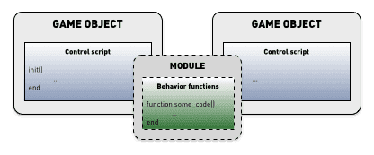

# Lua in Defold

The Defold engine has the Lua language embedded for scripting. Lua is a lightweight dynamic language that is powerful, fast, and easy to embed. It is widely used as a videogame scripting language. Lua programs are written in a simple procedural syntax. The language is dynamically typed and is run by a bytecode interpreter. It features automatic memory management with incremental garbage collection.

This manual will give a quick introduction to the basics of Lua programming in general and what you need to consider when working with Lua in Defold. If you have some experience with Python, Perl, Ruby, Javascript or a similar dynamic language you will get going pretty quickly. If you are totally new to programming you might want to start with a Lua book aimed at beginners. There are plenty to choose from.

## Lua versions
We aim to keep Defold the same across all platforms, but we currently have a small discrepancy between Lua versions. For HTML5 and iOS 64 bit platforms we use Lua 5.1 but for other platforms we use LuaJIT. LuaJIT is based on 5.1 but contains a few additional features.

::: important
To keep your game working cross platform we suggest you stick to Lua 5.1 features.
:::

## Lua books and resources

* [Programming in Lua (first edition)](http://www.lua.org/pil/contents.html) Later editions are available in print.
* [Lua 5.1 reference manual](http://www.lua.org/manual/5.1/)
* Beginning Lua Programming (Wrox, 2007)
* Game Development with Lua (Charles River Media, 2005)

## Syntax

Programs have simple, easy to read syntax. Statements are written one on each line and there is no need to mark the end of a statement. You can optionally use semicolons `;` to separate statements. Blocks of code are keyword delimited, ending with the `end` keyword. Comments can be either block or until the end of the line:

```lua
--[[
Here is a block of comments that can run
over several lines in the source file.
--]]

a = 10
b = 20 ; c = 30 -- two statements on one line

if my_variable == 3 then
    call_some_function(true) -- Here is a line comment
else
    call_another_function(false)
end
```

## Variables and data types

Lua is dynamically typed which means that variables do not have types, but values do. Unlike in typed languages, you can assign any value to any variable as you like. There are eight basic types in Lua:

`nil`
: This type only has the value `nil`. It usually represents the absence of a useful value, for example unassigned variables.

  ```lua
  print(my_var) -- will print 'nil' since 'my_var' is not yet assigned a value
  ```

boolean
: Has either the value `true` or `false`. Conditions that are `false` or `nil` are made false. Any other value makes it true.

  ```lua
  flag = true
  if flag then
      print("flag is true")
  else
      print("flag is false")
  end

  if my_var then
      print("my_var is not nil nor false!")
  end

  if not my_var then
      print("my_var is either nil or false!")
  end
  ```

number
: Numbers are internally represented as either 64 bit _integers_ or 64 bit _floating point_ numbers. Lua automatically converts between these representations as needed so you generally don't have to worry about it.

  ```lua
  print(10) --> prints '10'
  print(10.0) --> '10'
  print(10.000000000001) --> '10.000000000001'

  a = 5 -- integer
  b = 7/3 -- float
  print(a - b) --> '2.6666666666667'
  ```

string
: Strings are immutable sequences of bytes that can contain any 8-bit value, including embedded zeros (`\0`). Lua makes no assumptions about the contents of a string so you can store any data you like in them. String literals are written in single or double quotes. Lua converts between numbers and strings at runtime. Strings can be concatenated with the `..` operator.

  Strings can contain the following C-style escape sequences:

  | Sequence | Character |
  | -------- | --------- |
  | `\a`     | bell       |
  | `\b`     | back space |
  | `\f`     | form feed  |
  | `\n`     | newline    |
  | `\r`     | carriage return |
  | `\t`     | horizontal tab |
  | `\v`     | vertical tab   |
  | `\\`     | backslash      |
  | `\"`     | double quote   |
  | `\'`     | single quote   |
  | `\[`     | left square bracket    |
  | `\]`     | right square bracket   |
  | `\ddd`   | character denoted by its numeric value where ddd is a sequence of up to three _decimal_ digits |

  ```lua
  my_string = "hello"
  another_string = 'world'
  print(my_string .. another_string) --> "helloworld"

  print("10.2" + 1) --> 11.2
  print(my_string + 1) -- error, can't convert "hello"
  print(my_string .. 1) --> "hello1"

  print("one\nstring") --> one
                       --> string

  print("\097bc") --> "abc"

  multi_line_string = [[
  Here is a chunk of text that runs over several lines. This is all
  put into the string and is sometimes very handy.
  ]]
  ```

function
: Functions are first class values in Lua, meaning that you can pass them as parameters to functions and return them as values. Variables assigned to a function contain a reference to the function. You can assign variables to anonymous functions, but Lua provides syntactic sugar (`function name(param1, param2) ... end`) for convenience.

  ```lua
  -- Assign 'my_plus' to function
  my_plus = function(p, q)
      return p + q
  end

  print(my_plus(4, 5)) --> 9

  -- Convenient syntax to assign function to variable 'my_mult'
  function my_mult(p, q)
      return p * q
  end

  print(my_mult(4, 5)) --> 20

  -- Takes a function as parameter 'func'
  function operate(func, p, q)
      return func(p, q) -- Calls the provided function with parameters 'p' and 'q'
  end

  print(operate(my_plus, 4, 5)) --> 9
  print(operate(my_mult, 4, 5)) --> 20

  -- Create an adder function and return it
  function create_adder(n)
      return function(a)
          return a + n
      end
  end

  adder = create_adder(2)
  print(adder(3)) --> 5
  print(adder(10)) --> 12
  ```

table
: Tables are the only data-structuring type in Lua. They are associative array _objects_ that are used to represent lists, arrays, sequences, symbol tables, sets, records, graphs, trees etc. Tables are always anonymous and variables you assign a table to do not contain the table itself, but a reference to it. When initializing a table as a sequence, the first index is `1`, not `0`.

  ```lua
  -- Initialize a table as a sequence
  weekdays = {"Sunday", "Monday", "Tuesday", "Wednesday",
              "Thursday", "Friday", "Saturday"}
  print(weekdays[1]) --> "Sunday"
  print(weekdays[5]) --> "Thursday"

  -- Initialize a table as a record with sequence values
  moons = { Earth = { "Moon" },
            Uranus = { "Puck", "Miranda", "Ariel", "Umbriel", "Titania", "Oberon" } }
  print(moons.Uranus[3]) --> "Ariel"

  -- Build a table from an empty constructor {}
  a = 1
  t = {}
  t[1] = "first"
  t[a + 1] = "second"
  t.x = 1 -- same as t["x"] = 1

  -- Iterate over the table key, value pairs
  for key, value in pairs(t) do
      print(key, value)
  end
  --> 1   first
  --> 2   second
  --> x   1

  u = t -- u now refers to the same table as t
  u[1] = "changed"

  for key, value in pairs(t) do -- still iterating over t!
      print(key, value)
  end
  --> 1   changed
  --> 2   second
  --> x   1
  ```

userdata
: Userdata is provided to allow arbitrary C data to be stored in Lua variables. Defold uses Lua userdata objects to store Hash values (hash), URL objects (url), Math objects (vector3, vector4, matrix4, quaternion), Game objects, GUI nodes (node), Render predicates (predicate), Render targets (render_target) and Render constant buffers (constant_buffer)

thread
: Threads represent independent threads of execution and are used to implement coroutines. See below for details.

## Operators

Arithmetic operators
: Mathematic operators `+`, `-`, `*`, `/`, the unary `-` (negation) and exponential `^`.

  ```lua
  a = -1
  print(a * 2 + 3 / 4^5) --> -1.9970703125
  ```

  Lua provides automatic conversions between numbers and strings at run time. Any numeric operation applied to a string tries to convert the string to a number:

  ```lua
  print("10" + 1) --> 11
  ```

Relational/comparison operators
: `<` (less than), `>` (greater than), `<=` (less or equal), `>=` (greater or equal), `==` (equal), `~=` (not equal). There operators always return `true` or `false`. Values of different types are considered different. If the types are the same, they are compared according to their value. Lua compares tables, userdata, and functions by reference. Two such values are considered equal only if they refer to the same object.

  ```lua
  a = 5
  b = 6

  if a <= b then
      print("a is less than or equal to b")
  end

  print("A" < "a") --> true
  print("aa" < "ab") --> true
  print(10 == "10") --> false
  print(tostring(10) == "10") --> true
  ```

Logical operators
: `and`, `or`, and `not`. `and` returns its first argument if it is `false`, otherwise it returns its second argument. `or` returns its first argument if it is not `false`, otherwise it returns its second argument.

  ```lua
  print(true or false) --> true
  print(true and false) --> false
  print(not false) --> true

  if a == 5 and b == 6 then
      print("a is 5 and b is 6")
  end
  ```

Concatenation
: Strings can be concatenated with the `..` operator. Numbers are converted to strings when concatenated.

  ```lua
  print("donkey" .. "kong") --> "donkeykong"
  print(1 .. 2) --> "12"
  ```

Length
: The unary length operator `#`. The length of a string is its number of bytes. The length of a table is its sequence length, the number of indices that are numbered from `1` and upwards where the value is not `nil`. Note: If the sequence has `nil` value "holes" in it, the length can be any index preceding a `nil` value.

  ```lua
  s = "donkey"
  print(#s) --> 6

  t = { "a", "b", "c", "d" }
  print(#t) --> 4

  u = { a = 1, b = 2, c = 3 }
  print(#u) --> 0

  v = { "a", "b", nil }
  print(#v) --> 2
  ```

## Flow control

Lua provides the usual set of flow control constructs.

if---then---else
: Test a condition, execute the `then` part if the condition is true, otherwise execute the (optional) `else` part. Instead of nesting `if` statements you can use `elseif`. This replaces a switch-statement that Lua does not have.

  ```lua
  a = 5
  b = 4

  if a < b then
      print("a is smaller than b")
  end

  if a == '1' then
      print("a is 1")
  elseif a == '2' then
      print("a is 2")
  elseif a == '3' then
      print("a is 3")
  else
      print("I have no idea what a is...")
  end
  ```

while
: Test a condition and execute the block as long as it's true.

  ```lua
  weekdays = {"Sunday", "Monday", "Tuesday", "Wednesday",
              "Thursday", "Friday", "Saturday"}

  -- Print each weekday
  i = 1
  while weekdays[i] do
      print(weekdays[i])
      i = i + 1
  end
  ```

repeat---until
: Repeats the block until a condition is true. The condition is tested after the body so it will execute at least once.

  ```lua
  weekdays = {"Sunday", "Monday", "Tuesday", "Wednesday",
              "Thursday", "Friday", "Saturday"}

  -- Print each weekday
  i = 0
  repeat
      i = i + 1
      print(weekdays[i])
  until weekdays[i] == "Saturday"
  ```

for
: Lua has two types of `for` loop: numeric and generic. The numeric `for` takes 2 or 3 numeric values whereas the generic `for` iterates over all values returned by an _iterator_ function.

  ```lua
  -- Print the numbers 1 to 10
  for i = 1, 10 do
      print(i)
  end

  -- Print the numbers 1 to 10 and increment with 2 each time
  for i = 1, 10, 2 do
      print(i)
  end

  -- Print the numbers 10 to 1
  for i=10, 1, -1 do
      print(i)
  end

  t = { "a", "b", "c", "d" }
  -- Iterate over the sequence and print the values
  for i, v in ipairs(t) do
      print(v)
  end
  ```

break and return
: Use the `break` statement to break out of an inner block of a `for`, `while` or `repeat` loop. Use `return` to return a value from a function or to finish execution of a function and return to the caller. `break` or `return` can appear only as the last statement of a block.

  ```lua
  a = 1
  while true do
      a = a + 1
      if a >= 100 then
          break
      end
  end

  function my_add(a, b)
      return a + b
  end

  print(my_add(10, 12)) --> 22
  ```

## Locals, globals and lexical scoping

All variables that you declare are by default global, meaning that they are available through all parts of the Lua runtime context. You can explicitly declare variables `local`, meaning that the variable will only exist within the current scope.

Each Lua source file defines a separate scope. Local declarations on the topmost level in a file means the variable is local to the Lua script file. Each function creates another nested scope and each control structure block creates additional scopes. You can explicitly create scope with the `do` and `end` keywords. Lua is lexically scoped, meaning that a scope has full access to _local_ variables from the enclosing scope. Note that the local variables must be declared prior to their use.

```lua
function my_func(a, b)
    -- 'a' and 'b' are local to this function and available through its scope

    do
        local x = 1
    end

    print(x) --> nil. 'x' is not available outside the do-end scope
    print(foo) --> nil. 'foo' is declared after 'my_func'
    print(foo_global) --> "value 2"
end

local foo = "value 1"
foo_global = "value 2"

print(foo) --> "value 1". 'foo' is avalable in the topmost scope after declaration.
```

Note that if you declare functions `local` in a script file (which is generally a good idea) you need to watch out how you order the code. You can use forward declarations if you have functions that mutually call each other.

```lua
local func2 -- Forward declare 'func2'

local function func1(a)
    print("func1")
    func2(a)
end

function func2(a) -- or func2 = function(a)
    print("func2")
    if a < 10 then
        func1(a + 1)
    end
end

function init(self)
    func1(1)
end
```

If you write a function enclosed in another function, it too has full access to local variables from the enclosing function. This is a very powerful construct.

```lua
function create_counter(x)
    -- 'x' is a local variable in 'create_counter'
    return function()
        x = x + 1
        return x
    end
end

count1 = create_counter(10)
count2 = create_counter(20)
print(count1()) --> 11
print(count2()) --> 21
print(count1()) --> 12
```

## Variable shadowing

Local variables declared in a block will shadow variables from a surrounding block with the same name.

```lua
my_global = "global"
print(my_global) -->"global"

local v = "local"
print(v) --> "local"

local function test(v)
    print(v)
end

function init(self)
    v = "apple"
    print(v) --> "apple"
    test("banana") --> "banana"
end
```

## Coroutines

Functions execute from beginning to end and there is no way to stop them midway through. Coroutines allow you to do that, which can be very convenient in some cases. Suppose we want to create a very specific frame-by-frame animation where we move a game object from y position `0` to some very specific y positions from frame 1 to frame 5. We could solve that with a counter in the `update()` function (see below) and a list of the positions. However, with a coroutine we get a very clean implementation that is easy to extend and work with. All state is contained within the coroutine itself.

When a coroutine yields it returns control back to the caller but remembers its execution point so it can continue from there later on.

```lua
-- This is our coroutine
local function sequence(self)
    coroutine.yield(120)
    coroutine.yield(320)
    coroutine.yield(510)
    coroutine.yield(240)
    return 440 -- return the final value
end

function init(self)
    self.co = coroutine.create(sequence) -- Create the coroutine. 'self.co' is a thread object
    go.set_position(vmath.vector3(100, 0, 0)) -- Set initial position
end

function update(self, dt)
    local status, y_pos = coroutine.resume(self.co, self) -- Continue execution of coroutine.
    if status then
        -- If the coroutine is still not terminated/dead, use its yielded return value as a new position
        go.set_position(vmath.vector3(100, y_pos, 0))
    end
end
```


## Lua contexts in Defold

All variables that you declare are by default global, meaning that they are available through all parts of the Lua runtime context. Defold has a setting *shared_state* setting in *game.project* that controls this context. If the option is set, all scripts, GUI scripts and the render script are evaluated in the same Lua context and global variables are visible everywhere. If the option is not set, the engine executes scripts, GUI scripts and the render script in separate contexts.


Defold allows you to use the same script file in several separate game object components. Any locally declared variables are shared between components that runs the same script file.

```lua
-- 'my_global_value' will be available from all scripts, gui_scripts, render script and modules (Lua files)
my_global_value = "global scope"

-- this value will be shared through all component instances that use this particular script file
local script_value = "script scope"

function init(self, dt)
    -- This value will be available on this script component instance
    self.foo = "self scope"

    -- this value will be available inside init() and after it's declaration
    local local_foo = "local scope"
    print(local_foo)
end

function update(self, dt)
    print(self.foo)
    print(my_global_value)
    print(script_value)
    print(local_foo) -- will print nil, since local_foo is only visible in init()
end
```

## Performance considerations

In a high performance game that is intended to run at a smooth 60 FPS small performance mistakes can have a large impact on the experience. There are some simple general things to consider and some things that might not seem problematic.

Beginning with the simple things. It is generally a good idea to write code that is straightforward and that does not contain unnecessary loops. Sometimes you do need to iterate over lists of things, but be careful if the list of things is sufficiently large. This example runs in slightly over 1 millisecond on a pretty decent laptop, which can make all the difference if each frame is only 16 milliseconds long (at 60 FPS) and with the engine, render script, physics simulation and so forth eating up a chunk of that.

```lua
local t = socket.gettime()
local table = {}
for i=1,2000 do
    table[i] = vmath.vector3(i, i, i)
end
print((socket.gettime() - t) * 1000)

-- DEBUG:SCRIPT: 0.40388
```

Use the value returned from `socket.gettime()` (seconds since system epoch) to benchmark suspect code.

## Memory and garbage collection

Lua's garbage collection runs automatically in the background by default and reclaims memory that the Lua runtime has allocated. Collecting lots of garbage can be a time consuming task so it is good to keep down the number of objects that needs to be garbage collected:

* Local variables are in themselves free and will not generate garbage. (i.e. `local v = 42`)
* Each _new unique_ string creates a new object. Writing `local s = "some_string"` will create a new object and assign `s` to it. The local `s` itself will not generate garbage, but the string object will. Using the same string multiple times adds no additional memory cost.
* Each time a table constructor is executed (`{ ... }`) a new table is created.
* Executing a _function statement_ creates a closure object. (i.e. executing the statement `function () ... end`, not calling a defined function)
* Vararg functions (`function(v, ...) end`) create a table for the ellipsis each time the function is _called_ (in Lua prior to version 5.2, or if not using LuaJIT).
* `dofile()` and `dostring()`
* Userdata objects

There are many cases where you can avoid creating new objects and instead reuse the ones you already have. For example. The following is common at the end of each `update()`:

```lua
-- Reset velocity
self.velocity = vmath.vector3()
```

It's easy to forget that each call to `vmath.vector3()` creates a new object. Let's find out how much memory one `vector3` uses:

```lua
print(collectgarbage("count") * 1024)       -- 88634
local v = vmath.vector3()
print(collectgarbage("count") * 1024)       -- 88704. 70 bytes in total has been allocated
```

70 bytes has been added between the calls to `collectgarbage()`, but this includes allocations for more than the `vector3` object. Each printing of the result from `collectgarbage()` builds a string which in itself adds 22 bytes of garbage:

```lua
print(collectgarbage("count") * 1024)       -- 88611
print(collectgarbage("count") * 1024)       -- 88633. 22 bytes allocated
```

So a `vector3` weighs in at 70-22=48 bytes. That is not much, but if you create _one_ each frame in a 60 FPS game it's suddenly 2.8 kB of garbage per second. With 360 script components that each create one `vector3` every frame we're looking at 1 MB of garbage generated per second. The numbers can add upp very quickly. When the Lua runtime collects garbage it may eat up many precious milliseconds---especially on mobile platforms.

One way to avoid allocations is to create a `vector3` and then keep working with the same object. For instance, to reset a `vector3` we can use the following construct:

```lua
-- Instead of doing self.velocity = vmath.vector3() which creates a new object
-- we zero an existing velocity vector object's components
self.velocity.x = 0
self.velocity.y = 0
self.velocity.z = 0
```

The default garbage collecting scheme may not be optimal for some time critical applications. If you see stutter in your game or app, you might want to tune how Lua collects garbage through the [`collectgarbage()`](/ref/base/#collectgarbage) Lua function. You can, for instance, run the collector for a short time every frame with a low `step` value. To get an idea how much memory your game or app is eating, you can print the current amount of garbage bytes with:

```lua
print(collectgarbage("count") * 1024)
```

## Best practices

A common implementation design consideration is how to structure code for shared behaviors. Several approaches are possible.

Behaviors in a module
: Encapsulating a behavior in a module allows you to easily share code between different game objects’ script components (and GUI scripts). When writing module functions it is generally best to write strictly functional code. There are cases where stored state or side effects are a necessity (or lead to cleaner design). If you have to store internal state in the module, be aware that components share Lua contexts. See the [Modules documentation](/manuals/modules) for details.

  

  Also, even if it is possible to have module code directly modify the internals of a game object (by passing `self` to a module function) we strongly discourage you from doing so since you will create very tight coupling.

A helper game object with encapsulated behavior
: Just like you can contain script code in a Lua module, you can contain it in a game object with a script component. The difference is that if you contain it in a game object you can communicate with it strictly through message passing.

  

Grouping game object with helper behavior object inside a collection
: In this design you can create a behavior game object that automatically acts upon another target game object, either by a predefined name (the user has to rename the target game object to match), or through a `go.property()` URL that points to the target game object.

  

  The benefit with this setup is that you can drop a behavior game object into a collection containing the target object. Zero additional code is needed.

  In situations where you need to manage large quantities of game objects, this design is not preferable since the behavior object is duplicated for each instance and each object will cost memory.
