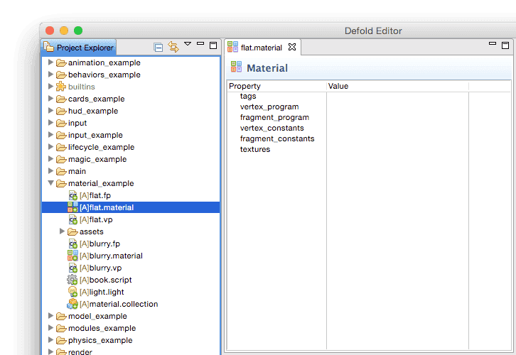
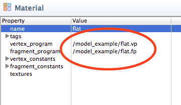
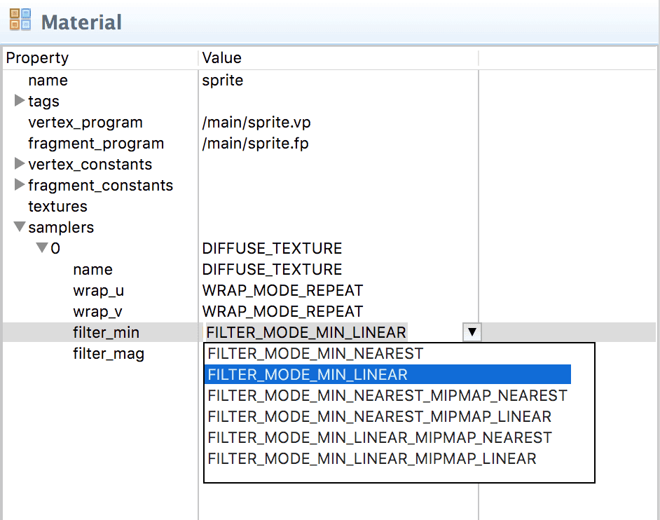

# Materials

Materials are the Defold way of expressing how a graphical component (a sprite, tilemap, font, GUI node etc) should be rendered.

A material holds _Tags_, information that is used in the rendering pipeline to select objects to be rendered. It also holds references to _shader programs_ that are compiled through the available graphics driver and uploaded to the graphics hardware and run when the component is rendered each frame.

* For more information on the render pipeline, see the [Render documentation](/manuals/render).
* For an in depth explanation of shader programs, see the [Shader documentation](/manuals/shader).

## Creating a material

Let's start by creating a simple flat (with no directional light), but textured material:

1. Select a target folder in the *Project Explorer*.
2. Select the menu <kbd>File ▸ New... ▸ Material File</kbd>. (You can also right click in the *Project Explorer* and select <kbd>New... ▸ Material File</kbd> from the pop up menu).
3. Name the new material file.
4. The new material will open in the *Material Editor*.



Now you need to create the vertex and fragment shader program files. If you work in Editor 2, just right click the target folder and select the menu <kbd>New... ▸ Vertex Program</kbd> and <kbd>New... ▸ Fragment Program</kbd>.

In Editor 1, the process is a little bit cumbersome:

1. Create a script file by selecting <kbd>File ▸ New... ▸ Script File</kbd>.
2. Rename the script file so it will have a *.vp* (Vertex Program) suffix.
3. Create a second script file.
4. Rename the script file so it will have a *.fp* (Fragment Program) suffix.

Associate the two program files with the corresponding properties in the material:



## Material tags

You need to set a tag for the material so your render script can render any component using the new material. The tags are represented in the engine as a _bitmask_ that is used by [`render.predicate()`](/ref/render#render.predicate) to collect components that should be drawn together. See the [Render documentation](/manuals/render) on how to do that.

::: important
The maximum number of tags you can use in a project is 32.
:::


## Constants

The vertex shader will need matrices so each vertex can be translated to the clipping space. You do that by setting up _vertex constants_. We add one constant "view_proj" and set the type to `CONSTANT_VIEW_PROJECTION`. This lets the engine know that you want "view_proj" to contain the view matrix multiplied with the projection matrix.


## Shader programs

For the material to work, we have to first edit the vertex shader program:

```glsl
// flat.vp
// view_proj and world are set as vertex constants and we
// access them in our vertex shader program by declaring them
// as "uniform".
//
uniform mediump mat4 view_proj;

// position holds the original vertex position, in world space.
attribute mediump vec4 position;

// texcoord0 contains the texture coordinate for this vertex.
attribute mediump vec2 texcoord0;

// Define a varying that will interpolate the texture coordinates
// between the vertices. The fragment shader will read this value.
varying mediump vec2 var_texcoord0;

void main()
{
    // The varying var_texcoord0 is at texcoord0 at the position of
    // this vertex.
    var_texcoord0 = texcoord0;

    // Translate the vertex position with the view_proj matrix.
    // The vec4(position.xyz, 1.0) ensures that the w component of
    // the position is always 1.0.
    gl_Position = view_proj * vec4(position.xyz, 1.0);
}
```

Secondly, the fragment shader needs to be edited:

```glsl
// flat.fp
// The texture coordinate for this fragment is varying between the
// vertices.
varying mediump vec2 var_texcoord0;

// The texture data for the component is accessed through a sampler2D
uniform sampler2D diffuse_texture;

void main()
{
    // Lookup the color of the texture at this fragment's coordinate and
    // set the fragment color to it.
    gl_FragColor = texture2D(diffuse_texture, var_texcoord0);
}
```

## Setting the material

Each of the graphical object types has a *Material* property that allows you to set a specific material for each component you create. If you don't set the material, a default one is automatically selected. To make a model render with your newly created material, set the *Material* property to reference the material file. You can find a guide on how to import 3D models into Defold in the [Models documentation](/manuals/models).


You should now be able to see the resulting rendering of your model. Even though it is not the most interesting material imaginable, it is a good starting point for experimentation. If you are new to shader programming, you can spend some time with this simple example in order to understand how the rendering pipeline works.


## Constant buffers

When the rendering pipeline draws, it pulls constant values from a default system constants buffer. Custom constant buffers are used to override the default constants and instead set shader program variables programmatically in the render script. These are then passed to the `render.draw()` function.

```lua
self.constants = render.constant_buffer() -- <1>
self.constants.tint = vmath.vector4(1, 0, 0, 1) -- <2>
...
render.draw(self.my_pred, self.constants) -- <3>
```
1. Create a new constants buffer
2. Set the `tint` constant to bright red
3. Draw the predicate using our custom constants

The buffer's constant elements can be indexed like an ordinary Lua table, but you can't iterate over them with `pairs()` or `ipairs()`.

## Uniform texture samplers

A declared sampler 2D is automatically bound to the texture referenced in the graphics component---there is currently no need to specify samplers in the materials file, but you can configure samplers if you want, see below.


```glsl
// The texture data for the component is accessed through a sampler2D
uniform sampler2D diffuse_texture;
...

// Lookup the color of the texture at this fragment's coordinate and
// set the fragment color to it.
gl_FragColor = texture2D(diffuse_texture, var_texcoord0);
...
```

::: important
Defold currently supports a single texture per material.
:::

## Sampler settings

You can optionally configure specific samplers in the materials file. Add a sampler, name it according to the name used in the shader program and set the wrap and filter settings to your liking.



## Wrap modes

The wrap mode can be set on the U and V axes independently:

WRAP_MODE_REPEAT
: Texture data outside the range [0,1] will repeat

WRAP_MODE_MIRRORED_REPEAT
: Texture data outside the range [0,1] will repeat but every second repetition is mirrored

WRAP_MODE_CLAMP_TO_EDGE
: Texture data for values greater than 1.0 are set to 1.0, and any values less than 0.0 are set to 0.0---i.e. the edge pixels will be repeated to the edge

## Filter modes

Separate filtering for magnification (*filter_mag*) and minification (*filter_min*) can be set. Nearest filtering requires less computation than linear interpolation, but can result in aliasing artifacts. Linear interpolation often provides smoother results.

FILTER_MODE_NEAREST
: The texel with coordinates nearest the center of the pixel is used

FILTER_MODE_LINEAR
: A weighted linear average of the 2x2 array of texels that lie nearest to the center of the pixel is used

FILTER_MODE_NEAREST_MIPMAP_NEAREST
: Within an individual mipmap, choose the nearest texel value

FILTER_MODE_NEAREST_MIPMAP_LINEAR
: Selects the nearest texel in the two nearest best choices of mipmaps and then interpolates linearly between these two values

FILTER_MODE_LINEAR_MIPMAP_NEAREST
: Within an individual mipmap, interpolate linearly

FILTER_MODE_LINEAR_MIPMAP_LINEAR
: Uses linear interpolation to compute the value in each of two maps and then interpolates linearly between these two values

## Shader constants

Uniforms are values that are passed from the engine to vertex and fragment shader programs. To use a constant you define it in the material file as either a *vertex_constant* property or a *fragment_constant* property. Corresponding `uniform` variables need to be defined in the shader program. The following constants can be set in a material:

CONSTANT_TYPE_WORLD
: The world matrix. Use to transform vertices into world space. For some component types, the vertices are already in world space when they arrive to the vertex program (due to batching). In those cases multiplying with the world matrix in the shader will yield the wrong results.

CONSTANT_TYPE_VIEW
: The view matrix. Use to transform vertices to view (camera) space.

CONSTANT_TYPE_PROJECTION
: The projection matrix. Use to transform vertices to screen space.

CONSTANT_TYPE_VIEWPROJ
: A matrix with the view and projection matrices already multiplied.

CONSTANT_TYPE_WORLDVIEW
: A matrix with the world and view projection matrices already multiplied.

CONSTANT_TYPE_NORMAL
: A matrix to compute normal orientation. The world transform might include non-uniform scaling, which breaks the orthogonality of the combined world-view transform. The normal matrix is used to avoid issues with the direction when transforming normals. (The normal matrix is the transpose inverse of the world-view matrix).

CONSTANT_TYPE_USER
: A vector4 constant that you can use for any custom data you want to pass into your shader programs. You can set the initial value of the constant in the constant definition, but it is mutable through the functions `.set_constant()` and `.reset_constant()` for each component type (`sprite`, `model`, `spine`, `particlefx` and `tilemap`)

## Vertex shader attributes

_Attributes_ are values associated with individual vertices. Different component types have different sets of attributes. To access them, simply declare them in your shader program:

```glsl
// position and texture coordinates for this vertex.
attribute mediump vec4 position;
attribute mediump vec2 texcoord0;
...
```

The following attributes are available:

Sprite
: `position` and `texcoord0`

Tilegrid
: `position` and `texcoord0`

Spine model
: `position` and `texcoord0`

GUI node
: `position`, `textcoord0` and `color`

ParticleFX
: `position`, `texcoord0` and `color`

Model
: `position`, `texcoord0` and `normal`

Font
: `position`, `texcoord0`, `face_color`, `outline_color` and `shadow_color`


