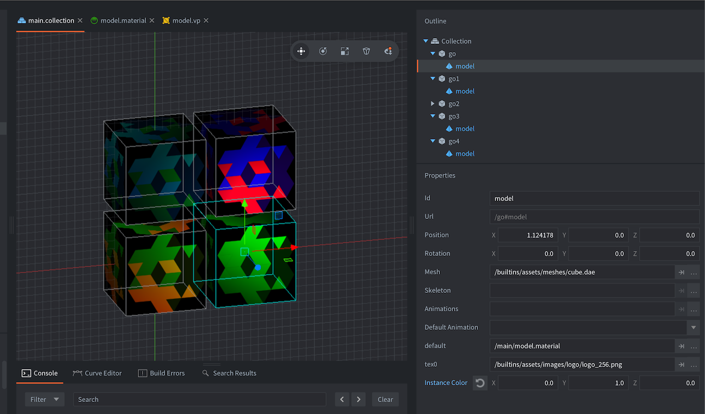
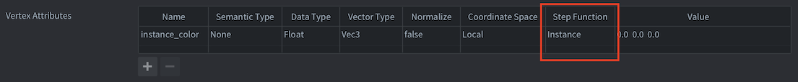
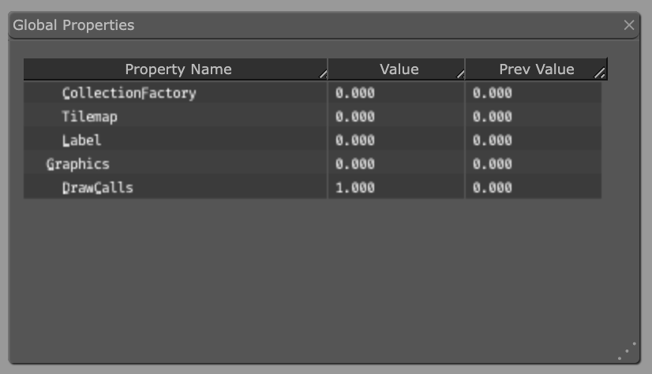

# Materials

Materials are used to express how a graphical component (a sprite, tilemap, font, GUI node, model etc) should be rendered.

A material holds _tags_, information that is used in the rendering pipeline to select objects to be rendered. It also holds references to _shader programs_ that are compiled through the available graphics driver and uploaded to the graphics hardware and run when the component is rendered each frame.

* For more information on the render pipeline, see the [Render documentation](/manuals/render).
* For an in depth explanation of shader programs, see the [Shader documentation](/manuals/shader).

## Creating a material

To create a material, <kbd>right click</kbd> a target folder in the *Assets* browser and select <kbd>New... ▸ Material</kbd>. (You can also select <kbd>File ▸ New...</kbd> from the menu, and then select <kbd>Material</kbd>). Name the new material file and press <kbd>Ok</kbd>.

{srcset="images/materials/material_file@2x.png 2x"}

The new material will open in the *Material Editor*.

{srcset="images/materials/material@2x.png 2x"}

The material file contains the following information:

Name
: The identity of the material. This name is used to list the material in the *Render* resource to include it in the build. The name is also used in the render API function `render.enable_material()`. The name should be unique.

Vertex Program
: The vertex shader program file (*.vp*) to use when rendering with the material. The vertex shader program is run on the GPU for each of a component's primitive vertices. It computes the screen position of each vertex and also optionally output "varying" variables that are interpolated and input to the fragment program.

Fragment Program
: The fragment shader program file (*.fp*) to use when rendering with the material. The program runs on the GPU for each of a primitive's fragments (pixels) and its purpose is to decide the color of each fragment. This is usually done by texture lookups and calculations based on input variables (varying variables or constants).

Vertex Constants
: Uniforms that will be passed to the vertex shader program. See below for a list of available constants.

Fragment Constants
: Uniforms that will be passed to the fragment shader program. See below for a list of available constants.

Samplers
: You can optionally configure specific samplers in the materials file. Add a sampler, name it according to the name used in the shader program and set the wrap and filter settings to your liking.

Tags
: The tags associated with the material. Tags are represented in the engine as a _bitmask_ that is used by [`render.predicate()`](/ref/render#render.predicate) to collect components that should be drawn together. See the [Render documentation](/manuals/render) on how to do that. The maximum number of tags you can use in a project is 32.

## Attributes

Shader attributes (also referred to as vertex streams, or vertex attributes), is a mechanism for how the GPU retrieves vertices from memory in order to render geometry. The vertex shader specifies a set of streams by using the `attribute` keyword and in most cases Defold produces and binds the data automatically under the hood based on the names of the streams. However, in some cases you might want to forward more data per vertex to achieve a specific effect that the engine does not produce. A vertex attribute can be configured with the following fields:

Name
: The attribute name. Similar to shader constants, the attribute configuration will only be used if it matches an attribute specified in the vertex program.

Semantic type
: A semantic type indicates the semantic meaning of *what* the attribute is and/or *how* it should be shown in the editor. For example, specifying an attribute with a `SEMANTIC_TYPE_COLOR` will show a color picker in the editor, while the data will still be passed in as-is from the engine to the shader.

  - `SEMANTIC_TYPE_NONE` The default semantic type. Does not have any other effect on the attribute other than passing the material data for the attribute directly to the vertex buffer (default)
  - `SEMANTIC_TYPE_POSITION` Produces per-vertex position data for the attribute. Can be used together with coordinate space to tell the engine how the positions will be calculated
  - `SEMANTIC_TYPE_TEXCOORD` Produces per-vertex texture coordinates for the attribute
  - `SEMANTIC_TYPE_PAGE_INDEX` Produces per-vertex page indices for the attribute
  - `SEMANTIC_TYPE_COLOR` Affects how the editor interprets the attribute. If an attribute is configured with a color semantic, a color picked widget will be shown in the inspector
  - `SEMANTIC_TYPE_NORMAL` Produces per-vertex normal data for the attribute
  - `SEMANTIC_TYPE_TANGENT` Produces per-vertex tangent data for the attribute
  - `SEMANTIC_TYPE_WORLD_MATRIX` Produces per-vertex world matrix data for the attribute
  - `SEMANTIC_TYPE_NORMAL_MATRIX` Produces per-vertex normal matrix data for the attribute

Data type
: The data type of the backing data for the attribute.

  - `TYPE_BYTE` Signed 8-bit byte values
  - `TYPE_UNSIGNED_BYTE` Unsigned 8-bit byte values
  - `TYPE_SHORT` Signed 16-bit short values
  - `TYPE_UNSIGNED_SHORT` Unsigned 16-bit short values
  - `TYPE_INT` Signed integer values
  - `TYPE_UNSIGNED_INT` Unsigned integer values
  - `TYPE_FLOAT` Floating point values (default)

Normalize
: If true, the attribute values will be normalized by the GPU driver. This can be useful when you don't need full precision, but want to calculate something without knowing the specific limits. E.g a color vector typically only need byte values of 0..255 while still being treated as a 0..1 value in the shader.

Coordinate space
: Some semantic types support supplying data in different coordinate spaces. To implement a billboarding effect with sprites, you typically want a position attribute in local space as well as a fully transformed position in world space for most effective batching.

Vector type
: The vector type of the attribute.

  - `VECTOR_TYPE_SCALAR` Single scalar value
  - `VECTOR_TYPE_VEC2` 2D vector
  - `VECTOR_TYPE_VEC3` 3D vector
  - `VECTOR_TYPE_VEC4` 4D vector (default)
  - `VECTOR_TYPE_MAT2` 2D matrix
  - `VECTOR_TYPE_MAT3` 3D matrix
  - `VECTOR_TYPE_MAT4` 4D matrix

Step function
: Specifies how the attribute data should be presented to the vertex function. This is only relevant for instancing.

  - `Vertex` Once per vertex, e.g a position attribute will typically be given to the vertex function per vertex in the mesh (default)
  - `Instance` Once per instance, e.g a world matrix attribute will typically be given to the vertex function once per instance

Value
: The value of the attribute. Attribute values can be overridden on a per-component basis, but otherwise this will act as the default value of the vertex attribute. Note: for *default* attributes (position, texture coordinates and page indices) the value will be ignored.

::: sidenote
Custom attributes can also be used to trim memory footprint on both CPU and GPU by reconfiguring the streams to use a smaller data type, or a different element count.
:::

### Default attribute semantics

The material system will assign a default semantic type automatically based on the name of the attribute in run-time for a specific set of names:

  - `position` - semantic type: `SEMANTIC_TYPE_POSITION`
  - `texcoord0` - semantic type: `SEMANTIC_TYPE_TEXCOORD`
  - `texcoord1` - semantic type: `SEMANTIC_TYPE_TEXCOORD`
  - `page_index` - semantic type: `SEMANTIC_TYPE_PAGE_INDEX`
  - `color` - semantic type: `SEMANTIC_TYPE_COLOR`
  - `normal` - semantic type: `SEMANTIC_TYPE_NORMAL`
  - `tangent` - semantic type: `SEMANTIC_TYPE_TANGENT`
  - `mtx_world` - semantic type: `SEMANTIC_TYPE_WORLD_MATRIX`
  - `mtx_normal` - semantic type: `SEMANTIC_TYPE_NORMAL_MATRIX`

If you have entries for these attributes in the material, the default semantic type will be overridden with whatever you have configured in the material editor.

### Setting custom vertex attribute data

Similar to user defined shader constants, you can also update vertex attributes in runtime by calling go.get, go.set and go.animate:


```lua
go.set("#sprite", "tint", vmath.vector4(1,0,0,1))

go.animate("#sprite", "tint", go.PLAYBACK_LOOP_PINGPONG, vmath.vector4(1,0,0,1), go.EASING_LINEAR, 2)
```

There are some caveats to updating the vertex attributes however, wether or not a component can use the value depends on the semantic type of the attribute. For example, a sprite component supports the `SEMANTIC_TYPE_POSITION` so if you update an attribute that has this semantic type, the component will ignore the overridden value since the semantic type dictates that the data should always be produced by the sprites position.

::: sidenote
Setting custom vertex data in runtime is currently only supported for sprite components.
:::

### Instancing

Instancing is a technique used to efficiently draw multiple copies of the same object in a scene. Instead of creating a separate copy of the object each time it's used, instancing allows the graphics engine to create a single object and then reuse it multiple times. For example, in a game with a large forest, instead of creating a separate tree model for each tree, instancing allows you to create one tree model and then place it hundreds or thousands of times with different positions and scales. The forest can now be rendered with a single draw call instead of individual draw calls for each tree.

::: sidenote
Instancing is currently only available for Model components.
:::

Instancing is enabled automatically when possible. Defold heavily relies on batching the draw state as much as possible - for instancing to work some requirements must be met:

- The same material must be used for all instances. Instancing will still work if a custom material has been set by `render.enable_material`)
- The material must be configured to use the 'local' vertex space
- The material must have at least one vertex attribute that is repeated per instance
- Constant values must be the same for all instances. Constant values can be put into custom vertex attributes or some other backing method instead (e.g a texture)
- Shader resources, such as textures or storage buffers, must be the same for all instances

Configuring a vertex attribute to be repeated per instance requires that the `Step function` is set to `Instance`. This is done automatically for certain semantic types based on name (see the `Default attribute semantics` table above), but it can also be set manually in the material editor by setting the `Step function` to `Instance`.

As a simple example, the following scene has four gameobjects with a model component each:

{srcset="images/materials/instancing-setup@2x.png 2x"}

The material is configured as such, with a single custom vertex attribute that is repeated per instance:

{srcset="images/materials/instancing-material@2x.png 2x"}

The vertex shader has multiple per-instance attributes specified:

```glsl
// Per vertex attributes
attribute highp vec4 position;
attribute mediump vec2 texcoord0;
attribute mediump vec3 normal;

// Per instance attributes
attribute mediump mat4 mtx_world;
attribute mediump mat4 mtx_normal;
attribute mediump vec4 instance_color;
```

Note that the mtx_world and mtx_normal will be configured to use the step function `Instance` by default. This can be changed in the material editor by adding an entry for them and setting the `Step function` to `Vertex`, which will make the attribute be repeated per vertex instead of per instance.

To verify that the instancing works in this case, you can look at the web profiler. In this case, since the only thing that changes between the instances of the box is the per-instance attributes, it can be rendered with a single draw call:

{srcset="images/materials/instancing-draw-calls@2x.png 2x"}

## Vertex and fragment constants

Shader constants, or "uniforms" are values that are passed from the engine to vertex and fragment shader programs. To use a constant you define it in the material file as either a *Vertex Constant* property or a *Fragment Constant* property. Corresponding `uniform` variables need to be defined in the shader program. The following constants can be set in a material:

CONSTANT_TYPE_WORLD
: The world matrix. Use to transform vertices into world space. For some component types, the vertices are already in world space when they arrive to the vertex program (due to batching). In those cases multiplying with the world matrix in the shader will yield the wrong results.

CONSTANT_TYPE_VIEW
: The view matrix. Use to transform vertices to view (camera) space.

CONSTANT_TYPE_PROJECTION
: The projection matrix. Use to transform vertices to screen space.

CONSTANT_TYPE_VIEWPROJ
: A matrix with the view and projection matrices already multiplied.

CONSTANT_TYPE_WORLDVIEW
: A matrix with the world and view matrices already multiplied.

CONSTANT_TYPE_WORLDVIEWPROJ
: A matrix with the world, view and projection matrices already multiplied.

CONSTANT_TYPE_NORMAL
: A matrix to compute normal orientation. The world transform might include non-uniform scaling, which breaks the orthogonality of the combined world-view transform. The normal matrix is used to avoid issues with the direction when transforming normals. (The normal matrix is the transpose inverse of the world-view matrix).

CONSTANT_TYPE_USER
: A vector4 constant that you can use for any custom data you want to pass into your shader programs. You can set the initial value of the constant in the constant definition, but it is mutable through the functions [go.set()](/ref/stable/go/#go.set) / [go.animate()](/ref/stable/go/#go.animate). You can also retrieve the value with [go.get()](/ref/stable/go/#go.get). Changing a material constant of a single component instance [breaks render batching and will result in additional draw calls](/manuals/render/#draw-calls-and-batching).

Example:

```lua
go.set("#sprite", "tint", vmath.vector4(1,0,0,1))

go.animate("#sprite", "tint", go.PLAYBACK_LOOP_PINGPONG, vmath.vector4(1,0,0,1), go.EASING_LINEAR, 2)
```

CONSTANT_TYPE_USER_MATRIX4
: A matrix4 constant that you can use for any custom data you want to pass into your shader programs. You can set the initial value of the constant in the constant definition, but it is mutable through the functions [go.set()](/ref/stable/go/#go.set) / [go.animate()](/ref/stable/go/#go.animate). You can also retrieve the value with [go.get()](/ref/stable/go/#go.get). Changing a material constant of a single component instance [breaks render batching and will result in additional draw calls](/manuals/render/#draw-calls-and-batching).

Example:

```lua
go.set("#sprite", "m", vmath.matrix4())
```

::: sidenote
In order for a material constant of type `CONSTANT_TYPE_USER` or `CONSTANT_TYPE_MATRIX4` to be available using `go.get()` and `go.set()` it has to be used in the shader program. If the constant is defined in the material but not used in the program it will be removed from the material and it will not be available at run-time.
:::

## Samplers

Samplers are used to sample the color information from a texture (a tile source or atlas). The color information can then be used for calculations in the shader program.

Sprite, tilemap, GUI and particle effect components automatically gets a `sampler2D` set. The first declared `sampler2D` in the shader program is automatically bound to the image referenced in the graphics component. Therefore there is currently no need to specify any samplers in the materials file for those components. Furthermore, those component types currently only support a single texture. (If you need multiple textures in a shader, you can use [`render.enable_texture()`](/ref/render/#render.enable_texture) and set texture samplers manually from your render script.)

{srcset="images/materials/sprite_sampler@2x.png 2x"}

```glsl
-- mysprite.fp
varying mediump vec2 var_texcoord0;
uniform lowp sampler2D MY_SAMPLER;
void main()
{
    gl_FragColor = texture2D(MY_SAMPLER, var_texcoord0.xy);
}
```

You can specify a component's sampler settings by adding the sampler by name in the materials file. If you don't set up your sampler in the materials file, the global *graphics* project settings are used.

{srcset="images/materials/my_sampler@2x.png 2x"}

For model components, you need to specify your samplers in the material file with the settings you want. The editor will then allow you to set textures for any model component that use the material:

{srcset="images/materials/model_samplers@2x.png 2x"}

```glsl
-- mymodel.fp
varying mediump vec2 var_texcoord0;
uniform lowp sampler2D TEXTURE_1;
uniform lowp sampler2D TEXTURE_2;
void main()
{
    lowp vec4 color1 = texture2D(TEXTURE_1, var_texcoord0.xy);
    lowp vec4 color2 = texture2D(TEXTURE_2, var_texcoord0.xy);
    gl_FragColor = color1 * color2;
}
```

{srcset="images/materials/model@2x.png 2x"}

## Sampler settings

Name
: The name of the sampler. This name should match the `sampler2D` declared in the fragment shader.

Wrap U/W
: The wrap mode for the U and V axes:

  - `WRAP_MODE_REPEAT` will repeat texture data outside the range [0,1].
  - `WRAP_MODE_MIRRORED_REPEAT` will repeat texture data outside the range [0,1] but every second repetition is mirrored.
  - `WRAP_MODE_CLAMP_TO_EDGE` will set texture data for values greater than 1.0 to 1.0, and any values less than 0.0 is set to 0.0---i.e. the edge pixels will be repeated to the edge.

Filter Min/Mag
: The filtering for magnification and minification. Nearest filtering requires less computation than linear interpolation, but can result in aliasing artifacts. Linear interpolation often provides smoother results:

  - `Default` uses the default filter option specified in the `game.project` file under `Graphics`  as `Default Texture Min Filter` and `Default Texture Mag Filter` .
  - `FILTER_MODE_NEAREST` uses the texel with coordinates nearest the center of the pixel.
  - `FILTER_MODE_LINEAR` sets a weighted linear average of the 2x2 array of texels that lie nearest to the center of the pixel.
  - `FILTER_MODE_NEAREST_MIPMAP_NEAREST` chooses the nearest texel value within an individual mipmap.
  - `FILTER_MODE_NEAREST_MIPMAP_LINEAR` selects the nearest texel in the two nearest best choices of mipmaps and then interpolates linearly between these two values.
  - `FILTER_MODE_LINEAR_MIPMAP_NEAREST` interpolates linearly within an individual mipmap.
  - `FILTER_MODE_LINEAR_MIPMAP_LINEAR` uses linear interpolation to compute the value in each of two maps and then interpolates linearly between these two values.

Max Anisotropy
: Anisotropic filtering is an advanced filtering technique that takes multiple samples, blending the results together. This setting controls the level of anisotropy for the texture samplers. If anisotropic filtering is not supported by the GPU the parameter will not do anything, and it will be set to 1 as default.

## Constants buffers

When the rendering pipeline draws, it pulls constant values from a default system constants buffer. You can create a custom constants buffer to override the default constants and instead set shader program uniforms programmatically in the render script:

```lua
self.constants = render.constant_buffer() -- <1>
self.constants.tint = vmath.vector4(1, 0, 0, 1) -- <2>
...
render.draw(self.my_pred, {constants = self.constants}) -- <3>
```
1. Create a new constants buffer
2. Set the `tint` constant to bright red
3. Draw the predicate using our custom constants

Note that the buffer's constant elements are referenced like an ordinary Lua table, but you can't iterate over the buffer with `pairs()` or `ipairs()`.
