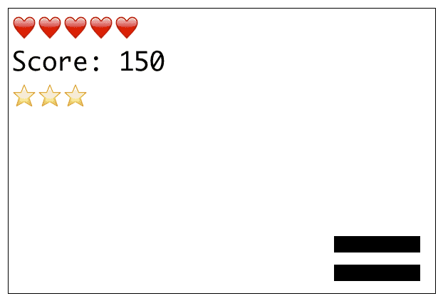
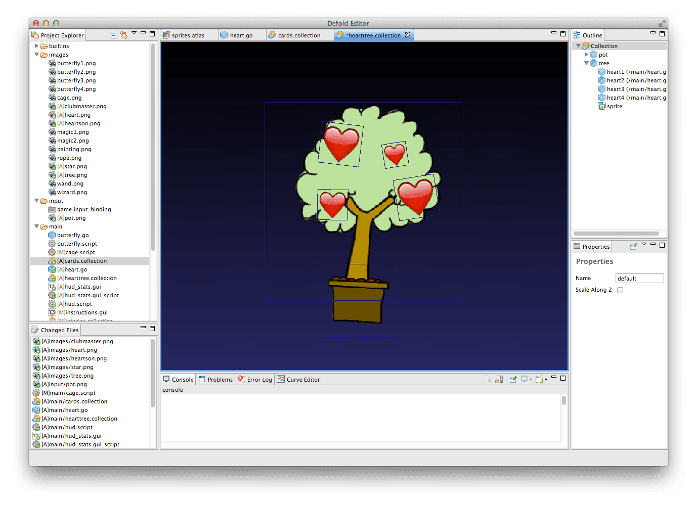

# Message passing

Message passing is the mechanism used by Defold to permit objects to communicate without creating dependencies between them. This manual assumes that you have a basic understanding of *Game Objects*, *Components* and *Collections*.

When programming it is generally best to couple all objects, code modules or components [as loosely as possible](http://en.wikipedia.org/wiki/Loose_coupling). Any object that has a dependency to the inner workings of another object is considered to be _tightly coupled_ and such coupling often lead to code that is harder to maintain and is a common source of bugs---some of which can be very hard to track down.

Defold's Lua integration does not provide object orientation in the sense that you define your application by setting up class hierarchies with inheritance (like Java, C++ or C#). Instead, Defold extends Lua with a simple and powerful object oriented design with the following characteristics:

* [Message passing](/manuals/message-passing) to communicate between objects.
* All objects have their own internal state, their own memory that they control. This is done through the `self` reference.
* You can send _any_ message to any existing object and it is up to your code how to respond to the message. This is done through the `on_message()` function. If your code does not contain code for a particular message, nothing happens.

## Addressing and URLs

Every object in Defold is uniquely addressed through a URL (Uniform Resource Locator). The address is set at compile time and stays fixed throughout  the object’s lifetime. This means that if you save the address to an object it will stay valid for as long as the object exists; you never have to worry about updating object references that you store.

When you organize your project, you add game objects into a hierarchy of collections. In its simplest form it’s a set of game objects directly under the top level collection, but often you would want to group things a bit more. For instance, suppose you have a simple game consisting of:

* A level collection containing a hero player character and one enemy
* And an on-screen interface

Here's a typical structure for that:


This game consists of:

- Two collections with id:s "main" and "level". "level" is placed inside "main".
- Three game objects with id:s "hero", "enemy" and "interface".
- "interface" is placed in "main".
- "hero" and "enemy" are placed in "level".
- Each game object in the example contains two components:
    - Game objects "hero" and "enemy" contains one script component "brain" and one sprite "body".
    - Game object "interface" contains one script component "control" and one GUI component "gui".
    - The "gui" component in "interface" has a GUI script attached to it.

Some of this game content will live in separate files in the project. For instance, collections are always stored in files so you will at least have one file for "main" collection and one for "level" collection. However, _this does not matter_. It's _really_ important to realize that file names and the location of files in your project folder is totally irrelevant. The two things that matter for addressing are:

1. The id you assign something
2. In what collection you put it

The Defold editor will automatically assign unique id:s within the current collection when you place a collection or game object. You can change these names to whatever you like--the editor will keep track of the id:s and make sure that names don't collide. If you force a name collision, the Defold editor will signal an error.

All addresses are expressed by a *URL* that uniquely identify each message sender and receiver in the running game. The URL consists of three components and is written in the following generic format:

`[socket:][path][#fragment]`

For most cases, these URL components are used to designate game objects and components, but the format is general.

socket
: Identifies which "world" the sender or receiver lives in. This is important when working with [Collection Proxies](/manuals/collection-proxy) and is then used to identify the _dynamically loaded collection_.

path
: This part of the URL usually contain the full id of the target _game object_.

fragment
: The id of the target _component_ within the specified game object.


The full URL string for the script in the "hero" game object above is then:

`main:/level/hero#brain`

and we can send messages to it like this:

```lua
-- Send "hello" to the script in "enemy"
msg.post("main:/level/enemy#brain", "hello")
```

If you send a message to an unknown recipient, Defold will signal an error in the console.

```txt
ERROR:GAMEOBJECT: Instance '/level/enemy' could not be found when dispatching message 'hello' sent from default:/level/hero#brain
```

In most cases, the above way of writing full URL:s is unnecessary and way too specific. Let's instead look at 3 more common examples of how to write messages in our example game:


Message 1
: A `knock` message is sent from the "hero" script component to the "enemy" script component. Since both objects live in the same place in the collection hierarchy, their sockets ("world", root, or main collection) are the same. We can leave out that piece of information which gives the following call:

  ```lua
  -- Send "knock" from the script component in "hero" to script in "enemy"
  msg.post("/level/enemy#brain", "knock")
  ```

  By not specifying a socket part of the URL, the message is assumed to be sent to a receiver in the _same_ socket as the sender. Defold allows us to take this one step further and leave out portions of the _id_ in the path part of the URL too. Any path that starts with "/" is _absolute_. It always start from the root of the socket (usually the main collection) and must contain the full hierarchical "path" down to the game object which is reflected in the object's id. Since the id:s of "hero" and "enemy" are "/level/hero" and "/level/enemy" respectively we are allowed to eliminate the "level" part and write a _relative_, or partial, id:

  ```lua
  -- Send "knock" from the script component in "hero" to script in "enemy"
  msg.post("enemy#brain", "knock")
  ```

  Notice that we do _not_ write "/enemy#brain" with a "/" at the front. Adding an initial "/" would lead to us trying to address a game object "enemy" at the root of collection "main" and no such object exists. Now, what would happen if we leave out the fragment part of the URL?

  ```lua
  -- Send "hello" from the script component in "hero" to "enemy"
  msg.post("enemy", "knock")
  ```

  This is perfectly valid. By leaving out the target component, the message is _broadcast_ to all components in the specified game object. We encourage though that you do specify the component, mainly because broadcasting is less performant but also because it can lead to obscure bugs.

Message 2
: A `increase_score` message is sent from the "hero" game object's script component to the script component of the "interface" game object.

  ```lua
  -- Send "increase_score" from the script component in "hero" to script component in "interface"
  msg.post("/interface#controller", "increase_score")
  ```

  In this case it's not possible to write a relative id. From the point of view of "hero", we must write an absolute, full id (filesystem-like notation like "../interface" is _not_ allowed). However, if the script in "interface" would like to send a message back, a relative path is possible:

  ```lua
  -- Send "increase_score_response" from the script component in "interface" to script in "hero"
  msg.post("level/hero#brain", "increase_score_response")
  ```

  Again, notice the lack of initial "/". By using a relative id, the sender and receiver will be able to communicate wherever they live in the collection hierarchies, which is vital when building objects and object hierarchies that are instanced multiple times or dynamically spawned.

Message 3
: A `update_minimap` message is sent from the "enemy" game object to the "gui" script in the "interface" game object.

  ```lua
  -- Send "update_minimap" from the script component in "enemy" to the GUI script in "interface".
  msg.post("/interface#gui", "update_minimap")
  ```

  Here is another case where we cannot specify a relative URL. Instead we have to write the full id of the "interface" object and direct the message to the "gui" component. Script and GUI components are the only game object components that have Lua script associated with them. They can react to arbitrary messages. It is important to remember that GUI scripts must be added to the GUI scene that you add as a component to the game object. Messages between GUI scripts and other scripts works exactly the same way.

## Shorthands

We have seen how it is possible to leave out redundant information from the URL:s when constructing messages. In addition, Defold provides two handy shorthands that you can use:

`.`
: A URL shorthand for the current game object.

`#`
: A URL shorthand for the current script.

For example:

```lua
 -- Let this game object acquire input focus
 msg.post(".", "acquire_input_focus")
```

```lua
 -- Post "reset" to this script
 msg.post("#", "reset")
```

## A concrete example

Consider this simple example: suppose that your game features a HUD with a set of on screen elements like stats (health, score and number of bonus stars). The HUD is controlled by a game object "hud".



We want to be able to increase and decrease health and we do that by sending a message to the "hud" object's script component:

```lua
msg.post("hud#script", "increase_health")
```

This will post a message with the id (or name) `increase_health` to the recipient component "script" in the object "hud". Defold will deliver the message the next time messages are dispatched, which happens within the current frame.

It is then up to the code assigned to the "hud" game object to respond to that message by increasing the score in a nicely presented manner.

```lua
-- file: hud.script
function on_message(self, message_id, message, sender)
    if message_id == hash("increase_health") then
        -- Let’s add one heart to the HUD with flashy animations.
        ...
    end
end
```

## Message data

The complete signature of the `msg.post()` call is:

`msg.post(receiver, message_id[, message])`

For convenience we add a message that sets all information on the HUD in one go. We name the message `set_stats` and attach new data in the `message` parameter:

```lua
-- Send table data in message.
msg.post("hud#script", "set_stats", { score = 100, stars = 2, health = 4 })
```

The call adds a `message` parameter with additional data to the message. The argument is optional and should be a Lua table, with key-value pairs inside curly braces. Almost any type of data can be included in the message Lua table. You can pass numbers, strings, booleans, URL:s, hashes and nested tables. You can not, however, pass functions.

```lua
-- Send table data containing a nested table
local invtable = { sword = true, shield = true, bow = true, arrows = 9 }
local msgdata = { score = 100, stars = 2, health = 4, inventory = invtable }
msg.post("hud#script", "set_stats", msgdata)
```

::: sidenote
There is a hard limit to the `message` parameter table size. This limit is set to 2 kilobytes. There is currently no trivial way to figure out the exact memory size a table consumes but you can use `collectgarbage("count")` at before and after inserting the table to monitor memory use.
:::

## on_message()

The `on_message()` function takes four parameters:

`self`
: A reference to the script component itself.

`message_id`
: Contains the name of the message. The name is _hashed_.

`message`
: Contains the message data. This is a Lua table.

`sender`
: Contains the full URL of the sender.

```lua
function on_message(self, message_id, message, sender)
    -- Print message id
    print(message_id)
    -- Print the message data (table, that's why we use pprint!)
    pprint(message)
    -- Print sender
    print(sender)
end
```

The console output shows the message, data and sender:

```txt
DEBUG:SCRIPT: hash: [set_stats]
DEBUG:SCRIPT: 
{
  health = 4,
  stars = 2,
  score = 100,
}
DEBUG:SCRIPT: url: [main:/game_controller#script]
```

Here is an example on how a "hud" game object might implement a simple version of `set_stats`:

```lua
function init(self)
    -- Duplicate GUI nodes for hearts x 10 and stars x 10
    self.heart_nodes = {}
    self.star_nodes = {}
    local heart_node = gui.get_node("heart")
    local star_node = gui.get_node("star")

    -- Store all nodes in a table for easy access
    table.insert(self.heart_nodes, heart_node)
    -- Start with the nodes disabled
    gui.set_enabled(heart_node, false)

    for i = 1, 9 do
        local clone = gui.clone(heart_node)
        local pos = gui.get_position(heart_node)
        pos.x = pos.x + i * 32
        gui.set_position(clone, pos)
        table.insert(self.heart_nodes, clone)
        gui.set_enabled(clone, false)
    end
    table.insert(self.star_nodes, star_node)
    gui.set_enabled(star_node, false)
    for i = 1, 9 do
        local clone = gui.clone(star_node)
        local pos = gui.get_position(star_node)
        pos.x = pos.x + i * 32
        gui.set_position(clone, pos)
        table.insert(self.star_nodes, clone)
        gui.set_enabled(clone, false)
    end
end

function on_message(self, message_id, message, sender)
    if message_id == hash("set_stats") then
        -- Update the score GUI node
        gui.set_text(gui.get_node("score"), message.score)
        -- Enable the right number of heart nodes
        for i = 1, message.health do
            gui.set_enabled(self.heart_nodes[i], true)
        end
        -- Enable the right number of star nodes
        for i = 1, message.stars do
            gui.set_enabled(self.star_nodes[i], true)
        end
    end
end
```

## Child-parent vs. collection-object hierarchies

We have seen how object addressing via paths is static in Defold meaning that when you code your game logic you can always trust the integrity of object’s id.

Object parent-child hierarchies is a dynamic relation affecting how objects react to transformations. Any transformation applied to an object will in turn be applied to the object’s children. You can alter an object’s parent in run-time by sending `set_parent` messages.

```lua
local parent = go.get_id("tree")
msg.post(".", "set_parent", { parent_id = parent })
```

Parent-child hierarchies can also be set up the editor, and will still be dynamic. Let’s, for example, build a tree with hearts in it. It will consist of a “tree” object and a number of “heart” objects. We also have a “pot” in where the tree lives. First we have to place these objects in a collection in order to make them parent and child. We're calling this collection “hearttree”. Then we can simply drag the heart objects onto the tree object to child them:



By making the hearts children of the tree, they will be affected by any _transformations_ we do to the tree, just as if they were parts of the tree object. So if you animate the tree to sway back and forth, the hearts will follow the animation.

::: important
Note that the paths to the heart objects inside the "hearttree" collection are unaffected by the dynamic parent-child relation we set up:

- `/hearttree/heart1` (_Not_ `/hearttree/tree/heart1`)
- `/hearttree/heart2`
- `/hearttree/heart3`
- `/hearttree/heart4`

The parent-child relationship is separate from the address of the object within the collection hierarchy. Thus, the parent-child relationship is _in no way_ reflected in the URL of an object.
:::

## Constructing URLs

In rare situations you might find the need to build URL objects programmatically. You can do it like this:

```lua
local my_url = msg.url()
my_url.socket = "main" -- specify by valid name
my_url.path = hash("/hearttree/tree") -- specify as string or hash
my_url.fragment = "script" -- specify as string or hash
msg.post(my_url, "grow")
```

Inspecting the URL and its components:

```lua
print(my_url) --> url: [main:/hearttree/tree#script]
print(my_url.socket) --> 786443 (internal numeric value)
print(my_url.path) --> hash: [/hearttree/tree]
print(my_url.fragment) --> hash: [script]
```

## System sockets

Defold uses sockets for communicating with certain engine subsystems. Those are:

- `@physics:`
- `@render:`
- `@system:`

Note that all are sockets with no path nor fragment.

For instance, you can toggle the system profiler by sending a message `msg.post("@system:", "toggle_profile")`

## Collection Proxies

When Defold starts up it will automatically load and initiate the collection specified in the *main_collection* parameter under *bootstrap* in the game project settings.

You might want to load different collections dynamically and, for example, keep different game levels in separate collections. Defold uses a specific collection proxy object that acts as proxy for a collection that can be loaded dynamically.

Suppose that we add a collection proxy object and set it to represent some collection that we have named "level". We can then load the collection by sending a message to the proxy:


```lua
msg.post("/loader#levelproxy", "load")
```

When the collection has loaded we get a message back and can initiate and start sending messages to the other top level collection:

```lua
function on_message(self, message_id, message, sender)
    if message_id == hash("proxy_loaded") then
        -- The collection has loaded and it's time to enable it.
        msg.post(sender, "enable")
        -- Send a message to someone in the loaded collection
        msg.post("level:/gamemaster#script", "wake_up")
    end
end
```

When we send message between top level collections like this, we have to use the socket field of the URL to designate the collection the target object resides in.

::: sidenote
A more in depth description can be found in the [Collection Proxies](/manuals/collection-proxy) documentation.
:::

## Message chains

When posted messages are dispatched and the recipients’ `on_message()` is called, it is common that you post new messages in your reaction code. You can build long chains of messaging that the engine has to dispatch. When does this happen?

The short answer is that the dispatching happens immediately. The engine has started dispatching messages and will continue to do so until the message queue is empty---even if you continue to fill the queue by posting new messages.

There is, however, a hard limit to how many times the engine tries to empty the queue, which effectively puts a limit to how long message chains you can expect to be fully dispatched within a frame. You can easily test how many dispatch passes the engine performs between each `update()` with the following script:

```lua
function init(self)
    -- We’re starting a long message chain during object init
    -- and keeps it running through a number of update() steps.
    print("INIT")
    msg.post("#", "msg")
    self.updates = 0
    self.count = 0
end

function update(self, dt)
    if self.updates < 5 then
        self.updates = self.updates + 1
        print("UPDATE " .. self.updates)
        print(self.count .. " dispatch passes before this update.")
        self.count = 0
    end
end

function on_message(self, message_id, message, sender)
    if message_id == hash("msg") then
        self.count = self.count + 1
        msg.post("#", "msg")
    end
end
```

Running this script will print something like the following:

```txt
DEBUG:SCRIPT: INIT
INFO:ENGINE: Defold Engine 1.2.36 (5b5af21)
DEBUG:SCRIPT: UPDATE 1
DEBUG:SCRIPT: 10 dispatch passes before this update.
DEBUG:SCRIPT: UPDATE 2
DEBUG:SCRIPT: 75 dispatch passes before this update.
DEBUG:SCRIPT: UPDATE 3
DEBUG:SCRIPT: 75 dispatch passes before this update.
DEBUG:SCRIPT: UPDATE 4
DEBUG:SCRIPT: 75 dispatch passes before this update.
DEBUG:SCRIPT: UPDATE 5
DEBUG:SCRIPT: 75 dispatch passes before this update.
``

We see that this particular Defold engine version performs 10 dispatch passes on the message queue between `init()` and the first call to `update()`. It then performs 75 passes during each subsequent update loop.

