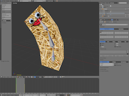

# 3D model animation

Model components can play skeletal animations and morph target animations imported from glTF files. Skeletal animation uses the bones of the model to apply deformation to vertices in the model. Morph target animation, also known as blend shape animation, changes the shape of the model by animating weights for alternate vertex positions.

For details on how to import 3D data into a Model for animation, see the [Model documentation](/manuals/model).

  
  


## Playing animations

Models are animated with the [`model.play_anim()`](/ref/model#model.play_anim) function:

```lua
function init(self)
    -- Start the "wiggle" animation back and forth on #model
    model.play_anim("#model", "wiggle", go.PLAYBACK_LOOP_PINGPONG)
end
```

::: important
Defold currently supports only baked skeletal animations. Skeletal animations need to have matrices for each animated bone each keyframe, and not position, rotation and scale as separate keys.

Animations are also linearly interpolated. If you do more advanced curve interpolation the animations needs to be prebaked from the exporter.
:::

### Morph targets

Morph targets are alternative shapes for the same mesh. Each target stores position, normal and tangent deltas, and each target has a blend weight that controls how much of that shape is applied. A weight of `0` means that the target has no effect, while a weight of `1` applies the full target shape. Values outside that range can also be useful for exaggerated effects if the shader and asset are authored for it.

Defold imports morph targets and initial morph weights from glTF model data. glTF animations that animate morph weights are imported into the model animation set and can be played with [`model.play_anim()`](/ref/model#model.play_anim), just like skeletal animations:

```lua
function init(self)
    model.play_anim("#model", "smile", go.PLAYBACK_LOOP_FORWARD)
end
```

Morph target data can be used on its own or together with skeletal animation, but a model component can only play one model animation at a time. This means that you cannot play one skeletal animation and one separate morph target animation at the same time using `model.play_anim()`. If a model has animation data but no skeleton, only morph target animation data will be used.

You can still combine skeletal animation playback with morph target changes that come from other sources, for example by setting morph target weights from script with `model.set_blend_weights()`.

You can also read and override morph target weights from script. [`model.get_blend_weights()`](/ref/model#model.get_blend_weights) returns the current weights for the first mesh in the model that has morph targets. [`model.set_blend_weights()`](/ref/model#model.set_blend_weights) applies a script override to every morphed mesh in the model:

```lua
function init(self)
    local weights = model.get_blend_weights("#model")
    weights[1] = 0.75
    weights[2] = 0.25
    model.set_blend_weights("#model", weights)
end
```

The weight table uses one-based Lua indices in the same order as the morph targets in the mesh. Extra values are ignored, and missing values are treated as zero for meshes with more morph targets than the table contains. The script override is applied after animation every frame until it is cleared:

```lua
model.set_blend_weights("#model")     -- clear the override
model.set_blend_weights("#model", nil) -- also clears the override
```

### Shader support

To render morph targets, the model material vertex shader needs to sample the generated `morph_targets` texture and apply the weighted deltas to the vertex data. The morph target texture is a 2D array texture where each morph target uses three array layers: position delta, normal delta and tangent delta.

The engine provides the current morph weights to a vertex shader uniform named `morph_targets_weights`. Each `vec4` stores four weights, so `morph_targets_weights[2]` has room for eight morph targets.

The following example shows the relevant vertex shader parts for a non-instanced model material:

```glsl
#version 140

in highp vec4 position;
in mediump vec2 texcoord0;
in mediump vec3 normal;
in mediump vec4 tangent;

out mediump vec2 var_texcoord0;
out mediump vec3 var_normal;
out mediump vec4 var_tangent;

uniform vs_uniforms
{
    mediump mat4 mtx_worldview;
    mediump mat4 mtx_proj;
    mediump mat4 mtx_normal;
    // Each vec4 stores four blend weights. Use morph_targets_weights[1]
    // for up to 4 morph targets, [2] for up to 8, [3] for up to 12, etc.
    mediump vec4 morph_targets_weights[2];
};

uniform sampler2DArray morph_targets;

vec2 get_morph_uv(int vertex_index, int width, int height)
{
    int x = vertex_index % width;
    int y = vertex_index / width;
    return vec2(
        (float(x) + 0.5) / float(width),
        (float(y) + 0.5) / float(height)
    );
}

void apply_morph_target(vec2 uv, float weight, int target,
    inout vec3 position_delta, inout vec3 normal_delta, inout vec3 tangent_delta)
{
    if (weight == 0.0) {
        return;
    }

    int position_layer = target * 3 + 0;
    int normal_layer = target * 3 + 1;
    int tangent_layer = target * 3 + 2;

    position_delta += weight * texture(morph_targets, vec3(uv, position_layer)).xyz;
    normal_delta += weight * texture(morph_targets, vec3(uv, normal_layer)).xyz;
    tangent_delta += weight * texture(morph_targets, vec3(uv, tangent_layer)).xyz;
}

void get_morph_target_data(int vertex_index,
    out vec3 position_delta, out vec3 normal_delta, out vec3 tangent_delta)
{
    position_delta = vec3(0.0);
    normal_delta = vec3(0.0);
    tangent_delta = vec3(0.0);

#ifndef EDITOR
    ivec3 texture_size = textureSize(morph_targets, 0);
    vec2 uv = get_morph_uv(vertex_index, texture_size.x, texture_size.y);

    apply_morph_target(uv, morph_targets_weights[0].x, 0, position_delta, normal_delta, tangent_delta);
    apply_morph_target(uv, morph_targets_weights[0].y, 1, position_delta, normal_delta, tangent_delta);
    apply_morph_target(uv, morph_targets_weights[0].z, 2, position_delta, normal_delta, tangent_delta);
    apply_morph_target(uv, morph_targets_weights[0].w, 3, position_delta, normal_delta, tangent_delta);
    apply_morph_target(uv, morph_targets_weights[1].x, 4, position_delta, normal_delta, tangent_delta);
    apply_morph_target(uv, morph_targets_weights[1].y, 5, position_delta, normal_delta, tangent_delta);
    apply_morph_target(uv, morph_targets_weights[1].z, 6, position_delta, normal_delta, tangent_delta);
    apply_morph_target(uv, morph_targets_weights[1].w, 7, position_delta, normal_delta, tangent_delta);
#endif
}

void main()
{
    vec3 position_delta;
    vec3 normal_delta;
    vec3 tangent_delta;
    get_morph_target_data(gl_VertexIndex, position_delta, normal_delta, tangent_delta);

    vec3 morphed_position = position.xyz + position_delta;
    vec3 morphed_normal = normalize(normal + normal_delta);
    vec3 morphed_tangent = normalize(tangent.xyz + tangent_delta);

    var_texcoord0 = texcoord0;
    var_normal = normalize((mtx_normal * vec4(morphed_normal, 0.0)).xyz);
    var_tangent = vec4(normalize((mtx_normal * vec4(morphed_tangent, 0.0)).xyz), tangent.w);

    gl_Position = mtx_proj * mtx_worldview * vec4(morphed_position, 1.0);
}
```

The `#ifndef EDITOR` wrapper is needed because model animation preview is not available in the editor yet, so the generated morph target texture data is only available at runtime. Increase the `morph_targets_weights` array size and add more `apply_morph_target()` calls if the mesh has more morph targets.

::: important
The shader example above uses `textureSize()` and does not work on OpenGL ES 2.0.
:::

### The bone hierarchy

The bones in the Model skeleton are represented internally as game objects.

You can retrieve the instance id of the bone game object in runtime. The function [`model.get_go()`](/ref/model#model.get_go) returns the id of the game object for the specified bone.

```lua
-- Get the middle bone go of our wiggler model
local bone_go = model.get_go("#wiggler", "Bone_002")

-- Now do something useful with the game object...
```

### Cursor animation

In addition to using the `model.play_anim()` to advance a model animation, *Model* components expose a "cursor" property that can be manipulated with `go.animate()` (more about [property animations](/manuals/property-animation)):

```lua
-- Set the animation on #model but don't start it
model.play_anim("#model", "wiggle", go.PLAYBACK_NONE)
-- Set the cursor to the beginning of the animation
go.set("#model", "cursor", 0)
-- Tween the cursor between 0 and 1 pingpong with in-out quad easing.
go.animate("#model", "cursor", go.PLAYBACK_LOOP_PINGPONG, 1, go.EASING_INOUTQUAD, 3)
```

## Completion callbacks

The model animation `model.play_anim()`) support an optional Lua callback function as the last argument. This function will be called when the animation has played to the end. The function is never called for looping animations, nor when an animation is manually canceled via `go.cancel_animations()`. The callback can be used to trigger events on animation completion or to chain multiple animations together.

```lua
local function wiggle_done(self, message_id, message, sender)
    -- Done animating
end

function init(self)
    model.play_anim("#model", "wiggle", go.PLAYBACK_ONCE_FORWARD, nil, wiggle_done)
end
```

## Playback Modes

Animations can be played either once or in a loop. How the animation plays is determined by the playback mode:

* `go.PLAYBACK_NONE`
* `go.PLAYBACK_ONCE_FORWARD`
* `go.PLAYBACK_ONCE_BACKWARD`
* `go.PLAYBACK_ONCE_PINGPONG`
* `go.PLAYBACK_LOOP_FORWARD`
* `go.PLAYBACK_LOOP_BACKWARD`
* `go.PLAYBACK_LOOP_PINGPONG`
