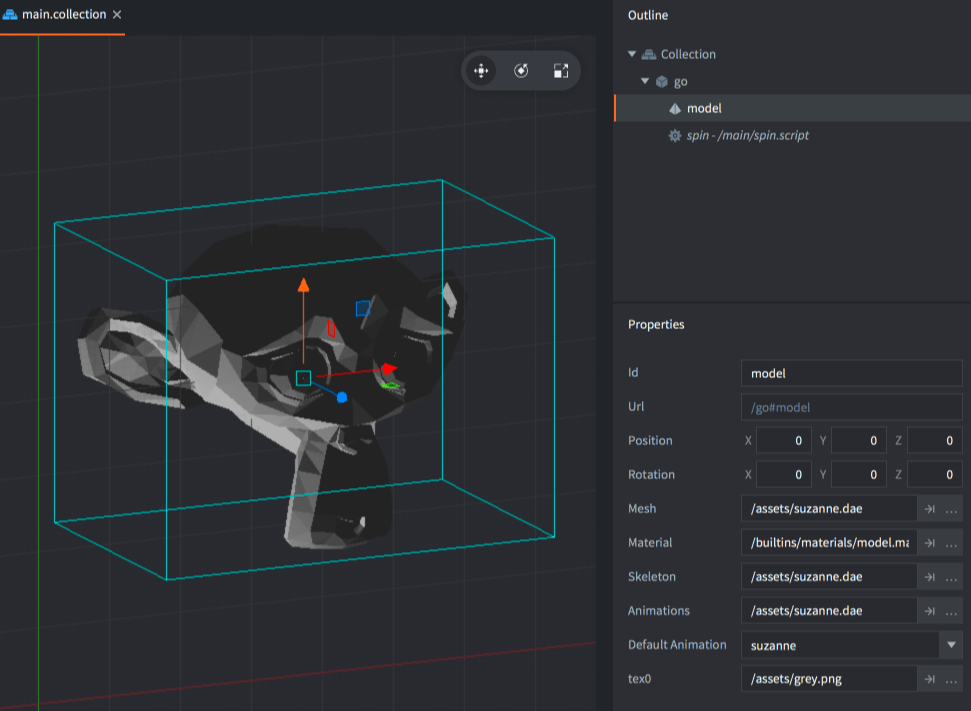
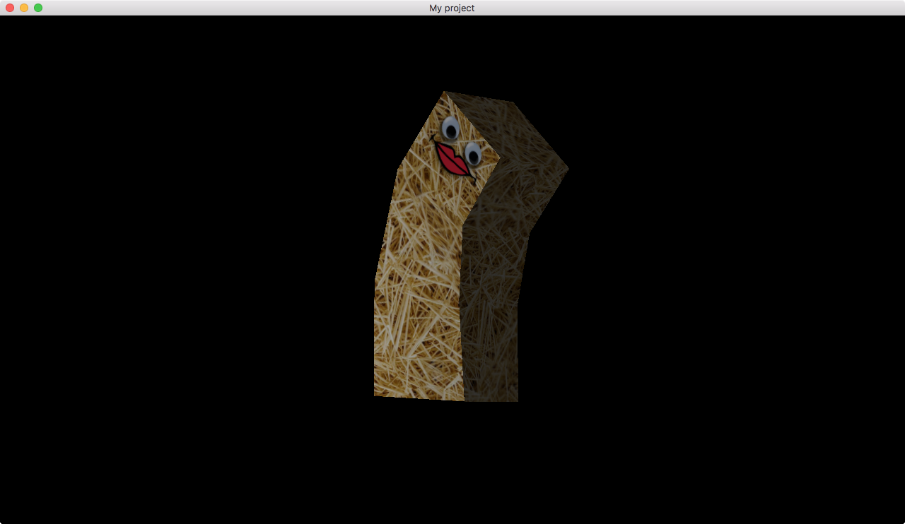

# Model component

Defold is at its core a 3D engine. Even when you work with 2D material only all rendering is done in 3D, but orthographically projected onto the screen.  Defold allows you to utilize full 3D content by including 3D assets, or _Models_ into your collections. You can build games in strictly 3D with only 3D assets, or you can mix 3D and 2D content as you wish.

## Creating a model component

Model components are created just like any other game object component. You can do it two ways:

- Create a *Model file* by <kbd>right-clicking</kbd> a location in the *Assets* browser and select <kbd>New... ▸ Model</kbd>.
- Create the component embedded directly into a game object by <kbd>right-clicking</kbd> a game object in the *Outline* view and selecting <kbd>Add Component ▸ Model</kbd>.



With the model created you need to specify a number of properties:

### Model properties

Apart from the properties *Id*, *Position* and *Rotation* the following component specific properties exist:

*Mesh*
: This property should refer to the Collada *.dae* file that contains the mesh to use. If the file contains multiple meshes, only the first one is read.

*Material*
: Set this property to a material you have created that is suitable for a textured 3D object. There is a built-in *model.material* file that you can use as a starting point.

*Texture*
: This property should point to the texture image file that you want applied to the object.

*Skeleton*
: This property should refer to the Collada *.dae* file that contains the skeleton to use for animation. Note that Defold requires a single root bone in your hierarchy.

*Animations*
: Set this to the *Animation Set File* that contains the animations you want to use on the model.

*Default Animation*
: This is the animation (from the animation set) that will be automatically played on the model.

## Editor manipulation

With the model component in place you are free to edit and manipulate the component and/or the encapsulating game object with the regular *Scene Editor* tools to move, rotate and scale the model to your liking.

{srcset="images/model/ingame@2x.png 2x"}

## Runtime manipulation

You can manipulate models in runtime through a number of different functions and properties (refer to the [API docs for usage](/ref/model/)).

### Runtime animation

Defold provides powerful support for controlling animation in runtime:

```lua
local play_properties = { blend_duration = 0.1 }
spine.play_anim("#model", "jump", go.PLAYBACK_ONCE_FORWARD, play_properties)
```

The animation playback cursor can be animated either by hand or through the property animation system:

```lua
-- set the run animation
model.play_anim("#model", "run", go.PLAYBACK_NONE)
-- animate the cursor
go.animate("#model", "cursor", go.PLAYBACK_LOOP_PINGPONG, 1, go.EASING_LINEAR, 10)
```

### Changing properties

A model also has a number of different properties that can be manipulated using `go.get()` and `go.set()`:

`animation`
: The current model animation (`hash`) (READ ONLY). You change animation using `model.play_anim()` (see above).

`cursor`
: The normalized animation cursor (`number`).

`material`
: The model material (`hash`). You can change this using a material resource property and `go.set()`. Refer to the [API reference for an example](/ref/model/#material).

`playback_rate`
: The animation playback rate (`number`).

`textureN`
: The model textures where N is 0-7 (`hash`). You can change this using a texture resource property and `go.set()`. Refer to the [API reference for an example](/ref/model/#textureN).


## Material

3D software commonly allows you to set properties on your object vertices, like coloring and texturing. This information goes into the Collada *.dae* file that you export from your 3D software. Depending on the requirements of your game you will have to select and/or create appropriate and _performant_ materials for your objects. A material combines _shader programs_ with a set of parameters for rendering of the object.

There is a simple 3D model material available in the built-in materials folder. If you need to create custom materials for your models, see the [Material documentation](/manuals/material) for information. The [Shader manual](/manuals/shader) contains information on how shader programs work.


### Material constants

The default model material has the following constants that can be changed using `model.set_constant()` and reset using `model.reset_constant()` (refer to the [Material manual for more details](/manuals/material/#vertex-and-fragment-constants)):

`tint`
: The color tint of the model (`vector4`). The vector4 is used to represent the tint with x, y, z, and w corresponding to the red, green, blue and alpha tint. Refer to the [API reference for an example](/ref/model/#model.set_constant:url-constant-value).


## Rendering

The default render script is tailor made for 2D games and does not work with 3D models. But by copying the default render script and adding a handful of lines of code to the render script you can enable rendering of your models. For instance:

  ```lua

  function init(self)
    self.model_pred = render.predicate({"model"})
    ...
  end

  function update()
    ...
    render.set_depth_mask(true)
    render.enable_state(render.STATE_DEPTH_TEST)
    render.set_projection(stretch_projection(-1000, 1000))  -- orthographic
    render.draw(self.model_pred)
    render.set_depth_mask(false)
    ...
  end
  ```

See the [Render documentation](/manuals/render) for details on how render scripts work.
