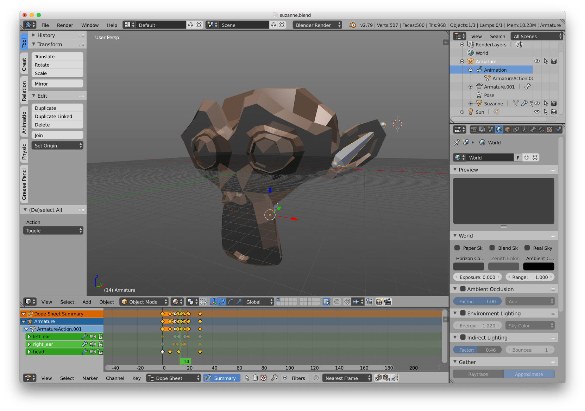

# Model component

Defold is at its core a 3D engine. Even when you work with 2D material only all rendering is done in 3D, but orthographically projected onto the screen.  Defold allows you to utilize full 3D content by including 3D assets, or _Models_ into your collections. You can build games in strictly 3D with only 3D assets, or you can mix 3D and 2D content as you wish.

## Creating a model

Let's look at an example. We have created a simple model with an armature (skeleton) and a simple animation in _Blender_. 

Blender is a powerful and popular 3D modeling, animation and rendering program. It runs on Windows, Mac OS X and Linux and is freely available for download at http://www.blender.org

Now we wish to bring this model to life in Defold.

{srcset="images/model/blender@2x.png 2x"}

When the model is done you select the Blender Collada exporter to produce a file with the *.dae* file extension. This exported mesh file contain all the vertices, edges and faces that make up the model, as well as _UV coordinates_ (what part of the texture image maps to a certain part of the mesh) if you have defined them, the bones in the skeleton and animation data.

A detailed description on polygon meshes can be found on http://en.wikipedia.org/wiki/Polygon_mesh. UV coordinates and UV mapping is described at http://en.wikipedia.org/wiki/UV_mapping.

Now, to import the model, simply drag and drop the *.dae* file and the corresponding texture image into the *Project Explorer* somewhere.

{srcset="images/model/assets@2x.png 2x"}

## Creating a model component

Model components are created just like any other game object component. You can do it two ways:

- Create a *Model file* by <kbd>right-clicking</kbd> a location in the *Assets* browser and select <kbd>New... ▸ Model</kbd>.
- Create the component embedded directly into a game object by <kbd>right-clicking</kbd> a game object in the *Outline* view and selecting <kbd>Add Component ▸ Model</kbd>.

With the model created you need to specify a number of properties:

*Mesh*
: This property should refer to the Collada *.dae* file that contains the mesh to use. If the file contains multiple meshes, only the first one is read.

*Material*
: Set this property to a material you have created that is suitable for a textured 3D object. There is a built-in *model.material* file that you can use as a starting point.

*Texture*
: This property should point to the texture image file that you want applied to the object.

*Skeleton*
: This property should refer to the Collada *.dae* file that contains the skeleton to use for animation. Note that Defold requires a single root bone in your hierarchy.

*Animations*
: Set this to the *Animation Set File* that contains the animations you want to use on the model.

*Default Animation*
: This is the animation (from the animation set) that will be automatically played on the model.

With the model component in place you are free to edit and manipulate the component and/or the encapsulating game object with the regular *Scene Editor* tools to move, rotate and scale the model to your liking.

{srcset="images/model/ingame@2x.png 2x"}

