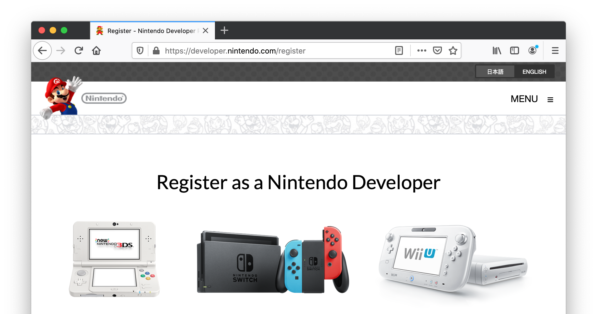

# Sign up for Nintendo Switch development

Due to Nintendo licensing restrictions access to Defold versions with support for the Nintendo Switch platform is not included in the standard version of Defold. In order to get access to versions of Defold with Nintendo Switch support you need to become an approved game developer for Nintendo Switch.

## Registering as a Nintendo Switch developer

You can register as a game developer for Nintendo Switch at the [Nintendo Developer Portal](https://developer.nintendo.com/register):

When you have been approved by Nintendo you will get access to the Tools and Middleware page of the Nintendo Developer Portal where you can sign up for Defold access. When you register for Defold access we will get an email from Nintendo verifying you as a registered Nintendo developer.

## Nintendo Switch access in Defold

Once we have confirmed your status as an approved Nintendo Switch developer we offer two tiers of Nintendo Switch access in Defold:

1. Standard access - Nintendo Switch extension, build tools and support.
2. Source code access - Nintendo Switch extension, build tools and support AND source code access to the Nintendo Switch specific parts of the Defold engine.

### Standard access

Access to versions of Defold with Nintendo Switch support is provided free of charge to all developers approved by Nintendo. As an approved developer we will provide you with access to:

* Extension with Nintendo Switch specific API integrations.
* [Command line tool](/manuals/bob) with support for bundling to the Nintendo Switch platform.
* Forum where you are able to get Nintendo Switch specific support.

### Source code access

Source code access is only provided to approved developer with an [active monthly community donation](/community-donations/) for an amount which gives you source code access.

## FAQ
:[Consoles FAQ](../shared/consoles-faq.md)
