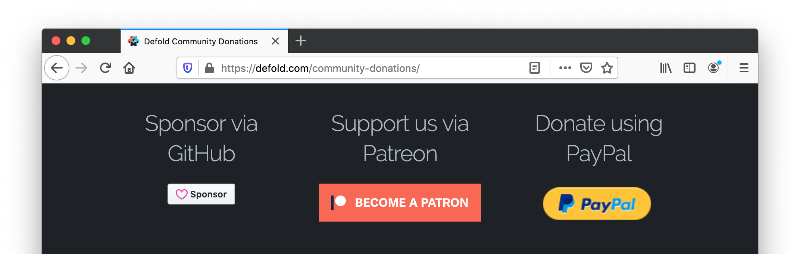

# Sign up for Nintendo Switch development

Support for the Nintendo Switch platform is not included in the standard version of Defold. In order to get access to Nintendo Switch support in Defold you need to 1) Become a Defold community donor with Nintendo Switch access included in your membership tier, and 2) Become a registered game developer for Nintendo platforms.

## Become a Defold community donor with Nintendo Switch access

You become a Defold community donor on the [Defold community donation page](/community-donations/). You can become a donor with Nintendo Switch access using either GitHub Sponsors or Patreon. Pay attention to the available tiers and select one which includes Nintendo Switch access.

## Register as a game developer for Nintendo platforms

You register as a game developer for Nintendo platforms at the [Nintendo Developer Portal](https://developer.nintendo.com/register):

When you register you will get access to Nintendo developer tools and resources to create and publish games and applications for current Nintendo platforms.

### Request Defold access

When you have been approved by Nintendo you need to log in to the Nintendo Developer Portal and visit the Tools and Middleware page and sign up for Defold access. When you register for Defold access we will get an email from Nintendo verifying you as a registered Nintendo developer. We will then proceed to verify you as a community donor with Nintendo Switch access included in your membership tier.

When we have verified you as a donor with Nintendo Switch access we will provide you with the access to the following:

* Versions of the Defold editor and the Defold command line tools (bob.jar) with support for bundling to the Nintendo Switch platform.
* Private forum group where you are able to get Nintendo Switch specific support.
* Nintendo Switch specific documentation
* API reference to Nintendo Switch specific engine functionality.

## FAQ
:[Nintendo Switch FAQ](../shared/nintendo-switch-faq.md)
