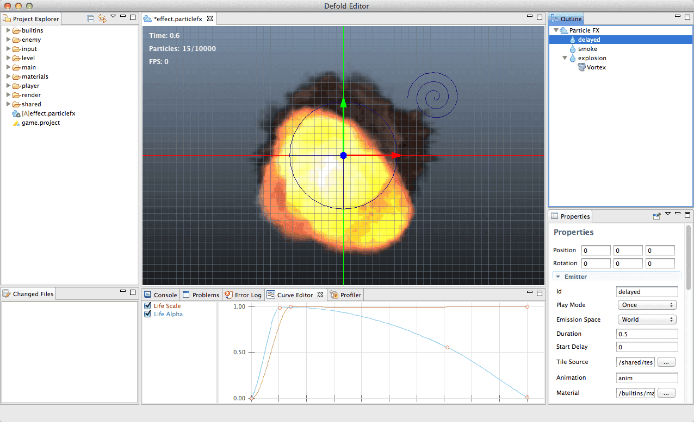
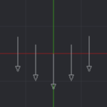
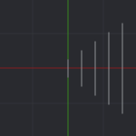
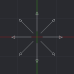
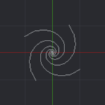

# Particle FX

It is possible to enhance the visual appeal of the game by using Particle effects. Watch this video for an introduction on how to work with particle effects in Defold.

<iframe width="560" height="315" src="https://www.youtube.com/embed/qzyB1lXNDKQ" frameborder="0" allowfullscreen></iframe>

## Concepts

ParticleFX
: A component that represents a particle effect.

Emitter
: A positioned shape that emits particles uniformly distributed over the shape.

Modifier
: Affects the velocity of spawned particles (field in Maya). Acceleration, drag, radial and vortex.

Image (Tile source or Atlas)
: Used for adding textures and flip-book animations, see the [2D graphics documentation](/manuals/2dgraphics)

When a ParticleFX file is created and opened, it is possible to add emitters and modifiers from the context menu in the Outline-view.

## Previewing

To preview the particle effects, the scene editor is used. It is explained in detail here: [Scene Editing](/manuals/scene-editing/).
Use the <kbd>Space</kbd> key to start and stop particle effects while previewing. Whether the particle effect is playing or not, it will be updated in real-time while tweaking it.

## Value tweaking

All number properties can be tweaked using the mouse-wheel (or scroll gesture on track-pad) when the <kbd>Alt</kbd> key modifier is pressed. Use the <kbd>Alt</kbd> key in combination with the <kbd>Ctrl</kbd> key to increase the speed by a factor of 10.

## Keying properties

Different properties can be keyed over different time lines, which means that their value can change over time. It is possible to see which properties have this ability in the reference below.

To key a value:

- Select Curve from the context menu in the text field you wish to key, which gives the text field a light green background.
- Go to the Curve Editor (available among the tabs in the bottom view) and modify the curve. It is possible to click and drag the points and tangents. Double-click to add or remove points (also available from the context menu inside the Curve Editor).

Keyed properties can't be edited in the Properties View, only in the Curve Editor.
To reset a keyed property, select Curve again from the context menu in its text field.
To auto-zoom the Curve Editor to display all curves, press <kbd>F</kbd>.

Spread
: When a property has two fields, the first is the value and the second is the spread. The value is what you key. The spread is a variation which is applied randomly for each spawned particle. E.g. if the value is 50 and the spread is 10, each spawned particle will get 50 +/- 10 as value.

## Emitter properties

Id
: Emitter identifier (used when setting render constants for specific emitters).

Mode
: If the emitter should stop (`Once`) or restart (`Loop`) when reaching its duration.

Duration
: For how long the emitter should emit particles.

Space
: In which geometrical space the spawned particles will exist.
  - `World` means the particles are left in the world and move independently of the emitter;
  - `Emitter` means they will move relative the emitter.

Position/rotation
: Transform of the emitter relative the ParticleFX component.

Image
: Image file (Tile source or Atlas) to use for texturing and animating the particles.

Animation
: Which animation in the Image file to use on the particles.

Material
: The material to use for shading the particles.

Blend Mode
: Available blend modes are `Alpha`, `Add` and `Multiply`.

Particle Orientation
: How the particles are oriented, either `Default` (unit orientation) or `Initial Direction`.

Inherit Velocity
: How much of the velocity of the emitter the particles should inherit. This value is only available when *Space* is set to `World`. The velocity of the emitter is estimated every frame.

Max Particle Count
: How many particles from this emitter can exist at the same time.

Type
: The shape of the emitter
  - `Circle` - A 2D circle which emits particles outwards from its center. Diameter is defined by *Emitter Size X*.
  - `2D Cone` - A flattened cone which emits particles from its bottom corner directed out through the top of the cone. *Emitter Size X* defines the diameter of the top and *Y* defines the height.
  - `Box` - A 3D box which emits particles along its local Y-axis. *Emitter Size X*, *Y* and *Z* defines width, height and depth respectively.
  - `Sphere` - A 3D sphere which emits particles outwards from its center. Diameter is defined by *Emitter Size X*.
  - `Cone` - A 3D cone which emits particles from its bottom corner directed out through the top disc of the cone. *Emitter Size X* defines the diameter of the top disc and *Y* defines the height.

Start Delay
: How long time to wait after the ParticleFX has been started before this emitter will start emitting particles.

## Keyable emitter properties

These properties have two fields, a value and a spread. The values can be keyed over the duration of the emitter. Spread defines how much the value should randomly change for each spawned particle. Spread is added to the current value.

Spawn Rate
: How many particles to emit per second.

Emitter Size X/Y/Z
: Dimensions of the emitter shape, see Type above.

Particle Life Time
: How long each spawned particle should live.

Initial Speed
: How fast the spawned particles should move initially.

Initial Size
: How large the spawned particles should be.

Initial Red/Green/Blue/Alpha
: Initial color components for the particles.

## Keyable particle properties

These properties can be keyed over the life time of the particles.

Life Scale
: How the particle size should be scaled.

Life Red/Green/Blue/Alpha
: How the particle color should be tinted over its life.

## Modifier properties

Position/rotation
: The transform of the modifier relative its parent.

Type
: The type of modifier
  |          | Type        |
  | -------- | ----------- |
  | {.inline} | `Acceleration`: A directed acceleration with no position. Use this for things like gravity. |
  | {.inline} | `Drag`: A decelerating acceleration which is proportional to the particle velocity. Use this for things like air resistance and other fluids. |
  | {.inline} | `Radial`: A radial modifier either attracts or repels particles towards/from a position. Use this for things like small planets. |
  | {.inline} | `Vortex`: A vortex affects particles in a circular or spiraling direction around its position. Use this for things like black holes and tornados. |

Max Distance
: The maximum distance within which particles are affected at all by this modifier. Only used for Radial and Vortex.

## Keyable modifier properties

These properties have two fields, a value and a spread. The values can be keyed over the duration of the emitter. Spread defines how much the value should randomly change for each spawned particle. Spread is added to the current value.

Magnitude
: The amount of effect the modifier has on the particles.

