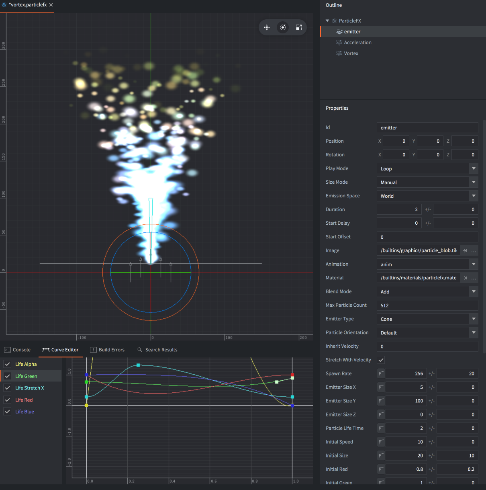
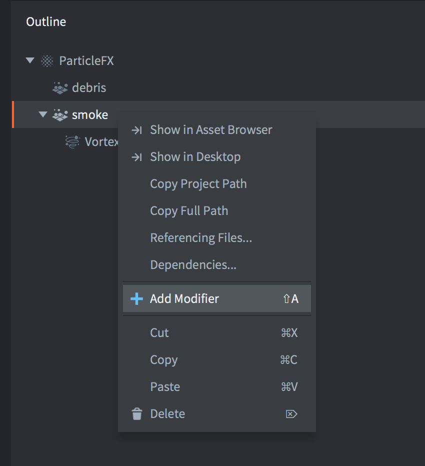
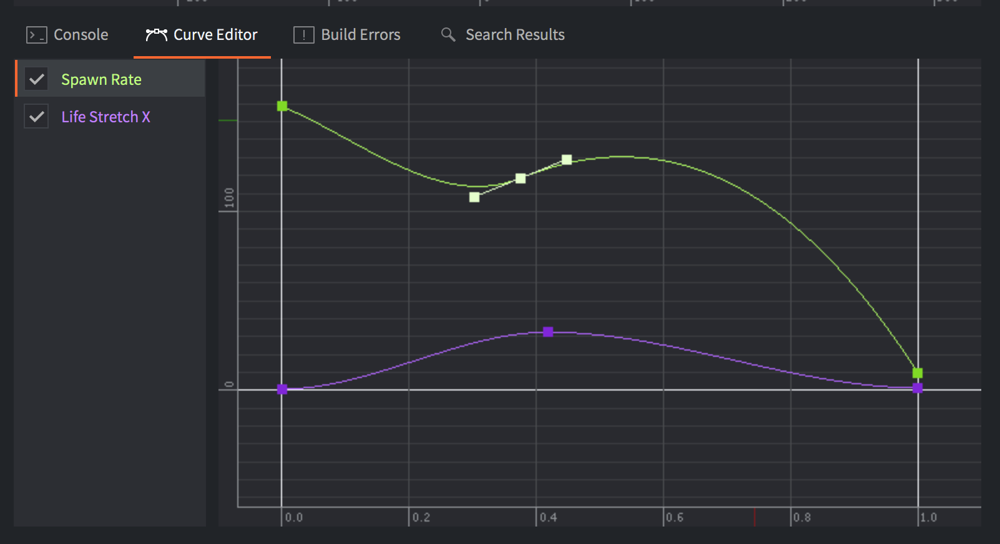

# Particle FX

Particle effects are used to visually enhance games. You can use them to create explosions, blood splatter, trails, weather or any other effect.

{srcset="images/particlefx/editor@2x.png 2x"}

Particle effects consists of a number of emitters and optional modifiers:

Emitter
: An emitter is a positioned shape that emits particles uniformly distributed over the shape. The emitter contains properties that controls the particle spawning as well as the image or animation, lifespan, color, shape and velocity of the individual particles.

Modifier
: A modifier affects the velocity of spawned particles to make them accelerate or slow down in a particular direction, move radially or swirl around a point. Modifiers can affect a single emitter's particles or a particular emitter.

## Creating an effect

Select <kbd>New... ▸ Particle FX</kbd> from the context menu in the *Assets* browser. Name the new particle effect file. The editor will now open the file using the [Scene Editor](/manuals/editor/#the-scene-editor).

The *Outline* pane shows the default emitter. Select the emitter to bring up its properties in the *Properties* pane below.

{srcset="images/particlefx/default@2x.png 2x"}

To add a new emitter to the effect, <kbd>right click</kbd> the root of the *Outline* and select <kbd>Add Emitter ▸ [type]</kbd> from the context menu. Note that you can change the type of the emitter in the emitter properties.

To add a new modifier, <kbd>right click</kbd> the location of the modifier in the *Outline* (the effect root or a particular emitter) and select <kbd>Add Modifier</kbd>, then select the modifier type.

{srcset="images/particlefx/add_modifier@2x.png 2x"}

{srcset="images/particlefx/add_modifier_select@2x.png 2x"}

A modifier that sits on the effect root (not childed to an emitter) affects all particles in the effect.

A modifier that is added as a child to an emitter affects only that emitter.

## Previewing an effect

* Select <kbd>View ▸ Play</kbd> from the menu to preview the effect. You may need to zoom out the camera to see the effect properly.
* Select <kbd>View ▸ Play</kbd> again to pause the effect.
* Select <kbd>View ▸ Stop</kbd> to stop the effect. Playing it again restarts it from its initial state.

When editing an emitter or modifier the result is immediately visible in the editor, even with the effect paused:


## Emitter properties

Id
: Emitter identifier (used when setting render constants for specific emitters).

Position/Rotation
: Transform of the emitter relative the ParticleFX component.

Play Mode
: Controls how the emitter plays:
  - `Once` stops the emitter after reaching its duration.
  - `Loop` restarts the emitter after reaching its duration.

Size Mode
: Controls how flipbook animations will be sized:
  - `Auto` keeps the size of each flipbook animation frame to the source image.
  - `Manual` sets the particle size according to the size property.

Emission Space
: Which geometrical space the spawned particles will exist:
  - `World` moves the particles independent of the emitter.
  - `Emitter` moves the particles relative to the emitter.

Duration
: The number of seconds the emitter should emit particles.

Start Delay
: The number of seconds the emitter should wait before emitting particles.

Start Offset
: The number of seconds into the particle simulation the emitter should start, or in other words how long the emitter should pre-warm the effect for.

Image
: The image file (Tile source or Atlas) to use for texturing and animating the particles.

Animation
: The animation from the *Image* file to use on the particles.

Material
: The material to use for shading the particles.

Blend Mode
: Available blend modes are `Alpha`, `Add` and `Multiply`.

Max Particle Count
: How many particles originating from this emitter that can exist at the same time.

Emitter Type
: The shape of the emitter
  - `Circle` emits particles from a random location inside a circle. The particles are directed outwards from the center. The circle diameter is defined by *Emitter Size X*.

  - `2D Cone` emits particles from a random location inside a flat cone (a triangle). The particles are directed out of the top of the cone. *Emitter Size X* defines the width of the top and *Y* defines the height.

  - `Box` emits particles from a random location inside a box. The particles are directed up along the box' local Y-axis. *Emitter Size X*, *Y* and *Z* defines width, height and depth respectively. For a 2D rectangle, keep the Z size at zero.

  - `Sphere` emits particles from a random location inside a sphere. The particles are directed outwards from the center. The sphere diameter is defined by *Emitter Size X*.

  - `Cone` emits particles from a random location inside a 3D cone. The particles are directed out through the top disc of the cone. *Emitter Size X* defines the diameter of the top disc and *Y* defines the height of the cone.

  {srcset="images/particlefx/emitter_types@2x.png 2x"}

Particle Orientation
: How the emitted particles are oriented:
  - `Default` sets the orientation to unit orientation
  - `Initial Direction` keeps the initial orientation of the emitted particles.
  - `Movement Direction` adjusts the orientation of the particles according to their velocity.

Inherit Velocity
: A scale value of how much of the velocity of the emitter the particles should inherit. This value is only available when *Space* is set to `World`. The velocity of the emitter is estimated every frame.

Stretch With Velocity
: Check to scale any particle stretch in the direction of movement.

### Blend modes
:[blend-modes](../shared/blend-modes.md)

## Keyable emitter properties

These properties have two fields: a value and a spread. The spread is a variation which is applied randomly for each spawned particle. E.g. if the value is 50 and the spread is 3, each spawned particle will get a value between 47 and 53 (50 +/- 3).

{srcset="images/particlefx/property@2x.png 2x"}

By checking the key button, the value of the property is controlled by a curve over the duration of the emitter. To reset a keyed property, uncheck the key button.

{srcset="images/particlefx/key@2x.png 2x"}

The *Curve Editor* (available among the tabs in the bottom view) is used to modify the curve. Keyed properties can't be edited in the *Properties* view, only in the *Curve Editor*. <kbd>Click and drag</kbd> the points and tangents to modify the shape of the curve. <kbd>Double-click</kbd> on the curve to add control points. To remove a control point, <kbd>double click</kbd> on it.

{srcset="images/particlefx/curve_editor@2x.png 2x"}

To auto-zoom the Curve Editor to display all curves, press <kbd>F</kbd>.

The following properties can be keyed over the play time of the emitter:

Spawn Rate
: The number of particles to emit per second.

Emitter Size X/Y/Z
: The dimensions of the emitter shape, see *Emitter Type* above.

Particle Life Time
: The lifespan of each spawned particle, in seconds.

Initial Speed
: The initial velocity of each spawned particle.

Initial Size
: The initial size of each spawned particle. If you set *Size Mode* to `Automatic` and use a flipbook animation as image source, this property is ignored.

Initial Red/Green/Blue/Alpha
: The initial color component tint values for the particles.

Initial Rotation
: The initial rotation values (in degrees) for the particles.

Initial Stretch X/Y
: The initial stretch values (in units) for the particles.

Initial Angular Velocity
: The initial angular velocity  (in degrees/second) of each spawned particle.

The following properties can be keyed over the life time of the particles:

Life Scale
: The scale value over each particle's life.

Life Red/Green/Blue/Alpha
: The color component tint value over each particle's life.

Life Rotation
: The rotation value (in degrees) over each particle's life.

Life Stretch X/Y
: The stretch value (in units) over each particle's life.

Life Angular Velocity
: The angular velocity (in degrees/second) over each particle's life.

## Modifiers

There are four types of modifiers available that affect the velocity of particles:

`Acceleration`
: Acceleration in a general direction.

`Drag`
: Reduces the acceleration of particles proportional to the particle velocity.

`Radial`
: Either attracts or repels particles towards/from a position.

`Vortex`
: Affects particles in a circular or spiraling direction around its position.

  {srcset="images/particlefx/modifiers@2x.png 2x"}

## Modifier properties

Position/Rotation
: The transform of the modifier relative its parent.

Magnitude
: The amount of effect the modifier has on the particles.

Max Distance
: The maximum distance within which particles are affected at all by this modifier. Only used for Radial and Vortex.

## Controlling a particle effect

To start and stop a particle effect from a script:

```lua
-- start the effect component "particles" in the current game object
particlefx.play("#particles")

-- stop the effect component "particles" in the current game object
particlefx.stop("#particles")
```

::: sidenote
A particle effect will continue to emit particles even if the game object the particle effect component belonged to is deleted.
:::
See the [Particle FX reference documentation](/ref/particlefx) for more information.

## Material constants

The default particle effect material has the following constants that can be changed using `particlefx.set_constant()` and reset using `particlefx.reset_constant()` (refer to the [Material manual for more details](/manuals/material/#vertex-and-fragment-constants)):

`tint`
: The color tint of the particle effect (`vector4`). The vector4 is used to represent the tint with x, y, z, and w corresponding to the red, green, blue and alpha tint. Refer to the [API reference for an example](/ref/particlefx/#particlefx.set_constant:url-constant-value).
