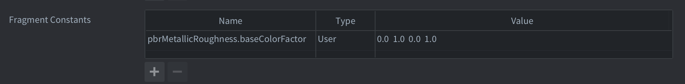

# Physically Based Rendering (PBR)

Physically Based Rendering (PBR) is a shading approach that models how light interacts with surfaces using real-world physical principles. It produces consistent, realistic lighting across different environments and allows assets to look correct under a wide range of lighting conditions.

Defold’s PBR implementation follows the glTF 2.0 material specification and associated Khronos extensions. When you import glTF assets into Defold, material properties are automatically parsed and stored as structured material data that can be accessed in shaders at runtime.

PBR materials can include effects such as metallic reflections, surface roughness, transmission, clearcoat, subsurface scattering, iridescence, and more.

::: sidenote
Defold currently exposes PBR material data to shaders, but does not provide a built-in PBR lighting model. You can use this data in your own lighting and reflection shaders to achieve physically based rendering. A default PBR lighting model will be added to Defold at a later stage.
:::

::: sidenote
Embedded textures from glTF files are currently not automatically assigned in Defold. Only material parameters are exposed to shaders. You can still manually assign textures to model components and sample them in your shader.
:::

## Material properties overview

The material properties are parsed from the glTF 2.0 source files assigned to a model component. Not all properties are standard. Some are provided through optional glTF extensions that may or may not be included by the tool used to export the glTF file. The relevant extension is denoted in parentheses after the property name below.

Metallic roughness
: Describes how light interact with the material. The default PBR model.

Specular glossiness (KHR_materials_pbrSpecularGlossiness)
: An alternative to metallic roughness. Often used in older assets.

Clearcoat (KHR_materials_clearcoat)
: Adds a transparent coating layer with its own roughness and normal map.

Ior (KHR_materials_ior)
: Adds an index of refraction.

Specular (KHR_materials_specular)
: Adds a dedicated specular intensity and color channel.

Iridescence (KHR_materials_iridescence)
: Simulates thin-film interference for materials like soap bubbles or pearls.

Sheen (KHR_materials_sheen)
: Models fabric-like micro-surface reflections.

Transmission (KHR_materials_transmission)
: Models light transmission for transparent or glass-like materials.

Volume (KHR_materials_volume)
: Supports volumetric effects like thickness and attenuation.

Emissive strength (KHR_materials_emissive_strength)
: Controls emissive brightness independent of base color.

Normal map
: Normal map for surface detail.

Occlusion map
: Ambient occlusion map.

Emissive map
: Self-emissive texture for glowing surfaces.

Emissive factor
: RGB multiplier for emissive intensity

Alpha cutoff
: Threshold for masked transparency.

Alpha mode
: Opaque, Masked, or Blended transparency modes.

Double sided
: If true, both sides of the surface are rendered.

Unlit
: If true, the material bypasses lighting calculations.

::: sidenote
Some of these properties provides hints on how the material should be rendered. The data for the properties (alpha cutoff, alpha mode, double sided and unlit) is available in the shaders, but does not affect how the material is rendered in Defold.
:::

## Shader integration

The PBR material data is exposed to the shaders based on types and name convention. The PBR material system provides all parsed material parameters to shaders via a structured uniform block named `PbrMaterial`. Each supported glTF extension corresponds to a struct within this block, which can be conditionally compiled using #define flags.

```glsl
uniform PbrMaterial
{
	// Material properties
};
```

The various features of the material is specified as fixed structs in the shader. Data has been packed as much as possible in vec4's since that is how constants are set internally in Defold. In those cases where data has been packed, it is denoted as comments in the shader snippets for each feature below:

```glsl
struct PbrMetallicRoughness
{
    vec4 baseColorFactor;
    // R: metallic (Default=1.0), G: roughness (Default=1.0)
    vec4 metallicAndRoughnessFactor;
    // R: use baseColorTexture, G: use metallicRoughnessTexture
    vec4 metallicRoughnessTextures;
};

struct PbrSpecularGlossiness
{
	vec4 diffuseFactor;
	// RGB: specular (Default=1.0), A: glossiness (Default=1.0)
	vec4 specularAndSpecularGlossinessFactor;
	// R: use diffuseTexture, G: use specularGlossinessTexture
	vec4 specularGlossinessTextures;
};

struct PbrClearCoat
{
	// R: clearCoat (Default=0.0), G: clearCoatRoughness (Default=0.0)
	vec4 clearCoatAndClearCoatRoughnessFactor;
	// R: use clearCoatTexture, G: use clearCoatRoughnessTexture, B: use clearCoatNormalTexture
	vec4 clearCoatTextures;
};

struct PbrTransmission
{
	// R: transmission (Default=0.0)
	vec4 transmissionFactor;
	// R: use transmissionTexture
	vec4 transmissionTextures;
};

struct PbrIor
{
	// R: ior (Default=0.0)
	vec4 ior;
};

struct PbrSpecular
{
	// RGB: specularColor, A: specularFactor (Default=1.0);
	vec4 specularColorAndSpecularFactor;
	// R: use specularTexture, G: use specularColorTexture
	vec4 specularTextures;
};

struct PbrVolume
{
	// R: thicknessFactor (Default=0.0), RGB: attenuationColor
	vec4 thicknessFactorAndAttenuationColor;
	// R: attentuationDistance (Default=-1.0)
	vec4 attenuationDistance;
	// R: use thicknessTexture
	vec4 volumeTextures;
};

struct PbrSheen
{
	// RGB: sheenColor, A: sheenRoughnessFactor (Default=0.0)
	vec4 sheenColorAndRoughnessFactor;
	// R: use sheenColorTexture, G: use sheenRoughnessTexture
	vec4 sheenTextures;
};

struct PbrEmissiveStrength
{
	// R: emissiveStrength (Default=1.0)
	vec4 emissiveStrength;
};

struct PbrIridescence
{
	// R: iridescenceFactor (Default=0.0), G: iridescenceIor (Default=1.3), B: iridescenceThicknessMin (Default=100.0), A: iridescenceThicknessMax (Default=400.0)
	vec4 iridescenceFactorAndIorAndThicknessMinMax;
	// R: use iridescenceTexture, G: use iridescenceThicknessTexture
	vec4 iridescenceTextures;
};
```

The common properties are set on the material uniform itself (and once again, note the data packing into vec4).

```glsl
// Common textures
uniform sampler2D PbrMaterial_normalTexture;
uniform sampler2D PbrMaterial_occlusionTexture;
uniform sampler2D PbrMaterial_emissiveTexture;

uniform PbrMaterial
{
	// Common properties:

	// R: alphaCutoff (Default=0.5), G: doubleSided (Default=false), B: unlit (Default=false)
	vec4 pbrAlphaCutoffAndDoubleSidedAndIsUnlit;
	// R: use normalTexture, G: use occlusionTexture, B: use emissiveTexture
	vec4 pbrCommonTextures;

	// Other properties...
};
```

### Example shader

Here is an example shader that contains all features and a proposed naming scheme for texture bindings (again, this must be handled manually). Note that you can turn off features simply by using defines around each member of the PbrMaterial itself, as shown in the example below:

```glsl
// Feature flags, comment or remove these to slim down the shader.
#define PBR_METALLIC_ROUGHNESS
#define PBR_SPECULAR_GLOSSINESS
#define PBR_CLEARCOAT
#define PBR_TRANSMISSION
#define PBR_IOR
#define PBR_SPECULAR
#define PBR_VOLUME
#define PBR_SHEEN
#define PBR_EMISSIVE_STRENGTH
#define PBR_IRIDESCENCE

// Common
uniform sampler2D PbrMaterial_normalTexture;
uniform sampler2D PbrMaterial_occlusionTexture;
uniform sampler2D PbrMaterial_emissiveTexture;

// PbrMetallicRoughness
uniform sampler2D PbrMetallicRoughness_baseColorTexture;
uniform sampler2D PbrMetallicRoughness_metallicRoughnessTexture;

struct PbrMetallicRoughness
{
    vec4 baseColorFactor;
    // R: metallic (Default=1.0), G: roughness (Default=1.0)
    vec4 metallicAndRoughnessFactor;
    // R: use baseColorTexture, G: use metallicRoughnessTexture
    vec4 metallicRoughnessTextures;
};

// PbrSpecularGlossiness
uniform sampler2D PbrSpecularGlossiness_diffuseTexture;
uniform sampler2D PbrSpecularGlossiness_specularGlossinessTexture;

struct PbrSpecularGlossiness
{
	vec4 diffuseFactor;
	// RGB: specular (Default=1.0), A: glossiness (Default=1.0)
	vec4 specularAndSpecularGlossinessFactor;
	// R: use diffuseTexture, G: use specularGlossinessTexture
	vec4 specularGlossinessTextures;
};

// PbrClearCoat
uniform sampler2D PbrClearCoat_clearcoatTexture;
uniform sampler2D PbrClearCoat_clearcoatRoughnessTexture;
uniform sampler2D PbrClearCoat_clearcoatNormalTexture;

struct PbrClearCoat
{
	// R: clearCoat (Default=0.0), G: clearCoatRoughness (Default=0.0)
	vec4 clearCoatAndClearCoatRoughnessFactor;
	// R: use clearCoatTexture, G: use clearCoatRoughnessTexture, B: use clearCoatNormalTexture
	vec4 clearCoatTextures;
};

// PbrTransmission
uniform sampler2D PbrTransmission_transmissionTexture;

struct PbrTransmission
{
	// R: transmission (Default=0.0)
	vec4 transmissionFactor;
	// R: use transmissionTexture
	vec4 transmissionTextures;
};

struct PbrIor
{
	// R: ior (Default=0.0)
	vec4 ior;
};

// PbrSpecular
uniform sampler2D PbrSpecular_specularTexture;
uniform sampler2D PbrSpecular_specularColorTexture;

struct PbrSpecular
{
	// RGB: specularColor, A: specularFactor (Default=1.0);
	vec4 specularColorAndSpecularFactor;
	// R: use specularTexture, G: use specularColorTexture
	vec4 specularTextures;
};

// PbrVolume
uniform sampler2D PbrVolume_thicknessTexture;

struct PbrVolume
{
	// R: thicknessFactor (Default=0.0), RGB: attenuationColor
	vec4 thicknessFactorAndAttenuationColor;
	// R: attentuationDistance (Default=-1.0)
	vec4 attenuationDistance;
	// R: use thicknessTexture
	vec4 volumeTextures;
};

// PbrSheen
uniform sampler2D PbrSheen_sheenColorTexture;
uniform sampler2D PbrSheen_sheenRoughnessTexture;

struct PbrSheen
{
	// RGB: sheenColor, A: sheenRoughnessFactor (Default=0.0)
	vec4 sheenColorAndRoughnessFactor;
	// R: use sheenColorTexture, G: use sheenRoughnessTexture
	vec4 sheenTextures;
};

struct PbrEmissiveStrength
{
	// R: emissiveStrength (Default=1.0)
	vec4 emissiveStrength;
};

// PbrIridescence
uniform sampler2D PbrEmissive_iridescenceTexture;
uniform sampler2D PbrEmissive_iridescenceThicknessTexture;

struct PbrIridescence
{
	// R: iridescenceFactor (Default=0.0), G: iridescenceIor (Default=1.3), B: iridescenceThicknessMin (Default=100.0), A: iridescenceThicknessMax (Default=400.0)
	vec4 iridescenceFactorAndIorAndThicknessMinMax;
	// R: use iridescenceTexture, G: use iridescenceThicknessTexture
	vec4 iridescenceTextures;
};

uniform PbrMaterial
{
	// Common properties
	// R: alphaCutoff (Default=0.5), G: doubleSided (Default=false), B: unlit (Default=false)
	vec4 pbrAlphaCutoffAndDoubleSidedAndIsUnlit;
	// R: use normalTexture, G: use occlusionTexture, B: use emissiveTexture
	vec4 pbrCommonTextures;

	// Features
#ifdef PBR_METALLIC_ROUGHNESS
	PbrMetallicRoughness  pbrMetallicRoughness;
#endif
#ifdef PBR_SPECULAR_GLOSSINESS
	PbrSpecularGlossiness pbrSpecularGlossiness;
#endif
#ifdef PBR_CLEARCOAT
	PbrClearCoat pbrClearCoat;
#endif
#ifdef PBR_TRANSMISSION
	PbrTransmission pbrTransmission;
#endif
#ifdef PBR_IOR
	PbrIor pbrIor;
#endif
#ifdef PBR_SPECULAR
	PbrSpecular pbrSpecular;
#endif
#ifdef PBR_VOLUME
	PbrVolume pbrVolume;
#endif
#ifdef PBR_SHEEN
	PbrSheen pbrSheen;
#endif
#ifdef PBR_EMISSIVE_STRENGTH
	PbrEmissiveStrength pbrEmissiveStrength;
#endif
#ifdef PBR_IRIDESCENCE
	PbrIridescence pbrIridescence;
#endif
};
```

::: sidenote
If specific data points in the material struct are not found, the data for those features will not be set. E.g if there is no `pbrClearCoat` in the material struct, no clear coat data will be set. If the uniform block is not found, no data at all will be set during rendering.
:::

### Constants

Each material property corresponds to an internal render constant in Defold. You can override default values by defining constants on the material resource itself, following the naming pattern `pbrFeature.structMember`. These values will be applied automatically if the matching data is missing in the glTF material.



## Next steps

To use the material data for physically based lighting, implement a BRDF in your fragment shader using the parameters provided in the `PbrMaterial` block.
See also:

* [Shaders manual](/manuals/shader)
* [Render manual](/manuals/render)
* [glTF 2.0 specification](https://registry.khronos.org/glTF/specs/2.0/glTF-2.0.html)

