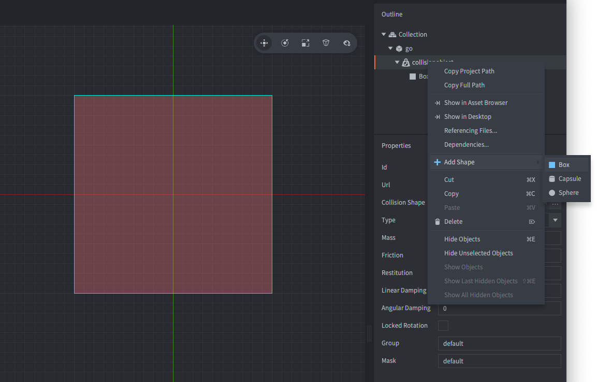
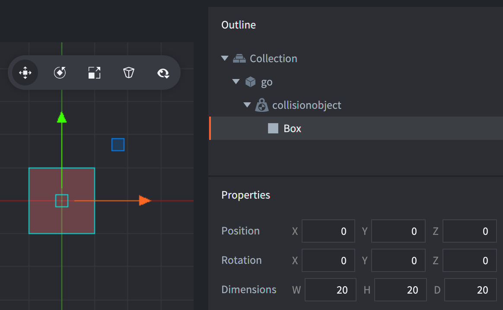

# Collision shapes

A collision component can either use several primitive shapes or a single complex shape.

### Primitive shapes
The primitive shapes are *box*, *sphere* and *capsule*. You add a primitive shape by <kbd>right clicking</kbd> the collision object and selecting <kbd>Add Shape</kbd>:



## Box shape
A box has a position, rotation and dimensions (width, height and depth):



## Sphere shape
A sphere has a position, rotation and diameter:


## Capsule shape
A capsule has a position, rotation, diameter and height:


::: important
Capsule shapes are only supported when using 3D physics (configured in the Physics section of the *game.project* file).
:::

### Complex shapes
A complex shape can either be created from a tilemap component or from a convex hull shape.

## Tilemap collision shape
Defold includes a feature allowing you to easily generate physics shapes for the tile source used by a tile map. The [Tilesource manual](/manuals/tilesource/#tile-source-collision-shapes) explains how to add collision groups to a tile source and assign tiles to collision groups ([example](/examples/tilemap/collisions/)).

To add collision to a tile map:

1. Add the tilemap to a game object by <kbd>right-clicking</kbd> the game object and selecting <kbd>Add Component File</kbd>. Select the tile map file.
2. Add a collision object component to the game object by <kbd>right-clicking</kbd> the game object and selecting <kbd>Add Component ▸ Collision Object</kbd>.
3. Instead of adding shapes to the component, set the *Collision Shape* property to the *tilemap* file.
4. Set up the collision object component *Properties* as usual.

{srcset="images/physics/collision_tilemap@2x.png 2x"}

::: important
Note that the *Group* property is **not** used here since the collision groups are defined in the tile map's tile source.
:::

## Convex hull shape
Defold includes a feature allowing you to create a convex hull shape from three or more points. You can use an external tool such as the [Defold Polygon Editor](https://rossgrams.itch.io/defold-polygon-editor) or the [Physics Body Editor](https://selimanac.github.io/physics-body-editor/) to create a convex hull shape.

1. Create convex hull shape file (file extension `.convexshape`) using an external editor.
2. Instead of adding shapes to the collision object component, set the *Collision Shape* property to the *convex shape* file.

::: sidenote
The shape will not be drawn in the editor. You can [enable Physics debugging](/manuals/debugging/#debugging-problems-with-physics) at runtime to see the shape.
:::

### File Format
The convex hull file format uses the same data format as all other Defold files, ie the protobuf text format. A convex hull shape defines the points of the hull in a counter clockwise order. Example:

```
shape_type: TYPE_HULL
data: 200.000
data: 100.000
data: 0.0
data: 400.000
data: 100.000
data: 0.0
data: 400.000
data: 300.000
data: 0.0
data: 200.000
data: 300.000
data: 0.0
```

The above example defines the four corners of a rectangle:

```
 200x300   400x300
    4---------3
    |         |
    |         |
    |         |
    |         |
    1---------2
 200x100   400x100
```

# Scaling collision shapes
The collision object and its shapes inherit the scale of the game object. To disable this behaviour uncheck the [Allow Dynamic Transforms](/manuals/project-settings/#allow-dynamic-transforms) checkbox in the Physics section of *game.project*. Note that only uniform scaling is supported and that the smallest scale value will be used if the scale isn't uniform.


# Resizing collision shapes
The shapes of a collision object can be resized at runtime using `physics.set_shape()`. Example:

```lua
-- set capsule shape data
local data = {}
data.diameter = 10
data.height = 20
physics.set_shape("#collisionobject", "my_capsule_shape", data)

-- set sphere shape data
data = {}
data.diameter = 10
physics.set_shape("#collisionobject", "my_sphere_shape", data)

-- set box shape data
data = {}
data.dimensions = vmath.vector3(10, 10, 5)
physics.set_shape("#collisionobject", "my_box_shape", data)
```


# Rotating collision shapes

## Rotating collision shapes in 3D physics
Collision shapes in 3D physics can be rotated around all axis.


## Rotating collision shapes in 2D physics
Collision shapes in 2D physics can only be rotated around the z-axis. Rotation around the x or y axis will yield incorrect results and should be avoided, even when rotating 180 degrees to essentially flip the shape along the x or y axis. To flip a physics shape it is recommended to use [`physics.set_hlip(url, flip)`](/ref/stable/physics/?#physics.set_hflip:url-flip) and [`physics.set_vlip(url, flip)`](/ref/stable/physics/?#physics.set_vflip:url-flip).
