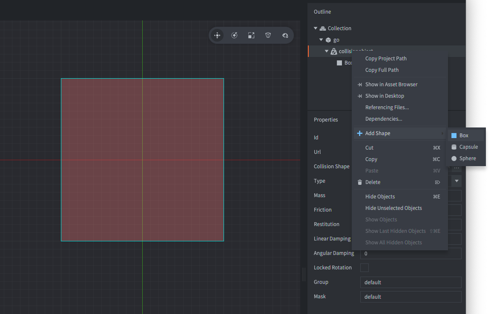
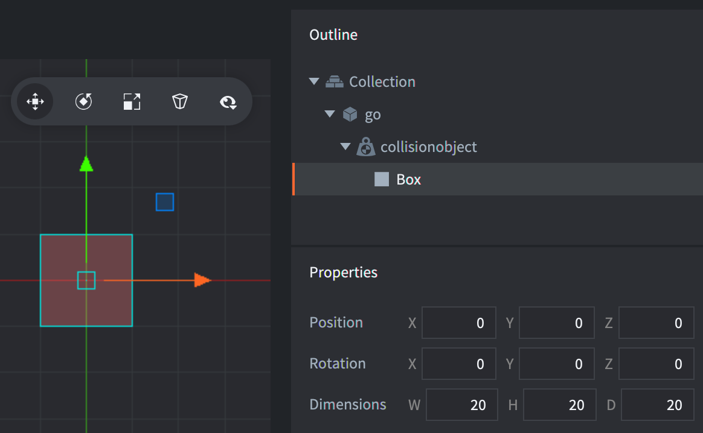
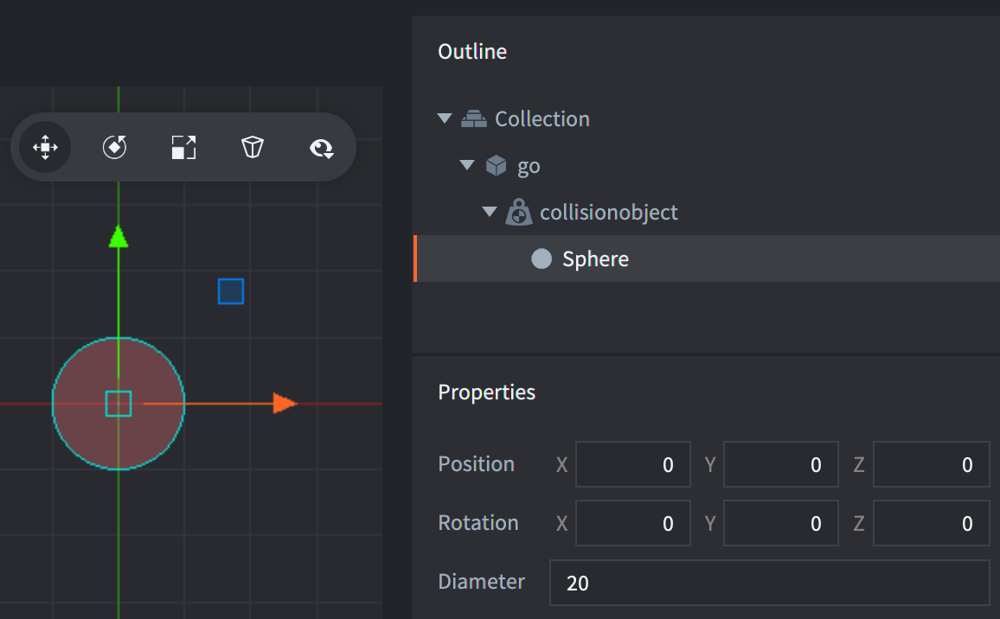
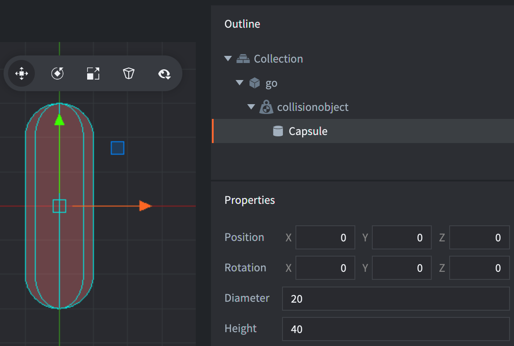
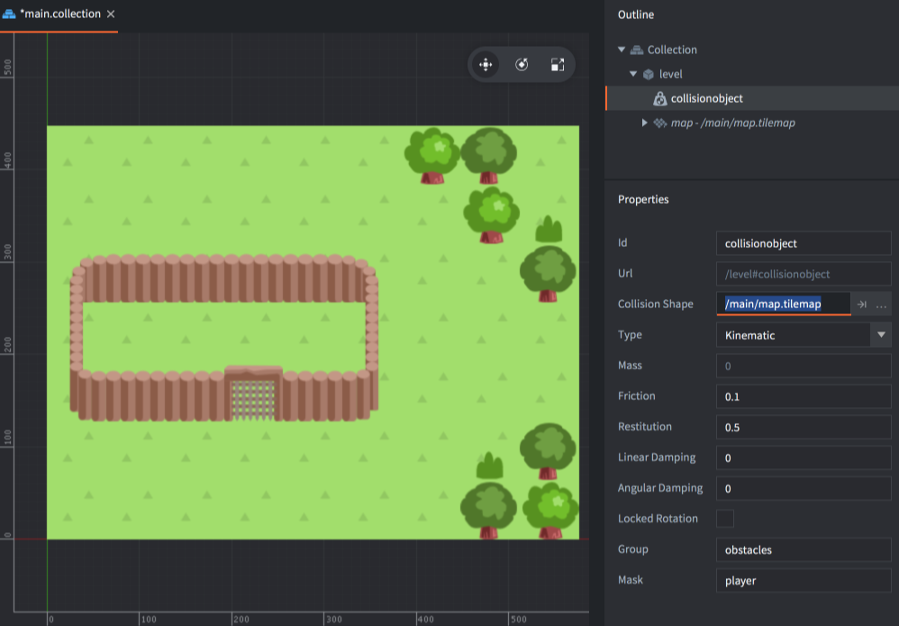

# Collision shapes

A collision object can contain several embedded shapes. In 3D physics these can include hulls and triangle meshes from glTF or GLB files. You can also use a tilemap or a convex shape resource through the collision object's *Collision Shape* property.

### Primitive shapes
The primitive shapes are *box*, *sphere* and *capsule*. You add a primitive shape by <kbd>right clicking</kbd> the collision object and selecting <kbd>Add Shape</kbd>:



## Box shape
A box has a position, rotation and dimensions (width, height and depth):



## Sphere shape
A sphere has a position, rotation and diameter:



## Capsule shape
A capsule has a position, rotation, diameter and height:



::: important
Capsule shapes are only supported when using 3D physics (configured in the Physics section of the *game.project* file).
:::

### Complex shapes
Complex shapes can use tilemap geometry or convex hull data. Since Defold 1.13.2, 3D collision objects can also create hulls and triangle mesh shapes from meshes in glTF or GLB scenes.

## Hull and mesh shapes in 3D

Use a *Hull* shape for a convex approximation of a mesh, or a *Mesh* shape when collisions need to follow its triangles, including concave areas such as openings in level geometry.

1. Set **Physics → Type** to `3D` in *game.project*.
2. Right-click the collision object in the *Outline* and select <kbd>Add Shape ▸ Hull</kbd> or <kbd>Add Shape ▸ Mesh</kbd>.
3. Select the new shape and set its *Scene* property to a *.gltf* or *.glb* file.
4. Select a named mesh from the *Mesh* field. If it is missing from the list, name the mesh in your modeling tool and export the scene again.
5. Position and rotate the shape to align it with the game object's visible geometry. Repeat these steps to add more shapes if needed.

The selected mesh supplies its local geometry; glTF node transforms are not applied. Mesh collision shapes are supported by the Bullet 3D backend, including for static and non-static collision objects. They are not supported by the 2D physics backends.

Triangle mesh geometry is read-only through the runtime shape APIs. Edit the source mesh and rebuild to change its triangles. See [scaling collision shapes](#scaling-collision-shapes) for the game object's scale.

## Tilemap collision shape
Defold includes a feature allowing you to easily generate physics shapes for the tile source used by a tile map. The [Tilesource manual](/manuals/tilesource/#tile-source-collision-shapes) explains how to add collision groups to a tile source and assign tiles to collision groups ([example](/examples/tilemap/collisions/)).

To add collision to a tile map:

1. Add the tilemap to a game object by <kbd>right-clicking</kbd> the game object and selecting <kbd>Add Component File</kbd>. Select the tile map file.
2. Add a collision object component to the game object by <kbd>right-clicking</kbd> the game object and selecting <kbd>Add Component ▸ Collision Object</kbd>.
3. Instead of adding shapes to the component, set the *Collision Shape* property to the *tilemap* file.
4. Set up the collision object component *Properties* as usual.



::: important
Note that the *Group* property is **not** used here since the collision groups are defined in the tile map's tile source.
:::

## Convex hull shape
In 3D physics you can create a hull directly from a mesh using the [editor workflow above](#hull-and-mesh-shapes-in-3d). The legacy `.convexshape` resource is also supported and can be created from points using an external editor:

1. Create convex hull shape file (file extension `.convexshape`) using an external editor.
2. Edit the file manually using a text editor or external tool (see below)
3. Instead of adding shapes to the collision object component, set the *Collision Shape* property to the *convex shape* file.

### File Format
The convex hull file format uses the same data format as all other Defold files, ie the protobuf text format. A convex hull shape defines the points of the hull. In 2D physics, the points should be provided in a counter clockwise order. An abstract point cloud is used in 3D physics mode. 2D example:

```
shape_type: TYPE_HULL
data: 200.000
data: 100.000
data: 0.0
data: 400.000
data: 100.000
data: 0.0
data: 400.000
data: 300.000
data: 0.0
data: 200.000
data: 300.000
data: 0.0
```

The above example defines the four corners of a rectangle:

```
 200x300   400x300
    4---------3
    |         |
    |         |
    |         |
    |         |
    1---------2
 200x100   400x100
```

## External tools

There are a number of different external tools that can be used to create collision shapes:

* The [Physics Editor](https://www.codeandweb.com/physicseditor/tutorials/how-to-create-physics-shapes-for-defold) from CodeAndWeb can be used to create game objects with sprites and matching collision shapes.
* [Defold Polygon Editor](https://rossgrams.itch.io/defold-polygon-editor) can be used to create convex hull shapes.
* [Physics Body Editor](https://selimanac.github.io/physics-body-editor/) can be used to create convex hull shapes.


# Scaling collision shapes
The collision object and its shapes inherit the scale of the game object. To disable this behaviour uncheck the [Allow Dynamic Transforms](/manuals/project-settings/#allow-dynamic-transforms) checkbox in the Physics section of *game.project*. Note that only uniform scaling is supported and that the smallest scale value will be used if the scale isn't uniform.

# Resizing collision shapes
Primitive shapes can be resized at runtime using `physics.set_shape()`. This function does not replace hull vertices or triangle mesh geometry. Example:

```lua
-- set capsule shape data
local capsule_data = {
  type = physics.SHAPE_TYPE_CAPSULE,
  diameter = 10,
  height = 20,
}
physics.set_shape("#collisionobject", "my_capsule_shape", capsule_data)

-- set sphere shape data
local sphere_data = {
  type = physics.SHAPE_TYPE_SPHERE,
  diameter = 10,
}
physics.set_shape("#collisionobject", "my_sphere_shape", sphere_data)

-- set box shape data
local box_data = {
  type = physics.SHAPE_TYPE_BOX,
  dimensions = vmath.vector3(10, 10, 5),
}
physics.set_shape("#collisionobject", "my_box_shape", box_data)
```

::: sidenote
A shape of the correct type with the specified id must already exist on the collision object.
:::

# Rotating collision shapes

## Rotating collision shapes in 3D physics
Collision shapes in 3D physics can be rotated around all axis.


## Rotating collision shapes in 2D physics
Collision shapes in 2D physics can only be rotated around the z-axis. Rotation around the x or y axis will yield incorrect results and should be avoided, even when rotating 180 degrees to essentially flip the shape along the x or y axis. To flip a physics shape it is recommended to use [`physics.set_hlip(url, flip)`](/ref/stable/physics/?#physics.set_hflip:url-flip) and [`physics.set_vlip(url, flip)`](/ref/stable/physics/?#physics.set_vflip:url-flip).


# Debugging
You can [enable Physics debugging](/manuals/debugging-game-logic/#debugging-problems-with-physics) to see the collision shapes at runtime.
