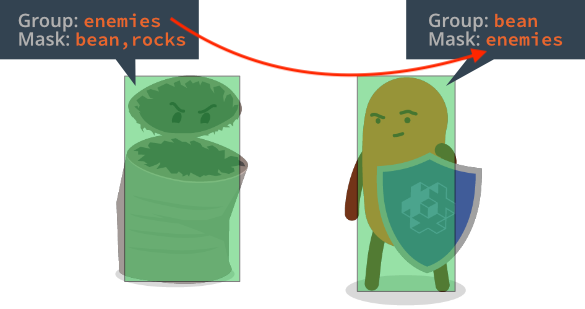

# Physics

Defold includes a modified version of the [Box2D](http://www.box2d.org) physics engine (version 2.1) for 2D physics simulations and the Bullet physics engine (version 2.77) for 3D physics. It allows you to simulate Newtonian physics interactions between different types of _collision objects_. This manual explains how this works.

## Collision objects

A collision object is a component you use to give a game object physical behaviour. A collision object has physical properties like weight, restitution and friction and its spatial extension is defined by one or more _shapes_ that you attach to the component. Defold supports the following types of collision objects:

Static objects
: Static objects never move but a dynamic object that collides with a static object will react by bouncing and/or sliding. Static objects are very useful for building level geometry (i.e. ground and walls) that does not move. They are also cheaper performance-wise than dynamic objects. You cannot move or otherwise change static objects.

Dynamic objects
: Dynamic objects are simulated by the physics engine. The engine solves all collisions and applies resulting forces. Dynamic objects are good for objects that should behave realistically but you *cannot* directly manipulate the position and orientation of a dynamic object. The only way to affect them is indirectly, by applying forces.

Kinematic objects
: Kinematic objects register collisions with other physics objects, but the physics engine do not perform any automatic simulation. The job of resolving collisions, or ignoring them, is left to you. Kinematic objects are very good for player or script controlled objects that require fine grained control of the physical reactions, like a player character.

Triggers
: Triggers are objects that register simple collisions. They are good for objects that just need to register a hit (like a bullet) or as part of game logic where you want to trigger certain actions when an object reaches a specific point. Trigger are computationally cheaper than kinematic objects and should be used in favor of those if possible.

## Adding a collision object component

A collision object component has a set of *Properties* that sets its type and physics properties. It also contains one or more *Shapes* that define the whole shape of the physics object.

To add a collision object component to a game object:

1. In the *Outline* view, <kbd>right click</kbd> the game object and select <kbd>Add Component ▸ Collision Object</kbd> from the context menu. This creates a new component with no shapes.
2. <kbd>Right click</kbd> the new component and select <kbd>Add Shape ▸ Box / Capsule / Sphere</kbd>. This adds a new shape to the collision object component. You can add any number of shapes to the component.
3. Use the move, rotate and scale tools to edit the shapes.
4. Select the component in the *Outline* and edit the collision object's *Properties*.

{srcset="images/physics/collision_object@2x.png 2x"}

Id
: The identity of the component.

Collision Shape
: This property is used for tile map geometry that does not use ordinary primitive shapes. See below for more information.

Type
: The type of collision object: `Dynamic`, `Kinematic`, `Static` or `Trigger`. If you set the object to dynamic you _must_ set the *Mass* property to a non zero value. For dynamic or static objects you should also check that the *Friction* and *Restitution* values are good for your use-case.

Friction
: Friction makes it possible for objects to slide realistically against each other. The friction value is usually set between `0` (no friction at all---a very slippery object) and `1` (strong friction---an abrasive object). However, any positive value is valid.

  The friction strength is proportional to the normal force (this is called Coulomb friction). When the friction force is computed between two shapes (`A` and `B`), the friction values of both objects are combined by the geometric mean:

  $$
  F_{combined} = \sqrt{ F_A \times F_B }
  $$

  This means that if one of the objects has zero friction then the contact between them will have zero friction.

Restitution
: The restitution value sets the "bounciness" of the object. The value is usually between 0 (inelastic collision—the object does not bounce at all) and 1 (perfectly elastic collision---the object's velocity will be exactly reflected in the bounce)

  Restitution values between two shapes (`A` and `B`) are combined using the following formula:

  $$
  R = \max{ \left( R_A, R_B \right) }
  $$

  When a shape develops multiple contacts, restitution is simulated approximately because Box2D uses an iterative solver. Box2D also uses inelastic collisions when the collision velocity is small to prevent bounce-jitter


Linear damping
: Linear damping reduces the linear velocity of the body. It is different from friction, which only occurs during contact, and can be used to give objects a floaty appearance, like they are moving through something thicker than air. Valid values are between 0 and 1.

  Box2D approximates damping for stability and performance. At small values, the damping effect is independent of the time step while at larger damping values, the damping effect varies with the time step. If you run your game with a fixed time step, this never becomes an issue.

Angular damping
: Angular damping works like linear damping but reduces the angular velocity of the body. Valid values are between 0 and 1.

Locked rotation
: Setting this property totally disables rotation on the collision object, no matter what forces are brought to it.

Group
: The name of the collison group the object should belong to. You can have 16 different groups and you name them as you see fit for your game. For example "players", "bullets", "enemies" and "world". If the *Collision Shape* is set to a tile map, this field is not used but the groups names are taken from the tile source.

Mask
: The other _groups_ this object should collide with. You can name one group or specify multiple groups in a comma separated list. If you leave the Mask field empty, the object will not collide with anything.

### Units used by the physics engine simulation

The physics engine simulates Newtonian physics and it is designed to work well with meters, kilograms and seconds (MKS) units. Furthermore, the physics engine is tuned to work well with moving objects of a size in the 0.1 to 10 meters range (static objects can be larger) and by default the engine treats 1 unit (pixel) as 1 meter. This conversion between pixels and meters is convenient on a simulation level, but from a game creation perspective it isn't very useful. With default settings a collision shape with a size of 200 pixels would be treated as having a size of 200 meters which is well outside of the recommended range, at least for a moving object. In general it is required that the physics simulation is scaled for it to work well with the typical size of objects in a game. The scale of the physics simulation can be changed in `game.project` via the [physics scale setting](/manuals/project-settings/#_physics). Setting this value to for instance 0.02 would mean that 200 pixels would be treated as a 4 meters. Do note that the gravity (also changed in `game.project`) has to be increased to accommodate for the change in scale.

## Group and mask

The physics engine allows you to group your physics objects and filter how they should collide. This is handled by named _collision groups_. For each collision object you create two properties control how the object collides with other objects, *Group* and *Mask*.

For a collision between two objects to register both objects must mutually specify each other's groups in their *Mask* field.

{srcset="images/physics/collision_group@2x.png 2x"}

The *Mask* field can contain multiple group names, allowing for complex interaction scenarios.

## Tilesource collision shapes

Defold includes a feature allowing you to easily generate physics shapes for a tile map. The [Tilemap manual](/manuals/tilemap/) explains how to add collision groups to a tile source and assign tiles to collision groups.

To add collision to a tile map:

1. Add the tilemap to a game object by <kbd>right-clicking</kbd> the game object and selecting <kbd>Add Component File</kbd>. Select the tile map file.
2. Add a collision object component to the game object by <kbd>right-clicking</kbd> the game object and selecting <kbd>Add Component ▸ Collision Object</kbd>.
3. Instead of adding shapes to the component, set the *Collision Shape* property to the *tilemap* file.
4. Set up the collision object component *Properties* as usual.

{srcset="images/physics/collision_tilemap@2x.png 2x"}

Note that the *Group* property is not used here since the collision groups are defined in the tile map's tile source.

## Collision messages

When two objects collide, the engine will broadcast messages to all components in both objects:

**`"collision_response"`**

This message is sent for all collision objects. It has the following fields set:

`other_id`
: the id of the instance the collision object collided with (`hash`)

`other_position`
: the world position of the instance the collision object collided with (`vector3`)

`group`
: the collision group of the other collision object (`hash`)

The collision_response message is only adequate to resolve collisions where you don't need any details on the actual intersection of the objects, for example if you want to detect if a bullet hits an enemy. There is only one of these messages sent for any colliding pair of objects each frame.

**`"contact_point_response"`**

This message is sent when one of the colliding objects is dynamic or kinematic. It has the following fields set:

`position`
: world position of the contact point (`vector3`).

`normal`
: normal in world space of the contact point, which points from the other object towards the current object (`vector3`).

`relative_velocity`
: the relative velocity of the collision object as observed from the other object (`vector3`).

`distance`
: the penetration distance between the objects -- non negative (`number`).

`applied_impulse`
: the impulse the contact resulted in (`number`).

`life_time`
: (*not currently used!*) life time of the contact (`number`).

`mass`
: the mass of the current collision object in kg (`number`).

`other_mass`
: the mass of the other collision object in kg (`number`).

`other_id`
: the id of the instance the collision object is in contact with (`hash`).

`other_position`
: the world position of the other collision object (`vector3`).

`group`
: the collision group of the other collision object (`hash`).

For a game or application where you need to separate objects perfectly, the `"contact_point_response"` message gives you all information you need. However, note that for any given collision pair, several `"contact_point_response"` messages can be received each frame, depending on the nature of the collision. See below for more information.

## Trigger messages

Triggers are light weight collision objects. Thay are similar to ray casts in that they read the physics world as opposed to interacting with it.

In a trigger collision `"collision_response"` messages are sent. In addition, triggers also send a special `"trigger_response"` message when the collision begins and end. The message has the following fields:

`other_id`
: the id of the instance the collision object collided with (`hash`).

`enter`
: `true` if the interaction was an entry into the trigger, `false` if it was an exit. (`boolean`).

## Ray casts

Ray casts are used to read the physics world along a linear ray. To cast a ray into the physics world, you provide a start and end position as well as a set of collision groups to test against.

If the ray hits a physics object you will get information about the object it hit. Rays intersect with dynamic, kinematic and static objects. They do not interact with triggers.

```lua
function update(self, dt)
  -- request ray cast
  local my_start = vmath.vector3(0, 0, 0)
  local my_end = vmath.vector3(100, 1000, 1000)
  local my_groups = { hash("my_group1"), hash("my_group2") }

  local result = physics.raycast(my_start, my_end, my_groups)
  if result then
      -- act on the hit (see 'ray_cast_response' message for all values)
      print(result.id)
  end
end
```

## Resolving kinematic collisions

Using kinematic collision objects require you to resolve collisions yourself and move the objects as a reaction. A naive implementation of separating two colliding objects looks like this:

```lua
function on_message(self, message_id, message, sender)
  -- Handle collision
  if message_id == hash("contact_point_response") then
    local newpos = go.get_position() + message.normal * message.distance
    go.set_position(newpos)
  end
end
```

This code will separate your kinematic object from other physics object it penetrates, but the separation often overshoots and you will see jitter in many cases. To understand the problem better, consider the following case where a player character has collided with two objects, *A* and *B*:

{srcset="images/physics/collision_multi@2x.png 2x"}

The physics engine will send multiple `"contact_point_response"` message, one for object *A* and one for object *B* the frame the collision occurs. If you move the character in response to each penetration, as in the naive code above, the resulting separation would be:

- Move the character out of object *A* according to its penetration distance (the black arrow)
- Move the character out of object *B* according to its penetration distance (the black arrow)

The order of these is arbitrary but the result is the same either way: a total separation that is the *sum of the individual penetration vectors*:

{srcset="images/physics/separation_naive@2x.png 2x"}

To properly separate the character from objects *A* and *B*, you need to handle each contact point's penetration distance and check if any previous separations have already, wholly or partially, solved the separation.

Suppose that the first contact point message comes from object *A* and that you move the character out by *A*'s penetration vector:

{srcset="images/physics/separation_step1@2x.png 2x"}

Then the character has already been partially separated from *B*. The final compensation necessary to perform full separation from object *B* is indicated by the black arrow above. The length of the compensation vector can be calculated by projecting the penetration vector of *A* onto the penetration vector of *B*:

{srcset="images/physics/projection@2x.png 2x"}

$$l = vmath.project(A, B) \times vmath.length(B)$$

The compensation vector can be found by reducing the length of *B* by *l*. To calculate this for an arbitrary number of penetrations, you can accumulate the necessary correction in a vector by, for each contact point, and starting with a zero length correction vector:

1. Project the current correction against the contact's penetration vector.
2. Calculate what compensation is left from the penetration vector (as per the formula above).
3. Move the object by the compensation vector.
4. Add the compensation to the accumulated correction.

A complete implementation looks like this:

```lua
function init(self)
  -- correction vector
  self.correction = vmath.vector3()
end

function update(self, dt)
  -- reset correction
  self.correction = vmath.vector3()
end

function on_message(self, message_id, message, sender)
  -- Handle collision
  if message_id == hash("contact_point_response") then
    -- Get the info needed to move out of collision. We might
    -- get several contact points back and have to calculate
    -- how to move out of all of them by accumulating a
    -- correction vector for this frame:
    if message.distance > 0 then
      -- First, project the accumulated correction onto
      -- the penetration vector
      local proj = vmath.project(self.correction, message.normal * message.distance)
      if proj < 1 then
        -- Only care for projections that does not overshoot.
        local comp = (message.distance - message.distance * proj) * message.normal
        -- Apply compensation
        go.set_position(go.get_position() + comp)
        -- Accumulate correction done
        self.correction = self.correction + comp
      end
    end
  end
end
```

## Caveats and common issues

Collection proxies
: Through collection proxies it is possible to load more than one top level collection, or *game world* into the engine. When doing so it is important to know that each top level collection is a separate physical world. Physics interactions (collisions, triggers, ray-casts) only happen between objects belonging to the same world. So even if the collision objects from two worlds visually sits right on top of each other, there cannot be any physics interaction between them.
