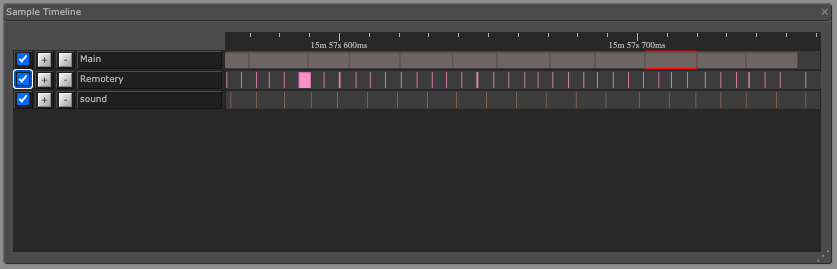

# Profiling

Defold includes a set of profiling tools that are integrated with the engine and the build pipeline. These are designed to help find problems with performance and memory usage. The built-in profilers are available on debug builds only. The frame profiler that is used in Defold is the [Remotery profiler by Celtoys](https://github.com/Celtoys/Remotery).

## The runtime visual profiler

Debug builds feature a runtime visual profiler that displays live information rendered overlayed on top of the running application:

```lua
function on_reload(self)
    -- Toggle the visual profiler on hot reload.
    profiler.enable_ui(true)
end
```


The visual profiler provides a number of different function that can be used to change the way the visual profiler presents its data:

```lua

profiler.set_ui_mode()
profiler.set_ui_view_mode()
profiler.view_recorded_frame()
```

Refer to a the [profiler API reference](/ref/stable/profiler/) for more information about the profiler functions.

## The web profiler

While running a debug build of the game, an interactive web-based profiler can be accessed through a browser. It allows you to sample your game while it is running and analyze individual frames in detail.

To access the profiler:

1. Start your game on your target device.
2. Select <kbd> Debug ▸ Open Web Profiler</kbd> menu. Alternatively, for example, when you use multiple targets simultaneously, you can open a web browser and point it to `http://<device IP>:8002` where `<device IP>` is the IP address of the device. You can find the IP numbers of your target devices in the <kbd>Project ▸ Target</kbd> menu.


### CPU/Frame profiler
The CPU profiler is divided into several sections that all give different views into the runing game. Press the Pause button in the top right corner to temporarily stop the profiler from updating the views.


Sample Timeline
: The Sample Timeline will show the frames of data captured in the engine, one horizontal timeline per Thread. Main is the main thread where all of the game logic and most of the engine code is run. Remotery is for the profiler itself and Sound is for the sound mixing and playback thread. You can zoom in and out (using the mouse wheel) and select individual frames to see the details of a frame in the Frame Data view.

  


Frame Data
: The Frame Data view is a table where all data for the currently selected frame is broken down into detail. You can view how many milliseconds are spent in each engine scope.

  


Global Properties
: The Global Properties view shows a table of counters. They make it is easy to, for instance, track the number of draw calls or the number of components of a certain type.

  


### Resource profiler
The resource profiler is divided into 2 sections, one showing a hierarchical view of the collections, game objects and components currently instantiated in your game, and the other showing all currently loaded resources.


Collection view
: The collection view shows hierarchical list of all game objects and components currently instantiated in the game and from which collection they originate. This is a very useful tool when you need to dig into and understand what you have instanced in your game at any given time and from where the objects originate.

Resources view
: The resources view shows all resources currently loaded into memory, their size and the number of references to each resource. This is useful when optimizing memory usage in your application when you need to understand what is loaded into memory at any given time.


## Build reports
When bundling your game there is an option to create a build report. This is very useful to get a grip on the size of all the assets that are part of your game bundle. Simply check the *Generate build report* checkbox when bundling the game.

{srcset="images/profiling/build_report@2x.png 2x"}

The builder will produce a file called "report.html" alongside the game bundle. Open the file in a web browser to inspect the report:

{srcset="images/profiling/build_report_html@2x.png 2x"}

The *Overview* gives an over all visual breakdown of the project size based on resource type.

*Resources* shows a detailed list of resources that you can sort based on size, compression ratio, encryption, type and directory name. Use the "search" field to filter the resource entries displayed.

The *Structure* section shows sizes based on how resources are organized in the project file structure. Entries are color coded from green (light) to blue (heavy) according to the relative size of the file and directory content.


## External tools
In addition to the built-in tools, there is a wide range of free high quality tracing and profiling tools available. Here is a selection:

ProFi (Lua)
: We do not ship any built-in Lua profiler but there are external libraries that are easy enough to use. To find where your scripts spend time, either insert time measures in your code yourself, or use a Lua profiling library like ProFi.

  https://github.com/jgrahamc/ProFi

  Note that pure Lua profilers add quite a lot of overhead with each hook they install. For this reason you should be a bit wary of the timing profiles you get from such a tool. Counting profiles are accurate enough though.

Instruments (macOS and iOS)
: This is a performance analyzer and visualizer that is part of Xcode. It allows you to trace and inspect the behavior of one or more apps or processes, examine device specific features (like Wi-Fi and Bluetooth) and much more.

  {srcset="images/profiling/instruments@2x.png 2x"}

OpenGL profiler (macOS)
: Part of the package "Additional Tools for Xcode" that you can download from Apple (select <kbd>Xcode ▸ Open Developer Tool ▸ More Developer Tools...</kbd> in the Xcode menu).

  This tool allows you to inspect a running Defold application and see how it uses OpenGL. It allows you to do traces of OpenGL function calls, set breakpoints on OpenGL functions, investigate application resources (textures, programs, shaders etc), look at buffer contents, and check other aspects of the OpenGL state.

  {srcset="images/profiling/opengl@2x.png 2x"}

Android Profiler (Android)
: https://developer.android.com/studio/profile/android-profiler.html

  A set of profiling tools that captures realtime data of your game's CPU, memory, and network activity. You can perform sample-based method tracing of code execution, capture heap dumps, view memory allocations, and inspect the details of network-transmitted files. Using the tool requires that you set `android:debuggable="true"` in "AndroidManifest.xml".

  

  Note: Since Android Studio 4.1 it is also possible to [run the profiling tools without starting Android Studio](https://developer.android.com/studio/profile/android-profiler.html#standalone-profilers).

Graphics API Debugger (Android)
: https://github.com/google/gapid

  This is a collection of tools that allows you to inspect, tweak and replay calls from an application to a graphics driver. To use the tool requires that you set `android:debuggable="true"` in "AndroidManifest.xml".

  
