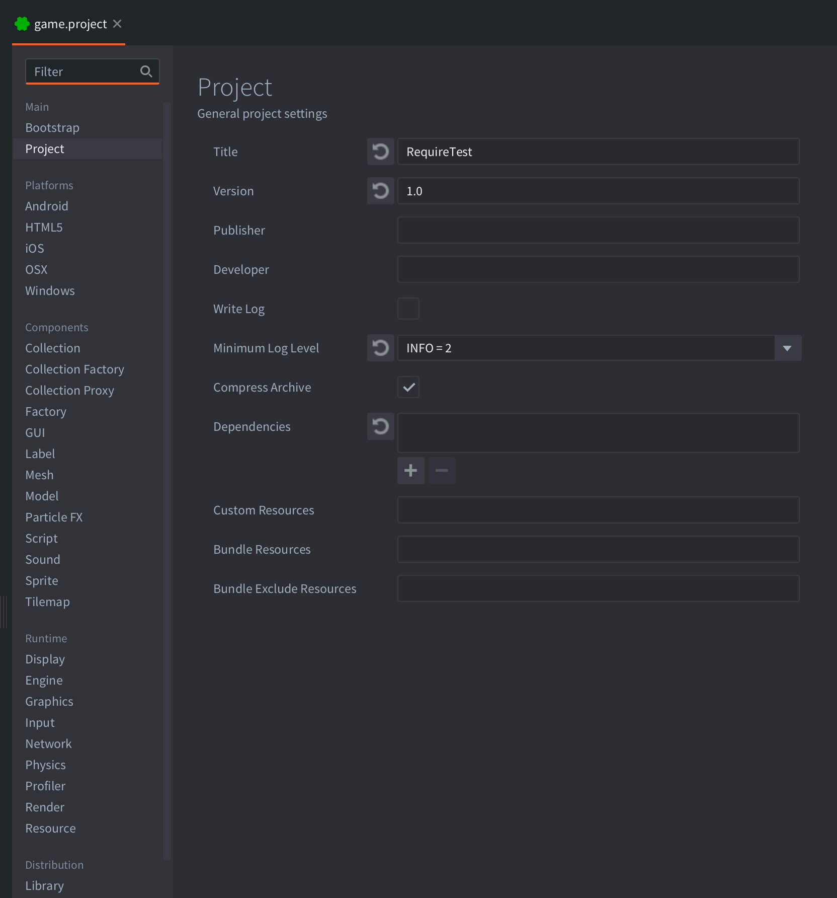

# Project settings

The file *game.project* contains all project wide settings. It must stay in the root folder of the project and must be named *game.project*. The first thing the engine does when starting up and launching your game is look for this file.

Every setting in the file belongs to a category. When you open the file Defold presents all settings grouped by category.



Below are all the available settings, arranged by section. Some settings are not yet exposed in the settings editor (these are marked "hidden setting" below), but can be set manually by right clicking "game.project" and selecting <kbd>Open With ▸ Text Editor</kbd>.

## Project

#### Title
The title of the application.

#### Version
The version of the application.

#### Write Log
When checked, the engine will write a log file *log.txt* in the project root. When running on iOS, the log file can be accessed through iTunes and the *Apps* tab and the *File Sharing* section. On Android, the file is stored in the app's external storage. When running the *dmengine* development app, you can view the log with:

```bash
$ adb shell cat /mnt/sdcard/Android/data/com.defold.dmengine/files/log.txt
```

#### Compress Archive
Enables compression of archives when bundling. Note that this currently applies to all platforms except Android where the apk already contains all data compressed.

#### Dependencies
A list of URLs to the project *Library URL*s. Refer to the [Libraries manual](/manuals/libraries/) for more information.

#### Custom Resources
A comma separated list of resources that will be included in the project. If directories are specified, all files and directories in that directory are recursively included. The resources can be loaded using [`sys.load_resource()`](/ref/sys/#sys.load_resource).

#### Bundle Resources
A comma separated list of directories containing resource files and folders that should be copied as-is into the resulting package when bundling. The directories must be specified with an absolute path from the project root, for example `/res`. The resource directory must contain subfolders named by `platform`, or `architecure-platform`.

  Supported platforms are `ios`, `android`, `osx`, `win32`, `linux`, `web`.

  A subfolder named `common` is also allowed, containing resource files common for all platforms.

#### Bundle Exclude Resources
A comma separated list of resources that should not be included in the bundle.

## Bootstrap

#### Main Collection
File reference of the collection to use for starting the application, `/logic/main.collection` by default.

#### Render
Which render setup file to use, which defines the render pipeline, `/builtins/render/default.render` by default.

## Library

#### Include Dirs
A space separated list of directories that should be shared from your project via library sharing.

## Script

#### Shared State
Check to share a single Lua state between all script types, unchecked by default.

## Display

#### Width
The width in pixels of the application window, `960` by default.

#### Height
The height in pixels of the application window, `640` by default.

#### High Dpi
Creates a high dpi back buffer on displays that support it. Typically the game will render in double the resolution than what is set in the *Width* and *Height* settings, which will still be the logical resolution used in scripts and properties.

#### Samples
How many samples to use for super sampling anti-aliasing. It sets the GLFW_FSAA_SAMPLES window hint. It is `0` by default, which means that anti-aliasing is turned off.

#### Fullscreen
Check if the application should start full screen. If unchecked, the application runs windowed.

#### Frame Cap
If `Vsync` checked, snaps to the closest matching swap interval for the set frame cap if a monitor is detected. Otherwise uses timers to respect the set value, 0 means no cap. This setting maps to `display.update_frequency`.

#### Vsync
Vertical sync, rely on hardware vsync for frame timing. Can be overridden depending on graphics driver and platform specifics.

#### Variable Dt (deprecated)
Deprecated. If checked, will check `Vsync` and set `Frame Cap` to 0 at build-time for equivalent behavior.

#### Display Profiles
Specifies which display profiles file to use, `/builtins/render/default.display_profilesc` by default. Learn more in the [GUI Layouts manual](/manuals/gui-layouts/#creating-display-profiles). 

#### Dynamic Orientation
Check if the app should dynamically switch between portrait and landscape on device rotation. Note that the development app does not currently respect this setting.

## Physics

#### Type
Which type of physics to use, `2D` (default) or `3D`.

#### Gravity Y
World gravity along y-axis, `-10` by default (natural gravity)

#### Debug
Check if physics should be visualized for debugging.

#### Debug Alpha
Alpha component value for visualized physics, `0`--`1`. The value is `0.9` by default.

#### World Count
Max number of concurrent physics worlds, `4` by default. If you load more than 4 worlds simultaneously through collection proxies you need to increase this value. Be aware that each physics world allocates a fair amount of memory.

#### Gravity X
World gravity along x-axis, `0` by default.

#### Gravity Z
World gravity along z-axis, `0` by default.

#### Scale
Tells the physics engine how to scale the physics worlds in relation to the game world for numerical precision, `0.01`--`1.0`. If the value is set to `0.02`, it means that the physics engine will view 50 units as 1 meter ($1 / 0.02$). The default value is `1.0`.

#### Debug Scale
How big to draw unit objects in physics, like triads and normals, `30` by default.

#### Max Collisions
How many collisions that will be reported back to the scripts, `64` by default.

#### Max Contacts
How many contact points that will be reported back to the scripts, `128` by default.

#### Contact Impulse Limit
Ignore contact impulses with values less than this setting, `0.0` by default.

#### Ray Cast Limit 2d
The max number of 2d ray cast requests per frame. `64` by default.

#### Ray Cast Limit 3d
The max number of 3d ray cast requests per frame. `128` by default.

#### Trigger Overlap Capacity
The maximum number of overlapping physics triggers. `16` by default.

## Graphics

#### Default Texture Min Filter
Specifies which filtering to use for minification filtering, `linear` (default) or `nearest`.

#### Default Texture Mag Filter
Specifies which filtering to use for magnification filtering, `linear` (default) or `nearest`.

#### Max Draw Calls
The max number of render calls, `1024` by default.

#### Max Characters:
The number of characters pre-allocated in the text rendering buffer, i.e. the number of characters that can be displayed each frame, `8192` by default.

#### Max Debug Vertices
The maximum number of debug vertices. Used for physics shape rendering among other things, `10000` by default.

#### Texture Profiles
The texture profiles file to use for this project, `/builtins/graphics/default.texture_profiles` by default.

## Input

#### Repeat Delay
Seconds to wait before a held down input should start repeating itself, `0.5` by default.

#### Repeat Interval
Seconds to wait between each repetition of a held down input, `0.2` by default.

#### Gamepads
File reference of the gamepads config file, which maps gamepad signals to OS, `/builtins/input/default.gamepads` by default.

#### Game Binding
File reference of the input config file, which maps hardware inputs to actions, `/input/game.input_binding` by default.

#### Use Accelerometer
Check to make the engine receive accelerator input events each frame. Disabling accelerometer input may give some performance benefit, checked by default.

## Resource

#### Http Cache
If checked, a HTTP cache is enabled for faster loading of resources over the network to the running engine on device, unset by default.

#### Uri
Where to find the project build data, in URI format.

#### Max Resources
The max number of resources that can be loaded at the same time, `1024` by default.

## Network

#### Http Timeout
The HTTP timeout in seconds. Set to `0` to disable timeout, which is the default.

## Collection

#### Max Instances
Max number of game object instances in a collection, `1024` by default.

## Sound

#### Gain
Global gain (volume), `0`--`1`, The value is `1` by default.

#### Max Sound Data
Max number of sound resources, i.e the number of unique sound files at runtime, `128` by default.

#### Max Sound Buffers
(Currently not used) Max number of concurrent sound buffers, `32` by default.

#### Max Sound Sources
(Currently not used) Max number of concurrently playing sounds, `16` by default.

#### Max Sound Instances
Max number of concurrent sound instances, i.e. actual sounds played at the same time. `256` by default.

## Sprite

#### Max Count
Max number of sprites per collection, `128` by default.

#### Subpixels
Check to allow sprites to appear unaligned with respect to pixels, checked by default.

## Tilemap

#### Max Count
Max number of tile maps per collection, `16` by default.

#### Max Tile Count
Max number of concurrent visible tiles per collection, `2048` by default.

## Spine

#### Max Count
Max number of spine models, `128` by default.

## GUI

#### Max Count
Max number of GUI components, `64` by default.

#### Max Particlefx Count
The max number of concurrent emitters, `64` by default.

#### Max Particle Count
The max number of concurrent particles, `1024` by default.

## Label

#### Max Count
Max number of labels, `64` by default.

#### Subpixels
Check to allow lables to appear unaligned with respect to pixels, checked by default.

## Particle FX

#### Max Count
The max number of concurrent emitters, `64` by default.

#### Max Particle Count
The max number of concurrent particles, `1024` by default.

## Collection proxy

#### Max Count
Max number of collection proxies, `8` by default.

## Collection factory

#### Max Count
Max number of collection factories, `128` by default.

## Factory

#### Max Count
Max number of game object factories, `128` by default.

## iOS

#### App Icon 57x57--180x180
Image file (.png) to use as application icon at given width and height dimensions `W` &times; `H`.

#### Launch Image 320x480--2436x1125
Image file (.png) to use as application launch image for resolution width and height dimensions `W` &times; `H`. iOS selects the display resolution based on the launch image.

#### Pre Rendered Icons
(iOS 6 and earlier) Check if your icons are pre-rendered. If this is unchecked the icons will get a glossy highlight added automatically.

#### Bundle Identifier
The bundle identifier lets iOS recognize any updates to your app. Your bundle ID must be registered with Apple and be unique to your app. You cannot use the same identifier for both iOS and OS X apps.

#### Info.plist
If specified, use this info.plist file when bundling your app.

#### Entitlements
If specified, can override wildcard entitlements defined in the supplied provisioning profile (.entitlements, .xcent, .plist).

## Android

#### App Icon 36x36--192x192
Image file (.png) to use as application icon at given width and height dimensions `W` &times; `H`.

#### Push Icon Small--LargeXxxhdpi
Image files (.png) to be used as custom push notification icon on Android. The icons will automatically be used for both local or remote push notifications. If not set the application icon will be used by default.

#### Push Field Title
Specifies which payload JSON field should be used as notification title. Leaving this setting empty makes the pushes default to the application name as title.

#### Push Field Text
Specifies which payload JSON field should be used as notification text. If left empty, the text in the field `alert` is used, just as on iOS.

#### Version Code
An integer value indicating the version of the app. Increase the value for each subsequent update.

#### Package
Package identifier.

#### Gcm Sender Id
Google Cloud Messaging Sender Id. Set this to the string assigned by Google to enable push notifications.

#### Manifest
If set, use the specified Android manifest XML file when bundling.

#### Iap Provider
Specifies which store to use. Valid options are `Amazon` and `GooglePlay`, `GooglePlay` by default.

#### Input Method
Specifies which method to use to get keyboard input on Android devices. Valid options are `KeyEvent` (old method) and `HiddenInputField` (new). `KeyEvent` by default.

#### Immersive Mode
If set, hides the navigation and status bars and lets your app capture all touch events on the screen.

#### Debuggable
Whether or not the application can be debugged using tools such as [GAPID](https://github.com/google/gapid) or [Android Studio](https://developer.android.com/studio/profile/android-profiler). This will set the `android:debuggable` flag in the Android manifest.

## MacOS / OS X

#### App Icon
Image file (.png) to use as application icon on MacOS.

#### Info.plist
If set, use the specified info.plist file when bundling.

#### Bundle Identifier
The bundle identifier lets OS X recognize updates to your app. Your bundle ID must be registered with Apple and be unique to your app. You cannot use the same identifier for both iOS and OS X apps.

## Windows

#### App Icon
Image file (.ico) to use as application icon on Windows. Read more about how to create a .ico file in the [Windows manual](/manuals/windows).

#### Iap Provider
Specifies which store to use. Valid options are `None` and `Gameroom`, `None` by default.

## HTML5

#### Heap Size
Heap size (number of megabytes) for Emscripten to use. By default this value is 256MB.

#### .html Shell
Use the specified template HTML file when bundling. By default `/builtins/manifests/web/engine_template.html`.

#### Custom .css
Use the specified theme CSS file when bundling. By default `/builtins/manifests/web/light_theme.css`.

#### Splash Image
If set, use the specified splash image on startup when bundling instead of Defold logo.

#### Archive Location Prefix
When bundling for HTML5 game data is split up into one or more archive data files. When the engine starts the game, these archive files are read into memory. Use this setting to specify the location of the data, `archive` by default.

#### Archive Location Suffix
Suffix to be appended to the archive files. Useful to, for instance, force non-cached content from a CDN (`?version2` for example).

#### Engine Arguments
List of arguments that will be passed to the engine.

#### Show Fullscreen Button
Enables Fullscreen Button in `index.html` file. By default `true`.

#### Show Made With Defold
Enables Made With Defold link in `index.html` file. By default `true`.

#### Scale Mode
Specifies which method to use to scale the game canvas. By default `Downscale Fit`.

## IAP

#### Auto Finish Transactions
Check to automatically finish IAP transactions. If unchecked, you need to explicitly call `iap.finish()` after a successful transaction, checked by default.

## Live update

#### Private Key
If set, use the specified private key file when bundling live update content. If no key file is set, a key is generated.

#### Public Key
If set, use the specified public key file when bundling live update content. If no key file is set, a key is generated.

## Native extension

#### _App Manifest_
If set, use the app manifest to customize the engine build. This allows you to remove unneeded parts from the engine making it possible to decrease the final binary size. Note that this feature is in alpha state. Please visit [the forum](https://forum.defold.com/t/native-extensions/4946/142) for information on how to proceed.

## Profiler

#### Track Cpu
If checked, enable CPU profiling in release versions of the builds. Normally, you can only access profiling information in debug builds.

## File format

The format of the settings file is simple text (INI format) and can be edited by any standard text editor. The format looks like this:

```ini
[category1]
setting1 = value
setting2 = value
[category2]
...
```

A real example is:

```ini
[bootstrap]
main_collection = /main/main.collectionc
```

which means that the setting *main_collection* belongs to the *bootstrap* category.
Whenever a file reference is used, like the example above, the path needs to be appended with a 'c' character, which means you're referencing the compiled version of the file.
Also note that the folder containing *game.project* will be the project root, which is why there is an initial '/' in the setting path.

## Setting config values on engine startup

When the engine starts, it is possible to provide config values from the command line that override the *game.project* settings:

```bash
# Specify a bootstap collection
$ dmengine --config=bootstrap.main_collection=/my.collectionc

# Set two custom config values
$ dmengine --config=test.my_value=4711 --config=test2.my_value2=1234
```

Custom values can---just like any other config value---be read with [`sys.get_config()`](/ref/sys/#sys.get_config):

```lua
local my_value = tonumber(sys.get_config("test.my_value"))
```

## Vsync, frame cap, and swap interval
The first thing of note is that on desktop platforms vsync can be controlled globally by graphics card settings. If for example vsync is force-enabled in the graphics control panel it is not user controllable, e.g. the setting cannot be accessed or modified from Defold. Most mobile devices also has vsync enabled by default.

With `Vsync` checked in `game.project` the engine relies on hardware vsync and uses a fixed time step `dt` based on any detected monitor refresh rate. This is the default setting. With `Vsync` checked and `Frame cap` > 0, the rate will be clamped to a swap interval that matches any detected main monitor refresh rate. With `Vsync` unchecked and `Frame cap` 0, the time step is not fixed but instead uses actual elapsed time difference for `dt`. With `Vsync` unchecked and `Frame cap` > 0, timers are used to respect the set frame cap value. There is no guarantee that the frame cap will be achieved depending on platform specifics and hardware settings.

Swap interval is the interval with which to swap the front and back buffers in sync with vertical blanks (v-blank), the hardware event where the screen image is updated with data from the front buffer. A value of 1 swaps the buffers at every v-blank, a value of 2 swaps the buffers every other v-blank and so on. A value of 0 disables waiting for v-blank before swapping the buffers\*. Setting `swap_interval` is done by calling the [```set_vsync_swap_interval```](/ref/sys/#sys.set_vsync_swap_interval:swap_interval) function.

### Caveat
Currently, Defold queries for monitor refresh rate at init and uses that as a basis for picking a fixed `dt`. If you want to support monitors using variable refresh rate (GSync or FreeSync for example) or other scenarios where the refresh rate might not be trivial to query, uncheck `Vsync`to let the engine measure actual `dt` each frame instead of relying on a fixed time step.


### Vsync and frame cap in Defold*

<table>
  <tr>
    <th></th>
    <th><b>Frame cap 0 (default)</b></th>
    <th><b>Frame cap > 0</b></th>
  </tr>
  <tr>
    <td><b>Vsync checked (default)</b></td>
    <td>Relies on hardware vsync. Fixed <code>dt</code> of <code>1/(detected monitor refresh rate)</code>.</td>
    <td>Fixed <code>dt</code> of <code>(swap interval)/(detected monitor refresh rate)</code> where swap interval is clamped to the closest matching monitor refresh rate frame cap multiple.</td>
  </tr>
  <tr>
    <td><b>Vsync unchecked</b></td>
    <td>Calculates <code>dt</code> each frame based on elapsed system time. Vsync might still be enabled in driver settings.</td>
    <td>Uses a fixed <code>dt</code> of <code>1 / (Frame cap)</code>. Uses timers and sleeps to respect the set frame cap.</td>
  </tr>
</table>
