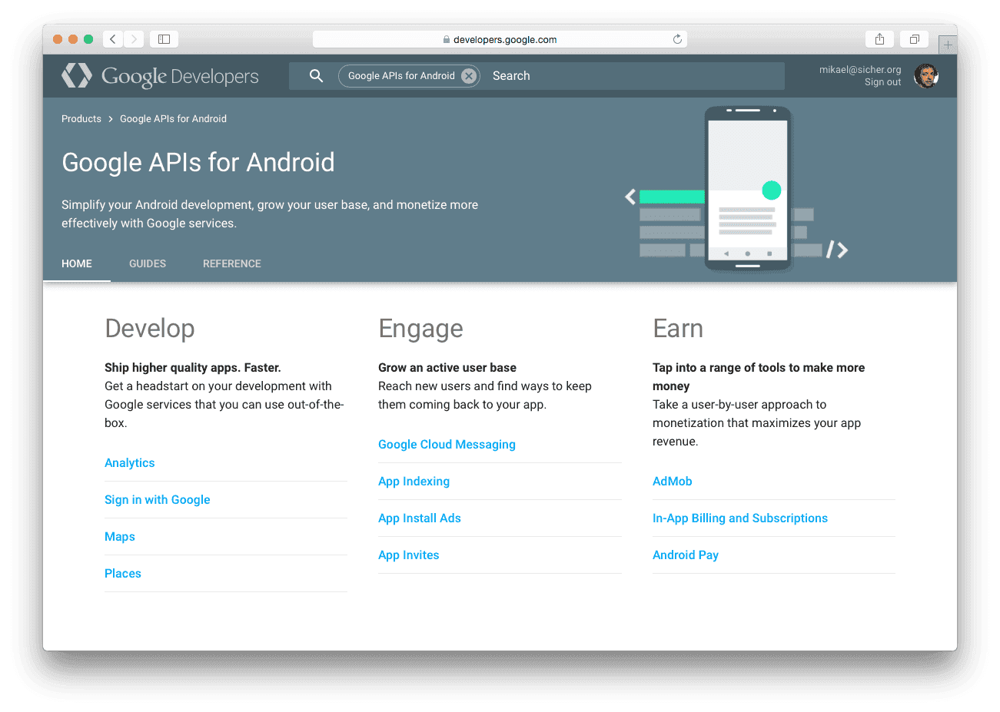
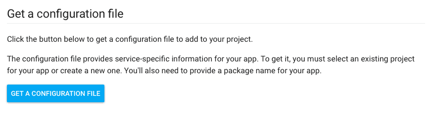
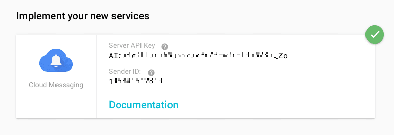

= Push notifications
:location: documentation manuals extensions
:type: manual

This document describes how to set up and implement remote and local push
notifications for your game or application.

Push notifications are available on iOS and Android devices and allow your game to inform the player about changes and updates. The core functionality is similar between iOS and Android but there are some platform specific differences that you need to consider.

For a push notifications to find its way from server to the target device, certain bits of information is required for your app. The most complex parts consists of security information that you set in the application so the notification system can verify the legitimity of the client receiving notifications. But you will also need a piece of security information for your notification server so the Apple or Google servers can verify that your server is a legitimate notification sender. Finally, when you send notifications, you need to be able to uniquely direct notifications to specific user's device. For that you retreive and use a token that is unique to the particular device (i.e. user).

## iOS setup

::: sidenote
To get acquainted with the Apple Push Notification Servide, a good idea is to start by reading Apple's own documentation on how the service works. You find it on https://developer.apple.com/library/ios/documentation/NetworkingInternet/Conceptual/RemoteNotificationsPG/Chapters/ApplePushService.html
:::

On iOS, you need the following information to send notifications:

* Push Notifications must be enabled in the App ID.
* A provisioning profile containing this valid App ID is also required.
* You also need an Apple Push Notification service SSL Certificate to be allowed to send notification data to the Apple Push Notification server from your messaging server application.

To get everything in place, head over to the [Apple Developer Member center](https://developer.apple.com/membercenter). Edit your AppID to enable Push Notifications.


You also need to create an Apple Push Notification service SSL certificate:


The certificate will be needed on your server that will send out push notifications. While developing, you can download and install the certificate on your machine and run a push test apps such as [APNS-Pusher](https://github.com/KnuffApp/APNS-Pusher) or [NWPusher](https://github.com/noodlewerk/NWPusher).

Make sure that you create a new provisioning profile, from the AppID and that you get that onto your device. You can do that manually from the "Member Center" page or through Xcode.


Note that it can take a while for Apple's sandbox servers to update so you might not get push to work immediately. Be patient.

[[above-code]]
Now it's time to run some test code:

```
local function push_listener(self, payload, origin)
	-- The payload arrives here.
	pprint(payload)
end

function init(self)
	local sysinfo = sys.get_sys_info()
	if sysinfo.system_name == "Android" then
		msg.post("#", "push_android")
	elseif sysinfo.system_name == "iPhone OS" then
		msg.post("#", "push_ios")	
	end
end

function on_message(self, message_id, message)
	if message_id == hash("push_ios") then
		local alerts = {push.NOTIFICATION_BADGE, push.NOTIFICATION_SOUND, push.NOTIFICATION_ALERT}
		push.register(alerts, function (self, token, error)
			if token then
				local t = ""
				for i = 1,#token do
					t = t .. string.format("%02x", string.byte(token, i))
				end
				-- Print the device token
				print(t)
			else
				-- Error
				print(error.error)
			end
		end)	
		push.set_listener(push_listener)
	elseif message_id == hash("push_android") then
		push.register(nil, function (self, token, error)
			if token then
				-- Print the device token
				print(token)
			else
				-- Error
				print(error.error)
			end
		end)
		push.set_listener(push_listener)
	end
end
```

If all goes well the notification listener will be registered and we get a token that we can use:

----
DEBUG:SCRIPT: 1f8ba7869b84b10df69a07aa623cd7f55f62bca22cef61b51fedac643ec61ad8
----

If you're running a push test app, you can now try to send notifications to your device using the device token and the APN service SSL certificate.


The notification should arrive to the client soon after you send it, from within your test application, arriving to the function `push_listener()`:

----
DEBUG:SCRIPT: 
{
  aps = {
    badge = 42,
    alert = Testing.. (1),
    sound = default,
  }
}
----

And from the iOS homescreen:


If you wish to update the badge count from within the application, use the `push.set_badge_count()` function.

## Android setup

::: sidenote
Google has extensive documentation for Google Cloud Messaging. We encourage you to start by reading it on https://developers.google.com/cloud-messaging/gcm
:::

On Android, you need the following information to send notifications:

* A GCM Sender ID. This is built into the application.
* A Server API Key to enable sending notifications through Google's servers.

The setup is quite straightforward. Start by heading over to http://developers.google.com, click on "Android" and then "Google Cloud Messaging".



A bit down the page there is a button saying "Get a configuration file".



Click the button and follow the instructions. At the end you will get a Server API Key and a Sender ID.



Copy the Sender ID and paste it into the *gcm_sender_id* field in your Defold project settings.


Now everything is ready on the client. The [above code](#above-code) example works for Android as well. Run it and copy the device token id.

----
DEBUG:SCRIPT: APA91bHkcKm0QHAMUCEQ_Dlpq2gzset6vh0cz46kDDV6230C5rFivyWZMCxGXcjxRDKg1PK4z1kWg3xnUVqSDiO_4_RiG8b8HeYJfaoW1ho4ukWYXjq5RE0Sy-JTyrhqRusUP_BxRTcE
----

Now we have all information we need. Google's notifications are sent through a Web API so we can use *curl* to send test messages:

----
$ curl  -X POST  -H "Content-type: application/json"  -H 'Authorization: key=SERVER_KEY' -d '{"registration_ids" : ["TOKEN_ID"], "data": {"alert": "Hello"}}' https://android.googleapis.com/gcm/send
----

Replace *SERVER_KEY* and *TOKEN_ID* with your specific keys.

## Local push notifications

Local push notifications are supported as well as remote ones. After the regular setup you can schedule a local notification:

```
-- Schedule a local push in 3 seconds
local payload = '{"data" : {"field" : "Some value", "field2" : "Other value"}}'
id, err = push.schedule(3, "A notification!", "Hello there", payload, { action = "get going" })
```

The id is uniquely identifying this scheduled notification and can be stored for later The final parameter to `push.schedule()` takes a table with platform specific settings:

action
: (iOS only). The alert action string to be used as the title of the right button of the alert or the value of the unlock slider, where the value replaces "unlock" in "slide to unlock" text.

badge_count
: (iOS only). The numeric value of the icon badge. Set to 0 to clear the badge.

priority
: (Android only). The priority is a hint to the device UI about how the notification should be displayed. There are five priority levels, from -2 to 2 where -1 is the lowest priority and 2 the highest. Unless specified, a default priority level of 2 is used.


## Inspecting scheduled notifications

The API provides two functions to inspect what is currently scheduled. 

```
n = push.get_scheduled(id)
pprint(n)
```

Which results in a table containing all details on the scheduled notification:

----
DEBUG:SCRIPT: 
{
  payload = {"data":{"field":"Some value","field2":"Other value"}},
  title = A notification!,
  priority = 2,
  seconds = 19.991938,
  message = Hello there,
}
----

Note that *seconds* indicate the number of seconds left for the notification to fire. It is also possible to retreive a table with _all_ scheduled notifications:

```
all_n = push.get_all_scheduled()
pprint(all_n)
```

Which results in a table pairing notification id:s with their respective data:

----
DEBUG:SCRIPT: 
{
  0 = {
    payload = {"data":{"field":"Some value","field2":"Other value"}},
    title = A notification!,
    priority = 2,
    seconds = 6.009774,
    message = Hey hey,
  }
  1 = {
    payload = {"data":{"field":"Some value","field2":"Other value"}},
    title = Another notification!,
    priority = 2,
    seconds = 12.652521,
    message = Hello there,
  }
  2 = {
    payload = {"data":{"field":"Some value","field2":"Other value"}},
    title = Hey, much notification!,
    priority = 2,
    seconds = 15.553719,
    message = Please answer!,
  }
}
----

