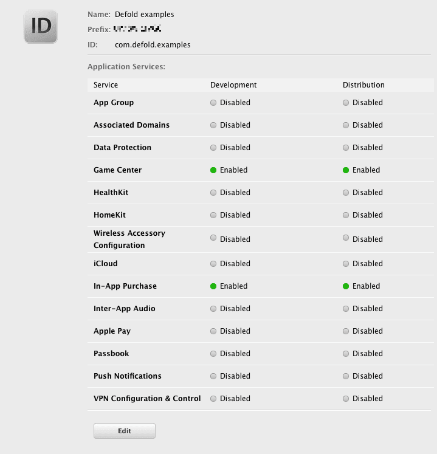
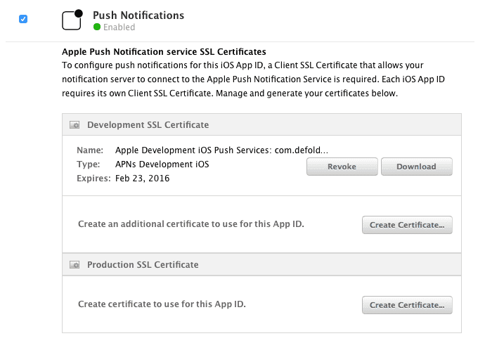
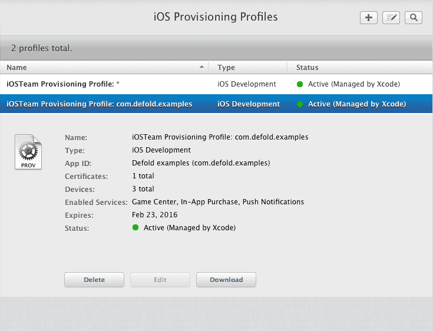
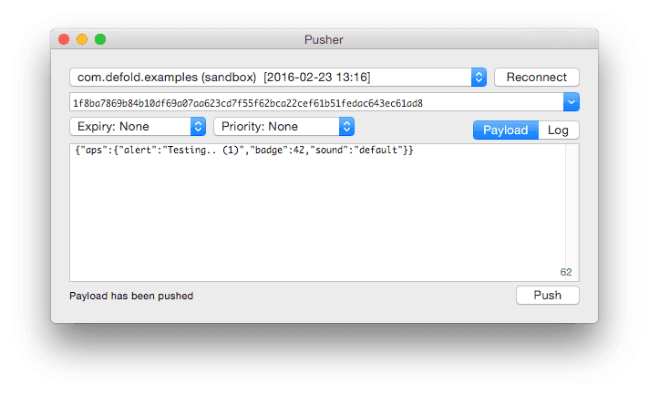
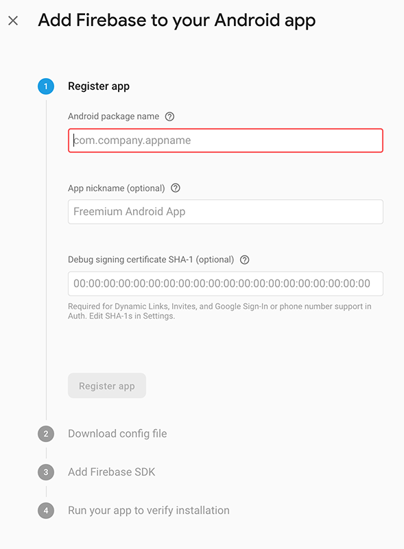
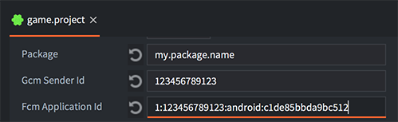
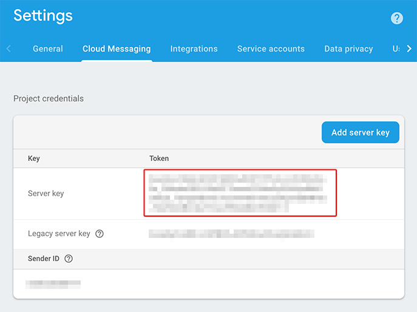

# Push notifications

Push notifications are available on iOS and Android devices as a [native extension](/manuals/extensions/) and allow your game to inform the player about changes and updates. The core functionality is similar between iOS and Android but there are some platform specific differences that you need to consider.

For a push notification to find its way from the server to the target device, certain bits of information are required for your app. The most complex part consists of security information that you set in the application so the notification system can verify the legitimacy of the client receiving notifications. But you will also need a piece of security information for your notification server so the Apple or Google servers can verify that your server is a legitimate notification sender. Finally, when you send notifications, you need to be able to uniquely direct notifications to a specific user's device. For that you retreive and use a token that is unique to the particular device (i.e. user).

## Installing the extension

To start using the Push extension you need to add it as a dependency to your `game.project` file. The latest stable version is available with the dependency URL:
```
https://github.com/defold/extension-push/archive/master.zip
```

We recommend using a link to a zip file of a [specific release](https://github.com/defold/extension-push/releases).

This extension requires the following dependency ([specific release](https://github.com/defold/extension-firebase-core/releases)):
```
https://github.com/defold/extension-firebase-core/archive/master.zip
```

Documentation of the API is available on the [extension GitHub page](https://defold.github.io/extension-push/).

## iOS setup

::: sidenote
To get acquainted with the Apple Push Notification Service, a good idea is to start by reading Apple's own documentation on how the service works. You can find it at https://developer.apple.com/library/ios/documentation/NetworkingInternet/Conceptual/RemoteNotificationsPG/Chapters/ApplePushService.html
:::

On iOS, you need the following information to send notifications:

* Push Notifications must be enabled in the App ID.
* A provisioning profile containing this valid App ID is also required.
* You also need an Apple Push Notification Service SSL Certificate to be allowed to send notification data to the Apple Push Notification server from your messaging server application.

To get everything in place, head over to the [Apple Developer Member center](https://developer.apple.com/membercenter). Edit your AppID to enable Push Notifications.



You also need to create an Apple Push Notification service SSL certificate:



The certificate will be needed on your server that will send out push notifications. While developing, you can download and install the certificate on your machine and run a push test app such as [APNS-Pusher](https://github.com/KnuffApp/APNS-Pusher) or [NWPusher](https://github.com/noodlewerk/NWPusher).

Make sure that you create a new provisioning profile from the AppID, and that you get it onto your device. You can do that manually from the "Member Center" page or through Xcode.



Note that it can take a while for Apple's sandbox servers to update so you might not get push to work immediately. Be patient.

Now it's time to run some test code:

<a name="above-code"></a>
```lua
local function push_listener(self, payload, origin)
    -- The payload arrives here.
    pprint(payload)
end

function init(self)
    local sysinfo = sys.get_sys_info()
    if sysinfo.system_name == "Android" then
        msg.post("#", "push_android")
    elseif sysinfo.system_name == "iPhone OS" then
        msg.post("#", "push_ios")
    end
end

function on_message(self, message_id, message)
    if message_id == hash("push_ios") then
        local alerts = {push.NOTIFICATION_BADGE, push.NOTIFICATION_SOUND, push.NOTIFICATION_ALERT}
        push.register(alerts, function (self, token, error)
            if token then
                local t = ""
                for i = 1,#token do
                    t = t .. string.format("%02x", string.byte(token, i))
                end
                -- Print the device token
                print(t)
            else
                -- Error
                print(error.error)
            end
        end)
        push.set_listener(push_listener)
    elseif message_id == hash("push_android") then
        push.register(nil, function (self, token, error)
            if token then
                -- Print the device token
                print(token)
            else
                -- Error
                print(error.error)
            end
        end)
        push.set_listener(push_listener)
    end
end
```

If all goes well the notification listener will be registered and we get a token that we can use:

```txt
DEBUG:SCRIPT: 1f8ba7869b84b10df69a07aa623cd7f55f62bca22cef61b51fedac643ec61ad8
```

If you're running a push test app, you can now try to send notifications to your device using the device token and the APN service SSL certificate.



The notification should arrive at the client soon after you send it, from within your test application, arriving to the function `push_listener()`:

```txt
DEBUG:SCRIPT:
{
  aps = {
    badge = 42,
    alert = Testing.. (1),
    sound = default,
  }
}
```

And from the iOS homescreen:


If you wish to update the badge count from within the application, use the `push.set_badge_count()` function.

## Android setup

::: sidenote
Firebase has extensive documentation for Firebase Cloud Messaging. We encourage you to start by reading it on https://firebase.google.com/docs/cloud-messaging/
:::

On Android, you need the following information to send notifications:

* A Firebase CM Sender ID and Application ID. These are built into the application.
* A Server API Key to enable sending notifications through Firebase's servers.

::: sidenote
If you already have an application using Google Cloud Messaging platform, it needs to be migrated to an application on Firebase Cloud Messaging instead. You only need to migrate the application entry on the Google dashboard to Firebase. The *sender id* will be the same after the migration, your `game.project` file will only need to be complemented with a `Firebase Application ID` (see below).
:::

The setup is quite straightforward. Start by heading over to [https://console.firebase.google.com](https://console.firebase.google.com), select your application or create a new one if neccessary. Then add Cloud Messaging support by navigating to *Grow* and *Cloud Messaging*.


Click on the Android icon to begin the configuration for push notifications.


Follow the initial instructions, enter the same package name as your Defold game project use.



Download the `google-services.json`, we will soon need some values from inside this file.


You can skip over the two remaining steps, *Add Firebase SDK* and *Run your app to verify installation*. The SDK is built into Defold, you don't need to add it yourself.

Open the `google-services.json` file in a text editor, and look for the *`project_number`* and *`mobilesdk_app_id`* entries. You need to copy these over to your `game.project` file, located under the *android* section, named `Gcm Sender Id` (`project_number`) and `Fcm Application Id` (`mobilesdk_app_id`).

```json
{
  "project_info": {
    "project_number": "123456789123",
    "firebase_url": "https://project-name-ki7h7.firebaseio.com",
    "project_id": "project-name-ki7h7",
    "storage_bucket": "project-name-ki7h7.appspot.com"
  },
  "client": [
    {
      "client_info": {
        "mobilesdk_app_id": "1:123456789123:android:c1de85bbda9bc512",
        "android_client_info": {
          "package_name": "my.package.name"
        }
      },

```



Now everything is ready on the client. The [above code](#above-code) example works for Android as well. Run it and copy the device token id.

```txt
DEBUG:SCRIPT: APA91bHkcKm0QHAMUCEQ_Dlpq2gzset6vh0cz46kDDV6230C5rFivyWZMCxGXcjxRDKg1PK4z1kWg3xnUVqSDiO_4_RiG8b8HeYJfaoW1ho4ukWYXjq5RE0Sy-JTyrhqRusUP_BxRTcE
```

Before we can send any messages we need to get a key that will be used for authentication against the Firebase servers. You will find the key under *Settings* and *Cloud Messaging* on the Firebase dashboard.



Now we have all information we need. Firebase's notifications can be sent through a Web API so we can use *curl* to send test messages:

```sh
$ curl  -X POST  -H "Content-type: application/json"  -H 'Authorization: key=SERVER_KEY' -d '{"registration_ids" : ["TOKEN_ID"], "data": {"alert": "Hello"}}' https://fcm.googleapis.com/fcm/send
```

Replace `SERVER_KEY` and `TOKEN_ID` with your specific keys.

## Local push notifications

Local push notifications are supported as well as remote ones. After the regular setup you can schedule a local notification:

```lua
-- Schedule a local push in 3 seconds
local payload = '{"data" : {"field" : "Some value", "field2" : "Other value"}}'
id, err = push.schedule(3, "A notification!", "Hello there", payload, { action = "get going" })
```

The id is uniquely identifying this scheduled notification and can be stored for later. The final parameter to `push.schedule()` takes a table with platform specific settings:

action
: (iOS only). The alert action string to be used as the title of the right button of the alert or the value of the unlock slider, where the value replaces "unlock" in "slide to unlock" text.

badge_count
: (iOS only). The numeric value of the icon badge. Set to 0 to clear the badge.

priority
: (Android only). The priority is a hint to the device UI about how the notification should be displayed. There are five priority levels:

  - push.PRIORITY_MIN
  - push.PRIORITY_LOW
  - push.PRIORITY_DEFAULT
  - push.PRIORITY_HIGH
  - push.PRIORITY_MAX

  Unless specified, the max priority level is used.

## Inspecting scheduled notifications

The API provides two functions to inspect what is currently scheduled.

```lua
n = push.get_scheduled(id)
pprint(n)
```

Which results in a table containing all details on the scheduled notification:

```txt
DEBUG:SCRIPT:
{
  payload = {"data":{"field":"Some value","field2":"Other value"}},
  title = A notification!,
  priority = 2,
  seconds = 19.991938,
  message = Hello there,
}
```

Note that `seconds` indicates the number of seconds left for the notification to fire. It is also possible to retreive a table with _all_ scheduled notifications:

```lua
all_n = push.get_all_scheduled()
pprint(all_n)
```

Which results in a table pairing notification id's with their respective data:

```txt
DEBUG:SCRIPT:
{
  0 = {
    payload = {"data":{"field":"Some value","field2":"Other value"}},
    title = A notification!,
    priority = 2,
    seconds = 6.009774,
    message = Hey hey,
  }
  1 = {
    payload = {"data":{"field":"Some value","field2":"Other value"}},
    title = Another notification!,
    priority = 2,
    seconds = 12.652521,
    message = Hello there,
  }
  2 = {
    payload = {"data":{"field":"Some value","field2":"Other value"}},
    title = Hey, much notification!,
    priority = 2,
    seconds = 15.553719,
    message = Please answer!,
  }
}
```
