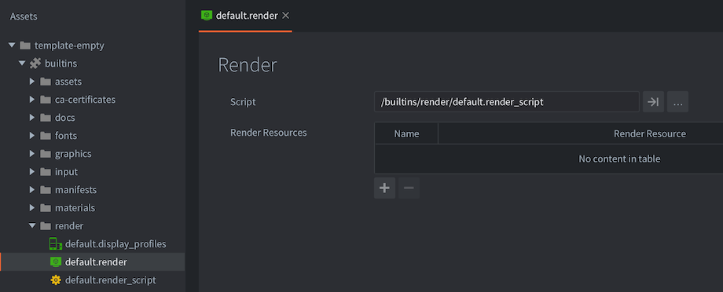

# Render

Every object that is shown on screen by the engine: sprites, models, tiles, particles or GUI nodes, are drawn by a renderer. At the heart of the renderer is a render script that controls the render pipeline. By default, every 2D object is drawn with the correct bitmap with the specified blending and at the correct Z depth---so you might not have to ever think about rendering beyond ordering and simple blending. For most 2D games, the default pipeline functions well, but your game might have special requirements. If that is the case, Defold allows you to write a tailor-made rendering pipeline.

## The default render

The render file contains a reference to the current render script as well as custom materials that should be made available in the render script (use with [`render.enable_material()`](/ref/render/#render.enable_material))

At the heart of the rendering pipeline is the _render script_. This is a Lua script with the functions `init()`, `update()` and `on_message()` and it is primarily used to interact with the underlying OpenGL rendering API. The render script has a special place in the lifecycle of your game. Details can be found in the [Application lifecycle documentation](/manuals/application-lifecycle).

In the "Builtins" folder of your projects you can find the default render resource ("default.render") and the default render script ("default.render_script").

{srcset="images/render/builtin@2x.png 2x"}

To set up a custom renderer:

1. Copy the files "default.render" and "default.render_script" to a location in your project hierarchy. You can, of course, create a render script from scratch but it is a good idea to start with a copy of the default script, especially if you are new to Defold and/or OpenGL ES rendering.

2. Edit your copy of the "default.render" file and change the *Script* property to refer to your copy of the render script.

3. Change the *Render* property (under *bootstrap*) in the "game.project" settings file to refer to your copy of the "default.render" file.

## Render predicates

To be able to control the draw order of objects, you create render _predicates_. A predicate declares what should be drawn based on a selection of material _tags_. 

Each object that is drawn onto the screen has a material attached to it that controls how the object should be drawn to the screen. In the material, you specify one or more _tags_ that should be associated with the material.

In your render script, you can then create a *render predicate* and specify which tags should belong to that predicate. When you tell the engine to draw the predicate, each object with a material containing a tag matching the list specified for the predicate will be drawn.

{srcset="images/render/render_predicate@2x.png 2x"}

A detailed description on how materials work can be found in the [Material documentation](/manuals/material).

## The render script

Below is the code for a custom render script that is a slightly modified version of the built-in one.

init()
: The function `init()` is used to set up the predicates, the view and clear color. These variables will be used during the actual rendering.

  ```lua
  function init(self)
      -- Define the render predicates. Each predicate is drawn by itself and
      -- that allows us to change the state of OpenGL between the draws.
      self.tile_pred = render.predicate({"tile"})
      self.gui_pred = render.predicate({"gui"})
      self.text_pred = render.predicate({"text"})
      self.particle_pred = render.predicate({"particle"})
      self.model_pred = render.predicate({"model"})
  
      self.clear_color = vmath.vector4(0, 0, 0, 0)
      self.clear_color.x = sys.get_config("render.clear_color_red", 0)
      self.clear_color.y = sys.get_config("render.clear_color_green", 0)
      self.clear_color.z = sys.get_config("render.clear_color_blue", 0)
      self.clear_color.w = sys.get_config("render.clear_color_alpha", 0)
  
      -- Define a view matrix to use. If we have a camera object, it will
      -- send "set_view_projection" messages to the render script and we
      -- can update the view matrix with the value the camera provides.
      self.view = vmath.matrix4()
  end
  ```

update()
: The `update()` function is called once each frame. Its function is to perform the actual drawing by calling the underlying OpenGL ES APIs (OpenGL Embedded Systems API). To properly understand what's going on in the `update()` function, you need to understand how OpenGL works. There are many great resources on OpenGL ES available. The official site is a good starting place. You find it at https://www.khronos.org/opengles/

  This example contains the setup necessary to draw 3D models. The `init()` function defined a `self.model_pred` predicate. Elsewhere a material with the tag "model" has been created. There are also some model components that use the material:

  ```lua
  function update(self)
      -- Set the depth mask which allows us to modify the depth buffer.
      render.set_depth_mask(true)
  
      -- Clear the color buffer with the clear color value and set the depth buffer to 1.0.
      -- The normal depth values are between 0.0 (near) and 1.0 (far) so maximizing the values
      -- throughout the buffer means that every pixel you draw will be nearer than 1.0 and thus
      -- it will be properly drawn and depth testing will work from thereon.
      render.clear({[render.BUFFER_COLOR_BIT] = self.clear_color, [render.BUFFER_DEPTH_BIT] = 1, [  render.BUFFER_STENCIL_BIT] = 0})  
  
      -- Set the viewport to the window dimensions.
      render.set_viewport(0, 0, render.get_window_width(), render.get_window_height())
  
      -- Set the view to the stored view value (can be set by a camera object)
      render.set_view(self.view)
  
      -- Render 2D space
      render.set_depth_mask(false)
      render.disable_state(render.STATE_DEPTH_TEST)
      render.disable_state(render.STATE_STENCIL_TEST)
      render.enable_state(render.STATE_BLEND)
      render.set_blend_func(render.BLEND_SRC_ALPHA, render.BLEND_ONE_MINUS_SRC_ALPHA)
      render.disable_state(render.STATE_CULL_FACE)
  
      -- Set the projection to orthographic and only render between -200 and 200 Z-depth
      render.set_projection(vmath.matrix4_orthographic(0, render.get_width(), 0,   render.get_height(), -200, 200))  
  
      render.draw(self.tile_pred)
      render.draw(self.particle_pred)
  
      -- Render 3D space, but still orthographic
      -- Face culling and depth test should be enabled
      render.enable_state(render.STATE_CULL_FACE)
      render.enable_state(render.STATE_DEPTH_TEST)
      render.set_depth_mask(true)
      render.draw(self.model_pred)
      render.draw_debug3d()
  
      -- Render the GUI last
      render.set_view(vmath.matrix4())
      render.set_projection(vmath.matrix4_orthographic(0, render.get_window_width(), 0,   render.get_window_height(), -1, 1))  
  
      render.enable_state(render.STATE_STENCIL_TEST)
      render.draw(self.gui_pred)
      render.draw(self.text_pred)
      render.disable_state(render.STATE_STENCIL_TEST)
  
      render.set_depth_mask(false)
      render.draw_debug2d()
  end
  ```

So far this is a simple and straightforward render script. It draws in the same manner every single frame. However, it is sometimes desirable to be able to introduce state into the render script and perform different operations depending on the state. It may also be desirable to communicate with the render script from other parts of the game code.

on_message()
: A render script can define an `on_message()` function and receive messages from other parts of your game or app. A common case where an external component sends information to the render script is the _camera_. A camera component that has acquired camera focus will automatically send its view and projection to the render script each frame. This message is named `"set_view_projection"`:

  ```lua
  function on_message(self, message_id, message)
      if message_id == hash("clear_color") then
          -- Someone sent us a new clear color to be used.
          self.clear_color = message.color
      elseif message_id == hash("set_view_projection") then
          -- The camera component that has camera focus will sent set_view_projection
          -- messages to the @render socket. We can use the camera information to
          -- set view (and possibly projection) of the rendering.
          -- Currently, we're rendering orthogonally so there's no need for camera
          -- projection.
          self.view = message.view
      end
  end
  ```

  However, any script of GUI script can send messages to the render script though the special `@render` socket:

  ```lua
  -- Change the clear color.
  msg.post("@render:", "clear_color", { color = vmath.vector4(0.3, 0.4, 0.5, 0) })
  ```

## System messages

`"set_view_projection"`
: This message is sent from camera components that has acquired camera focus.

`"window_resized"`
: The engine will send this message on changes of the window size. You can listen to this message to alter rendering when the target window size changes. On desktop this means that the actual game window has been resized and on mobile devices this message is sent whenever an orientation change happens.

  ```
  function on_message(self, message_id, message)
    if message_id == hash("window_resized") then
      -- The window was resized. message.width and message.height contain the new dimensions.
      ...
    end
  end
  ```

`"draw_line"`
: Draw debug line. Use to visualize ray_casts, vectors and more. Lines are drawn with the `render.draw_debug3d()` call.
  
  ```
  -- draw a white line
  local p1 = vmath.vector3(0, 0, 0)
  local p2 = vmath.vector3(1000, 1000, 0)
  local col = vmath.vector4(1, 1, 1, 1)
  msg.post("@render:", "draw_line", { start_point = p1, end_point = p2, color = col } )  
  ```

`"draw_text"`
: Draw debug text. Use to print debug information. The text is drawn with the built in "system_font" font. The system font has a material with tag "text" and is rendered with other text in the default render script.
  
  ```
  -- draw a text message
  local pos = vmath.vector3(500, 500, 0)
  msg.post("@render:", "draw_text", { text = "Hello world!", position = pos })  
  ```

The visual profiler accessible through the `"toggle_profile"` message sent to the `@system` socket is not part of the scriptable renderer. It is drawn separate from your render script.
