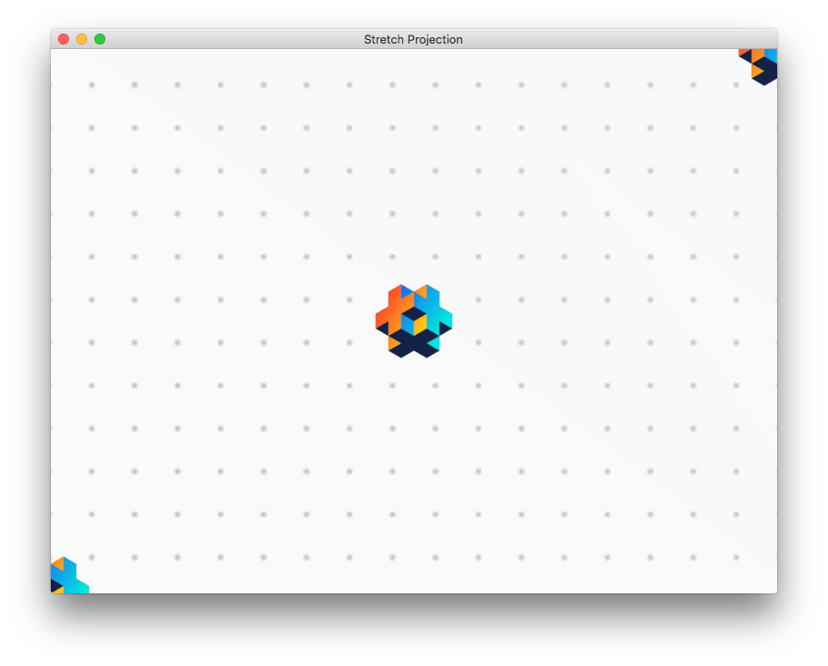
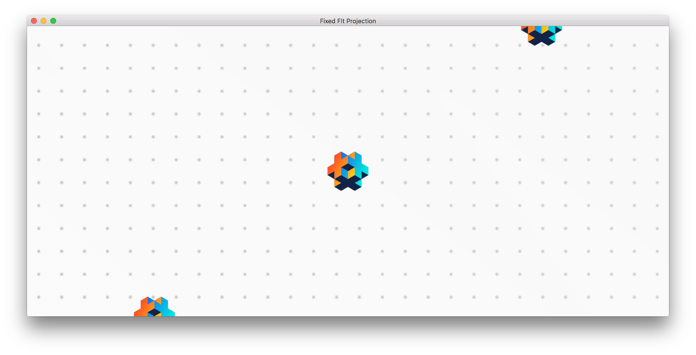
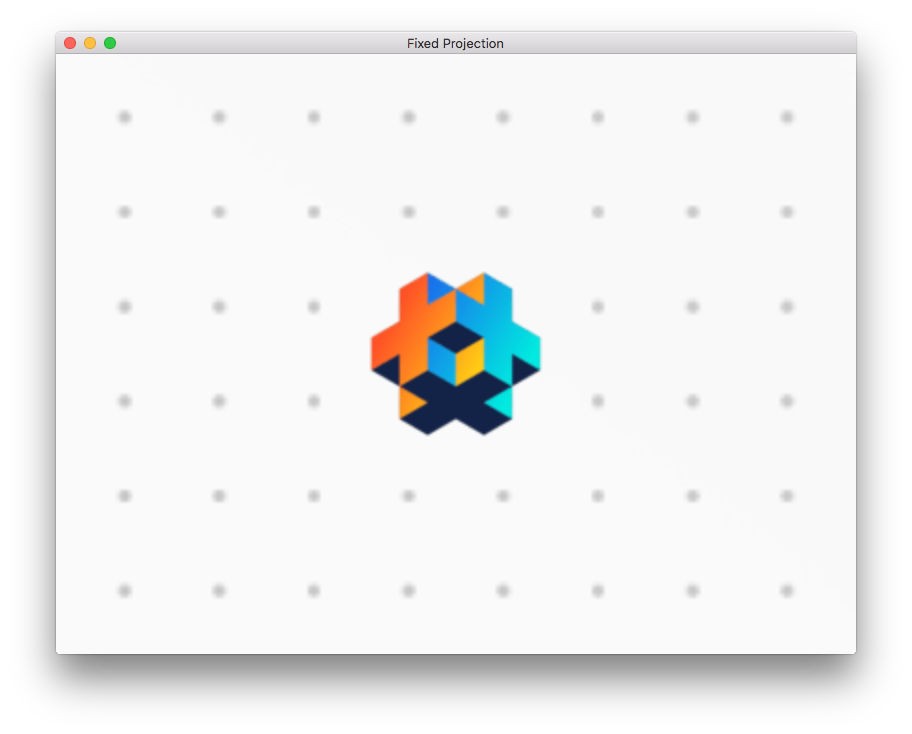
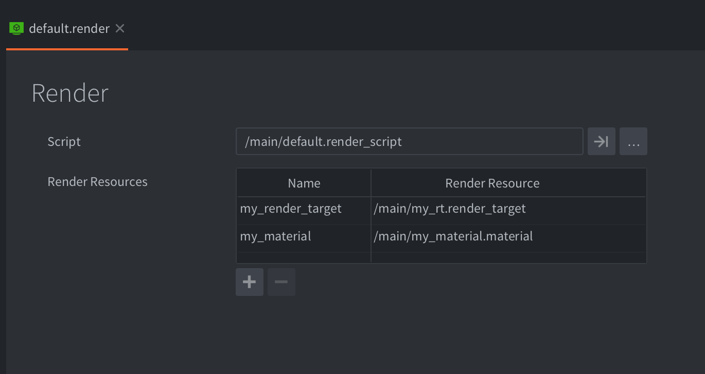

# Render

Every object that is shown on screen by the engine: sprites, models, tiles, particles or GUI nodes, are drawn by a renderer. At the heart of the renderer is a render script that controls the render pipeline. By default, every 2D object is drawn with the correct bitmap with the specified blending and at the correct Z depth---so you might not have to ever think about rendering beyond ordering and simple blending. For most 2D games, the default pipeline functions well, but your game might have special requirements. If that is the case, Defold allows you to write a tailor-made rendering pipeline.

### Render pipeline - What, when and where?

The render pipeline controls what to render, when to render it and also where to render it. What to render is controlled by [render predicates](#render-predicates). When to render a predicate is controlled in the [render script](#the-render-script) and where to render a predicate is controlled by the [view projection](#default-view-projection). The render pipeline can also cull the graphics, drawn by a render predicate, which lies outside of a defined bounding box or frustum. This process is called frustum culling.


## The default render

The render file contains a reference to the current render script as well as custom materials that should be made available in the render script (use with [`render.enable_material()`](/ref/render/#render.enable_material))

At the heart of the rendering pipeline is the _render script_. This is a Lua script with the functions `init()`, `update()` and `on_message()` and it is primarily used to interact with the underlying OpenGL rendering API. The render script has a special place in the lifecycle of your game. Details can be found in the [Application lifecycle documentation](/manuals/application-lifecycle).

In the "Builtins" folder of your projects you can find the default render resource ("default.render") and the default render script ("default.render_script").

{srcset="images/render/builtin@2x.png 2x"}

To set up a custom renderer:

1. Copy the files "default.render" and "default.render_script" to a location in your project hierarchy. You can, of course, create a render script from scratch but it is a good idea to start with a copy of the default script, especially if you are new to Defold and/or OpenGL ES rendering.

2. Edit your copy of the "default.render" file and change the *Script* property to refer to your copy of the render script.

3. Change the *Render* property (under *bootstrap*) in the *game.project* settings file to refer to your copy of the "default.render" file.


## Render predicates

To be able to control the draw order of objects, you create render _predicates_. A predicate declares what should be drawn based on a selection of material _tags_.

Each object that is drawn onto the screen has a material attached to it that controls how the object should be drawn to the screen. In the material, you specify one or more _tags_ that should be associated with the material.

In your render script, you can then create a *render predicate* and specify which tags should belong to that predicate. When you tell the engine to draw the predicate, each object with a material containing all of the tags specified for the predicate will be drawn.

```
Sprite 1        Sprite 2        Sprite 3        Sprite 4
Material A      Material A      Material B      Material C
  outlined        outlined        greyscale       outlined
  tree            tree            tree            house
```

```lua
-- a predicate matching all sprites with tag "tree"
local trees = render.predicate({"tree"})
-- will draw Sprite 1, 2 and 3
render.draw(trees)

-- a predicate matching all sprites with tag "outlined"
local outlined = render.predicate({"outlined"})
-- will draw Sprite 1, 2 and 4
render.draw(outlined)

-- a predicate matching all sprites with tags "outlined" AND "tree"
local outlined_trees = render.predicate({"outlined", "tree"})
-- will draw Sprite 1 and 2
render.draw(outlined_trees)
```


A detailed description on how materials work can be found in the [Material documentation](/manuals/material).


## Default view projection

The default render script is configured to use an orthographic projection suitable for 2D games. It provides three different orthographic projections: `Stretch` (default), `Fixed Fit` and `Fixed`. As an alternative to the orthographic projections in the default render script you also have the option to use the projection matrix provided by a camera component.

### Stretch projection

The stretch projection will always draw an area of your game that is equal to the dimensions set in *game.project*, even when the window is resized. If the aspect ratio changes it will result in game content being stretched either vertically or horizontally:



*Stretch projection with original window size*


*Stretch projection with the window stretched horizontally*

The stretch projection is the default projection but if you have changed from it and need to switch back you do it by sending a message to the render script:

```lua
msg.post("@render:", "use_stretch_projection", { near = -1, far = 1 })
```

### Fixed fit projection

Just like the stretch projection the fixed fit projection will always show an area of the game that is equal to the dimensions set in *game.project*, but if the window is resized and the aspect ratio changes the game content will retain the original aspect ratio and additional game content will be shown vertically or horizontally:


*Fixed fit projection with original window size*



*Fixed fit projection with the window stretched horizontally*


*Fixed fit projection with the window reduced to 50% of original size*

You enable the fixed fit projection by sending a message to the render script:

```lua
msg.post("@render:", "use_fixed_fit_projection", { near = -1, far = 1 })
```

### Fixed projection

The fixed projection will retain the original aspect ratio and render your game content with a fixed zoom level. This means that it if the zoom level is set to something other than 100% it will show more or less than the area of the game defined by the dimensions in *game.project*:



*Fixed projection with zoom set to 2*


*Fixed projection with zoom set to 0.5*


*Fixed projection with zoom set to 2 and window reduced to 50% of original size*

You enable the fixed projection by sending a message to the render script:

```lua
msg.post("@render:", "use_fixed_projection", { near = -1, far = 1, zoom = 2 })
```

### Camera projection

You can also use the projection provided by a [Camera component](/manuals/camera). You enable the camera projection by sending a message to the render script:

```lua
msg.post("@render:", "use_camera_projection")
```


## Frustum culling

The render API in Defold lets developers perform something called frustum culling. When frustum culling is enabled any graphics that lies outside of a defined bounding box or frustum will be ignored. In a large game world where only a portion is visible at a time, frustum culling can dramatically reduce the amount of data that needs to be sent to the GPU for rendering, thus increasing performance and saving battery (on mobile devices). It is common to use the view and projection of the camera to create the bounding box. The default render script uses the view and projection (from the camera) to calculate a frustum.

Frustum culling is implemented in the engine per component type. Current status (Defold 1.4.7):

| Component   | Supported |
|-------------|-----------|
| Sprite      | YES       |
| Model       | YES       |
| Mesh        | YES (1)   |
| Label       | YES       |
| Spine       | YES       |
| Particle fx | NO        |
| Tilemap     | NO        |
| Rive        | NO        |

1 = Mesh bounding box needs to be set by the developer. [Learn more](/manuals/mesh/#frustum-culling).


## Coordinate systems

When components are rendered you usually talk of in which coordinate system the components are rendered. In most games you have some components drawn in world space and some in screen space.

GUI components and their nodes are usually drawn in the screen space coordinate, with the bottom left corner of the screen having coordinate (0,0) and the top right corner is (screen width, screen height). The screen space coordinate system is never offset or in some other way translated by a camera. This will keep the GUI nodes always drawn on screen regardless of how the world is rendered.

Sprites, tilemaps and other components used by game objects that exist in your game world are usually drawn in the world space coordinate system. If you make no modifications to your render script and use no camera component to change the view projection this coordinate system is the same as the screen space coordinate system, but as soon as you add a camera and either move it around or change the view projection the two coordinate systems will deviate. When the camera is moving the lower left corner of the screen will be offset from (0, 0) so that other parts of the world is rendered. If the projection changes the coordinates will be both translated (ie offset from 0, 0) and modified by a scale factor.


## The render script

Below is the code for a custom render script that is a slightly modified version of the built-in one.

init()
: The function `init()` is used to set up the predicates, the view and clear color. These variables will be used during the actual rendering.

```lua
function init(self)
    -- Define the render predicates. Each predicate is drawn by itself and
    -- that allows us to change the state of OpenGL between the draws.
    self.predicates = create_predicates("tile", "gui", "text", "particle", "model")

    -- Create and fill data tables will be used in update()
    local state = create_state()
    self.state = state
    local camera_world = create_camera(state, "camera_world", true)
    init_camera(camera_world, get_stretch_projection)
    local camera_gui = create_camera(state, "camera_gui")
    init_camera(camera_gui, get_gui_projection)
    update_state(state)
end
```

update()
: The `update()` function is called once each frame. Its function is to perform the actual drawing by calling the underlying OpenGL ES APIs (OpenGL Embedded Systems API). To properly understand what's going on in the `update()` function, you need to understand how OpenGL works. There are many great resources on OpenGL ES available. The official site is a good starting place. You find it at https://www.khronos.org/opengles/

  This example contains the setup necessary to draw 3D models. The `init()` function defined a `self.predicates.model` predicate. Elsewhere a material with the tag "model" has been created. There are also some model components that use the material:

```lua
function update(self)
    local state = self.state
     if not state.valid then
        if not update_state(state) then
            return
        end
    end

    local predicates = self.predicates
    -- clear screen buffers
    --
    render.set_depth_mask(true)
    render.set_stencil_mask(0xff)
    render.clear(state.clear_buffers)

    local camera_world = state.cameras.camera_world
    render.set_viewport(0, 0, state.window_width, state.window_height)
    render.set_view(camera_world.view)
    render.set_projection(camera_world.proj)


    -- render models
    --
    render.set_blend_func(render.BLEND_SRC_ALPHA, render.BLEND_ONE_MINUS_SRC_ALPHA)
    render.enable_state(render.STATE_CULL_FACE)
    render.enable_state(render.STATE_DEPTH_TEST)
    render.set_depth_mask(true)
    render.draw(predicates.model_pred)
    render.set_depth_mask(false)
    render.disable_state(render.STATE_DEPTH_TEST)
    render.disable_state(render.STATE_CULL_FACE)

     -- render world (sprites, tilemaps, particles etc)
     --
    render.set_blend_func(render.BLEND_SRC_ALPHA, render.BLEND_ONE_MINUS_SRC_ALPHA)
    render.enable_state(render.STATE_DEPTH_TEST)
    render.enable_state(render.STATE_STENCIL_TEST)
    render.enable_state(render.STATE_BLEND)
    render.draw(predicates.tile)
    render.draw(predicates.particle)
    render.disable_state(render.STATE_STENCIL_TEST)
    render.disable_state(render.STATE_DEPTH_TEST)

    -- debug
    render.draw_debug3d()

    -- render GUI
    --
    local camera_gui = state.cameras.camera_gui
    render.set_view(camera_gui.view)
    render.set_projection(camera_gui.proj)
    render.enable_state(render.STATE_STENCIL_TEST)
    render.draw(predicates.gui, camera_gui.frustum)
    render.draw(predicates.text, camera_gui.frustum)
    render.disable_state(render.STATE_STENCIL_TEST)
end
```

So far this is a simple and straightforward render script. It draws in the same manner every single frame. However, it is sometimes desirable to be able to introduce state into the render script and perform different operations depending on the state. It may also be desirable to communicate with the render script from other parts of the game code.

on_message()
: A render script can define an `on_message()` function and receive messages from other parts of your game or app. A common case where an external component sends information to the render script is the _camera_. A camera component that has acquired camera focus will automatically send its view and projection to the render script each frame. This message is named `"set_view_projection"`:

```lua
local MSG_CLEAR_COLOR =         hash("clear_color")
local MSG_WINDOW_RESIZED =      hash("window_resized")
local MSG_SET_VIEW_PROJ =       hash("set_view_projection")

function on_message(self, message_id, message)
    if message_id == MSG_CLEAR_COLOR then
        -- Someone sent us a new clear color to be used.
        update_clear_color(state, message.color)
    elseif message_id == MSG_SET_VIEW_PROJ then
        -- The camera component that has camera focus will sent set_view_projection
        -- messages to the @render socket. We can use the camera information to
        -- set view (and possibly projection) of the rendering.
        camera.view = message.view
        self.camera_projection = message.projection or vmath.matrix4()
        update_camera(camera, state)
    end
end
```

However, any script of GUI script can send messages to the render script though the special `@render` socket:

```lua
-- Change the clear color.
msg.post("@render:", "clear_color", { color = vmath.vector4(0.3, 0.4, 0.5, 0) })
```

## Render Resources
To pass in certain engine resources into the render script, you can add these into the `Render Resoures` table in the .render file assigned to the project:



Using these resources in a render script:

```lua
-- "my_material" will now be used for all draw calls associated with the predicate
render.enable_material("my_material")
-- anything drawn by the predicate will end up in "my_render_target"
render.set_render_target("my_render_target")
render.draw(self.my_full_screen_predicate)
render.set_render_target(render.RENDER_TARGET_DEFAULT)
render.disable_material()

-- bind the render target result texture to whatever is getting rendered via the predicate
render.enable_texture(0, "my_render_target", render.BUFFER_COLOR0_BIT)
render.draw(self.my_tile_predicate)
```

::: sidenote
Defold currently only supports `Materials` and `Render Targets` as referenced render resources, but over time more resource types will be supported by this system.
:::

## Texture handles

Textures in Defold are represented internally as a handle, which essentially equates to a number that should uniquely identify a texture object anywhere in the engine. This means that you can bridge the gameobject world with the rendering world by passing these handles between the render system and a gameobject script. For example, a script can create a dynamic texture in a script attached to a gameobject and send this to the renderer to be used as a global texture in a draw command.

In a `.script` file:

```lua
local my_texture_resource = resource.create_texture("/my_texture.texture", tparams)
-- note: my_texture_resource is a hash to the resource path, which can't be used as a handle!
local my_texture_handle = resource.get_texture_info(my_texture_resource)
-- my_texture_handle contains information about the texture, such as width, height and so on
-- it does also contain the handle, which is what we are after
msg.post("@render:", "set_texture", { handle = my_texture_handle.handle })
```

In a .render_script file:

```lua
function on_message(self, message_id, message)
    if message_id == hash("set_texture") then
        self.my_texture = message.handle
    end
end

function update(self)
    -- bind the custom texture to the draw state
    render.enable_texture(0, self.my_texture)
    -- do drawing..
end
```

::: sidenote
There is currently no way of changing which texture a resource should point to, you can only use raw handles like this in the render script.
:::

## Supported graphics APIs
The Defold render script API translates render operations into the following graphics APIs:

:[Graphics API](../shared/graphics-api.md)


## System messages

`"set_view_projection"`
: This message is sent from camera components that has acquired camera focus.

`"window_resized"`
: The engine will send this message on changes of the window size. You can listen to this message to alter rendering when the target window size changes. On desktop this means that the actual game window has been resized and on mobile devices this message is sent whenever an orientation change happens.

```lua
local MSG_WINDOW_RESIZED =      hash("window_resized")

function on_message(self, message_id, message)
  if message_id == MSG_WINDOW_RESIZED then
    -- The window was resized. message.width and message.height contain the new dimensions.
    ...
  end
end
```

`"draw_line"`
: Draw debug line. Use to visualize ray_casts, vectors and more. Lines are drawn with the `render.draw_debug3d()` call.

```lua
-- draw a white line
local p1 = vmath.vector3(0, 0, 0)
local p2 = vmath.vector3(1000, 1000, 0)
local col = vmath.vector4(1, 1, 1, 1)
msg.post("@render:", "draw_line", { start_point = p1, end_point = p2, color = col } )  
```

`"draw_text"`
: Draw debug text. Use to print debug information. The text is drawn with the built-in `always_on_top.font` font. The system font has a material with tag `debug_text` and is rendered with other text in the default render script.

```lua
-- draw a text message
local pos = vmath.vector3(500, 500, 0)
msg.post("@render:", "draw_text", { text = "Hello world!", position = pos })  
```

The visual profiler accessible through the `"toggle_profile"` message sent to the `@system` socket is not part of the scriptable renderer. It is drawn separate from your render script.


## Draw calls and batching

A draw call is the term used to describe the process of setting up the GPU to draw an object to the screen using a texture and a material with optional additional settings. This process is usually resource intensive and it is recommended that the number of draw calls are as few as possible. You can measure the number of the draw calls and the time it takes to render them using the [built-in profiler](/manuals/profiling/).

Defold will try to batch render operation to reduce the number of draw calls according to a set of rules defined below. The rules differ between GUI components and all other component types.


### Batch rules for non-GUI components

Rendering is done based on z-order, from low to high. The engine will start by sorting the list of things to draw and iterate from low to high z-values. Each object in the list will be grouped into the same draw call as the previous object if the following conditions are met:

* Belongs to the same collection proxy
* Is of the same component type (sprite, particle fx, tilemap etc)
* Uses the same texture (atlas or tile source)
* Has the same material
* Has the same shader constants (such as tint)

This means that if two sprite components in the same collection proxy has adjacent or the same z-value (and thus comes next to each other in the sorted list), use the same texture, material and constants they will be grouped into the same draw call.


### Batch rules for GUI components

Rendering of the nodes in a GUI component are done from top to bottom of the node list. Each node in the list will be grouped into the same draw call as the previous node if the following conditions are met:

* Is of the same type (box, text, pie etc)
* Uses the same texture (atlas or tile source)
* Has the same blend mode.
* Has the same font (only for text nodes)
* Has the same stencil settings

::: sidenote
Rendering of nodes are done per component. This means that nodes from different GUI components will not be batched.
:::

The ability to arrange nodes in hierarchies makes it easy to group nodes into manageable units. But hierarchies can effectively break batch rendering if you mix different node types. It is possible to more effectively batch GUI nodes while maintaining node hierarchies using GUI layers. You can read more about GUI layers and how they affect draw calls in the [GUI manual](/manuals/gui#layers-and-draw-calls).
