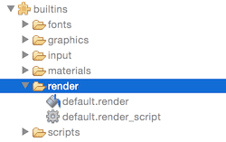
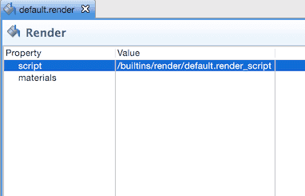

# Rendering

Every object that is shown on screen by the engine: sprites, models, tiles, particles or GUI nodes are drawn by a renderer. At the heart of the renderer is a render script that controls the render pipeline. By default, every 2D object is drawn with the correct bitmap with the specified blending and at the correct Z depth--so you might not have to ever think about rendering beyond ordering and simple blending. For most 2D games, the default pipeline functions well, but your game might have special requirements. If that is the case, Defold allows you to write a tailor-made rendering pipeline.

## The default renderer

At the heart of the rendering pipeline is the _render script_. This is a regular Lua script with the functions `init()`, `update()` and `on_message()` and it is primarily used to interact with the underlying OpenGL rendering API. In the "Builtins" folder of your projects you can find the default render resource (*default.render*) and the default render script (*default.render_script*). The render object simply contains a reference to the current render script.

::: sidenote
Defold relies on OpenGL ES 2.0 for rendering on handheld devices. On desktops, regular Open GL is used. It is therefore possible to write shaders using features not available on OpenGL ES 2.0. Doing so will break cross compatibility.
:::





To set up a custom renderer, you can do as follows:

1. Copy the files *default.render* and *default.render_script*.
2. Put the files somewhere in the project hierarchy, like in a *render* folder.
3. Edit the new *default.render* object (or whatever you call it) and change the *script* property to refer to your copy of the render script.
4. Change the *render* property under *Bootstrap* in the *game.project* settings file to refer to your copy of the *default.render* object.

You can, of course, create a render script from scratch but it is a good idea to start with a copy of the default script if you are new to Defold and/or OpenGL ES rendering.

::: sidenote
The render script has a special place in the lifecycle of your game. Detailed can be found in the [Application lifecycle documentation](/manuals/application-lifecycle).
:::

## Render predicates

To be able to control the draw order of objects, you create render _predicates_. A predicate declares what should be drawn based on a selection of material _tags_. Each object that is drawn onto the screen has a material attached to it and it controls exactly how the object should be drawn, down to which shader program to run. In the material, you specify one or more _tags_ associated with the material. This is compiled into a bit field when building the game, but is expressed as plain text tags in the editor. In your render script, create one or more render predicates and specify which tags should belong to the predicate. When you finally draw the predicate, each object with a material containing a tag matching the list specified to the predicate will be drawn. A more detailed description on materials can be found in the [Material documentation](/manuals/material).


## The render script

To get a better understanding of how render scripts work we can look closer at the content of a render script that is a slightly modified version of the built-in one. Starting with `init()` which is used to set up the predicates, the view and clear color. These variables will be used during the actual rendering.

## init()

```lua
function init(self)
    -- Define the render predicates. Each predicate is drawn by itself and
    -- that allows us to change the state of OpenGL between the draws.
    self.tile_pred = render.predicate({"tile"})
    self.gui_pred = render.predicate({"gui"})
    self.text_pred = render.predicate({"text"})
    self.particle_pred = render.predicate({"particle"})
    self.model_pred = render.predicate({"model"})

    self.clear_color = vmath.vector4(0, 0, 0, 0)
    self.clear_color.x = sys.get_config("render.clear_color_red", 0)
    self.clear_color.y = sys.get_config("render.clear_color_green", 0)
    self.clear_color.z = sys.get_config("render.clear_color_blue", 0)
    self.clear_color.w = sys.get_config("render.clear_color_alpha", 0)

    -- Define a view matrix to use. If we have a camera object, it will
    -- send "set_view_projection" messages to the render script and we
    -- can update the view matrix with the value the camera provides.
    self.view = vmath.matrix4()
end
```

::: sidenote
Information on how to define and use custom project settings can be found in the [Project settings documentation](/manuals/project-settings). Consult the [Camera documentation](/manuals/camera) for details on how game cameras work.
:::

## update()

The `update()` function is called each frame. Its function is to perform the actual drawing by calling the underlying OpenGL ES APIs (OpenGL Embedded Systems API). To properly understand what's going on in the `update()` function, you need to understand how OpenGL works. There are many great resources on OpenGL ES available. The official site is a good starting place. You find it at https://www.khronos.org/opengles/

The following example contains one major addition to the built in script which is the setup necessary to properly draw 3D models. As you saw above, a `self.model_pred` predicate is constructed. Elsewhere a material corresponding to this predicate has been defined and been applied to a 3D model component. The code for `update()` requires some specific handling of that predicate:

```lua
function update(self)
    -- Set the depth mask which allows us to modify the depth buffer.
    render.set_depth_mask(true)

    -- Clear the color buffer with the clear color value and set the depth buffer to 1.0.
    -- The normal depth values are between 0.0 (near) and 1.0 (far) so maximizing the values
    -- throughout the buffer means that every pixel you draw will be nearer than 1.0 and thus
    -- it will be properly drawn and depth testing will work from thereon.
    render.clear({[render.BUFFER_COLOR_BIT] = self.clear_color, [render.BUFFER_DEPTH_BIT] = 1, [render.BUFFER_STENCIL_BIT] = 0})

    -- Set the viewport to the window dimensions.
    render.set_viewport(0, 0, render.get_window_width(), render.get_window_height())

    -- Set the view to the stored view value (can be set by a camera object)
    render.set_view(self.view)

    -- Render 2D space
    render.set_depth_mask(false)
    render.disable_state(render.STATE_DEPTH_TEST)
    render.disable_state(render.STATE_STENCIL_TEST)
    render.enable_state(render.STATE_BLEND)
    render.set_blend_func(render.BLEND_SRC_ALPHA, render.BLEND_ONE_MINUS_SRC_ALPHA)
    render.disable_state(render.STATE_CULL_FACE)

    -- Set the projection to orthographic and only render between -200 and 200 Z-depth
    render.set_projection(vmath.matrix4_orthographic(0, render.get_width(), 0, render.get_height(), -200, 200))

    render.draw(self.tile_pred)
    render.draw(self.particle_pred)

    -- Render 3D space, but still orthographic
    -- Face culling and depth test should be enabled
    render.enable_state(render.STATE_CULL_FACE)
    render.enable_state(render.STATE_DEPTH_TEST)
    render.set_depth_mask(true)
    render.draw(self.model_pred)
    render.draw_debug3d()

    -- Render the GUI last
    render.set_view(vmath.matrix4())
    render.set_projection(vmath.matrix4_orthographic(0, render.get_window_width(), 0, render.get_window_height(), -1, 1))

    render.enable_state(render.STATE_STENCIL_TEST)
    render.draw(self.gui_pred)
    render.draw(self.text_pred)
    render.disable_state(render.STATE_STENCIL_TEST)

    render.set_depth_mask(false)
    render.draw_debug2d()
end
```

Now we have a simple and straightforward render script. It draws in the same manner every single frame. But what if you would like to introduce render states and control the render pipeline from somewhere else?

## on_message()

The render script is a regular citizen in Defold's message passing world. Your render script can define an `on_message()` function and thus open up for other parts of your game or app to influence the behavior of the render script. A common example where an external object sends information to the render script is the _Camera_ component. (See the [Camera documentation](/manuals/camera) for details.) The Camera component that has camera focus automatically sends its view and projection to the render script. But any script can communicate with the render script though the special `@render` socket.

```lua
function on_message(self, message_id, message)
    if message_id == hash("clear_color") then
        -- Someone sent us a new clear color to be used.
        self.clear_color = message.color
    elseif message_id == hash("set_view_projection") then
        -- The camera component that has camera focus will sent set_view_projection
        -- messages to the @render socket. We can use the camera information to
        -- set view (and possibly projection) of the rendering.
        -- Currently, we're rendering orthogonally so there's no need for camera
        -- projection.
        self.view = message.view
    end
end
```

Given the above render script and `on_message()` function, you can change the clear color (background color) to a nice dark steel blue by sending the message:

```lua
msg.post("@render:", "clear_color", { color = vmath.vector4(0.3, 0.4, 0.5, 0) })
```

## System messages

The `@render` socket has some built-in messages. The engine will send you a `window_resized` message on changes of the window size. You can listen to this message to alter rendering when the target window size changes. On desktop this means that the actual game window has been resized and on mobile devices this message is sent whenever an orientation change happens.

```
function on_message(self, message_id, message)
  if message_id == hash("window_resized") then
    -- The window was resized. message.width and message.height contains new dimensions.
    ...
  end
end
```

There are also messages allowing you to draw text and lines:

```
-- draw a white line from (0, 0) to (1000, 1000)
msg.post("@render:", "draw_line", { start_point = vmath.vector3(0, 0, 0), end_point = vmath.vector3(1000, 1000, 0), color = vmath.vector4(1, 1, 1, 1) } )

-- draw a text message at 500, 500
msg.post("@render:", "draw_text", { text = "Hello world!", position = vmath.vector3(500, 500, 0) } )
```

These messages are intended to be used to draw debug information. You can easily visualize ray_casts and vectors and print debug or development statistics in a programmatic manner. This data relates to your render script as follows:

* Any lines added to the scene through the `draw_line` message are drawn with the `render.draw_debug3d()` call.
* Any text added to the scene through the `draw_text` message are drawn in the built in "system_font" font. The system font has a material with tag "text" and is thus drawn in the "self.text_pred" predicate in the above render script.

::: sidenote
The visual profiler accessible through the `toggle_profile` message sent to the `@system` socket is not part of the scriptable renderer. It is drawn separate from your render script.
:::

