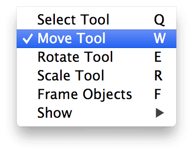
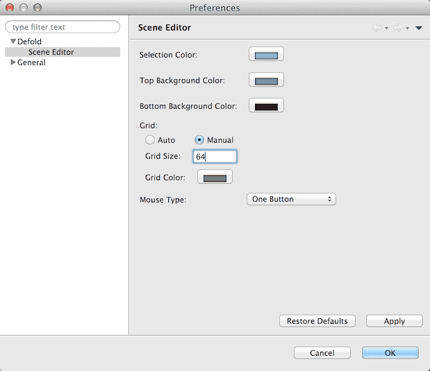

# Scene editing

Defold contains a number of editors, but the Scene Editor is the one used the most. All Game Objects and Collections, as well as some component types are created and edited in this editor.

Pan
: <kbd>Alt</kbd> + <kbd>Middle button</kbd> (three button mouse) or <kbd>Option + Ctrl</kbd> + <kbd>Mouse button</kbd> (one button mouse)

Zoom
: <kbd>Alt</kbd> + <kbd>Right button</kbd> (three button mouse) or <kbd>Ctrl</kbd> + <kbd>Mouse button</kbd> (one button). If your mouse has a scroll wheel, it can be used to zoom.

If you have a mouse wheel, it can be used to zoom the view. In OS X, two finger swipes up and down on the trackpad is equivalent to rolling the mouse wheel so you can use that gesture to zoom.

To reset the view to where the whole scene is visible in the window, select <kbd>Scene ▸ Frame Objects</kbd>{.menu} from the menu or press <kbd>F</kbd>.

## Selecting objects

Click on objects in the main window to select them. The rectangle surrounding the object in the editor view will highlight green.

In addition you can select objects by:

- Clicking an empty area in the view where there is no object, then drag to select all objects inside the drawn region.
- Click objects in the Outline view.
- Hold [[Shift]] and click to select multiple objects in the editor view. You can also hold <kbd>⌘</kbd> (Mac) or <kbd>Ctrl</kbd> (PC/Linux) while clicking.
- Click one object in the Outline view, then hold <kbd>Shift</kbd> and click a second object to select the two objects and everyone in between.
- Hold <kbd>⌘</kbd> (Mac) or <kbd>Ctrl</kbd> (PC/Linux) and click to select multiple objects in the Outline view.

## The Move tool

To move objects, use the *Move Tool*. It is accessible through the menu <kbd>Scene ▸ Move Tool</kbd> or by pressing the <kbd>W</kbd> key.

The selected object now shows three manipulation points that are used to move the object. Click and drag in the gren square to move the object freely:

You can also move the object along just one selected axis by clicking and dragging along the corresponding arrow. Clicking and dragging on the red arrow allows movement on the *X* axis only whereas clicking and dragging on the green arrow allows movement on the *Y* axis only.

Move against the grid
: Hold <kbd>Shift</kbd> when using the move tool to snap the center of the game object to the grid. The default grid size is set to 100. If you wish to alter the size of the grid, you can specify a custom grid size in the preferences. Select <kbd>Defold Editor ▸ Preferences...</kbd>

    

## Rotate Tool

The *Rotate Tool* is accessible through the menu <kbd>Scene ▸ Rotate Tool</kbd> or by pressing the <kbd>E</kbd> key.

The tool consists of three handles that you can manipulate. If you are working on 2D objects, you would probably only want to use the handle that rotates around the *Z* axis, which is the blue circle around the object. Click and drag on the circle to rotate the object.

If you want to rotate around the *X* or *Y* axis, click and drag on the green and red circles. Since the view is peripendicular to those axis, the circles only appear as two lines crossing the object: a green horizontal one and a red vertical.

## Scale Tool

The *Scale Tool* is accessed through the menu <kbd>Scene ▸ Scale Tool</kbd> or by pressing the <kbd>R</kbd> key.

Click the red or green handle and drag to scale the object. Game objects can be scaled freely along the *X* and *Y* axis, causing the object to stretch or compress visually.

::: sidenote
Currently, sprites can not be scaled in the editor. They do, however, support *runtime* free-form scaling. See the [2D Graphics documentation](/manuals/2dgraphics/) for details.
:::

## Selecting what is showing in the Scene Editor

It is often convenient to be able to disable the visual rendering of certain types of information in the Scene Editor, especially when you are working on a complicated collection with lots of objects containing physics, triggers and layers upon layers of graphical assets. The Scene Editor allows you to enable and disable the rendering of different types of information in the editor. Select the <kbd>Scene ▸ Show</kbd> submenu and then chose what you want to see in the editor.

The choices you make are stored in the editor and applies to all Scene Editor instances. Your choices are rememberered between sessions too so if you close the Defold editor down and start it up the next day, your Show settings will be intact.

