# The Defold scene editor

The **Scene Editor** is the visual editor used to build and edit scenes such as collections, game objects, and other visual assets.

By default, many visual scenes open with a **2D orthographic** view. For 3D work you can switch to a 3D-oriented layout, enable a 3D grid plane, and use a **perspective** camera.

## Opening the Scene Editor

Open the Scene Editor by double-clicking a visual resource in the *Assets* pane, such as:

- **Scene structure** — collections (`.collection`), game objects (`.go`)
- **2D assets** — atlas (`.atlas`), tilemaps (`.tilemap`), sprites (`.sprite`), tile sources (`.tilesource`)
- **3D assets** — models (`.model`, `.glb`, `.gltf`)
- **UI** — GUI scenes (`.gui`)
- **Effects** — particle effects (`.particlefx`)
- And others

## Scene view navigation (camera controls)

The Scene Editor camera can be controlled with mouse and keyboard. The available controls depend on whether you are using the standard camera navigation or **Free Camera Mode**.

### Standard navigation (all visual editors)

These controls are available in visual editors:

- **Pan**
  - <kbd>Alt</kbd>/<kbd>⌥ Option</kbd> + <kbd>Left Mouse Button</kbd>
- **Zoom**
  - <kbd>Mouse Wheel</kbd>, or
  - <kbd>Ctrl</kbd>/<kbd>^ Control</kbd> + <kbd>Alt</kbd>/<kbd>⌥ Option</kbd> + <kbd>Left Mouse Button</kbd>
- **Rotate/Orbit (3D) around selection**
  - <kbd>Ctrl</kbd>/<kbd>^ Control</kbd> + <kbd>Left Mouse Button</kbd>

You may also use **Frame Selection** (<kbd>F</kbd>) to focus the camera on the current selection.

## 2D and 3D scene orientation

The scene view can be used in both 2D and 3D workflows:

- In **2D**, you typically work in an orthographic view with a 2D-oriented grid.
- In **3D**, you typically:
  - Realign the view to a 3D orientation,
  - Use a **perspective** camera,
  - Choose an appropriate grid plane (often **Y** for “ground”).

You can access these functions via the toolbar and the **View** menu.

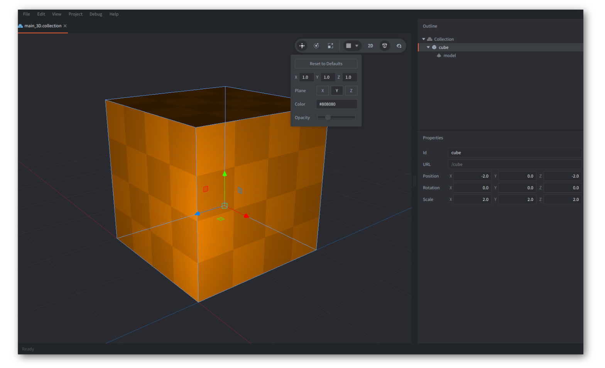

## Toolbar overview

In the top-right of the scene view there is a toolbar with commonly used tools and view options (left to right):

- **Move tool** (<kbd>W</kbd>)
- **Rotate tool** (<kbd>E</kbd>)
- **Scale tool** (<kbd>R</kbd>)
- **Grid Settings** (`▦`)
- **Align/Realign Camera 2D/3D** (`2D`) — toggles between 2D and 3D orientation (shortcut <kbd>.</kbd>)
- **Camera Perspective/Orthographic**
- **Visibility Filters** (`👁`)

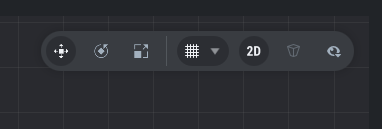

## Selecting and manipulating objects

### Selecting objects

<kbd>Left Mouse Click</kbd> on objects in the main window to select them. The rectangle (or cuboid) surrounding the object in the editor view will highlight with cyan to indicate what item is selected. The selected object is also highlighted in the `Outline` view as in the picture above.

  You can also select objects by:

  - <kbd>Left Mouse Click</kbd> and <kbd>Drag</kbd> to select all objects inside the selection region.
  - <kbd>Left Mouse Click</kbd> objects in the `Outline`, and while holding <kbd>⇧ Shift</kbd> you can expand selection or while holding <kbd>Ctrl</kbd>/<kbd>⌘ Cmd</kbd> you can (un)select clicked.

#### Move tool

{.left}

To move objects, use the *Move Tool*. You can find it in the Toolbar in the top right corner of the scene editor, or by pressing the <kbd>W</kbd> key.

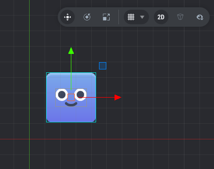{.inline}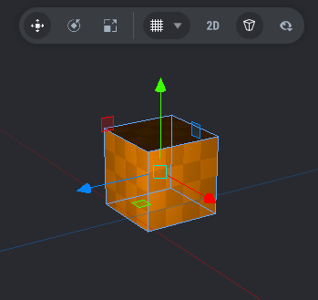{.inline}

The gizmo changes and shows a set of manipulators - squares and arrows (selected manipulator will turn to orange color) that you can <kbd>Drag</kbd> to move:

- one cyan center square handle to move the object only in the screen space,
- 3 red, green and blue arrows along each axis to move the object only along the given X, Y or Z axis.
- 3 red, green and blue square handles (outlined with a transparent fill) to move the object only on the given plane, e.g. X-Y (blue) and (visible if rotating the camera in 3D) X-Z (green) and Y-Z (red) planes.

#### Rotate tool

{.left}

To rotate objects, use the *Rotate Tool* by selecting it in the Toolbar, or by pressing the <kbd>E</kbd> key.

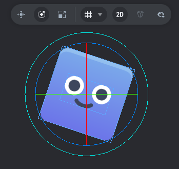{.inline}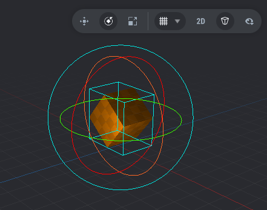{.inline}

This tool consists of four circular manipulators (selected manipulator will turn to orange color) that you can <kbd>Drag</kbd> to rotate:

- one cyan (outer, biggest circle) manipulator that rotates the object in the screen space
- 3 smaller red, green and blue circle manipulators allowing rotation around each of the X, Y and Z axes separately. For 2D orthographic view, the two of them are perpendicular to the X- and Y-axis, so the circles only appear as two lines crossing the object.

#### Scale tool

{.left}

To scale objects, use the *Scale Tool* by selecting it in the toolbar, or by pressing the <kbd>R</kbd> key.

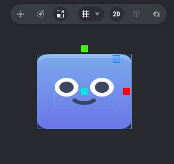{.inline}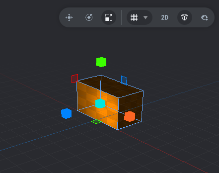{.inline}

This tool consists of a set of square/cube manipulators (selected manipulator will turn to orange color) that you can <kbd>Drag</kbd> to scale:

- one cyan cube in the center scales the object uniformly in all axes (including Z).
- 3 red, blue and green cube manipulators scale the object along each of the X, Y and Z axes separately.
- 3 red, green and blue square manipulators (outlined with a transparent fill) scale the object on the X-Y, X-Z or Y-Z planes separately.

### Visibility filters

Click on the **Visibility Eye Icon** (`👁`) in the Toolbar to toggle visibility of various component types as well as bounding boxes and guide lines (`Component Guides` or shortcut <kbd>Ctrl</kbd> + <kbd>H</kbd> (Win/Linux) or <kbd>^ Ctrl</kbd> + <kbd>⌘ Cmd</kbd> + <kbd>H</kbd>(Mac)).

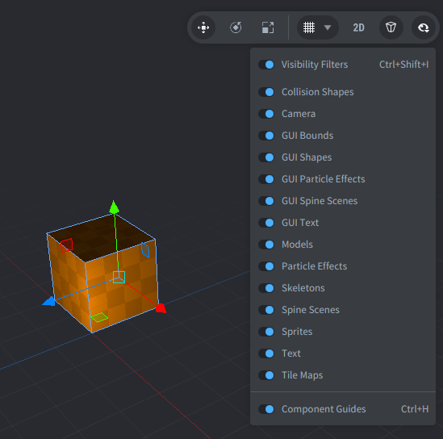

## Grid settings

The grid can be customized to match your workflow (especially useful in 3D). Click the **Grid Settings** button (`▦`) to open the grid settings popup.

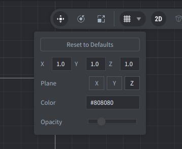

Settings include:

- **Grid size (X/Y/Z)**
  Sets the spacing between grid lines along each axis. Use smaller values for precise placement of small objects, or larger values for a broader overview.
- **Active plane (X/Y/Z)**
  Selects which plane the grid is drawn on. In 2D workflows this is typically **Z** (the default X-Y plane). In 3D workflows, **Y** is common to represent a ground/floor plane.
- **Grid color**
  Sets the color of the grid lines. Useful for contrast against different scene backgrounds.
- **Grid opacity**
  Controls how transparent the grid lines are. Lower values make the grid less intrusive while still providing a reference.
- A **Reset to Defaults** button
  Restores all grid settings to their original values.

## Camera type: Perspective vs Orthographic

The Scene Editor supports both:

- **Orthographic** camera (common in 2D workflows)
- **Perspective** camera (common in 3D workflows)

Use the camera toggle in the toolbar to switch. In 3D scenes, perspective navigation usually feels more natural.

## Free Camera Mode

For fast 3D navigation, the Scene Editor provides **Free Camera Mode**, a first-person / “FPS-style” camera.

### Activating Free Camera Mode

- Hold <kbd>Right Mouse Button</kbd> — Free Camera Mode is active as long as the button is held
- <kbd>Shift</kbd> + <kbd>`</kbd> (backtick) — toggles Free Camera Mode on, keeping it active after release

::: sidenote
On some keyboard layouts (e.g. Swedish) the backtick key is a dead key and may not trigger the shortcut as expected. You
can rebind this shortcut in `File ▸ Preferences ▸ Keys` and enter a shortcut for `Scene -> Free Camera -> Activate`
:::

When Free Camera Mode is active the Scene View is highlighted with a line around the edges.

### Exiting Free Camera Mode

- Release <kbd>Right Mouse Button</kbd> (when activated by hold), or
- <kbd>Left Mouse Button</kbd>, <kbd>Right Mouse Button</kbd> (press and release), or press <kbd>Esc</kbd> when Free Camera Mode was activated as a toggle.

### Looking around (mouse look)

While Free Camera Mode is active, these keys control camera movement (instead of editor tools):

- Move the mouse to control **yaw** (left/right) and **pitch** (up/down)
- Pitch is clamped to avoid flipping the camera

You can also optionally invert the Y axis (see **Free camera settings** below).

### Moving

While Free Camera Mode is active:

- <kbd>W</kbd> — forward
- <kbd>S</kbd> — backward
- <kbd>A</kbd> — left
- <kbd>D</kbd> — right
- <kbd>E</kbd> — up
- <kbd>Q</kbd> — down

::: sidenote
All movement keys can be rebound in `File ▸ Preferences ▸ Keys`. Then search for `Scene -> Free Camera`
:::

Speed modifiers:

- Hold <kbd>Shift</kbd> — move faster
- Hold <kbd>Alt</kbd>/<kbd>⌥ Option</kbd> — move slower / more precisely

### Walking mode (optional)

Free Camera Mode supports **Walking Mode**.

When enabled:
- Up/down movement is constrained to behave more like grounded first-person walking on a ground plane.
- This is useful when exploring a level and you want consistent “grounded” movement.

## Camera settings popup

The perspective camera button in the toolbar has a settings popup for camera-related preferences.

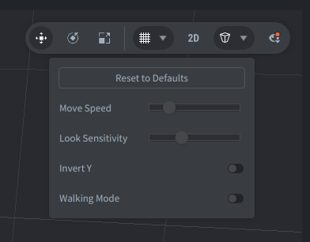

The popup contains:

- **Move Speed**
  Adjusts free camera movement speed.

- **Look Sensitivity**
  Adjusts how quickly the camera rotates in response to mouse movement.

- **Invert Y**
  Inverts vertical mouse look.

- **Walking Mode**
  Constrains movement for ground-like navigation.

- **Reset to Defaults**
  Restores default camera settings.
